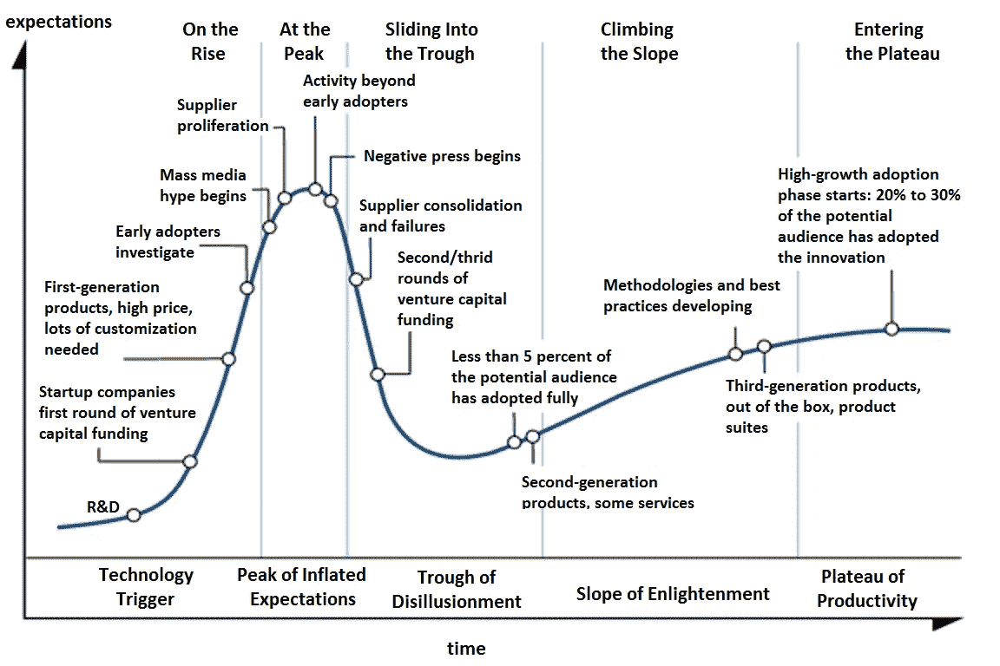
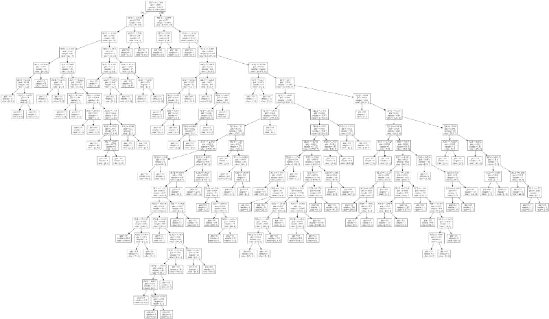

# 叫艾虚张声势

> 原文：<https://medium.datadriveninvestor.com/calling-ais-bluff-9ef275943168?source=collection_archive---------5----------------------->

人工智能正在享受 Gartner 众所周知的[炒作周期](https://en.wikipedia.org/wiki/Hype_cycle)中的一个(常规的)‘膨胀预期峰值’。

“大众媒体炒作”的例子有:

机器智力优势:[《alpha go Zero:Google deep mind 超级计算机 40 天学习人类 3000 年知识](https://www.telegraph.co.uk/science/2017/10/18/alphago-zero-google-deepmind-supercomputer-learns-3000-years/)》，《 [AI 做出这幅画](https://www.bloomberg.com/news/articles/2018-05-17/ai-made-incredible-paintings-in-about-two-weeks)》:

> 人工智能也在驾驶汽车、赚钱、探索海洋……并让人们感到恐惧。

人工智能在任何地方都不可或缺:[“对人工智能的投资对我们未来的健康至关重要](https://www.independent.co.uk/voices/artificial-intelligence-machine-learning-computers-global-healthcare-malaria-facebook-a8327901.html)”，[“人工智能投资为黄金时间做好准备](https://www.forbes.com/sites/greatspeculations/2017/10/25/getting-ready-for-prime-time-of-artificial-intelligence-investing/#6218b3a92010)”

在黑暗的一面，机器超越人类的日子即将到来:“[‘人工智能之父’说奇点离我们还有 30 年](https://futurism.com/father-artificial-intelligence-singularity-decades-away/)”

一些严肃的记者试图驱散围绕人工智能的迷雾，比如英国《金融时报》的“[人工智能在银行业:炒作背后的现实](https://www.ft.com/content/b497a134-2d21-11e8-a34a-7e7563b0b0f4)”和彭博的“[人工智能口述历史](https://www.bloomberg.com/news/features/2018-05-17/apple-and-its-rivals-bet-their-futures-on-these-men-s-dreams)”。

我的目标是扩展英国《金融时报》的方法，让我的读者能够识别人工智能的优势和劣势，并能够辨别我的特定专业领域——金融——的炒作和潜力

# AI 是什么？

大众媒体的一个问题是他们无法区分人工智能和普通智能(AGI):

> 一台机器的智能，它能成功地完成人类能完成的任何智力任务

以及[狭义人工智能](https://en.wikipedia.org/wiki/Weak_AI) (NAI 或弱 AI):

> 狭义的 AI，是专注于**一号**狭义任务的人工智能。

当你读到或听到任何关于人工智能的东西时，你脑海中的第一个问题应该是:**正在解决的任务是什么？**

注意粗体字:**任何**任务对**一个**任务。现在，当你阅读上面的新闻时，你会注意到:AlphaGo 很擅长下围棋(一项任务)，自动驾驶汽车只驾驶(一项任务)，像 [Mitsuku](https://www.pandorabots.com/mitsuku/) 这样的聊天机器人可以像人类一样聊天(仍然是一项任务——我刚刚试图和它下棋，它做不到)，[识别图片中的猫](https://www.cnet.com/news/google-photos-pets-cat-dogs-meow-movie/)等等。每个例子本身都令人印象深刻，但是从一个任务转移到另一个任务的努力仍然是巨大的。

一旦 NAI 建立起来，它几乎可以无限地复制(取决于计算机资源),而且永远不会厌倦——这就是它提高生产率的能力和潜力。

在商业环境中，目标应该是开发 NAIs 来解决生产瓶颈，或者结合人类的判断力来使用它们(被称为[智能增强](https://en.wikipedia.org/wiki/Intelligence_amplification)或放大):

> 指[信息技术](https://en.wikipedia.org/wiki/Information_technology)在增强[人类智能](https://en.wikipedia.org/wiki/Intelligence#Human_intelligence)方面的有效利用。

另一方面，AGI 仍然在地平线上很远的地方，而且很有争议——我会远离它(但是如果你阅读了关于奇点的报告，请记住它们指的是 AGI)

# 怎样才能养成一个 NAI？

我特别讨厌的是 pdf 格式的报告，其中包含许多漂亮的图形和表格，显示了一个解释不清的算法的一组不可用数据的良好结果。出于这个原因，我决定用 Jupyter 笔记本写一些例子(如果你有谷歌账户，你可以在他们的云系统上运行)。这些例子应该允许访问数据(没有密码)，并应在任何地方运行浏览器。这种“研究再现性”有一些警告，因为它限制了计算能力和“大数据”分析，但我希望它可以显示 NAI 的一些基本知识。

要开发一个 NAI，你需要数据。大量数据。

*   想想 google cat 的例子:像[开放图像数据集](https://github.com/openimages/dataset)这样的数据集有 900 万**张**带注释的图像，
*   随着时间的推移，AlphaGo " *学会了最好的走法，简单地通过与自己对弈* ***百万次*** *的游戏。*"，
*   情绪分析器 Vader 使用了 90，000+的评分。

如果您的所有数据都适合 Excel，请记住这一点。经验告诉你没有足够的钱。你还需要使用电脑，但是这部分已经商品化了——你可以从亚马逊、微软、谷歌等公司租用。

正如 Yann LeCun 和 Geoffrey Hinton 指出的那样:

> le Cun:……人工智能方法需要复杂的软件、大量的数据和强大的计算机。….在 20 世纪 90 年代中期和 21 世纪中期，人们选择了更简单的方法——没有人对神经网络真正感兴趣。
> 
> HINTON: …工程师们发现其他方法在小数据集上同样有效，甚至更好，所以他们寻求这些途径…

最后，学会一种技术(现在有很多，从“深度学习”到“随机森林”)。稍后我会准备一份清单，帮助你跟注诈唬，下面我会展示一些可以使用的技巧，但现在请注意，你可以将它们分为两类:

## 无监督学习

作为“增强智能”的一个例子，我写了[**利率聚类**](https://medium.com/@gjlr2000/rates-clustering-611a3af9b294) ，在这里我展示了如何使用当前的技术，一个系统可以识别一个金融数据时间序列中的不同制度变化(我使用了美国利率的公共期限结构，但经过一些修改，您可以使用其他时间序列)

该技术使用“集群化”方法来识别似乎属于同一个“集群”的数据段。这是一个无监督学习的例子，因为我们所需要的只是输入数据，而该技术会吐出不同的聚类。然后，一个专家可以使用输出进行分析——她可以说我们已经进入了一个新的金融体系(需要以不同的形式进行交易)。

另一个类似的例子是[谷歌的猫识别器](https://www.wired.com/2012/06/google-x-neural-network/)，它把图片和猫聚集在一起(没有把它标记为猫)——就在那之后，一个人把整个群标记为“猫”

## 监督学习

在无监督学习中，人工智能技术能够自己找到一些结构(在上面的例子中，它依靠人类来识别含义)。监督学习使用所有数据**和**注释数据(例如，这张图片有一只猫，这场围棋比赛是白人赢的)来“训练”人工智能。

这就是“深度学习”的由来。要记住的诀窍是，深度学习需要大量数据(数百万——如谷歌猫和 AlphaGo 的例子)。如果你有更少的，你必须使用其他方法。

监督学习的一个例子是我的 [**AI 作为金融中的白盒**](https://medium.com/@gjlr2000/ai-as-a-white-box-in-finance-e6f3216aa7e7) :

这里，从一组公开的(匿名的)信用卡交易(包含一些欺诈交易)数据中，生成了一个决策树。这个特殊的例子非常适合监督学习类别，因为有非常强烈的动机和要求来检查交易是否有效。

研究人员做了大量工作来提出一个监督学习方法的问题——就像 AlphaGo 的例子一样——其中产生了数百万个游戏模拟，但也做了更多工作来“众包”数百万个例子的标记: [ImageNet](https://qz.com/1034972/the-data-that-changed-the-direction-of-ai-research-and-possibly-the-world/)

> 即使在找到机械土耳其人之后，**数据集也花了两年半**才完成。

它不仅能访问数百万个数据点，还能有效地注释数据。

监督学习的第二个例子是 [**情感分析**](https://medium.com/@gjlr2000/sentiment-analysis-in-finance-a4b3016a9fc0) 。如果你点击这个链接，你会看到一些基础知识和在金融领域的应用列表。正如我在上面所写的，一个现成的情感分析器(Vader)需要超过 90，000 个例子由亚马逊土耳其员工手动标记。

金融监督学习的圣杯(在不可企及的意义上)是交易时间序列的盈利预测。注意安装在你智能手机上的“预测短信”:一系列书面单词被用来暗示以下一个。金融领域的对等物将采用价格和其他因素的历史，再加上“带注释的”正确预测。我正在准备一个(玩具)例子——我会随时通知你(但稍微剧透一下——一个合适的预测深度学习机器可能需要数百万个数据点，并在短时间内工作，直到“政权更迭”)。