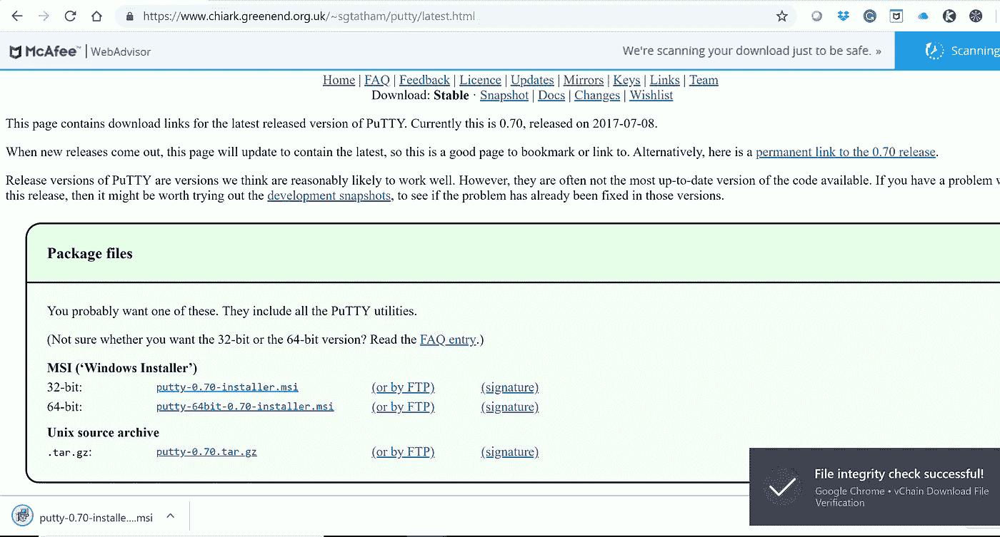
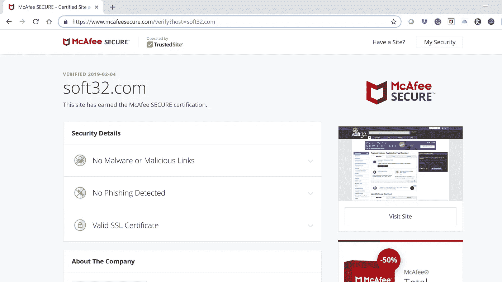
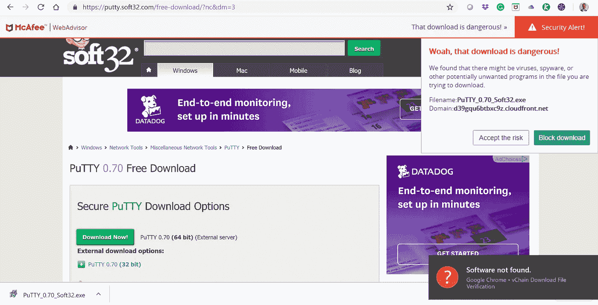

# Chrome 扩展能比谷歌和数字证书更好地保护我免受恶意软件的攻击吗？

> 原文：<https://medium.datadriveninvestor.com/can-a-chrome-extension-protect-me-from-malware-better-than-google-and-digital-certificates-do-6ef5986da372?source=collection_archive---------9----------------------->

CodeNotary Download Integrity Verification result for PuTTY software

今天，当你在谷歌上寻找一个知名的应用程序时，你很可能会找到几十个来自不同网站的下载链接。即使是顶级链接也隐藏着很多危险。

签名证书的存在实际上对于信任是不够的，下载源也是如此。越来越多的恶意软件和恶意软件注入的软件，用合法的数字证书签名，由排名靠前的网站分发而不被检测到。这种做法让互联网用户面临很大的风险。

 [## 网络安全非营利组织帮助中小企业打击网络犯罪-数据驱动的投资者

### 一个名为全球网络联盟(GCA)的非营利组织发誓要改善…

www.datadriveninvestor.com](https://www.datadriveninvestor.com/2019/02/22/cybersecurity-non-profit-to-help-smes-fight-against-cybercrime/) 

为了证实这一论点并量化普通互联网用户面临的风险水平，我通过从官方网站和其他排名靠前的网站下载热门应用程序并比较下载的哈希来验证它们的完整性。

## 我下载的是真正的未经篡改的软件吗？

在我的测试中，我使用了一个非常流行的工具:PuTTY，西蒙·塔瑟姆([https://www.chiark.greenend.org.uk/~sgtatham/putty/](https://www.chiark.greenend.org.uk/~sgtatham/putty/))开发的“著名”开源终端模拟器。该工具统计了数百万次下载和活跃用户。

首先，我通过 [vChain](http://www.vchain.us) 为 Chrome 安装了 code 公证人完整性验证扩展。该扩展保护互联网用户免于安装恶意软件，通过自动验证下载的唯一哈希与官方应用程序的唯一哈希，之前经过了[code 公证人](http://www.codenotary.io)的公证。如果哈希值与原始值不一致，用户将被更改，以避免任何危险的安装。Chrome 网上商店的[这里](https://chrome.google.com/webstore/detail/vchain-codenotary-downloa/mnloemedehacppeggbipipjlphdjpjcb)有这个扩展。然后，我从官方网站下载了 PuTTY。显然，扩展确认了软件是原创的。

Successful integrity check of PuTTY by CodeNotary Chrome Extension

## 测试 PuTTY 下载的完整性

然后我继续测试前 5 名链接的 PuTTY 下载。不得不说 Simon Tatham 在 SEO 方面做的更好，官方下载网站的链接在 google 搜索中首先登陆。然而，在前 5 个链接中，我可以找到可疑的链接。

我们点击了第一个链接，它看起来来自一个值得尊敬的来源:soft32.com

在此之前，我们在 McAfee Secure 上检查了 soft32.com 网站是否是已知的恶意软件发布者，结果是否定的。

Results of McAfee verification of Soft32.com website trust

另外，在这种情况下，vChain Chrome Extension 立即通知我该文件与从官网资源下载的版本不匹配。

就 PuTTY 而言，McAfee WebAdvisor 还会提醒我即将下载危险文件，建议我中断下载。具有讽刺意味的是，这是同一个杀毒软件，就在几秒钟前给我的网站开了绿灯。

vChain Integrity verification of Soft32.com PuTTY download

## 有哪些主要的外卖？

*   下载软件时要小心恶意拷贝。有些是良性副本，但其他包括恶意软件或不需要的软件。
*   你不能依靠一个网站在搜索引擎优化上的得分来信任软件
*   数字证书不能保护您免受恶意软件的攻击

## code 公证人 Chrome 扩展如何防范恶意软件？

正如我在文章开头所说，直到今天，互联网用户还没有简单的方法来验证下载是否被注入了恶意代码。

事实证明，即使是对网站可靠性和数字签名的人工检查也不足以完成这项任务。事实上，今天发现带有官方和合法数字证书的恶意软件是很常见的。

[code 公证人下载完整性验证](https://chrome.google.com/webstore/detail/vchain-codenotary-downloa/mnloemedehacppeggbipipjlphdjpjcb)Chrome 扩展保护用户免于安装恶意软件，其名称模仿著名应用程序的名称。没有手动验证，没有搜索网页，扩展自动为你做一切。

如果您是软件开发商或软件发行商，并且您希望保护您的客户免受下载的恶意软件注入克隆的影响，[现在就开始](http://www.codenotary.io)用 code 公证人签署您的代码。该解决方案对开源和非商业项目是免费的。