# 机器学习模型能比人类更准确地检测调情短信吗？我打赌是的！

> 原文：<https://medium.datadriveninvestor.com/can-a-machine-learning-model-detect-flirty-text-messages-more-accurate-than-humans-i-bet-it-does-3d8640249963?source=collection_archive---------5----------------------->

接受吧，有时候我们不知道什么时候有人在搭讪我们，还是只有我？我不这么认为！或者我可能只是害羞！

你以前遇到过这种情况吗？我们总是过多地考虑来自暗恋对象或潜在伴侣的短信，怀疑他/她是否喜欢我们，并倾向于把我们的智能手机交给朋友，认为他们可以客观看待它。他们可能会给你他们的观点，但他们不能百分之百确定。

想象一下，你可以使用一台从成千上万条带有挑逗意味的短信中收集和学习的机器。听起来很有趣！

斯坦福大学的一组研究人员发现，人类在检测调情行为方面有点糟糕，并设计了一个基于对话和词汇特征的调情检测模型，以高达 71.5%的准确率检测说话者的调情意图。

查看此处的文件:

由于我们的情绪和欲望，有很多原因会对某件事产生错误的印象。那是机器出现的地方！在这项任务中，模型可以提供客观的答案。所以我相信，机器可以通过短信和相当准确的准确度来检测某人是否在和你调情或表示友好。

我将尝试复制相同的实验，使用我收集的一些数据和微软 Azure 机器学习工作室并预测情绪分析。该模型将识别两类短信:**调情**和**不调情**。

从这个实验开始。我在野外收集了近千条短信:

*   使用 Twitter 和#flirttext 等标签，收集了一些推文
*   我从人际关系专家那里收集了一些短信，并在不同的网站上采访了一些真实的人。

收集的数据如下所示:

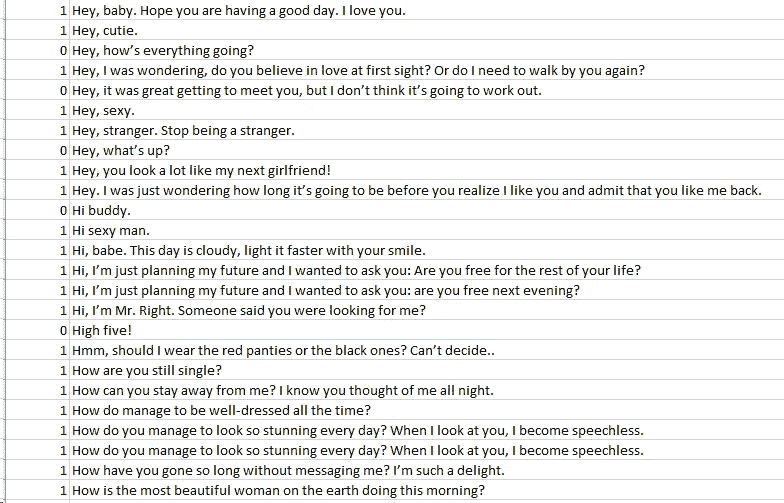

# 我们来分析一下数据！

# 调情短信的文字云

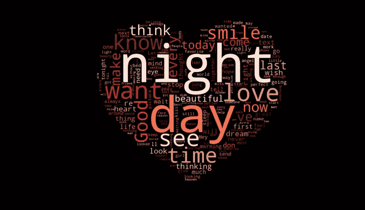

**你在这个词云中获得了哪些真知灼见？**

*   日日夜夜是这个词云中最大的词。和你调情的人往往会虔诚地给你发**【早上好】****【晚安】**短信。永远不会消失，这是一个经典！当有人喜欢你时，这是一个很大的信号。
*   爱总是一个强烈的词。不需要解释。
*   微笑，是一个人值得钦佩的好东西。当有人赞美你时，你的微笑是特别的。
*   太美了。这个词不用我解释！

# 无调情短信的文字云

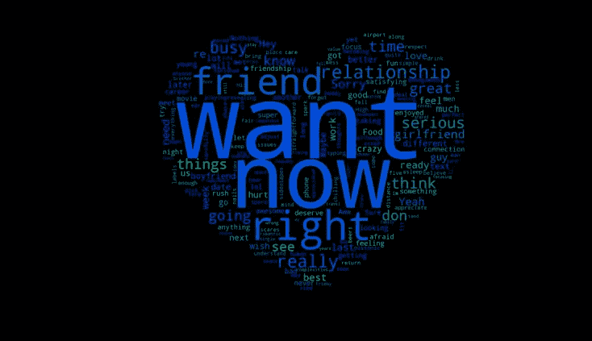

你能在这个词云中发现有趣的见解吗？

**Want:** 这个词在以下短信中经常使用:

*   我喜欢你，尊重你，公平地说，我想直截了当……我只是不认为我是合适的人选。
*   我不想认真，因为我不想异地恋。
*   我只想把事情简单化。
*   我不想仓促行事。

*忙碌、害怕、伤害、联系、工作、事业、匆忙、专注*是我在这类短信中觉得很有意思的几个词。当有人表示他/她不喜欢你时，这些词非常常用。

# 使用 Azure Machine Learning Studio 创建一个机器学习模型来检测调情文本

上个月，我在 **Edx** 注册了《人工智能导论》，这是一家大型开放式在线课程提供商。它为全球学生提供广泛学科的在线大学课程，包括一些免费课程。

为了参与本课程的项目，我需要获得一个 Microsoft Azure 帐户。我喜欢在 Azure 中通过将元素拖放到工作区来创建模型的简单方式。

所以这一次，我将使用 Azure 来创建和部署模型，而不是使用 Jupyter 笔记本。

下面是从 Azure 创建情感分析项目的主要步骤。你可以在 Azure 机器学习工作室([https://docs . Microsoft . com/en-us/Azure/Machine-Learning/Studio/text-analytics-module-tutorial](https://docs.microsoft.com/en-us/azure/machine-learning/studio/text-analytics-module-tutorial))的微软文档到情绪分析模型中找到这些步骤

1.  清理和预处理文本数据集
2.  从预处理文本中提取数字特征向量
3.  训练分类或回归模型
4.  对模型进行评分和验证
5.  将模型部署到生产中

# 步骤 1:清理和预处理文本数据集

这里要做的第一步是把我的数据集分成两类:**【轻浮】**和**【不轻浮】**，这里是高和低，意思是高会表示短信更有可能是“轻浮的”，低是“不轻浮的”。

用于此步骤的模块:**编辑元数据**和**分组分类值。**

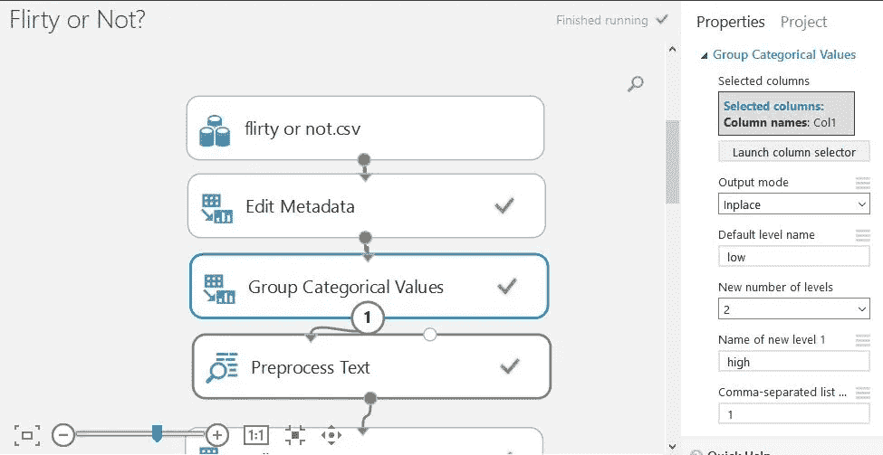

我用预处理文本模块清理了我的文本。这个模块的作用是清除数据集中的噪声，并找到有助于提高模型精度的最重要的特征。像其他工具一样，**预处理文本**模块删除停用词(" the "、" a" "of "等)、重复字符、电子邮件地址、URL 和符号。它还将文本转换为小写。

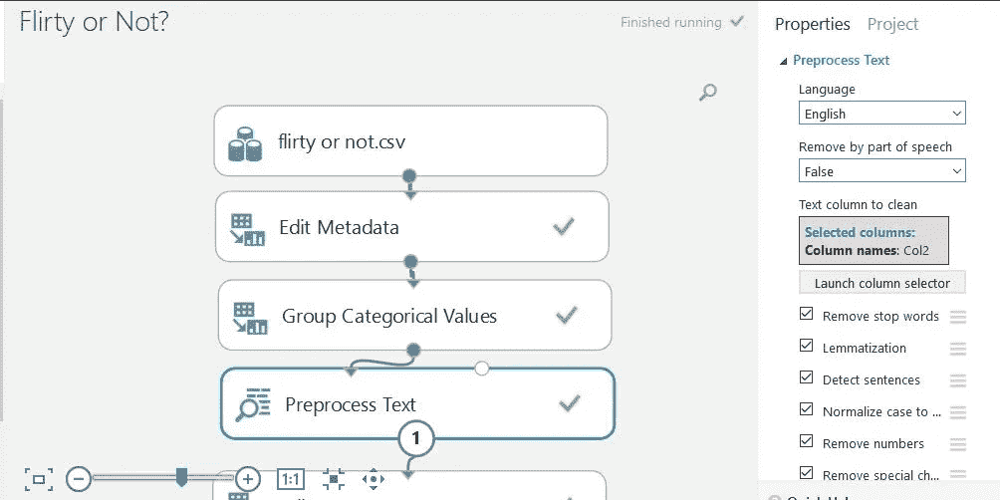

清理完文本后，就该把数据分成两部分了:训练集和测试集。

# 步骤 2:从预处理的文本中提取数字特征向量

现在是时候将文本转换成数字特征向量，以便机器可以理解并学习这些数据。我为此使用的模块叫做**提取 N-Gram 特征**，它用于将文本数据转换成数值。

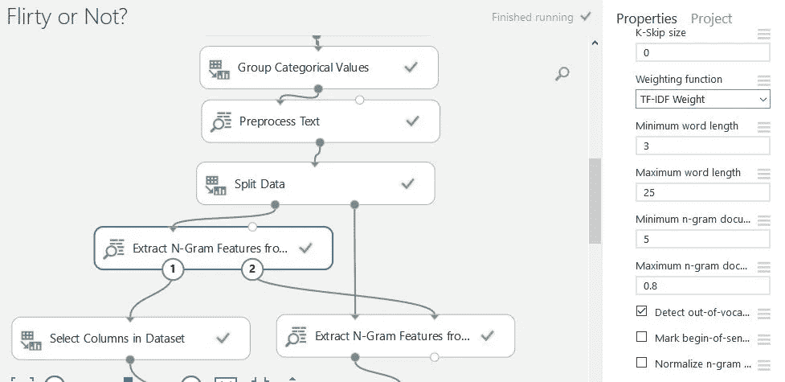

# TF-IDF

我使用了流行的技术 **TF-IDF** (词频逆文档频率)，这是一种数字统计，旨在反映一个词对数据集中的一个文档有多重要。

# 步骤 3:训练分类或回归模型

我试图解决的问题是识别一条短信是否有调情暗示，所以我使用了**两类逻辑回归**模块来得到我的预测。

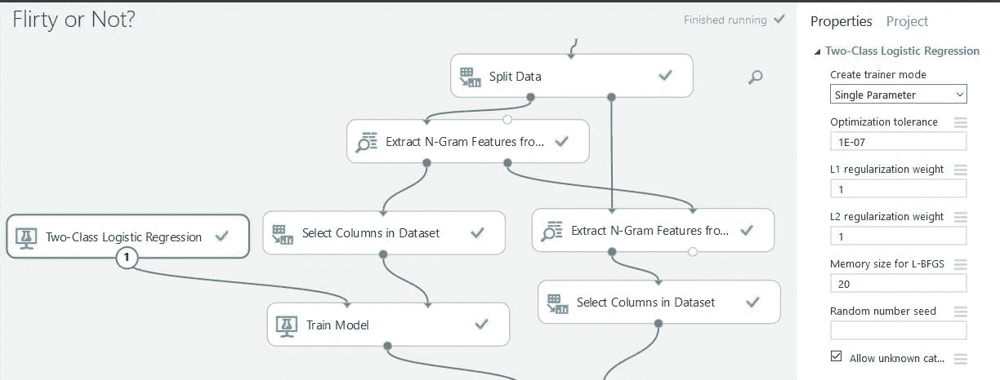

# 步骤 4:对模型进行评分和验证

在我训练了我的分类模型之后，需要进行验证。对于这个任务，我使用了测试集并评估了我的模型的准确性。您可以在下面看到结果:

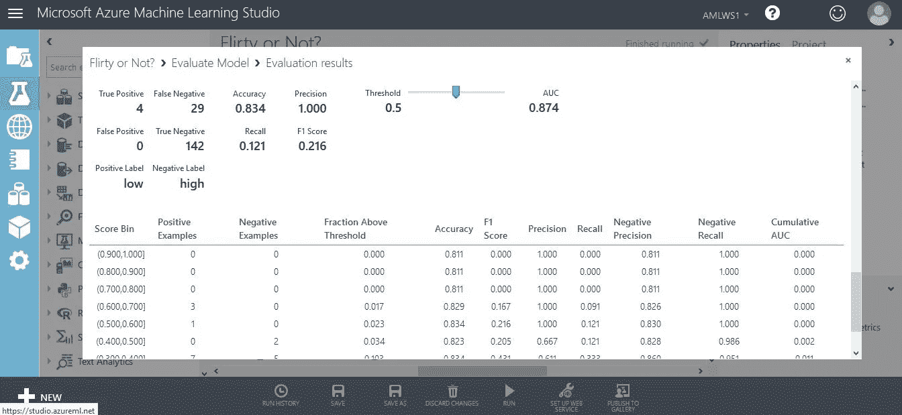

# 步骤 5:为生产版本部署模型

您可以在下图中看到，我更改了结构来部署我的模型。但是关键就在这里:我们需要保存训练中的两个重要元素:分类模型和作为数据集的 N 元词汇。

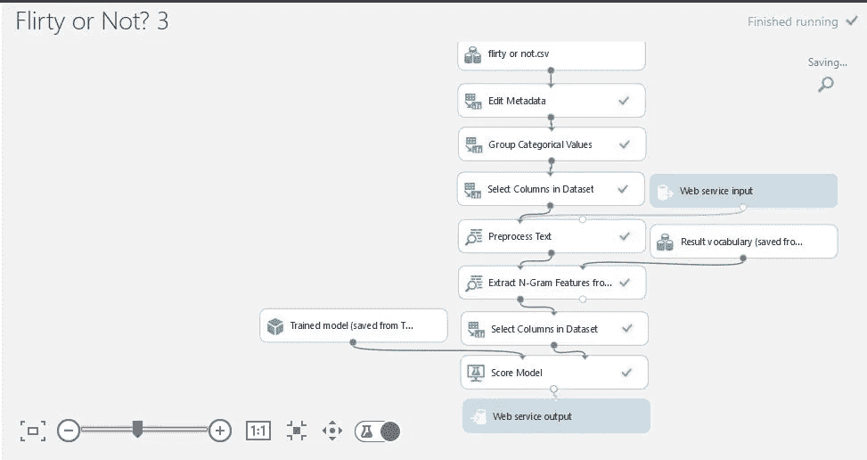

# 测试部署的模型

**这是我的部署模型！**很简单:你在文本框中写一条短信，点击按钮进行预测:**高**或**低**以及数字的准确性。你可以在下面看到一些例子:

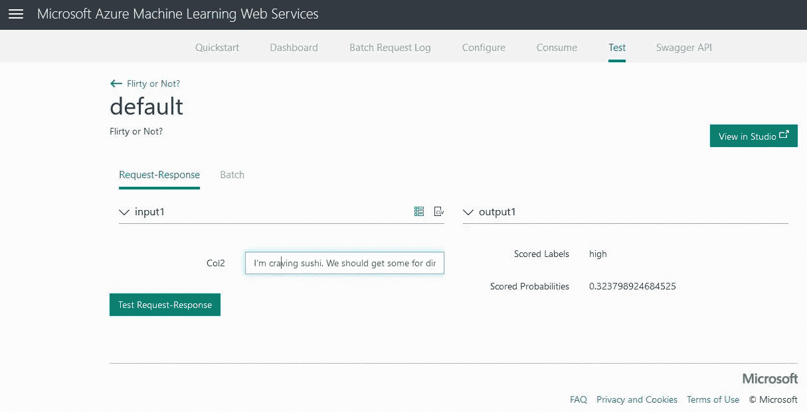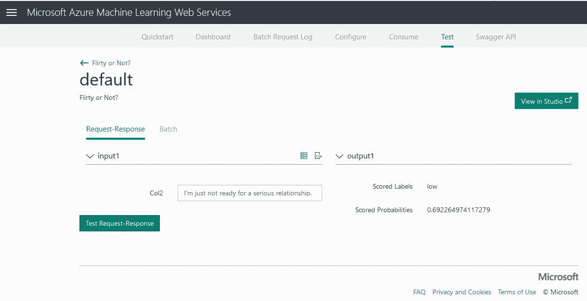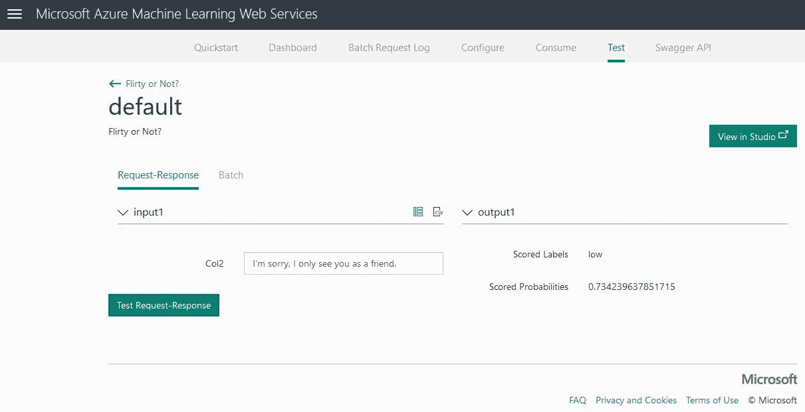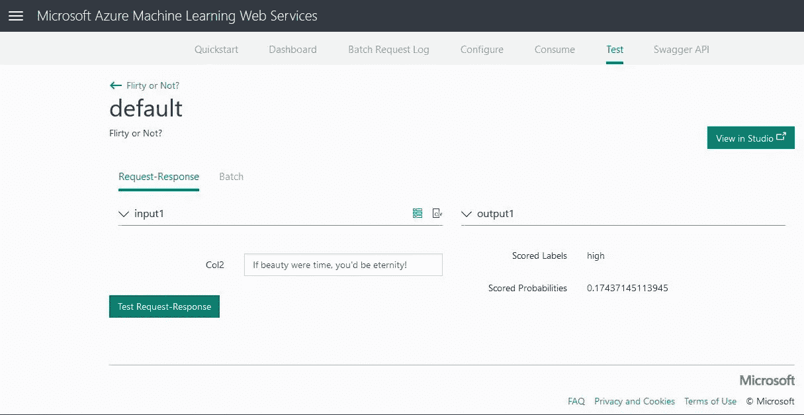

# **结论**

*   这是我第一次使用 Microsoft Azure Machine Learning Studio 进行实验，但我学会了如何部署模型并为生产做好准备！
*   如果我在一个更大更好的数据集中工作，准确性会提高，这就是我要做的
*   如果能考虑其他因素来预测文本是否调情，那就太棒了

 [## viritaromero -概述

### 软件工程师，对数据科学和机器学习充满热情。-维里塔罗梅罗

github.com](https://github.com/viritaromero) 

## 来自 DDI 的相关故事:

 [## 用 7 个步骤解释深度学习——数据驱动投资者

### 在深度学习的帮助下，自动驾驶汽车、Alexa、医学成像-小工具正在我们周围变得超级智能…

www.datadriveninvestor.com](https://www.datadriveninvestor.com/2019/01/23/deep-learning-explained-in-7-steps/)  [## 成为数据科学家所需的 8 项技能——数据驱动型投资者

### 数字吓不倒你？没有什么比一张漂亮的 excel 表更令人满意的了？你会说几种语言…

www.datadriveninvestor.com](https://www.datadriveninvestor.com/2019/02/07/8-skills-you-need-to-become-a-data-scientist/)