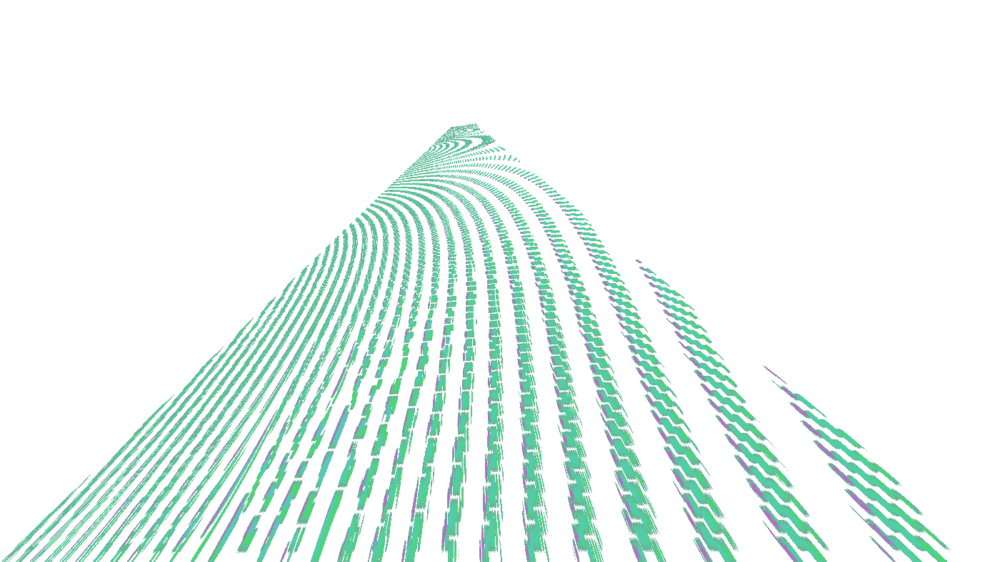
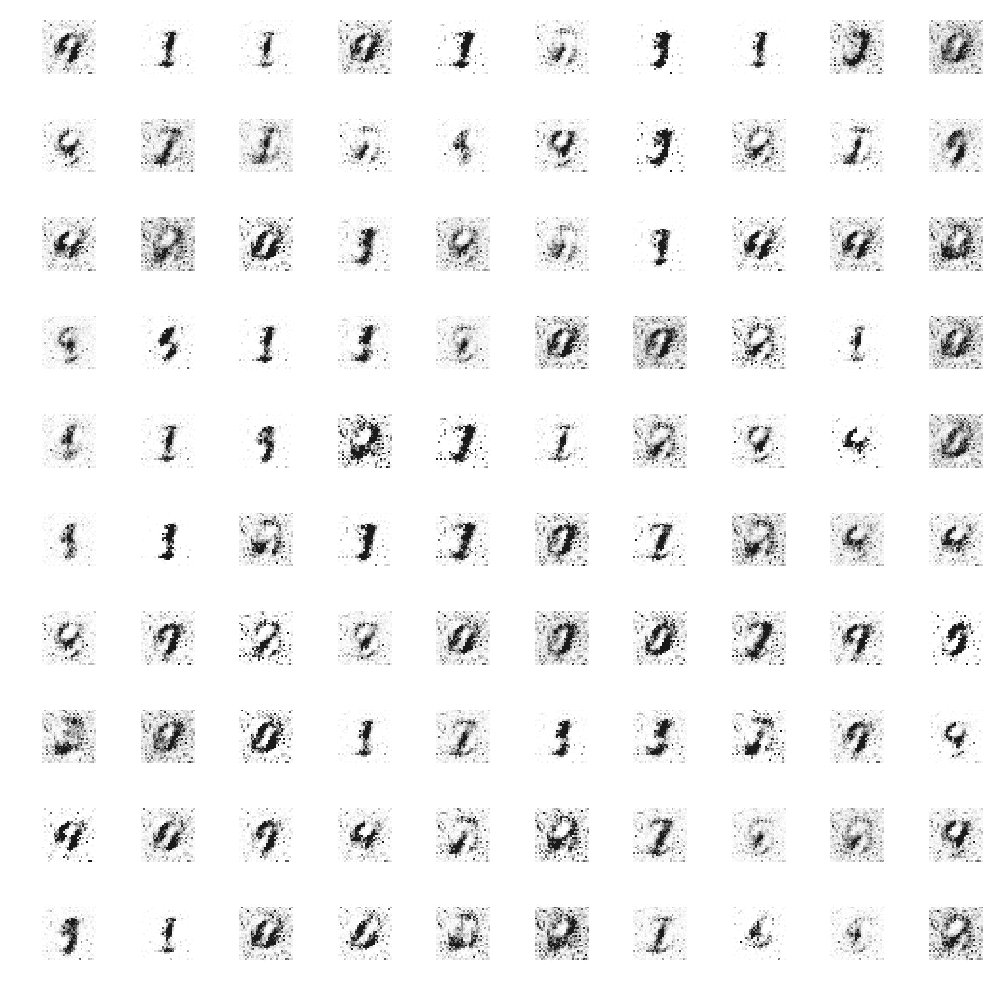

# 神经网络能抓到“病毒”吗？

> 原文：<https://medium.datadriveninvestor.com/can-a-neural-network-catch-a-virus-8439ec6ddc6e?source=collection_archive---------6----------------------->

神经网络是当今机器学习工具箱中最强大的工具之一，但它们会被“病毒”操纵或破坏吗？

**快速神经网络入门**

N 欧洲网络是图灵机智能(TMI，[我喜欢的人工智能术语](https://medium.com/@samtroper/ai-a-term-of-the-past-9d2217fcb86f))的一种高度灵活的形式，它通过给定要分析的数据和所需的分析形式来“学习”。数据可以是用字节表示的任何东西(所以你在计算机上见过或用过的任何东西都可以)，输出可以是用字节表示的任何东西。在更高的层次上，这意味着你可以执行诸如面部识别(输入是图像，输出是被识别的个人的名字)之类的事情，创建自动驾驶汽车，构建股票交易机器人，或者更多。

这些网络的内部工作(通常)是使用高级微积分生成的，对此的解释超出了本文的范围。这种演算(称为[反向传播](https://en.wikipedia.org/wiki/Backpropagation))应用于“隐藏层”，即一系列连接输入和输出的节点，并可能连接到其他隐藏层。然而，这些生成的内部连接在很大程度上对任何创建这些网络的人来说都是一个黑盒，对那些与这些网络进行交互但却没有意识到这一点的人来说甚至更加不透明，例如流行应用程序的用户、网络浏览器、汽车司机等。随着给定网络规模的增加，它们变得越来越不透明。[这些内层经常最终执行没有分配给给定机器的任务，例如识别书籍](https://www.youtube.com/watch?v=AgkfIQ4IGaM)。机器通常(至少在其隐藏层中)不会像有意识的人一样思考或感知(尽管，也许这些内层和我们的无意识思维之间有一些相似之处，这是本文范围之外的另一个有趣的话题)，这使得理解它们的内部网络很困难。

**输入生成的敌对网络(gan)**

的核心是两个相互训练的神经网络的组合——这些网络通过结合传统的训练数据和两个神经网络之间的“竞争”来学习。这些网络非常强大——它们可以被训练在几分钟内“想象”出数字图像，或者[创造出不存在的面孔](https://petapixel.com/2018/12/17/these-portraits-were-made-by-ai-none-of-these-people-exist/)。

A GAN network which learned to “imagine” digits in a few minutes. The gif shows the results after training epochs 1–5, 10, 15, 20, 30, 40, and every 20 epochs, concluding with the 200th epoch. You can see the progress being made from blurs, to messy digits, to clean digits with some artifacts, to nearly perfect digits.

这些网络是(相对)新的网络，是机器学习领域中相当令人兴奋的发展。它们还没有被完全探索，可能性是相当有趣和开放的。

**那么，神经网络能抓到“病毒”吗？**

T 何简短回答大概是。一个更长的答案是，一些网络可能可以，但其他可能不能，这是一个个案的基础上。一些可能比其他更容易“感染”，特别是随着网络的复杂性(以及网络可能“被感染”的点的数量)的增长。

那么，为什么会这样呢？

GAN 可以用来为特定的神经网络生成“病毒”。虽然 GANs 通常用于将图像标记为“真实”或“人工”，但它们不是训练它们“欺骗”网络认为某样东西是“真实的”而不是“人工的”，而是可以用来“感染”网络并导致它生成不正确的结果。

这是最简单的具体例子。考虑具有两个分类的图像分类器:contains_person_A 和 contains_any_person。像这样的分类器已经存在，我将避免如何建立一个的细节，但你可以在这里看到[了解更多。我们称这个网络为“分类器”我们将这个分类器作为第二个神经网络插入到 GAN 中。第一个网络将是我们的“病毒”发生器。我们将创建的病毒是导致第二个网络得出分类 contains_person_A = True 和 contains_any_person = False 的病毒(显然，如果图像包含人 A，则它包含人，从而使该网络得出致命的结论)。既然目标已经确定，网络实际上就相对容易组装起来:“冻结”分类器，并附加“病毒”生成器。告诉网络以生成图像为目标进行训练，使得分类器最终得到 contains_person_A = True 和 contains_any_person = False 的矛盾结果。这就是开始制造这种类型的“病毒”所需要的一切这可以扩展到为现有图像创建过滤器，使其成为一个具有一些真实用途的完整应用程序。](https://www.tensorflow.org/tutorials/images/image_recognition)

**这是什么意思，下一步是什么？**

很不幸，我看不到未来，但是有一些有趣的可能性:

神经网络的“神经学家”可能会出现，专注于这些网络的内部工作，而不是传统的结果，以保持这些网络的健康和功能。这些“神经学家”甚至可能是另一个神经网络，导致计算机之间复杂的“医生-病人”类型的交互。

这些网络可能能够为你的照片生成“匿名”过滤器——你可以应用这些过滤器，使维护大型面部数据库的公司(如脸书、Instagram、谷歌……)无法正确分类你，同时让你的图像对任何查看图像的人来说都是“正常的”。

企业和政府可能开始从事一种新形式的间谍活动——攻破他们的对手 TMIs(人工智能)。谷歌可能试图通过插入特制的病毒图像来破坏脸书的算法，导致它们的分类和其他 TMI(人工智能)“中断”，并开始以比过去更差的水平运行。军方可能开始试图利用这些“病毒”来破坏他们的敌人网络。

随着这种“病毒式”数据进入组织的数据库，它也将开始被用作训练数据，从而在这些网络的算法中引起波动，这可能会产生深远的后果…

事实上，人们可能会创建一个通用的神经网络来为其他网络创建“病毒”，尽管也许其他人也会创建一个通用的“医生”网络来对抗这些“病毒”

这些只是其中的几种可能性，但还有很多很多。有些可能对社会有帮助，例如将“病毒”插入压迫政权的网络，而另一些可能被用来“破坏”积极分子的计划。

神经网络病毒是一种现实的可能性。后果如何还有待观察。