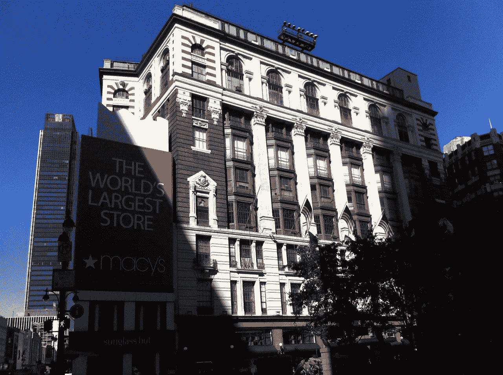
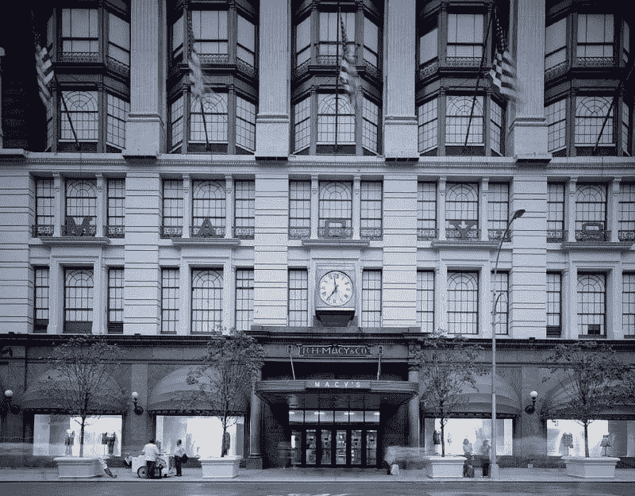
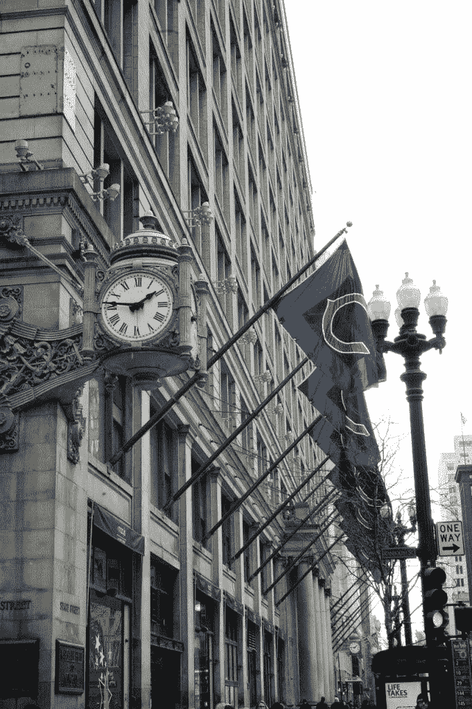
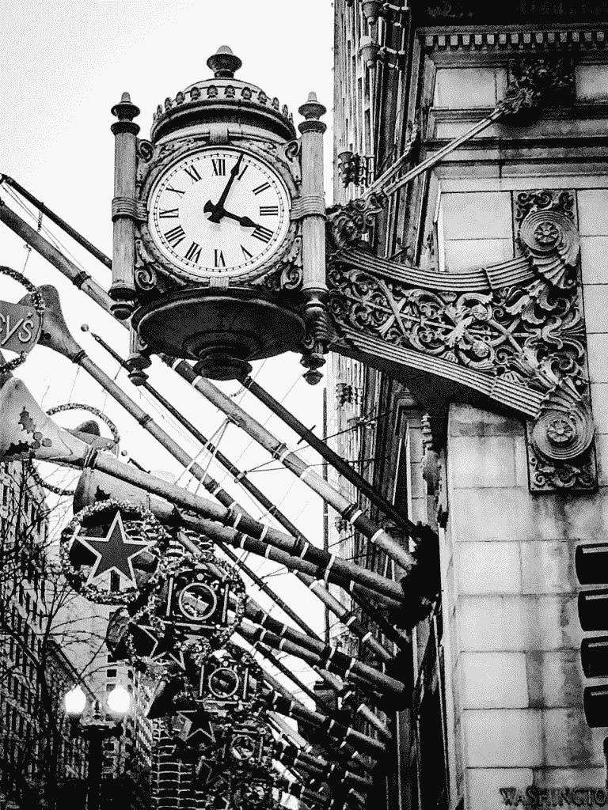
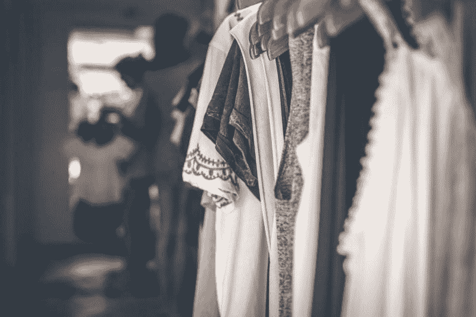

# 萎缩的梅西百货能挺过亚马逊时代吗？—市场疯人院

> 原文：<https://medium.datadriveninvestor.com/can-a-shrinking-macys-survive-the-age-of-amazon-market-mad-house-1e4d32c41d59?source=collection_archive---------6----------------------->

在亚马逊萎缩的时代，没有哪家零售商比梅西百货更脆弱。

解释一下，**亚马逊(NASDAQ: AMZN)** 出售梅西百货的所有商品，并提供在家购物的便利。事实上，富国银行分析师预计亚马逊将在 2019 年超过梅西百货的服装和鞋子销售额， *Geekwire* [报道](https://www.geekwire.com/2018/amazon-surpass-walmart-top-u-s-apparel-retailer-30b-annual-sales-analyst-says/)。因此，亚马逊将取代梅西百货成为美国最大的服装零售商。

而且，梅西百货的资源是亚马逊资源的零头。例如，亚马逊报告营收为 723.82 亿美元；2018 年第四季度的毛利为 275.97 亿美元，现金和短期投资为 412.5 亿美元。

 [## 股票市场投资的机器学习——数据驱动的投资者

### 当你的一个朋友在脸书上传你的新海滩照，平台建议给你的脸加上标签，这是…

www.datadriveninvestor.com](https://www.datadriveninvestor.com/2019/01/30/machine-learning-for-stock-market-investing/) 

与此同时，梅西唱片公司(Macy ' s records)2019 年 2 月 2 日的现金和短期投资为 11.62 亿美元，毛利为 31.67 亿美元，营收为 84.55 亿美元。

# 为什么梅西百货无法与亚马逊竞争

在这种情况下，梅西百货无法与亚马逊竞争，因为它的资源要小得多。

此外，梅西百货的许多资源正在萎缩。值得注意的是，Stockrow 估计梅西百货的收入增长在 2018 年最后一个季度萎缩了-2.5%。因此，梅西百货的季度收入从 2018 年 2 月的 86.72 亿美元降至 2019 年 2 月的 84.55 亿美元。

此外，梅西百货的季度毛利从 2018 年 2 月的 33.49 亿美元降至 2019 年 2 月的 31.67 亿美元。此外，梅西百货的季度净收入从 2018 年 2 月 3 日的 13.47 亿美元增至 2019 年 2 月的 7.4 亿美元。

此外，梅西百货的季度运营现金流从 2018 年 2 月 3 日的 15.77 亿美元降至 2019 年 2 月 2 日的 13.06 亿美元。加上梅西公司的季度自由现金流从 2018 年 2 月的 15.66 亿美元下降到 2019 年 2 月的 14.04 亿美元。

# 梅西百货无法与亚马逊竞争

实际上，随着亚马逊的人气激增，梅西百货从较低的销售额中获得的现金越来越少。

具体来说，梅西百货需要让顾客走进店里来看它的商品。同时，亚马逊；和所有的商品都在顾客面前。

而且，亚马逊从梅西百货的广告中获利。解释一个喜欢梅西百货电视广告中的衬衫的顾客，可能会在亚马逊上购买它。此外，Prime 使网上购物变得免费和容易。

最后， *The Verge* [声称](https://www.theverge.com/2019/4/25/18516795/amazon-prime-free-one-day-shipping-update-earnings)亚马逊正在开发一个免费的一日 Prime 运输选项。因此，如果有顾客想要的东西，亚马逊可以在几个小时内送货上门。

# 现在沃尔玛正在收购梅西百货

亚马逊也不是唯一的危险。现在，美国最大的实体零售商；沃尔玛，正在争夺梅西百货的顾客。

解释一下，**沃尔玛(纽约证券交易所代码:WMT)** 现在正通过为城市顾客提供礼宾运输服务与梅西百货直接竞争。彭博[报道](https://www.bloomberg.com/news/articles/2018-05-31/walmart-unveils-concierge-shopping-service-for-urban-families)具体来说，沃尔玛的 8 号店孵化器在纽约市经营一个他们称之为 [Jetblack](https://www.jetblack.com/) 的门房。

像亚马逊一样，礼宾部让购物变得简单方便。例如，Jetblack 通过短信提供个人购物、快速免费快递、免费礼品包装和无障碍退货。因此，一个忙碌的足球妈妈没有理由带着飞机去百货商店。

我想知道梅西百货公司如何能继续经营下去，当它的主要顾客；女性大多通过电话购物。我认为 Jetblack 对梅西百货是一个巨大的直接威胁，因为[Store 8](https://www.storeno8.com/)正试图开发能够处理任何购物请求的数字机器人。

如果 Jetblack 的数字机器人奏效，沃尔玛可以在全国范围内推广它们，并在所有市场上与梅西百货竞争。沃尔玛正在测试 Jetblack，因为它需要更有钱的上层顾客。像 Jetblack 这样的服务就是为了获得这些客户。

# 梅西百货有前途吗？

因此，**梅西百货(纽约证券交易所代码:M)** 未来最大的希望可能是与亚马逊、沃尔玛或类似 Jetblack 的公司联手。

为了解释这一点，梅西百货可以在其商店中为亚马逊或 Jetblack 订单提供服务。具体来说，Jetblack 可以将梅西商店的商品运送给顾客。此外，梅西百货可以作为一个“服务中心”,接受 Jetblack 的退货，并支持几种送货服务。

此外，梅西百货可以通过向 Jetblack、Instacart 或亚马逊等在线零售商出租或租赁部分店铺来赚钱。有趣的是，**美国柯尔百货公司(纽约证券交易所代码:KSS)** 的商店里有[亚马逊服务中心](https://www.kohls.com/feature/amazon.jsp)。

因此，梅西商店可以作为城市重生；或郊区，履行中心支持交付网络。此外，梅西百货可以为其商店增加一些便利设施，如沙龙、水疗中心、杂货店、酒吧、修鞋、烹饪班、裁缝店和餐馆。

# 梅西百货有多少价值？

有趣的是，由于其足迹，梅西百货的价值可能远远超过市场先生的想象。

例如，梅西百货[经营](https://www.macysinc.com/about/store-count-and-square-footage) 680 家梅西百货和布鲁明戴尔百货，以及 190 家专卖店。事实上，梅西百货经营着五家专业连锁店:蓝色水星、布鲁明戴尔的奥特莱斯、梅西百货的后台和故事。此外，梅西百货的足迹遍布 43 个州、波多黎各、关岛和哥伦比亚特区。

因此，我认为梅西百货可以利用其资源打造下一代零售平台。澄清一下，这个平台可以结合网上购物、机器人门房、当天送达和实体零售。此外，梅西百货可以向顾客出售“体验”,比如水疗或烹饪课程。

# 是的，梅西百货是一项价值投资

因此，我认为**梅西百货(纽约证券交易所代码:M)** 在 2019 年 5 月 3 日交易的 23.24 美元是一个弱势价值投资。梅西百货之所以疲软，是因为其业务萎缩，现金有限。

解释一下，我认为梅西的资源潜在价值高于股价。因此，梅西百货是一项风险价值投资，因为它有很多未开发的潜力。

特别是，梅西百货可以通过向其他零售商出售或出租店面来创收。此外，梅西百货可以通过采用组合商店商业模式来削减开支和创造更多的收入。

为了证明这一点，美国柯尔百货公司和阿尔迪正在开设合资商店，将一家小型百货商店和一家杂货店合二为一。因此，梅西百货可以通过与零售商如**克罗格(NYSE KR)** 、阿尔迪、**沃尔格林(NASDAQ: WBA)** 、亚马逊/全食、**家得宝(NYSE: HD)** 、**劳氏(NYSE: LOW)** 或沃尔玛合作开设组合商店来从过剩的空间中获利。

组合商店非常适合像 Jetblack 这样的机器人礼宾服务，因为它们可以支持快递员一站式收取杂货、热餐、餐包、鞋子、服装和许多其他物品。因此，不断发展的技术赋予了梅西百货巨大的潜在价值。

# 梅西百货是一家值得尊敬的股息公司

最后，我认为梅西百货是一只值得尊敬的股息股，因为它在 2019 年 4 月 1 日向 37.7₵支付了每股股息。

然而，这一股息已经三年没有增长了。事实上，自 2016 年 6 月向 36₵.支付股息以来，梅西百货的股息一直没有增长因此，梅西百货不是一只好的收益股。然而，梅西百货的股东在 2019 年 5 月 3 日享有 6.5%的股息率，1.51 美元的年化派息，以及 38.4%的派息率。

那些寻找具有很大投机增长潜力的低价股息股票的人应该去梅西百货公司看看。但是，投资者应该认识到，梅西百货；和其他连锁百货商店一样，在亚马逊时代，亚马逊也有很多风险。

*原载于 2019 年 5 月 3 日*[*【https://marketmadhouse.com】*](https://marketmadhouse.com/can-a-shrinking-macys-survive-the-age-of-amazon/)*。*