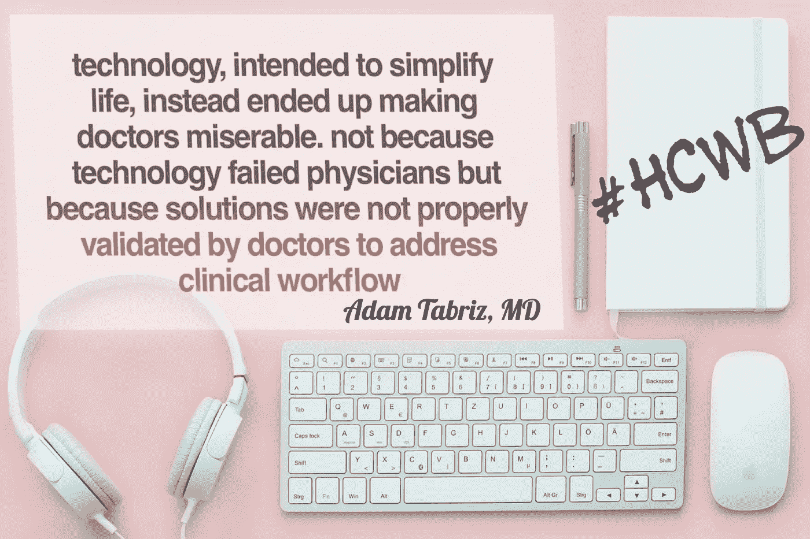

# 突然的决策和政策能拯救医疗保健吗？

> 原文：<https://medium.datadriveninvestor.com/can-abrupt-decisions-and-policies-rescue-healthcare-5f790f4d1857?source=collection_archive---------3----------------------->

HITECH

医疗保险和医疗补助服务中心以及国家健康信息技术协调员办公室已经承诺将处理病人病历的医疗行业数字化。CMS 的管理者西玛·维尔马呼吁在 2020 年前逐步淘汰所有诊所和医生办公室的传真机。

这些组织已经走到一起，为患者、护理提供者和保险公司之间的互操作性和医疗信息的无缝流动创造了新的机会。CMS 希望所有医生和内科医生转而使用数字健康信息，并寻求开发人员为所有利益相关者创建用户友好的应用程序，而不是使用传真。维尔马认为医疗保健仍然停留在 20 世纪 90 年代，他们应该做些什么来使医生的工作更容易。

**医生对决定的反应**

医生和内科医生在社交媒体上发表他们对这一决定的看法。有些人认为这不是一个好主意，因为传真机很难被黑客入侵，而且使系统更安全。一位医生把事情发展到不同的水平，并告诉说，现在医学界将采取旅鸽交流健康信息。

这个评论引起了一阵骚动，一位医生评论说，他们应该使用驿马快信而不是信鸽来找到绕过传真机和 HISP 电子邮件目录的路。一位医生很想知道 CMS 将如何完成这项任务，并评论说，我们必须等到 2019 年才能找到答案。

其他人指出，医生不愿意适应新的系统，仍然依赖于纸张。他说，我们已经在电子健康记录(EHR)系统上花费了数十亿美元，并且拥有像智能手机这样的普通设备，可以用来发送安全的文本和信息。但是，即使所有技术都可用，医疗保健界仍未转向数字化。根据他的观点，这就是医疗保健昂贵且功能失调的原因。

**这个决定没有解决问题的根本原因**

我们已经看到了政府试图解决医疗保健问题的不足之处。我们有如此多的流行词汇，如患者授权、互操作性、医生倦怠、信息的无缝流动，但都无济于事！另一方面，我们有 MACRA、ICD 10 编码、基于价值的报销、患者结果、效率、电子病历的有意义使用、医生的 MOC、农村健康问题——感觉我们生活在丛林中！

我相信，西玛·维尔马想逐步淘汰传真机是有诚意的，但这肯定不是办法。她对整个医生群体和医疗保健系统的划分是不正确的，她必须理解为什么医生仍然使用传真机。

为什么医生还在使用传真机？

传真机仍然存在于所有的诊所、医院和医生办公室。由于 HIPAA 认为它是发送信息的一种安全方式，所以它仍被广泛使用。电子邮件很容易被黑客入侵，但要入侵传真真的很难，因此它有资格处理医疗记录。

发送传真也比发送加密电子邮件简单得多，许多医生不想放弃这种简单性。传真机把发送信息、扫描和打印合二为一，许多医生喜欢这种便利。

一些医疗平台，如 Doximity，已经设计出使用智能手机发送传真的解决方案。许多诊所和医院仍然依赖旧系统，即使组织已经转向数字信息，也有必要拥有传真机进行通信。

已经转向数字方法的医院或诊所仍然不具备互操作性。因此，当患者信息必须发送给新的提供商时，他们必须依靠传真。此外，一些医生不愿意学习新技术，仍然使用过时的传真机。

**我们需要解决根本原因的方案**

纠正医疗保健的所有步骤感觉像是在命令之上增加了更多的命令，并增加了压力。政府在不解决现有问题的情况下增加了更多的负担。传真机已经过时了，但是医生们坚持使用它是有原因的。

但是现在有了更好的技术，为什么有些医生还想用？这个案例就是医学界的异化。政府应处理问题的根源，并帮助医学界采取正确的工具，以满足当前的要求，避免倦怠。

医生和患者的舒适对于高质量的医疗保健是必要的，我们需要在这个问题上团结所有的医生。公司环境可能会削弱“分而治之”理念对患者和医生的授权。政府应该加强所有医生和病人之间的联系，以便找到解决办法。

我们必须拉拢医生，利用他们的合作来提出任何解决方案。政府应该鼓励创业和创新，提供最先进的解决方案，并修复医疗保健的信任缺失。

我们必须摆脱垄断市场，强调病人的消费主义，这将有助于医生转向新技术。应该尽可能避免不必要的命令和微观规定，这样我们可以防止医生精疲力竭，并为患者带来积极的结果。