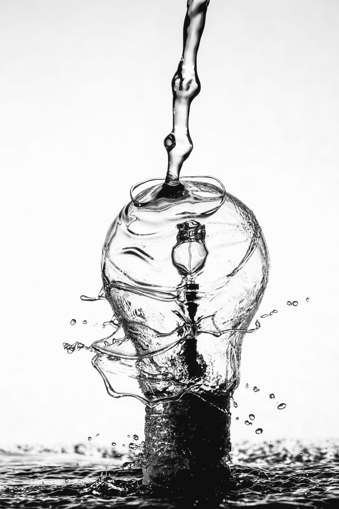

# AI 可以自动化创造力吗？

> 原文：<https://medium.datadriveninvestor.com/can-ai-automate-creativity-cc597ceac970?source=collection_archive---------21----------------------->

“water dropping on light bulb” by [Sharon Pittaway](https://unsplash.com/@sharonp?utm_source=medium&utm_medium=referral) on [Unsplash](https://unsplash.com?utm_source=medium&utm_medium=referral)

## 人工智能(AI)将改变人们的工作和生活方式。它可能会取代或帮助许多工作，从体力劳动开始，一直到医疗和行政职位。人工智能热潮正在永远改变我们所知道的世界。

人工智能对许多涉及重复动作的工作有意义，但创造性的工作呢？

# AI 可以自动化创造力吗？

从技术角度来看，当前的人工智能技术非常简单——它非常擅长在非常明确的情况下模仿和复制人类行为模式。看看你自己。你可能会做很多并不复杂的重复动作。从机械的角度考虑写作，认识日常物品，开车。

真正的问题是，人工智能是否能产生完全独特和创造性的内容。没有简单的答案。

举个例子，一种新的算法被称为生成对抗网络，或 GANs。英伟达最近的研究表明，人工智能可以很好地生成新内容。

NVIDIA 的神经网络被引入到好莱坞名人的照片集中，并被训练生成不存在的名人的新面孔。虽然这听起来令人印象深刻，但这不是我们所知道的创造力。这只是一种更复杂的复制粘贴已有知识的方式，就像一个婴儿试图复制单词并产生胡言乱语。婴儿可能会试图模仿成人书写的样子，但他不可能理解内容。这个名人脸生成器做着同样的事情——它模仿，但不创造。区别纯粹是哲学上的。

> *“一切艺术创作都是一种模仿。”—柏拉图*

**照片编辑也是如此。通过遵循从专业摄影师那里学到的最佳实践和模式，AI 可以学习模仿照片编辑过程。至少它可以复制常规部分——像人类编辑一样修正白平衡、曝光、细节和清晰度。但人工智能无法增加创造性。这仍然需要人工干预。**

例如，我们的自动化照片编辑工具 Photolemur 背后的人工智能，利用专业 Luminar 用户提供的一些技巧和窍门，充分利用你的照片。通过运用我们社区的集体智慧，这是一个让你的照片集看起来很棒并且快速完成的好方法。但是要创作一部杰作，还是要打开 Luminar，开始工作。没有人工智能来自动化这一点。

最有创造力的头脑依赖于跨越一生的丰富多彩的经历。神经网络远没有那么广阔的视野。虽然它们擅长模仿，但让它们成为更通用的解决方案的工作仍处于起步阶段。造成这种情况的主要原因是 AI 系统的内存和经验有限，通常仅限于一个简单的应用程序。

> *作为一家公司，我们认为我们的使命是开发人工智能，帮助你进行日常编辑，并为你的创作过程提供新的工具。*

著名的国际象棋特级大师、现在的人工智能研究人员加里·卡斯帕罗夫提出了一个我们喜欢的人工智能的新含义——人工智能应该代表辅助智能。人类的智慧加上机器深厚的领域专业知识，形成了无与伦比的组合。至少在象棋和摄影方面。