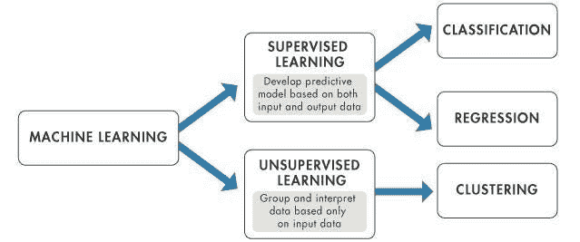
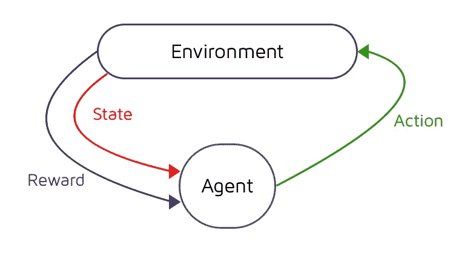
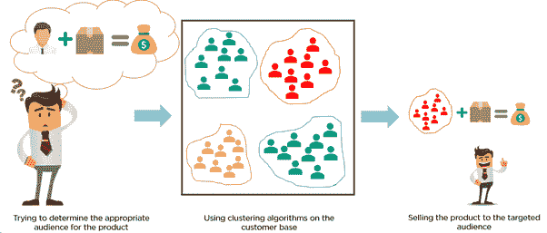

# 人工智能能创作出比人类更好的音乐吗？

> 原文：<https://medium.datadriveninvestor.com/can-ai-compose-better-music-than-humans-66a8bad81fd2?source=collection_archive---------10----------------------->

## 人工智能有朝一日能够取代人类的创造力吗？

AI 会作曲这件事吓到大家了。这会在人们心中引发疑问: ***“这会让人类失业吗？”***AI 会不会把碧昂斯，阿黛尔或者 Jay Z 赶出歌唱和表演？不会。它将只是用来为视频游戏和 YouTube 视频创作音乐，几乎和人类一样好。

它是如何工作的？一个人工智能程序是如何开始理解音乐、作曲和节奏的？

 [## 人工智能与创造力:梦想成真|数据驱动的投资者

### 人工智能总是让我着迷。不仅作为一套有用的工具，不断发展，而且作为一个…

www.datadriveninvestor.com](https://www.datadriveninvestor.com/2019/01/28/ai-creativity-deep-dream-comes-true/) 

该程序背后的技术基于使用**强化学习技术的**深度学习算法**。**首先，什么是深度学习？—简而言之，**深度学习**是**机器学习**的子集，它拥有能够从未标记的数据中学习**无监督**的网络。

使用**深度神经网络**人工智能预测音符序列来创作全新的歌曲。你给软件输入大量的源材料，从热门舞蹈到经典作品，然后它进行分析以找到模式。它掌握了诸如节奏和长度这样的东西。然后它从所有的输入中学习，这样它就能写出自己的旋律。

Supervised and Unsupervised Learning Diagram

**另一方面，强化学习**是一种**机器学习技术**，它教会软件代理决定下一步采取什么行动以达到某些目标。

Reinforcement Learning Diagram

在**强化学习中，**代理每次决定采取哪些行动。代理人根据收到的奖励和观察到的环境做出这些决定。这个模型需要学习的只是一系列它可以采取的行动，一个奖励信号，以及一个它所处环境的表示，比如一幅图像。

与**监督学习不同，**需要使用已知和标记的数据作为输入和输出，**强化学习**不需要数据的标记输入和输出。这使得人工智能可以在没有任何明确指示的情况下找到自己的数据处理方式，并提高其性能。

强化学习的一个例子是**聚类。**聚类是指由于某些相似性而聚集在一起的数据点的集合。这对音乐来说意味着，对于类似的曲调和节奏，人工智能将这些相似之处聚集在一起，并从中制作音乐。

Clustering Diagram

大型科技公司也提供人工智能作曲的音乐。其中有 [Google](https://ai.google/research/teams/brain/magenta/) Magenta、[索尼的 Flow Machines](https://www.flow-machines.com/) 、 [Aiva](https://www.aiva.ai/) 。

所以现在的问题是:**如果机器可以创作音乐，这对人类音乐家来说意味着什么？**是的，制作音乐的算法听起来很可怕，因为它反映了我们已经发现很奇怪的人类能力，但人工智能音乐也可以是一种迷人的工具，可以增强人类的能力。人工智能作为一个合作者可以增加音乐制作的机会，它也可以为你制作下一张热门专辑提供一些灵感。

AI 音乐的宗旨不是 ***“这会比 X 好吗？”*** 但却是 ***的问题“会对人有用吗？”*** 。 ***对他们有帮助吗？"*** 这种类型的技术是为那些制作短片的人或者因为版权原因不希望自己的视频被删除的 YouTubers 用户准备的。

也许有一天，人工智能可以在创作音乐的能力上与人类竞争，但就目前而言，我怀疑它是否会取代艺术家的创造力。

# 关键要点:

*   人工智能音乐不会取代艺术家，而是简单地用于为视频游戏和 YouTube 视频创作音乐。
*   这项技术基于使用强化学习技术的深度学习算法。
*   与需要使用已知和标记数据作为输入和输出的监督学习不同，强化学习不需要数据的标记输入和输出。
*   强化学习的一个例子是聚类。
*   这项技术的目的不是让它比**X**更好，而是帮助那些制作短片的人或不希望自己的视频被删除的 YouTubers 用户。

如果你喜欢这篇文章，别忘了为它鼓掌！