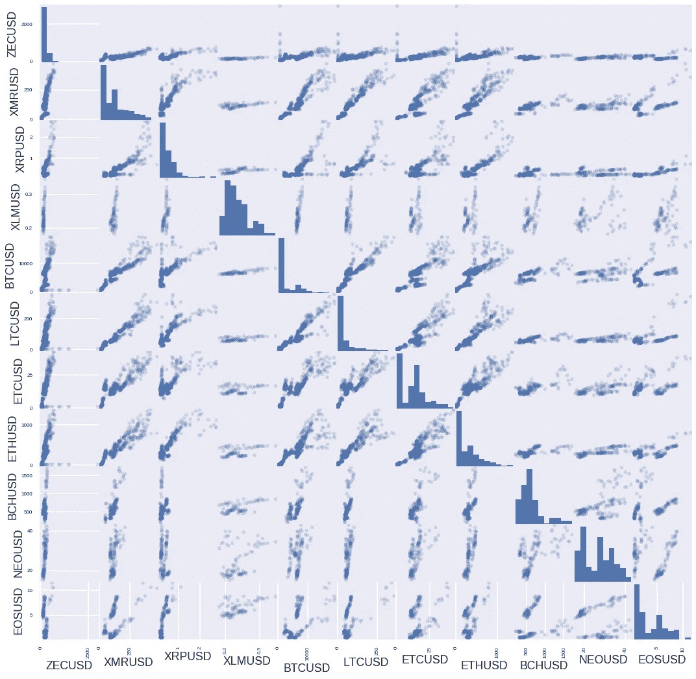
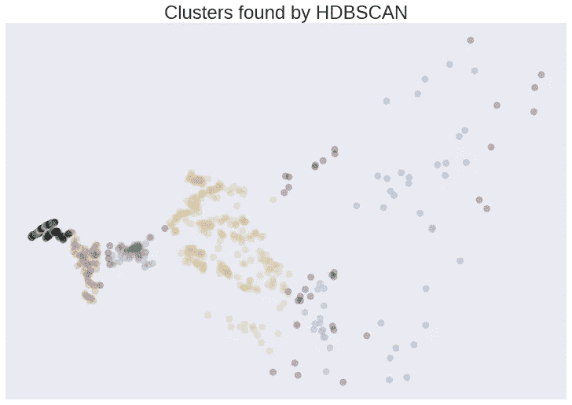
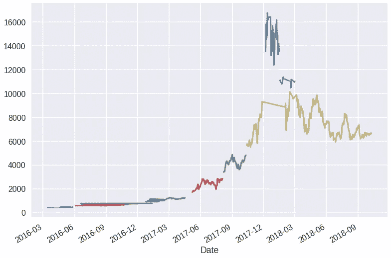

# 人工智能能识别金融泡沫吗？

> 原文：<https://medium.datadriveninvestor.com/can-ai-identify-a-financial-bubble-5c64cca809e8?source=collection_archive---------1----------------------->

## 识别政权更迭

## 案例研究:加密和集群

我最近无意中发现了以下博客:“[你不需要多样化的加密投资组合来分散风险:这就是为什么](https://hackernoon.com/bitcoin-dominance-5a95f0f3319e)”。虽然多样化的前提是有争议的，但我发现加密市场的演变历史非常有趣，因为它压缩了各种制度的类型(引用自上面的博客):

*   炒作之前:(截止到 2016 年):

> 2016 年，各货币之间的价格相关性非常松散。事实上，如果我没记错的话，除了通过这个名为 Gatehub 的粗略网站，你甚至不能购买 Ripple。我认为你必须使用菲亚特购买，但因为这对美国公民来说是一个问题，我不认为我的帐户被验证过。细节有点模糊，有点跑题，但关键是，在 2016 年，altcoin 价格与比特币的关联非常松散。只有莱特币、Monero 和 Dash 真正表现出与比特币的适度相关性。按照股价标准，有人可能会说它仍然具有很强的相关性，但与最近几年相比，0.6-0.7 看起来相当不错。

*   牛市(2017):

> 2017 年标志着最近一轮加密货币牛市的开始，几乎把每一个替代硬币都变成了一个以比特币为中心巨星的星球。请注意，相关性急剧上升，只有 Ripple 对比特币定价表现出一些抵制。

*   市场崩盘(2018 年):

> 2018 年，随着围绕加密货币的积极市场情绪减弱，价格趋势发生了转变。比特币价格从 17000 美元跌至今天的 6600 美元左右，整个加密货币市场都可以感受到这次崩溃的影响。在此期间，加密货币价格之间的相关性甚至很强，比特币价格下跌的重量将所有东西都拉了下来。

## 人工智能对抗人类专家

人工智能能帮助(甚至取代)人类识别这种政权吗？在之前的博客(“[比率聚类](https://medium.com/@gjlr2000/rates-clustering-611a3af9b294)”)中，我展示了如何使用人工智能聚类来识别不同的政权；嗯，我把同样的技术应用到加密货币世界只是为了好玩，下面是我得到的结果:

乍一看，如果我们做一个自由散点图，我们可以直观地识别密码之间的一些相关性，但也可以识别一些倾向于“群集”的区域:

在之前的博客(“ [Rates Clustering](https://medium.com/@gjlr2000/rates-clustering-611a3af9b294) ”)中，我使用了不同的聚类技术(无监督人工智能)来识别不同的制度。一个简单的技巧是将整个密码字的维数降低到一个二维问题，然后进行聚类。Python 允许你用几行代码就可以做到这一点(见我的[谷歌合作笔记本](https://colab.research.google.com/drive/1SEZJpq1v2iIIM-KqfahYOb1ibWwJvOuw)，我可以得到视觉上很好看的聚类图:

(我使用 HDBScan —阅读“[集群与 HDBScan](https://towardsdatascience.com/lightning-talk-clustering-with-hdbscan-d47b83d1b03a) ”了解相关介绍)

从上面我们可以清楚地看到，人工智能技术几乎完全独立地识别不同的聚类(仍然需要设置“最小聚类大小”)。图很好看，但还是让我们把它还原成时间序列形式(应用在比特币的价格上):

Bitcoin Regimes

看那里，人工智能强调了一个似乎与泡沫一致的制度:深蓝色价格在 12k 和 16.5k 之间，泡沫！

现在，因为聚类是一种无监督的人工智能技术(阅读金融中的'[AI【T7])，它**不知道**它指的是泡沫，所以严格来说，它所说的只是“这组数据点看起来相似”。人类仍然需要理解它是泡沫、牛市(见红色和绿色的集群)还是停滞的时间(黄金线)](https://medium.com/datadriveninvestor/ai-in-finance-cutting-through-the-hype-with-case-studies-f361518b00d4)

所以，不， **AI 无法识别泡沫**。

检查我的谷歌协作 Python 笔记本中的代码( [*密码体制变更*](https://colab.research.google.com/drive/1SEZJpq1v2iIIM-KqfahYOb1ibWwJvOuw) )