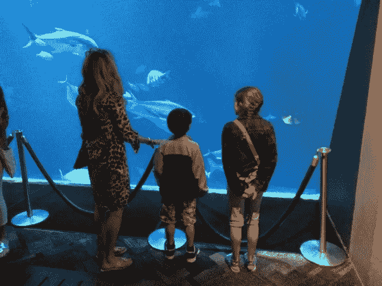

# AI + IoT 能否帮助拯救地球？

> 原文：<https://medium.datadriveninvestor.com/can-ai-iot-help-save-the-planet-af369053978b?source=collection_archive---------2----------------------->

除非我们明智地使用它们。

联合国最近关于生物多样性的报告令人清醒地证明，人类的经济发展已经造成了一场危机，威胁着未来几年地球上超过 100 万种植物和动物的灭绝。

《T2》报道称，物种的消失主要是由气候变化、栖息地丧失、过度捕捞、砍伐森林、污染和其他人为活动造成的，其速度比过去快了几十到几百倍。

 [## 人工智能与创造力:梦想成真——数据驱动的投资者

### 人工智能总是让我着迷。不仅作为一套有用的工具，不断发展，而且作为一个…

www.datadriveninvestor.com](https://www.datadriveninvestor.com/2019/01/28/ai-creativity-deep-dream-comes-true/) 

总部位于奥斯陆的商业咨询公司 [Xyntéo](https://xynteo.com/) 的董事长奥斯瓦尔德·比耶兰(Osvald Bjelland)在接受电话采访时表示:

> 这不是一场远在未来的危机。这是现在正在发生的事情。联合国的报告很明确:大自然正处于有史以来最糟糕的状态。如果我们不立即采取行动，我们就有可能永远失去地球上的重要部分。这威胁到我们自己的灭绝。
> 
> 我们拥有创造一个更可持续发展的世界所需的技术、资本和人才；我们需要的是商业领袖、科学家、政策制定者和普通人一起开发一种为人类和地球服务的增长模式。

# 技术如何提供帮助

来自地球母亲的最新警告发出之际，高科技产业正处于范式转变之中，许多分析师称之为第四次工业革命。基本上，该术语适用于新兴认知技术的融合——以人工智能(AI)为中心——这将重塑整个行业，加速和增强人类决策，并自动化或取代现在由人执行的许多工作。

随着物联网(IoT)、机器学习、机器人流程自动化、深度学习和虚拟助手的出现，人工智能(AI)及其支持的系统将很快触及人们工作和生活的方方面面，并有可能从根本上改善他们的生活。或者，如果没有强有力的道德和明智的领导以及适当的保障，也可能使他们的生活变得更糟。

对环保主义者和全球可持续发展倡导者来说，好消息是这些新技术——特别是人工智能和物联网——极大地增强了人类管理环境因素的能力，如气候变化、农业、生物多样性、水质、自然灾害预测等。正如微软总裁布拉德·史密斯在这家科技巨头推出其雄心勃勃的“人工智能拯救地球”计划时所解释的那样:

> 人工智能最有影响力的社会领域莫过于帮助解决监测、建模和管理地球自然系统所需的紧迫工作。数据可以帮助我们了解我们星球的健康状况，包括我们的空气、水、土地和野生动物的健康状况……人工智能可以被训练成将来自地面、天空或太空传感器的原始数据分类成人类和计算机都能理解的类别。从根本上说，人工智能可以加快我们观察环境系统以及它们在全球范围内如何变化的能力，将数据转化为有用的信息，并应用这些信息采取具体措施来更好地管理我们的自然资源。

这里有一个现实生活中 AI + IoT 的例子。全世界的农民和种植者都受到一个他们无法控制的因素的支配——天气。Yield是一家总部位于澳大利亚的农业技术公司，它使用传感器、数据和人工智能(AI)来帮助农民和种植者做出与天气、土壤和植物条件相关的明智决策。

该公司端到端解决方案中的传感器测量包括土壤湿度、树叶湿度、光线、风和雨在内的 12 个因素，并将数据上传到微软 Azure 云平台。使用微软人工智能，Yield 应用高级分析和预测建模来为农民的特定小气候创建 7 天天气预报。一个直观的移动应用程序帮助农民使用预测来确定如何、何时以及在哪里最好地种植、灌溉、保护、喂养和收获他们的作物。结果呢？更少的腐败和更多的食物。好处是软件从错误中学习，越用越聪明。

在解决环境和其他生活质量问题的新旧行业中，人工智能技术有数千种用途。思科估计，到 2030 年，将有 5000 亿个这样的设备和物体连接到互联网。5G 的到来将加速这种采用。

这对社会和技术都有巨大的影响，涉及广泛的物联网应用:智能农业、海洋监测、野生动物保护、供水监测、优化的基于传感器的空气净化系统、极端天气监测和预测、早期自然灾害预警、智能能源数据中心管理以及数以千计的其他即将到来的应用。

一个积极指标；[世界经济论坛](https://www.weforum.org/agenda/2018/01/effect-technology-sustainability-sdgs-internet-things-iot/)与物联网研究公司 IoT Analytics 合作，对超过 640 个现有物联网部署进行了分析，发现 84%的现有物联网部署可以实现其可持续发展目标(SDG)。

人工智能和物联网有潜力推动尊重和保护环境的前所未有的增长，减少威胁野生动物和自然栖息地的不断扩大的人类足迹，并通过更好的空气、水和可靠的食物供应改善人类和动物健康。

它们也有可能使已经致命的武器变得更加致命，使独裁政权能够以更容易和更具侵入性的方式对个人进行全面监控，并做出不反映人类最佳“价值观”或不符合公平和正义的民主标准的自主决定。它们有能力使许多现在由人类执行的任务自动化并变得多余，如果不以迫切需要规划的方式减轻这些任务，这对人类来说可能是一场灾难。

美国最负盛名的两所大学——斯坦福大学和麻省理工学院——已经通过启动主要的跨学科项目解决了这些问题和其他问题，这些项目致力于研究、指导和开发符合道德并保持“以人为本”的人工智能技术和应用

指导人类迄今为止开发的最强大技术的发展最需要的是领导力。我们需要明智、公正并致力于人类自由、自主和隐私等基本价值观的政府和行业领袖。

我个人的观点是，可持续性要求不仅适用于自然环境，也适用于世界收入不平等差距扩大、政治向威权主义靠拢以及自动化将不可避免地导致失业等问题。

如果引导得当，人工智能可以对人们的生活产生深远的积极影响:它可以帮助减轻气候变化的影响；通过早期检测发现和预防疾病；为更多人提供优质医疗服务；提供更好的清洁用水和健康食品；个性化教育和职业培训；帮助数百万人摆脱贫困，并帮助解决我们面临的许多其他挑战。

智能机器只有在我们让它们聪明的时候才会聪明。创造一个更美好的未来需要政府、学术界、商界、社会和其他利益相关者齐心协力，共同塑造未来。

*这个故事的更早版本出现在 2019 年 5 月 8 日 https://diginomica.com/government*