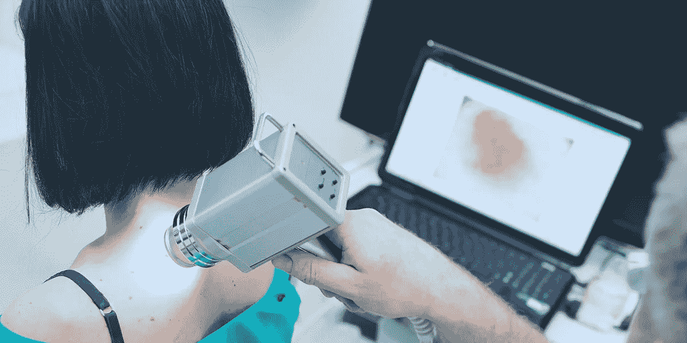

# AI 能代替医生吗？不太可能，但它肯定会扰乱医疗保健

> 原文：<https://medium.datadriveninvestor.com/can-ai-replace-doctors-not-likely-but-it-is-set-to-disrupt-healthcare-c73b07662f82?source=collection_archive---------27----------------------->

Doctor examines a skin lesion with help from a computer.

## 人工智能在某些领域胜过医生，显示出作为医疗工具的前景。这也引发了伦理问题。

今年早些时候，头条新闻传遍了互联网:电脑比医生更准确地检测出了皮肤癌。突然之间，医学界的未来似乎成了疑问。由人工智能驱动的计算机会让这些专业人员过时吗？

研究人员坚持认为不太可能，他们设想人工智能(AI)是一种帮助而不是取代医生的工具。机器学习技术在帮助诊断许多疾病方面显示出巨大的前景，但伦理问题仍然存在。

# 人工智能诊断黑色素瘤

皮肤病学非常适合基于计算机的诊断，因为这一职业非常直观。皮肤科医生检查病人的皮肤，寻找瑕疵可能是癌的迹象。如果医生怀疑是癌症，他们会安排活组织检查来确诊。

据 [IBM Watson](https://medium.com/u/368d6fdd39f?source=post_page-----c73b07662f82--------------------------------) 研究员 Noel Codella 称，医生最初的诊断结果正确率约为 60%—[使用现代工具如皮肤镜放大镜时，正确率高达 80%](https://www.medgadget.com/2017/06/using-watson-diagnose-skin-cancer-interview-ibm-computer-vision-scientist-noel-codella.html)。

2018 年 5 月下旬，德国研究人员宣布，他们的[人工智能](https://www.medicaldaily.com/artificial-intelligence-can-diagnose-skin-cancer-better-doctors-research-shows-424419)在检测黑色素瘤方面比医生更好。在这项研究中，58 名皮肤科医生检测出 86.6%的黑色素瘤，当他们有更多的信息，如年龄，性别和病变部位时，这一比例上升到 88.9%。深度学习卷积神经网络(CNN)以 95%的准确率检测黑色素瘤，在皮肤科医生中名列前茅。

研究人员通过向人工智能展示皮肤缺陷的真实照片以及最终诊断来训练它。这使得计算机能够自己学习癌症和良性病变之间的视觉差异。

医生通常依靠 ABCD——不对称、边界不均匀、颜色和直径——以及他们多年的专业经验、培训和直觉来确定病变是否可能是癌性的。研究人员没有用 ABCD 规则给计算机编程。相反，它像孩子一样学习，自己识别为什么这个病灶是癌性的，而另一个不是。

研究人员可能不知道所谓的黑匣子里面有什么——这个过程使人工智能能够正确识别皮肤癌——但根据真实诊断测试人工智能证实了它的工作。科学家设想机器学习是医生的有用工具。人工智能可以提醒医生基于一些小细节的潜在诊断，否则他们可能会错过。

# 人工智能来诊断其他医疗状况

指甲真菌是皮肤科医生每天在办公室常见的疾病，影响着 3500 万美国人。2018 年 1 月，一组韩国研究人员展示了一个[卷积神经网络](https://spectrum.ieee.org/the-human-os/robotics/artificial-intelligence/ai-beats-dermatologists-in-diagnosing-nail-fungus)比大多数皮肤科医生更好地诊断这种指甲状况。

皮肤科医生仍然需要确认计算机的诊断，将患者的病史和脚臭等线索考虑在内。然而，诊断真菌的人工智能可以[减少医生的办公室访问](https://aluance.digital/acuity/506/future-of-telemedicine-depends-on-patient-buy-in/)，帮助患者在自己舒适的家中获得快速[远程医疗](https://aluance.digital/acuity/413/five-ways-telehealth-helps-healthcare-workers-care-for-an-aging-population/)诊断和抗真菌药物处方。

人工智能也在其他领域取得进展。使用深度学习创建的谷歌 Verily 软件预测心脏病发作风险几乎和医生一样好。依靠眼睛扫描的视觉线索来指示血压，吸烟者或不吸烟者，以及年龄，所有心脏病的风险因素，人工智能在 70%的情况下做出正确的预测。医生使用同样的线索加上验血，准确率为 72%。

# 健康领域对人工智能的担忧

由于机器学习算法从使用人类提供的数据开始，因此有可能引入有意识或无意识的偏见。人工智能系统已经出现了与种族和性别相关的面部识别错误，并且根据研究人员提供的训练数据质量，可能会在自然语言处理中反映出普遍的社会偏见。

斯坦福大学的研究人员正在用人工智能进行实验，以预测哪些患者应该接受姑息治疗。然而，在以盈利为基础的医疗保健环境中，患者健康可能不是唯一的目标。

“如果算法是围绕省钱的目标设计的呢？”斯坦福生物医学伦理中心主任大卫·马格努斯问道。“如果根据保险状况或患者的支付能力做出不同的治疗决定，会怎么样？”

> “如果算法是围绕省钱这个目标设计的呢？如果根据保险状况或患者的支付能力做出不同的治疗决定，会怎么样？”—大卫·马格努斯，斯坦福生物医学伦理中心

研究人员展示了操控人工智能有多容易。通过对照片进行微小的调整，小到人类无法注意到，哈佛大学的研究人员在 100%的情况下导致了错误分类。这意味着患者可能得不到他们需要的治疗(节省保险公司的钱)，或者他们可能得到不必要的治疗(提供者需要更多的钱)。

一些人认为，除了操纵图像，还有其他方式来实施欺诈，但研究人员安德鲁·比姆指出了一个优势:“很难检测到攻击已经发生。”欺诈对于 3.3 万亿美元的美国医疗保健行业来说并不新鲜:研究人员估计医疗保健欺诈每年高达 2720 亿美元。

> “很难察觉攻击已经发生。”哈佛医学院的安德鲁·比姆

# 人工智能在医疗保健中的未来

当谈到黑色素瘤和心脏骤停时，早期检测大大增加了存活的机会，任何挽救生命的技术都是医疗保健的福音。到 2021 年，埃森哲咨询公司预测，随着计算巨头和行业颠覆者打造“下一件大事”，医疗人工智能产业将价值 66 亿美元。

正如多伦多大学计算机科学家 Geoffrey Hinton 所阐述的那样，人工智能的力量在于它能够随着时间的推移而学习:“对于人类放射学家来说，没有这样的系统。如果你错过了什么，一个病人五年后得了癌症，没有系统的常规告诉你如何纠正自己。但是你可以建立一个系统来教会计算机实现这一点。”

> “对于人类放射学家来说，没有这样的系统。如果你错过了什么，一个病人五年后得了癌症，没有系统的常规告诉你如何纠正自己。但是你可以建立一个系统来教会计算机实现这一点。”——杰弗里·辛顿，多伦多大学

*原载于 2018 年 9 月 25 日*[*a lucence . digital*](https://aluance.digital/acuity/433/can-ai-replace-doctors-not-likely-but-it-is-set-to-disrupt-healthcare/)*。*

 [## 远程医疗帮助医护人员照顾老龄人口的五种方式

### 越来越多的老年人和迫在眉睫的医生短缺将给医疗保健系统带来压力，但远程医疗技术…

medium.com](https://medium.com/@aluance/five-ways-telehealth-helps-healthcare-workers-care-for-an-aging-population-3acc5dcbfcea)