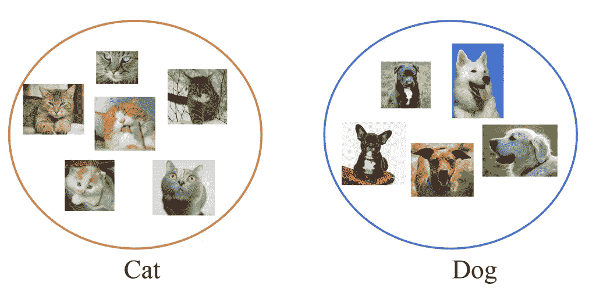

# 无监督聚类可以解决分类问题吗？

> 原文：<https://medium.datadriveninvestor.com/can-all-classification-problems-be-solved-by-unsupervised-clustering-3a9f3e1f72c0?source=collection_archive---------2----------------------->

分类的定义:根据共有的品质或特征将某物分类的行为或过程

“It’s all about finding patterns and understanding what differentiates them.”

给定问题的答案很大程度上取决于一个人对术语“分类”的理解。有人可能会说，只有当我们对以前的数据点有所“了解”时，才能对新的数据点进行分类。

然而，我会反驳这一论点，说即使当我们为监督分类任务进行训练时，我们也理解数据的结构。然后，我们试图理解区分数据点的数据属性。如果我们选择了错误的属性集，那么训练肯定是没有用的，并且分类器不会准确地在新的数据点上工作。

那么，这不就意味着我们甚至在监督训练之前就有了关于定义数据点的数据属性的“知识”吗？我们在训练阶段所做的只是估计这些属性的阈值，这些属性将一种类型的数据点与另一种类型的数据点区分开来。这种训练通常被称为“参数估计”。

现在，如果这些数据属性的这些阈值的估计以无监督的方式被估计会怎样。如果这些阈值是估计的，我们将知道数据点的特定类或类别的共享质量，并且因此将能够分类新的数据点。因此，通过无监督学习来解决分类问题。

好吧，但是有什么问题呢？问题是只理解重要的数据属性是困难的。研究人员花费大量时间选择不同的数据属性，并对它们进行训练和评估模型。经过多次迭代，研究人员可以说他们已经找到了一个工作模型。

这方面的一个例子是将电影评论分为正面和负面两类。例如，在论文“电影评论挖掘:监督和非监督分类方法的比较。”[1]，作者已经确定了短语和词性标签是负面评论的主要特征。接下来，他们进行基于语义的聚类(不是通过匹配精确的单词，而是检查语义相似度)，并将所有现有的评论分为正面和负面类别。一旦这种无监督的聚类完成，新的电影评论可以通过简单地使用类似 K-最近邻的东西来分类，这两个组。

在第二个例子中，论文“无监督命名实体识别:生成地名词典和解决歧义”[2]解释了使用无监督聚类方法从文本中提取命名实体。这是传统上在监督下完成的事情。但是，非监督聚类方法的输出与监督方法的输出相同，这给了我们一个提示，即识别类也可以以非监督的方式进行。

本帖所解释的一切完全是作者的想法，可能不完全符合人们一般的想法。我很想知道其他人对此有何看法。你同意还是不同意？

参考资料:

1.  赵，周，李(2005 年 1 月)。电影评论挖掘:监督和非监督分类方法的比较。《第 38 届夏威夷系统科学国际年会论文集》(112 c-112 c 页)。IEEE。
2.  纳多博士、特尼博士和马特温博士(2006 年 6 月)。无监督命名实体识别:生成地名词典和解决歧义。在加拿大智能计算研究学会的*会议上*(第 266–277 页)。斯普林格，柏林，海德堡。