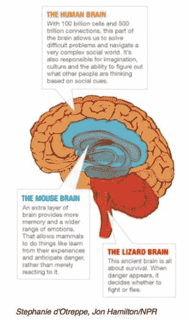
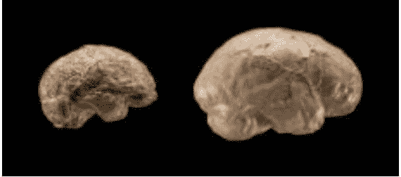

# 人工智能可以比“疯狗”更厉害吗？

> 原文：<https://medium.datadriveninvestor.com/can-artificial-intelligence-be-more-than-a-rabid-dog-6455fd8cc540?source=collection_archive---------10----------------------->

> “做好事的感觉，正确的满足感，看着自己的喜悦，亲爱的先生，是保持我们正直和进步的强大杠杆。另一方面，如果男人被剥夺了这种感觉，他们就会变成患狂犬病的狗。” *—阿尔贝·加缪《值得活下去的人生》*

[**【人工智能】**](https://en.wikipedia.org/wiki/Artificial_intelligence) 是由[机器](https://en.wikipedia.org/wiki/Machine)所展示的[智能](https://en.wikipedia.org/wiki/Intelligence)，与人类所展示的**人类智能相对照。**

**人工智能领域是建立在这样一种说法的基础上的，即人类的智能可以被精确地描述成机器可以模仿它的样子(T21)。然而，人类智能的规格已被证明比最初想象的更难以捉摸，人工智能研究人员还有许多工作要做。**

****

**天文学家兼天体物理学家卡尔·萨根(Carl Sagan)写道:“我关于大脑的基本前提是，它的工作——我们有时称之为‘思维’——是其解剖和生理的结果，仅此而已……萨根博士写的解剖和生理已经被约翰·霍普金斯大学神经科学教授大卫·林登(David Linden)描述为由三个主要部分组成**

1.  ******——**(“新大脑皮层”)负责抽象思维、想象、意识和人类语言的发展。****
2.  ****老鼠的大脑记录了产生愉快和不愉快经历的行为记忆。它负责人类所谓的情感。****
3.  ******蜥蜴脑—** (爬虫脑)三个部分中最古老的一个，它控制着人体的心率、呼吸、体温、平衡等生命机能。它包括爬行动物大脑中的主要结构:脑干和小脑。****

****[**莎伦·贝格利**](https://en.wikipedia.org/wiki/Sharon_Begley) 这样总结林登博士的结论:****

> *****“对(大卫·林登)来说，大脑是‘拼凑起来的一团乱麻’在功能上令人印象深刻，当然。但在设计上，大脑是“古怪、低效和怪异的……一个在数百万年的进化史中积累起来的特殊解决方案的怪异集合体。”…不仅仅是关于生物结构是超自然设计的产物还是生物进化的另一场战斗……对我们大脑原始基础的研究正在破解这样的难题，例如为什么我们不能胳肢自己，为什么我们甚至在梦里也被迫编造故事，以及为什么爬行动物的特征在我们的灰质中持续存在。”*****

*****再者，*大脑的三个部分**并不是独立运作的**。他们建立了无数的相互联系，通过这些联系他们交换信息并相互影响。 [**例如，从边缘系统到皮质**](http://thebrain.mcgill.ca/flash/d/d_04/d_04_cr/d_04_cr_peu/d_04_cr_peu.html#2) 的神经通路就特别发达。正是这些传递信息的神经通路，被证明是人工智能研究人员最难模仿的。****

****根据林登博士的说法，我们可以在人脑中找到他描述的所有完全相同的部分,“但林登说，这是有区别的——成年人的大脑大约是大猩猩大脑的三倍。****

*****[***直立人***](https://en.wikipedia.org/wiki/Homo_erectus) *(距今 180 万年前)的大脑，左边和右边分别是* [***智人***](https://en.wikipedia.org/wiki/Homo_sapiens) *(距今 30 万年前)的大脑，下图说明了大脑体积的增大。******

********

****[http://humanorigins.si.edu/human-characteristics/brains](http://humanorigins.si.edu/human-characteristics/brains)****

*   *******从 600 万年前到 200 万年前*——**(*大脑和身体尺寸增大)这个时间段，早期人类开始直立行走，制作简单的工具。大脑体积增大了，但幅度很小。*****
*   *******从 200 万年前到 80 万年前—*** *在这个时期早期人类遍布全球，在不同的大陆上遇到了许多新的环境。这些挑战，加上身体尺寸的增加，导致了大脑尺寸的增加。*****
*   *******从 80 万年前到 20 万年前*** ( *脑容量迅速增加)人类的脑容量在一个剧烈的气候变化时期进化得最快。更大、更复杂的大脑使这一时期的早期人类能够以新的不同方式相互交流以及与周围环境交流。随着环境变得越来越不可预测，更大的大脑帮助我们的祖先生存下来。*****

****人工智能开发者可能不想承认这一点，但人类的大部分智能都是偶然发现的。它不像人工智能算法那样有组织或有计划。虽然有思想的人可以创造出智慧思想的轮廓，但他们最有可能遇到“啊哈”的时刻，这时他们的思维会跳跃到他们认为的解决方案或启示。这些“啊哈”时刻的出现很大程度上是因为人类大脑的三个部分之间的相互联系。正如 [**达马西奥**](https://en.wikipedia.org/wiki/Antonio_Damasio) 博士所写的“*在决定的时刻，情绪对于选择非常重要。事实上，即使我们认为是合乎逻辑的决定，选择的关键也总是基于情感。*****

****应用最广泛的人工智能算法之一是人工神经网络(ANN)或 [**连接主义者**](https://en.m.wikipedia.org/wiki/Connectionism) **系统。**人工神经网络是受构成动物大脑的 [**生物神经网络**](https://en.m.wikipedia.org/wiki/Biological_neural_network) 启发的计算系统。安的“学习”是通过一种机械的进化形式实现的。他们考虑例子，通常没有任何特定于任务的规则。人工神经网络不是不断进化，而是被“训练”来对数据库中的项目和与计算机集成的一个或多个传感器的观察结果进行可靠的比较。为了实现 AI 研究人员的目标，并建造“*一台可以被制造来模拟人脑的机器”AI 研究人员可能需要对“a-ha”时刻进行编码。*****

****人工神经网络没有“哈哈”时刻。他们依靠严谨和编码纪律来得出“正确的答案”。人工神经网络没有“正确的满足感”。当他们确定自己在统计学上更有可能是对的而不是错的时候，他们就会停下来。编码“啊哈”时刻，即“感觉他们是对的”，可能是人工智能研究人员的下一个大挑战。在那之前，人工智能研究人员可能只制造了加缪所说的“*疯狗*”。****

****___________________________________________________________________****

******备注:******

1.  ****阿尔伯特·加缪，《值得活下去的人生》，([http://filozofia . uni-miskolc . Hu/WP-content/uploads/2011/11/Robert-Zaretsky-A-Life-value-Living _-Albert-Camus-and-the-Quest-for-Meaning-belk nap-Press-2013 . pdf)](http://filozofia.uni-miskolc.hu/wp-content/uploads/2011/11/Robert-Zaretsky-A-Life-Worth-Living_-Albert-Camus-and-the-Quest-for-Meaning-Belknap-Press-2013.pdf))****
2.  ****卡尔·萨根《伊甸园之龙》，百龄坛图书公司，纽约，1977 年****
3.  ****[http://the brain . mcgill . ca/flash/d/d _ 05/d _ 05 _ Cr/d _ 05 _ Cr _ her/d _ 05 _ Cr _ her . html](http://thebrain.mcgill.ca/flash/d/d_05/d_05_cr/d_05_cr_her/d_05_cr_her.html)****
4.  ****人类大脑:漫威还是混乱？|新闻周刊科技| Newsweek.com****
5.  ****[http://big think . com/experts-corner/decisions-is-emotional-not-logical-the-neuroscience-behind-of-decision-making](http://bigthink.com/experts-corner/decisions-are-emotional-not-logical-the-neuroscience-behind-decision-making)****

*****原载于 2018 年 6 月 11 日*[*neutec.wordpress.com*](https://neutec.wordpress.com/2018/06/11/can-artificial-intelligence-be-more-than-a-rabid-dog)*。*****