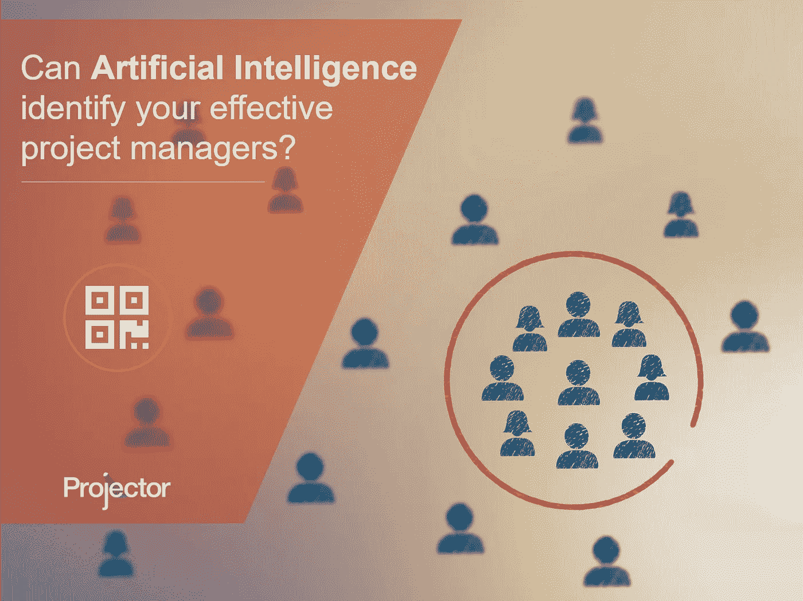

# 人工智能能识别你最有效的项目经理吗？

> 原文：<https://medium.datadriveninvestor.com/can-artificial-intelligence-identify-your-most-effective-project-managers-bf5b406b770d?source=collection_archive---------38----------------------->

我不幻想人工智能和机器学习的当前状态已经先进到足以有效取代一个有才华、有经验、有激情的项目经理。对我来说，一个更有趣的问题是，这些技术是否可以作为一种工具来帮助提高项目管理规程中的成功率。

人工智能和机器学习能识别你的员工中最有效的项目管理吗？当人工智能有助于通知投资时，专业发展美元能否产生更大的影响？此外，人工智能技术能帮助组织理解单个项目经理最有可能成功交付哪些项目吗？

> 起初只是受求知欲驱使的一点玩笑，最终揭示了一些隐藏的真相。

我们与几个客户合作，开始探索这一点。开始只是由求知欲驱动的一点玩笑，最终揭示了一些关于他们的业务、流程和人员的隐藏真相。它还让我们意外地了解到，当我们通过统计学、人工智能和机器学习的视角来看待数据时，我们可以依赖什么，不可以依赖什么。

如果这激起了你的兴趣，请在我们的博客上查看整个故事，并阅读我们发现的五种不同类型的项目经理:

> [专业服务自动化博客:人工智能能识别出你最有效的项目经理吗？](https://www.projectorpsa.com/blog/artificial-intelligence-effective-project-managers)

你在旅行中遇到过这些类型的经前综合症吗？有没有其他可能值得一看的简介？你认为这是对人工智能和机器学习的好的使用还是坏的使用？对你的想法感兴趣！

史蒂夫(男子名)

【www.projectorpsa.com】最初发表于**。**