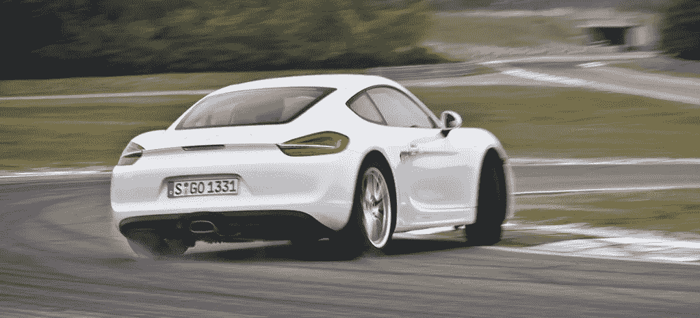
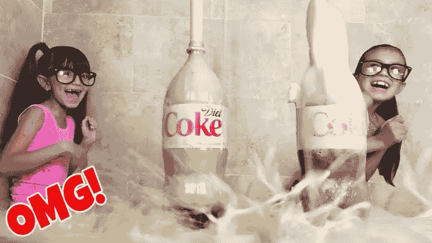
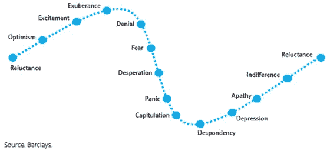
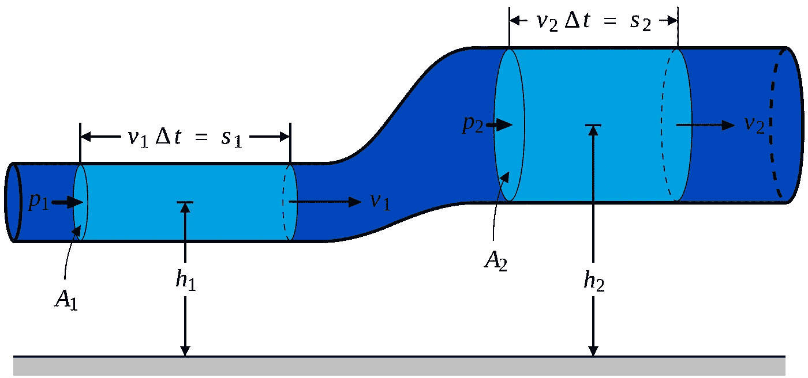
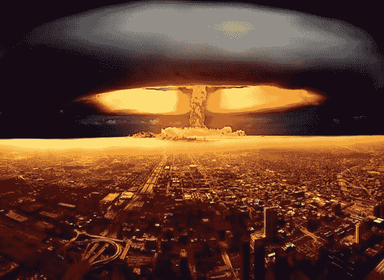
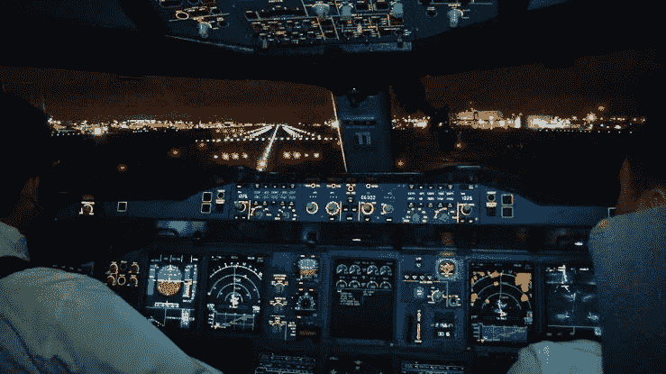

# 人工智能能改善我们的全球金融体系吗？

> 原文：<https://medium.datadriveninvestor.com/can-artificial-intelligence-improve-our-global-financial-system-9be2aa79fab8?source=collection_archive---------12----------------------->

> 他没有估计到整个国家的贪婪狂热；他没有看到信心，就像不信任，可以无限增加，希望和恐惧一样奢侈。

摘自“[非凡的流行错觉](http://Extraordinary_Popular_Delusions_and_the_Madness_of_Crowds)”——对投资时人类行为的有趣观察，经常被引用作为郁金香投资狂热的第一个参考。这个故事指的是 1719 年的一个货币计划。自那以来，市场已经走过了漫长的道路，但我不确定人类的行为有多大改变。

人工智能能成为“牵引力控制”和先进的制动系统，检测人类行为给我们的市场系统带来的内在危险并做出反应吗？它能学习我们反复犯下却不承认的人类错误吗？贪婪、群体思维、恐惧、兴奋和操纵等行为？它能在我们害怕的时候加速，在我们得意忘形的时候刹车吗？这样做的话，潜在的市场破坏可能只是小问题。拯救经济中的一些乘客不被抛出窗外，造成不可逆转的社会损害。

> Abs(防抱死制动系统)通过施加正确的制动量来工作，因此汽车保持在控制中。这种级别的刹车控制对于处于恐慌状态的人来说是不可能的，他们会自然地猛踩刹车。

记得你 10 岁的时候，一个朋友让你在商店里给他买一瓶可乐。他给了你一些硬币来支付费用，然后你就进去了。然而今天是愚人节，所以是时候恶作剧了。你买了两瓶可乐，用力摇晃其中一瓶。你的朋友打开它，可乐洒得到处都是，而你却在笑着流泪。愚人节得分:1-0 给你。

你的朋友眯起眼睛，发誓要报复。他一直等到你喝完可乐，几个小时后，当你又渴了，他会给你一些他的可乐。你欣然接受，他已经动摇了。当你打开瓶子时，他满怀期待地微笑着,《复仇是甜的，像可乐》。你打开瓶子，什么也没发生，他沮丧地看着你吞下他的可乐。可恶！他忍不住要发泄他的愤怒。我试着让你回来，为什么它不喷你一身？哈哈哈，你笑了，那是因为所有的气泡都消失了。你必须放入更多的二氧化碳才能让它再次喷出。

你现在 2 比 0，对吗？不完全是这样，你的朋友满身都是可乐，你们俩都只剩下很少一点，没有气泡。实际上这最多是个平局，但至少你们中的一个笑了。

你 10 年前的恶作剧真是天才。你没有意识到，你只是完美地模拟了全球经济体系。你幼稚的行为胜过了一些最伟大的分析头脑，用最复杂的模型来预测我们的市场、经济和社会。

> OMG！又到 2007 年了！

我敢肯定，现在，你认为我疯了。请耐心听我解释这是如何工作的，以及我们可能如何改进它。

众所周知，市场和经济会经历周期。从底部开始，我们经历了衰退。这就是“产出”下降的地方。之后，我们进入成长阶段。最后，它在繁荣阶段结束，这是某种程度的群体狂热开始的地方。最终它变得太疯狂和吹，然后整个循环重复。那么是什么在驱动它呢？我确信这是一种群体情绪状态。这些情绪大致映射到抑郁/昏睡/绝望，接着是有争议的努力工作和信念。最后是过度自信、兴奋和自满。这种循环的问题在于其令人难以置信的低效。就像彻夜狂饮一样，我们花费大量的时间来造成伤害或从中恢复。

> 情绪化的投资者周期，在一个群体中会是一样的吗？

> [市场恐慌要好得多](https://wealth.barclays.com/en_gb/home/research/research-centre/white-papers/Behavioural-Finance/Cycle-of-investor-emotions.html)在较长时间内平均下来，因为人们经常反应过度，过于兴奋或害怕。

好消息是，尽管有起有落，但迄今为止其总体上是一个[上升轨迹](https://www.thesimpledollar.com/where-does-7-come-from-when-it-comes-to-long-term-stock-returns/)。这对我们所有人都有些好处，但不幸的是，这种好处并没有在社会中平均分配。我相信，我们可以使用人工智能来帮助缓解起伏，并使系统更加公平。假设这种循环是由群体的人类情绪反应驱动的，就很难灌输行为改变，就像戒烟一样。然而，我们必须假设一项能够提供市场竞争优势的技术将被系统所吸收。必须指出的是，[雷伊·达里奥](https://www.ted.com/talks/ray_dalio_how_to_build_a_company_where_the_best_ideas_win/up-next?language=en)已经运行了一个基于数字的系统来消除群体偏见，并取得了显著的成功。人工智能能让所有人都能进行这种水平的分析吗？这样做能让财富的竞技场变得公平吗？我想是的。

AI 如何做到这一点？它可以探测到先前的周期和事件是如何结束的。这些事件的特点已经成为立体的典型笑话。当擦鞋人给你股票提示时卖出，对出租车司机来说有点现代。在非常普遍的稀释中，一个驼背的人获得了巨大的财富，出租他的驼背作为办公桌，给写作空间，以出售股票。狂热是如此之高。人工智能系统可以收集这些水平的大众情绪。它可以预测我们持续行为的负面影响，并向我们发出警告。

从我对可乐瓶的描述中，有人可能会认为我们应该试图发现情绪的巨大变化。然而，这通常不是人工智能工作的最佳方式。更重要的是，这也不是人类行为改变的方式。一般来说，人类在评估长期风险方面相当糟糕。以吸烟为例，警告说从现在起 20 年后死亡人数将会增加，但这并不能遏制吸烟行为。在酒吧禁止它，并大幅提高价格似乎效果更好。行为的结果与行为越接近，这是改变是否会发生的一个重要因素。例如，我怀疑你会把你的手放在沸水中很长时间。

AI 可以从与之相关的较小力中理解宏观方案。更重要的是，如果它可以警告人们较小的后果，较大的波动也应该被抑制。以可乐瓶为例，当瓶子摇晃时，每个气泡产生的压力逐渐增大。使用 B [ernoulli 方程](https://en.m.wikipedia.org/wiki/Bernoulli%27s_principle)，随着压力的增加，我们的目标是增加流量来释放压力。人工智能可以检测到压力的增加，这将取决于人类增加流量(出售股票)，至少现在是这样。

> 伯努利方程看起来很复杂，但其实很简单。当压力增加时，让它流出来。在可乐洒得到处都是之前释放一点气体，在汽车打滑之前打破光线，或者在全球崩溃之前卖掉一些股票。

开放市场系统的本质是它们依赖于信息。假设没有大量的内幕信息，这对上市公司来说是真的。苹果的所有股东都不可能掌握内幕信息而不公之于众。在这种情况下，股东根据他们收到的信息做出买入或卖出的决定。它可能来自股票经纪人、朋友或新闻来源，但最终这些信息在某处属于公共领域。所有的信息都必须来自这个基础。

随着信息量的增加，一个人要了解信息对任何股票或投资组合的潜在影响变得越来越困难。在 [NewsWhip](https://www.newswhip.com) 我们每天跟踪数百万条内容和数十亿个原始数据点。我们对未来的内容表现进行了预测，我们的产品被用来协助[验证内容的真实性](https://www.newswhip.com/2017/02/tackling-fake-news/)。在任何学科中，寻找“真相”都是一项极其困难的任务，只要问问任何一位法官或警官就知道了。[我们也知道了为什么故事会像野火一样在社交媒体上传遍全球，猜猜看，这和驱动经济周期的原因是一样的。事实证明，带有强烈情感载体的内容会像病毒一样传播。例如恐惧、厌恶、愤怒、幽默、同情和灵感。原因是，情绪反应非常擅长让人类做一些事情，比如分享一段内容，出售公司股份，抗议或投票。](https://www.newswhip.com/2017/11/get-emotional-get-shares/)

我们的用户是专业记者，他们专注于一个新闻领域或“节拍”,仍然需要技术来跟上他们的步伐。你的股票经纪人和记者一样了解最新动态吗？你的对冲基金经理知道该基金投资的所有公司的“真相”吗？他或她花多少时间会见客户和筹集资金？是否存在信息套利的可能？这种技术能为所有人创造公平的竞争环境，而不是让最好的金融建议成为只有最富有的人才能提供的精英服务吗？

当事情被描绘得过于消极时，人工智能可以帮助我们，并给我们购买的信心。所有优秀的投资者都知道，当情况看起来最糟糕的时候，就是最好的出手时机。当恐惧高涨时，其他人都在跑，是时候去捡便宜了。股市中一些最大的上涨就是在这样的日子里发生的。另一方面，当我们都相信自己是不可战胜的时候，人工智能可以检测到我们正在变得忘乎所以。该回家睡觉了，伙计们，今晚不喝酒了。

AI 可以协助收费。全球金融机构的提取水平令人瞠目。在我看来，了解这些周期的人从中赚了不合理的钱。由于薪酬水平的原因，许多最聪明的人开始预测市场。相反，他们可以解决很多问题，比如气候变化。最成功的投资策略通常非常简单，只是利用长期的复合增长来积累长期财富，再加上多样化，提供一个统计上的安全天堂。然而，许多财富管理机构收取大量人们不理解的费用，这些费用深藏在我们的强制性养老金要求中。

> “从长远来看，我们都死了”这种经济学表述也可以很容易地理解为“从长远来看，我们都从此过上了幸福的生活”。人类行为和核心经济假设经常不同。也许沉闷的科学可以从工程学中获得一些解决问题的方法，并开始为我们希望我们的孩子享受的未来处理和解决问题。

阿尔伯特·爱因斯坦创造了赢得第二次世界大战的技术。尽管德国在核弹头制造完成之前就基本被打败了，但如果战争继续下去，它肯定会结束，就像更坚定的日本人一样。具有讽刺意味的是，这项技术应该先给德国人，因为爱因斯坦在移居美国之前就住在那里。这是一个接受他的社会，他用脚投票。这个决定很容易扭转战局。善良似乎常常能战胜邪恶。这并不奇怪，因为我相信人类的本性在大多数情况下是倾向于做好事的，尽管有时会有点迷失。不管怎样，关键是作为科学家和技术人员，我们可以用脚投票，我们可以决定用我们的技能做什么。许多技术被优化用于[高频交易，](https://en.m.wikipedia.org/wiki/High-frequency_trading)使用更快的系统计算交易价格可以提供临时套利。我们必须问的问题是，这是让我们的市场更安全还是更不稳定？这些系统最终因其存在的风险而受到监管，但仍以各种形式存在。以防抱死制动系统为例，这类似于给汽车加电而不改善刹车。我们是应该创造技术来实现这一点，还是尝试让系统更强大？事实证明，我们作为技术专家和科学家可以决定。

> A380 的驾驶舱，有大量的技术协助这些训练有素的飞行员，提供最安全的运输方式，尽管规模、速度和外部环境因素的比例惊人。我们当然可以对市场做同样的事情。

与所有行业一样，技术变革带来的自动化带来了更高程度的确定性和更具竞争力的价格。例如，这可以在飞机上看到，尽量减少人为错误至关重要，其次是成本。这考虑到了规模和可预测性，对消费者来说是最好的。金融业似乎回避这一点已经有一段时间了，但如果说历史教会了我什么，那就是你无法长时间抵制技术变革。我相信金融时代正在迅速到来，我希望它能为我们所有人创造一个更加公平的环境。

> 想参与进来吗？

> 这是一篇关于这项技术的可能影响的高水平文章。这是我非常热爱的事情，我已经做了大量的研究。特别是，我一直在观察对新闻和相关信息的微气泡(比如可乐瓶)进行分组，以了解它是如何影响股价运动的。如果它让你兴奋，请给我写信，我随时欢迎反馈、想法和机会。领英可以在这里找到[https://www.linkedin.com/in/andrew-mullaney-669724a](https://www.linkedin.com/in/andrew-mullaney-669724a)