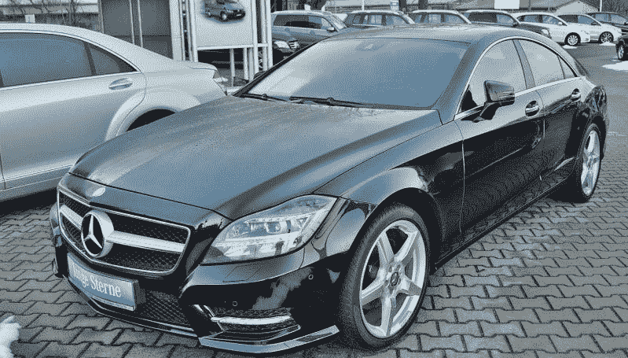
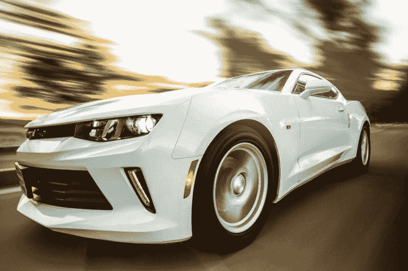
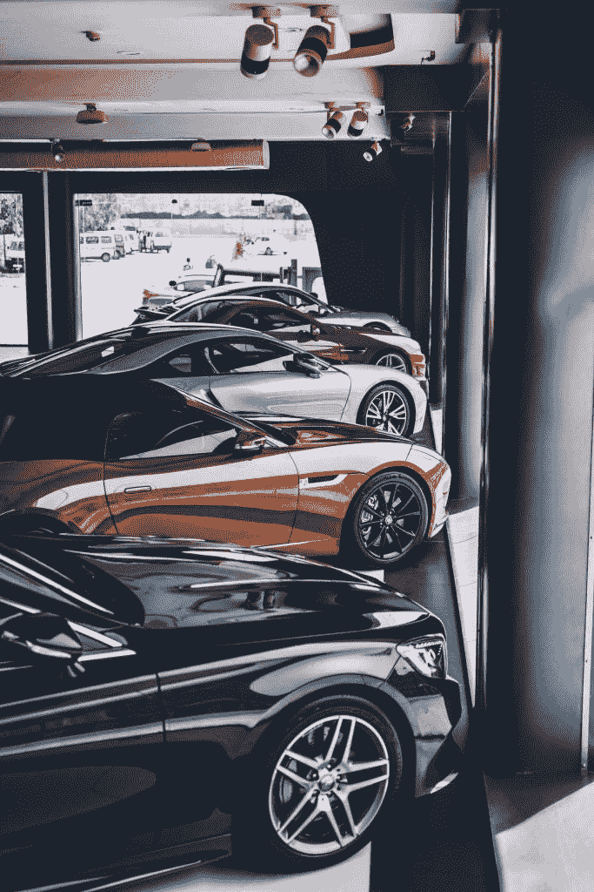
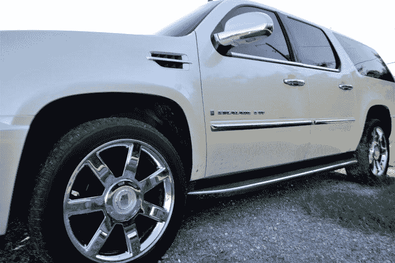

# AutoNation 能挺过汽车销量下滑吗？—市场疯人院

> 原文：<https://medium.datadriveninvestor.com/can-autonation-survive-falling-car-sales-market-mad-house-b974cd9755f4?source=collection_archive---------10----------------------->

投资者会问 AutoNation 能否挺过汽车销量的下降，因为这家零售商正在关闭经销商。

具体来说， **AutoNation(纽约证券交易所代码:AN)** 将关闭其在北加州罗斯维尔汽车城的马自达和大众经销商。*萨克拉门托蜜蜂* [报道](https://www.sacbee.com/news/business/article231523523.html)马自达经销商于 2019 年 6 月 8 日关闭，大众经销商将于 7 月停止运营。

 [## 算法交易的机器学习-数据驱动的投资者

### 当你的一个朋友在脸书上传你的新海滩照，平台建议给你的脸加上标签，这是…

www.datadriveninvestor.com](https://www.datadriveninvestor.com/2019/01/30/machine-learning-for-stock-market-investing/) 

奇怪的是，罗斯维尔的关闭发生在**大众(DE:VOW)**2018 年 5 月至 2019 年 5 月期间销量增长 6%之后， *CleanTechnica* [估计](https://cleantechnica.com/2019/06/05/us-auto-sales-down-for-audi-honda-infiniti-mercedes-nissan-toyota-in-2019/)。然而，一些主要汽车品牌的销量正在下降。

例如，2018 年 5 月至 2019 年 5 月，丰田(纽约证券交易所:TM)销量下降 3%，奔驰销量下降 9%，**本田(纽约证券交易所:HMC)** 销量下降 1%，日产销量下降 6%。此外， *CleanTechnica* 估计，2018 年 5 月至 2019 年 5 月期间，美国销售的新车数量下降了 42，200 辆。

# 美国汽车销售崩溃

销售数据显示美国汽车销售正在崩溃。事实上， *CleanTechnica* 估计，2018 年 5 月至 2019 年 5 月期间，每个非美国汽车制造商的美国汽车销量都有所下降。

例如，现代汽车在此期间的年同比销量下降了 12%。与此同时，现代 2019 年 5 月的汽车销量比 2018 年 5 月低 19%。因此，现代汽车 2018 年 5 月的销量比 2019 年 5 月少了 18，614 辆。

可怕的是，现代并不孤单。奥迪的年同比汽车销量下降了 79%。值得注意的是，2018 年 5 月至 2019 年 5 月，现代的销量下降了 69，579 辆。

行业领导者丰田汽车的汽车销量同比下降了 20%，销量下降了 33，591 辆。即使是一直很受欢迎的斯巴鲁，其年同比汽车销量也下降了 20%，汽车销量下降了 12，034 辆。

# 汽车销售真的崩溃了吗？

汽车销售崩溃的明显结果将是经销商处大量未售出的汽车。例如， *CleanTechnica* 估计，2018 年 5 月至 2019 年 5 月期间，美国汽车销售总量下降了 189，020 辆。而且 2019 年 5 月销量下降了 26，372 辆。

然而，路透社[估计【2019 年 5 月美国汽车总销量增长 3%。汽车总销量正在增长，因为这个数字包括货车、卡车和运动型多功能车(SUV)。](https://www.nytimes.com/reuters/2019/06/03/business/03reuters-usa-autos-sales.html)

值得注意的是，皮卡销量正在飙升，2018 年 5 月至 2019 年 5 月期间，**菲亚特克莱斯勒(NYSE: FCA)** Ram 卡车品牌的销量增长了 33%。然而，J.D. Power 估计，美国汽车总销量下降了 2.5%，至 1690 万辆。

因此，对于那些出售大众想要的汽车的人来说，汽车生意仍然很好。然而，向美国公众销售轿车越来越难了。

# AutoNation 能挺过汽车销量暴跌吗？

AutoNation 无法逃脱汽车销售的崩溃，因为它在美国经营着 300 多家经销商。

对 AutoNation 来说，崩溃带来的危险包括大量未售出的存货、更低的价格和更少的客流量。降低新车价格；尤其是可能威胁到 AutoNation 的二手车业务。

目前，二手车价格不错。，然而。 *CarGurus 指数* [显示](https://www.cargurus.com/Cars/price-trends/)在截至 2019 年 6 月 17 日的 30 天内，美国二手车的平均价格下跌了 0.02%。然而，在 2019 年 6 月 17 日之前的 90 天内，二手车平均价格增长了 2.07%。

# 二手车是价值投资吗？

然而，CarGurus 的数据表明二手车仍然有很大的利润空间。事实上，2019 年 6 月 17 日，二手车平均价格为 20，490 美元。

而且大众化的车辆价格更高。具体来说，2019 年 6 月 17 日，二手 SUV 的平均价格为 26，381 美元。此外，2019 年 6 月 17 日，二手车的平均价格为 25，973 美元。相比之下，二手轿车的平均价格为 15，769 美元。

二手车价格显示了为什么沃伦·巴菲特通过伯克希尔·哈撒韦汽车公司投资汽车经销商。新车和二手车是昂贵的产品，人们需要。此外，汽车融资可以产生大量的浮存金。

# 为什么沃伦·巴菲特投资汽车经销商

解释一下，普通美国人需要一辆车去上班和去杂货店。然而，39%的美国成年人承认他们无法拿出 400 美元来支付意外开支，美国联邦储备系统关于 2018 年美国家庭经济福祉的*报告* *，*估计。

因此，普通美国人需要购买汽车。此外，美国人将通过每月付款来支付购车款。汽车付款是一个极好的浮动来源，因为汽车是大多数美国人拥有的唯一交通工具。如果他们想四处走动；并避免回购人的访问，美国人必须支付汽车付款。

因此，汽车付款产生了巴菲特所说的“浮存”。澄清一下，浮存金是来自定期支付的现金流，公司可以很容易地利用。

# AutoNation 是一家现金充裕的公司吗？

相反，尽管有浮存，AutoNation 并不是一家现金充裕的公司。例如，AutoNation 报告 2019 年 3 月 31 日的自由现金流为 1.997 亿美元，运营现金流为 2.597 亿美元。

同时，AutoNation 报告负的融资现金流为-2.109 亿美元，负的投资现金流为-4860 万美元。因此，AutoNation 的业务似乎很少产生现金。

此外，截至 2019 年 5 月 31 日，AutoNation 仅有 4870 万美元的现金和短期投资。因此，AutoNation 可能很快崩溃，因为它几乎没有现金。

# AutoNation 赚钱了吗？

低现金流引发了 AutoNation 是否赚钱的问题？斯托克罗对这个问题的回答是 AutoNation 赚了一点钱。

具体来说，AutoNation 在 2019 年 3 月 31 日报告的毛利为 8.482 亿美元，营收为 49.81 亿美元。然而，AutoNation 当天公布的营业收入为 1.821 亿美元，净收入为 9200 万美元。

AutoNation 赚了一点钱，但其收入增长正在萎缩。例如，StockRow 报告称，AutoNation 的收入在过去三个季度都有所下降。具体来看，截至 2019 年 9 月 30 日的季度，AutoNation 的收入增长下降了 1.53%，截至 2019 年 12 月 31 日的季度下降了 4.78%，截至 2019 年 3 月 31 日的季度下降了 5.29%。

此外，AutoNation 的收入从 2019 年 12 月 31 日的 54.12 亿美元降至 2019 年 3 月的 49.81 亿美元。我认为这些数字表明 AutoNation 的业务可能无法持续。简而言之，AutoNation 无法以足够高的价格出售足够多的汽车来维持其业务。

# AutoNation 会幸存吗？

对于 AutoNation 来说，这场可持续性危机发生在一个可怕的时刻，因为汽车行业正在经历巨大的变化。

首先，美国人的购车习惯正在发生巨大变化。戏剧性的是，****(NYSE:F)**[**菲亚特克莱斯勒**](https://www.chicagotribune.com/autos/sc-auto-cover-0503-ford-gm-cars-20180427-story.html) **(NYSE: FCA)** 已经基本结束了在美国的轿车生产。同时，**通用汽车**正在[淘汰](https://www.caranddriver.com/features/g25307911/general-motors-killing-cars-production-2019/)几种型号的汽车以求生存。**

**汽车的终结可能会迫使 AutoNation 减少其足迹和经销商规模。我认为 2025 年的汽车经销商只能销售皮卡、SUV 和一些货车。因此，我们可能会看到较小的经销商销售较少的汽车，但他们将更高的价格和更高的利润。**

# **对自治的新威胁**

**其次，危险的新竞争对手正在进入汽车行业。值得注意的是，**伯克希尔哈撒韦公司(纽约证券交易所代码:BRK。B)** 在几个主要市场与 AutoNation 直接竞争。**

**洛杉矶、圣何塞、旧金山、迈阿密、圣安东尼奥、休斯顿、达拉斯、堪萨斯城和奥兰多都有伯克希尔哈撒韦公司的经销商。伯克希尔可以提供比 AutoNation 好得多的融资交易，因为它有沃伦巴菲特(Warren Buffett)的全部资金支持。**

**此外，伯克希尔哈撒韦汽车公司在深度折扣方面处于更有利的地位，因为它是一个更大机构的一部分。我认为伯克希尔·哈撒韦公司可以以更低的价格出售汽车；这可能会减少经销商利润，并最终扼杀 AutoNation。**

# **拼车如何威胁 AutoNation**

**除了伯克希尔，汽车销售的新商业模式正在涌现。例如，**特斯拉(纳斯达克:TSLA)** 经营自己的经销商， [**宝马**](https://marketmadhouse.com/bmw-car-rental-business/) **(OTC: BMWY)** 通过 [Reach Now](https://reachnow.com/en/) 从事拼车和短期租车业务。**

**拼车和短期租车对 AutoNation 来说是更大的威胁，因为它们消除了对车辆所有权的需求。除了宝马，福特和 T2 的通用也在尝试拼车。**

****

**因此，AutoNation 很快就能与拥有更多资源的汽车制造商竞争。例如，福特在 2019 年 3 月 31 日拥有 377.30 亿美元的现金和短期投资。因此，福特有能力花费大量现金来扩大其拼车服务。**

# **自动驾驶汽车如何威胁自主**

**自动驾驶汽车对 AutoNation 构成了更大、更复杂的威胁。像 **Alphabet 的**、 [Waymo](https://www.citylab.com/transportation/2019/05/waymo-autonomous-vehicles-technology-consumer-report-safety/589141/) 这样的自动驾驶汽车公司的目标是按需自动驾驶汽车。因此，Waymo 已经在亚利桑那州运营一项拼车服务。**

**Waymo 和优步的最终目标是，只要轻触应用程序，一辆车就能随时随地来接你。这可以通过提供快速、廉价和可靠的本地交通来消除对汽车所有权的需求。**

****

**据 BBC 新闻[报道](https://www.bbc.com/news/business-45786690)，许多观察家预测汽车所有权将在 20 年内终结。为了解释这一点，分析人士认为，在未来几十年里，只有铁杆车迷才会拥有汽车。其他人将依赖自动驾驶车辆进行日常运输。**

**你将不再拥有一辆车，而是使用一个应用程序来调用你需要的车辆。例如，你可以召唤自动驾驶的福特皮卡去家得宝(Home Depot)旅行，或者订购自动驾驶的奔驰去约会之夜。**

**显然，在这样一个世界里，不可能有自治的位置。解释一下，像赫兹这样的租赁公司或汽车制造商将拥有这些车辆。乘客可以通过优步**或 Lyft**支付每次乘车费用，也可以每月支付车辆使用费。**

**这类工具的另一个潜在大股东是伯克希尔哈撒韦公司(纽约证券交易所代码:BRK)。A) 可以向拼车服务或直接向公众出租车辆。代替 GEICO 汽车保险，你可以加入 GEICO 汽车服务公司，该公司将按月收费提供交通服务。**

# **自治面临厄运**

**因此，从长远来看，AutoNation 的业务面临厄运，但这是一项好的短期价值投资吗？**

**我的回答，尽管价格低；42.52 美元市场先生于 2019 年 6 月 21 日给出。 **AutoNation (NYSE: AN)** 是一只烂股票。我认为 AutoNation 很糟糕，因为它几乎不产生现金，也不支付股息。**

**如果你想投资未来的低价汽车，调查福特而不是 AutoNation。吸引人的是，福特现金充裕，但它在 2019 年 6 月 21 日的实际股价为 9.99 美元，并在 2019 年 6 月 3 日支付了 15₵的股息。**

**至于 AutoNation，我预测它会倒闭或者被更大的机构收购。我对 AutoNation 的预测是，它将成为像伯克希尔**哈撒韦(纽约证券交易所代码:BRK)这样的大公司的一部分。B)** 、 **Avis-Budget Group(纽约证券交易所代码:CAR)** 甚至一家汽车制造商。收购是不可避免的，因为我看不出 AutoNation 作为一家独立公司将如何在不断变化的汽车行业中生存。**

***原载于 2019 年 6 月 21 日*[*https://marketmadhouse.com*](https://marketmadhouse.com/can-autonation-survive-falling-car-sales/)*。***

***免责声明:文章所表达的观点和看法仅属于作者，不一定反映 DDI 的立场。这篇文章无意成为投资建议。***