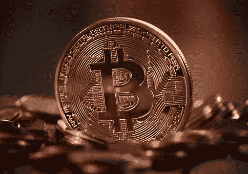

# 比特币能否成为当前金融体系的替代品？

> 原文：<https://medium.datadriveninvestor.com/can-bitcoin-be-an-alternative-to-the-current-financial-system-f774507134c9?source=collection_archive---------5----------------------->

## 比特币为什么被创造出来，它是如何消除第三方和中介的

## 比特币从来都不仅仅关乎金钱，它关乎自由。

这是第二篇从不同角度看待**比特币的文章。**

[第一篇是关于**博弈论**T5；这篇文章讨论了比特币作为当前金融体系的一种可能替代品的作用。
的确，比特币的诞生**不仅是作为一种货币**，也是一种哲学概念**的例证:**](https://medium.com/coinmonks/bitcoin-as-a-master-piece-game-theory-and-incentives-3b9f10ceb782)

> 作为电子现金的纯点对点版本，允许在线支付直接从一方发送到另一方，而不通过金融机构。

本文的目的有两个，首先解释创造比特币背后的主要原因，然后讨论它是否以及如何成为当前系统的替代品。

为此，我们首先需要**介绍我们金融体系的运作方式。**

# 当前的金融体系

The New York Stock Exchange — Symbol of the current financial system

我们目前的金融体系由第三方监管。
他们**执行法律**和**垄断系统**允许用户在不信任对方的情况下进行金钱交易。

在历史上，人们过去常常在面对面的情况下用钱来交换商品。传统的价值交换方式随着数字支付的发展而减弱。自从我们开始在没有人在场的情况下把钱从一个地方转移到另一个地方，相互信任的必要性变得更加重要。

在我们的既定体系中，中介机构采取的形式是*政府*或*金融* *机构*。他们的作用是确保**两个或两个以上的人可以在互不信任的情况下交换价值，**保证正确执行**交换*价值*。如今，这看起来很容易，也很理所当然，如果没有第三方的建立，我们当前的金融和系统将会崩溃。尽管第三方带来了交易的便利，但这是有代价的:**财务自由。****

事实上，当前的金融体系在几个方面限制了个人:

## 1.每个国家唯一被接受的交换手段是国家强制发行的法定货币；

每个国家都有自己的货币，由中央银行控制和铸造，通常被定义为法定货币:

> 法律认可的官方支付手段，可用于清偿公共或私人债务或履行财务义务。几乎在每个国家，国家货币都是法定货币。

所有其他货币都被认为是外币**和**很少被接受。**
我们都很熟悉**出国时兑换本国货币**；这个过程很有可能会经历一次*货币兑换*并且你会在**交易中产生**和**中介** **成本**。在任何时候，唯一有效的货币将是由各国政府铸造的货币。**

## **2.个人被限制了通过不同渠道使用他们的钱的隐私和自由:所有的钱必须通过中央系统流动；**

**目前的系统没有替代方案。除了现金，全球所有的数字交易都通过官方渠道进行。我们的金融系统基于全球银行间金融电信协会，这是一个允许全球金融机构在安全、规范和可靠的环境中发送和接收金融交易信息的网络。**

**自从货币变得数字化以来，我们已经看到我们的货币自由在慢慢消失，并最终被一个依赖于广泛的金融机构作为中介的系统所取代，这个金融机构就是 T2，并且是一个垄断机构。除了我们的**金钱**和**财务自由**，我们也在见证我们的**隐私** *慢慢消逝*，因为**我们所做的每一笔** **购买**都会留下数字痕迹，其影响相当明显。金融机构可以**收集**无限量的关于我们消费习惯的**数据**，这些数据最终将被用于他们的利益，要么通过营销活动，要么试图以牺牲你的个人隐私为代价为你量身定制他们的优惠。结果，**我们失去了财务自由**，**我们无法控制自己的资金**，**我们无法控制我们放弃的信息**成为当前金融体系的一部分。**

# **当前金融体系的弱点**

****

**当前的体系在我们需要相互信任的必要信任和我们作为个体所拥有的财务自由之间引入了一种权衡。然而，尽管它充分解决了信任的问题，但它的架构使它受到几个弱点的影响。**

1.  ****单点故障** 当前的系统基于*自顶向下的架构*，其特点是有第三方作为中介。反过来，这意味着**用户正在支付高昂的中介成本**，因为他们不能彼此直接交易，并且系统本身是**集中式的**，因此**依赖于单点故障。**如果控制当前体系的中央政府垮台，*整个体系也会随之垮台；***
2.  ****不开放**不开放
    由于其集中的性质，该系统不对任何人开放加入。事实上，处于系统顶端的金融机构充当了看门人的角色。由于符合*法规*，他们需要收集客户的个人信息。因此，该系统只对那些被认为*【值得信赖】*的人开放。这不可避免地将所有缺乏必要条件的人排除在系统之外:穷人、无证件者、受迫害者。综上所述，**控制当前金融体系的机构可以任意决定谁有权或无权进入全球经济；****
3.  **虽然我们生活在一个全球化的世界，但我们的经济体系并没有准确地反映出这一点。事实上，货币仍然以国家为中心。跨境和跨国交易仍然不方便，而且费用很高。即使我们的支付是电子的，如果我们在另一个国家这样做，我们仍然要支付**额外费用**；**
4.  **容易受到审查
    作为上面提到的前两点的直接后果，当前的系统**受到控制它的机构的审查**。虽然这在某些情况下似乎是好的(例如，针对洗钱者的*)，**这种权力也可能被滥用、被工具化并被强加给那些不符合现状的人。对于政治活动家和记者来说，这可能意味着由于他们的革命观点而被排斥在世界经济之外。这涉及到国家和个人——例如，当美国利用美元对伊朗实施制裁并将其排除在全球经济之外。*****

**因此，[*“完全不可逆转的交易实际上是不可能的，因为金融机构无法避免调解纠纷[……]调解成本增加了交易成本，限制了最小实际交易规模，切断了小额偶然交易的可能性[……]由于逆转的可能性，对信任的需求扩大了。商人必须警惕他们的顾客，向他们索取比他们原本需要的更多的信息”。*](https://bitcoin.org/bitcoin.pdf)**

# **比特币的历史意义**

**既然我们已经提供了当前金融系统工作方式的最新进展，让我们来讨论创造比特币的历史意义。**

****比特币白皮书**发布于 2008 年*10 月，*正值全球金融危机**重创世界经济之际。第一笔[交易](https://www.blockchain.com/btc/block/000000000019d6689c085ae165831e934ff763ae46a2a6c172b3f1b60a8ce26f)发生在 2009 年 1 月 3 日——所谓的*“创世纪区块】*——很有象征意义。****

**嵌入在代码中的是那天《泰晤士报》的标题，内容如下:**

> **"《泰晤士报》03/1/2009 财政大臣濒临第二次银行救助."**

****

**Symbolic writing on the walls of Detroit, USA**

**由于其发布的特定时机，比特币承载着一种**固有的历史意义。**比特币发布的同一天，美国政府给予银行[9000 亿美元的救助](https://www.reuters.com/article/us-financial-bailout/factbox-government-bailout-tally-tops-900-billion-idUSN16126320080917)。在全球金融危机期间，基于信任的中央集权制度**的所有弱点变得如此明显。****

**现在让我们来定义一下**比特币的目的是什么**以及**为什么要发行**，因为围绕这个问题有很多困惑。**

# **比特币为什么被创造出来？**

****

**我总觉得这个问题让大多数人很困惑。
许多人认为，比特币诞生时就考虑到了*统治世界*:取代当前金融体系的宏伟目标。**

**然而，这从来都不是比特币的目标。**

**相反，正如任何读过白皮书的人都明白的那样，它的目标是为当前的金融体系提供一个对等的替代方案。*一种电子版的现金，允许人们直接相互交换价值，而不通过金融机构或任何第三方。***

**它基于这样的假设:当前基于信任的系统是有缺陷的。事实上，虽然银行和政府在交换价值时解决了相互信任的问题，但我们仍然需要信任他们。**

**我们相信他们不会滥用权力，不会侵犯我们的隐私，不会用我们的钱进行危险的操作。我们相信他们会本着道德和诚信行事。**

**从历史上看，我们目睹了太多他们违背这种信任的例子，其中最明显的是上一次经济危机，我想你们或多或少对我们的经济运作方式都很熟悉，如果你不熟悉，请观看雷伊·达里奥的这段令人惊叹的视频。**

**直到 *2009* ，这个决定才被迫做出。我们不得不信任现有的机构，因为别无选择。
这是比特币成立的主要原因。**

**它希望:**

1.  **成为当前集中式系统的对等替代方案；**
2.  **为人们提供财务自由；**
3.  **让他们完全控制自己的资金。**

# **比特币如何取代第三方？**

**既然我们已经就创造比特币背后的原因达成一致，让我们进入下一步:*它如何成为传统系统的替代品？***

**如前所述，我们当前的系统依赖于第三方在交换价值的两个或多个用户之间实施信任。
相反，比特币依赖于*加密信任。***

**必须解决的主要问题是所谓的**重复支出问题。也就是说， ***personA*** 如何验证 ***personB*** 没有*重复花费*现在发给他的钱？****

**这目前由第三方解决，检查每笔交易的重复支出。每次交易后，硬币被返还给金融机构— *“只有直接从造币厂发行的硬币才被认为不会被重复使用”*。显然，这种架构有其不足之处，因为 **的**命运****整个**系统**是**依赖于运行它的实体，并且**所有的事务都必须通过它们。******

**比特币通过以下方式解决了这个问题:**

1.  **一个**点对点、分布式、系统架构:**任何一台连接到比特币网络的计算机，一般定义为“ [*节点*](https://en.bitcoin.it/wiki/Full_node)”；**
2.  **一个**时间戳服务**，其中每一个发生的事务都被打上时间戳，指示它发生的日期和时间:*时间戳对于创建每一个事务的总体历史是必要的，按时间顺序，共享给网络的每一个节点；*不重做就不能更改记录…**
3.  **基于*电能*的消耗，生成交易有效的证明的**计算代价高的方式:为了证明交易有效，节点需要运行计算代价高的操作(提供所谓的*工作证明*)，从而在消耗的电能方面产生成本。****

**因此，**当前系统中典型的集中的、无所不知的 oracle 的存在被完全透明的系统所取代，在该系统中，交易被公开宣布并在所有节点之间共享，并且参与者同意单一的事实:** *接收交易的正确顺序。*先前的信任模型因此被新的模型所取代，在新的模型中，收款人需要证明，当交易被执行时，大多数节点同意它是有效的— *也就是说，钱之前没有被重复花费。*然而，该过程是由网络自动执行的:*用户没有举证的责任。***

**所有这些因素的结合使得比特币区块链有可能不依赖于金融中介或第三方，而是依赖于**一个分布式对等系统，该系统在任何给定时间都完全了解交易历史的正确版本。****

# **比特币是当前金融系统的唯一替代品**

**总结一下..**

1.  **比特币是作为当前金融体系的一种可能的替代物而产生的(而不是取代它！);**
2.  **它通过用不需要中介的**分布式系统排除到当前的集中式基于信任的系统**来做到这一点；**
3.  **在比特币区块链中，**中介被健全的密码学所替代；****
4.  **这使得**点对点交易、中介成本的降低、欺诈和隐私的丧失成为可能；****
5.  **最后但同样重要的是，它允许用户完全控制他们的资金。**

**自 10 年前诞生以来，比特币一直被误解，其目的也被媒体和专家利用，这取决于他们想要达到的目标:*更高的名气、更多的观众、更多的点击。***

**然而，如今，它代表了当前金融体系的唯一选择。它是安全的、分布式的、开放的，不可能被审查或关闭。非常重要的是要强调，使用替代渠道的想法不仅仅适用于那些有所隐瞒的人。我们对第三方的依赖使得**当前系统效率低下**和**受到滥用权力**和**操纵**。完全控制我们的资金应该是我们的基本权利，也是每个人的利益！**

**这一系列短文的目的绝不是对比特币的内部运作提供彻底的解释——因为该系列的任何一集都需要在一本厚重的书中得到充分的阐述——而是提出对比特币的不同观点。**它不仅仅是技术，这就是它如此重要的原因。**它将*哲学、金融、政治、经济和科技*缠绕在同一张画布上，对我们历史上最美丽的杰作毫不羡慕。**

****

**“Sacred and Profane Love” — Titian**

## **作者评论:**

**如果你喜欢这个故事，请点击👏按钮并分享，帮助其他人找到它！欢迎在下方留言评论。**

**在 [**区块链和加密货币**](https://app.ddichat.com/category/blockchain-and-cryptocurrency) **:** 中安排 DDIChat 会话**

** [## 专家-区块链和加密货币- DDIChat

### DDIChat 允许个人和企业直接与主题专家交流。它使咨询变得快速…

app.ddichat.com](https://app.ddichat.com/category/blockchain-and-cryptocurrency) 

在此申请成为 DDIChat 专家[。
与 DDI 合作:](https://app.ddichat.com/expertsignup)[https://datadriveninvestor.com/collaborate](https://datadriveninvestor.com/collaborate)
点击此处订阅 DDIntel [。](https://ddintel.datadriveninvestor.com/)**