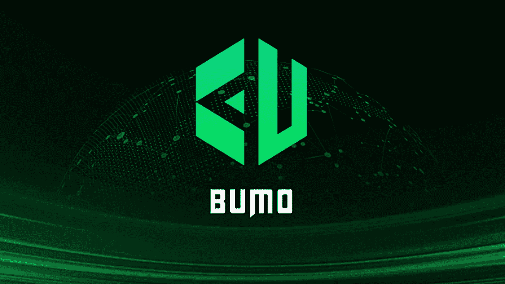

# 比特币能修好吗？

> 原文：<https://medium.datadriveninvestor.com/can-bitcoin-be-fixed-d2a13e88cc90?source=collection_archive---------9----------------------->

## 比特币和其他加密货币的诞生引发了技术和金融科技领域的下一波创新，但我们还没有完全实现

Source: [https://www.pexels.com/@worldspectrum](https://www.pexels.com/@worldspectrum)

比特币刚满 10 岁。自 2008 年金融危机席卷全球金融体系以来，10 年已经过去了。Satoshi 曾指出，创世纪区块和比特币的诞生是人们对当前金融体系和现状失去信心的结果。

比特币和其他加密货币的诞生引发了科技和金融科技领域的下一波创新。尽管比特币和加密货币在准备好被大规模采用之前总体上面临几个挑战，但毫无疑问，经过 10 年的考验和磨难，加密货币和区块链正在走向成熟，并获得主流认可。

然而，如果没有人在日常交易中使用数字货币，它的使用仍然非常有限。这是业外人士的普遍共识。比特币受欢迎程度的提高也助长了它的漏洞，高昂的交易费用、缓慢的交易速度和计算机的电力成本正在阻止它和其他加密货币成为主流。

> 比特币“几乎没有人接受，而且还在萎缩，”他补充道，“如果没有人接受这项技术进行支付，那么它的价值将为零。”
> 
> *摩根士丹利分析师 James Faucette，“比特币解密”*

*Bitcoin Source: pixabay.com*

尽管有人担心加密和区块链技术是否已经准备就绪，但普遍的共识是，Lightning Network、Liquid Network、Casper、Sharding、Plasma 和 sidechain 等扩展解决方案将解决可扩展性挑战，并允许每秒钟数十亿次交易同时、无缝和安全地发生。

## 区块链挑战减缓加密的主流采用

*挑战 1:可扩展性*

谈到交易速度，Visa 是主导者。Visa 每秒可处理 24 000 笔交易，平均每天处理 1.5 亿笔交易。Ripple 以 1500 美元排名第二，PayPal 以 193 美元排名第二，以此类推…

如果数字货币无法接近 visa，那么为什么会有人停止使用 Visa 呢？还是现金/借记卡？

*挑战 2:互操作性*

银行有能力相互沟通，即使这会导致高额费用和时间延迟。目前以太坊与比特币区块链或 Ripple 区块链对话的能力很困难。区块链之间的轻松互动对大规模采用至关重要。目前，交易所是区块链之间转移价值的主要沟通渠道，交易所很容易受到攻击。许多人认为跨链通信问题的解决是区块链技术的下一个“发现”时刻。

*Solving the scalability and interoperability challenges of Bitcoin and other cryptocurrencies — Source: Shutterstock*

许多区块链和加密技术背后的主要目标是试图解决与法定和传统国家批准的银行系统相关的风险和问题。区块链开发者目前正在致力于建立开放协议和多链框架，以使区块链和加密货币能够互操作。这些开放协议中最著名的是原子交换协议，它允许区块链之间的价值交换，而不使用交换或中介。

## 区块链是比特币与众不同的地方

区块链，或分布式账本技术(DLT)是一个廉洁的数字账本，可以通过编程记录几乎所有有价值的东西。为了更好地理解区块链，想象一个电子表格在计算机网络上被复制成千上万次，该电子表格定期更新——所有参与者都可以实时访问，并存储在多个位置。DLT 为资源整合和信息传播提供了一个改进的、更有效的解决方案，

类似的例子有 Google Sheets 和 Google Docs，它们允许有访问权限的各方同时查看一个文档，就像一个共享的分类账。

**公立和私立区块链**

公共链是开源的，信任更少(不需要像银行这样的可信中介)，任何人都可以加入。任何商业实体或政府都不应该控制区块链——这就是它们分散化的原因。

公共区块链背后的想法是，任何有权访问它的人都应该能够不受限制地使用它。

私人区块链则相反，任何人未经许可不得进入，通常所有者是一家公司或单一实体。他们控制了区块链，这意味着他们也控制了区块链的入口。它们不是分散的，而是由于其速度、时间和金钱效率的好处而被工业大量利用

**2018 年是公共区块链年——或者是吗？**

许多业内人士希望 2018 年将是公共区块链的突破之年，届时将有超过 1000 家公共连锁店涌现，跨链通信和交易速度将成为过去，但我们即将进入 2019 年，但事实并非如此。许多这些公共区块链仍处于早期开发阶段；其他国家正在取得重大进展，但可以说我们仍未度过“最困难时期”。

## 可伸缩性和互操作性竞赛

**闪电网络**

[闪电网络](https://lightning.network/)通过在比特币的区块链上增加一个额外的层来工作，允许在不同的区块链之间建立链外支付通道，允许用户在这个额外的层上创建任何两方之间的小额支付通道。只要需要完成交易，这些支付渠道就存在，是点对点的，允许交易几乎立即发生，费用很低或不存在。

闪电网络主要用于莱特币和比特币之间的交易，通过在不同区块链之间建立链外支付通道实现，允许即时价值转移。

**血浆现金**

3 月 9 日，Vitalik Buterin 在巴黎展示了一个名为[等离子现金的可扩展性解决方案。](https://ethresear.ch/t/plasma-cash-plasma-with-much-less-per-user-data-checking/1298)由 Vitalik Buterin 与闪电网络的联合创作者之一 Joseph Poon 共同创作。像比特币闪电网络中的支付通道一样，等离子体是一种在进行链外交易时改善可扩展性和安全性限制的技术；依靠底层以太坊区块链来巩固其安全性。

Source: BUMO Blockchain

[**BUMO——区块上的新区块链**](https://www.bumo.io/)

BUMO 是面向商业级应用的企业区块链基础设施。基本上，它们为父/子树架构中的内部和外部侧链提供桥接服务，主要是为了解决伸缩性和互操作性问题。

BUMO 知道，它必须通过集成各种技术来缓解当前与性能、可扩展性和应用多样性相关的区块链瓶颈，从而根据区块链需要服务的企业的具体业务需求定制具体的网络。

通过提供一个独特的互操作性平台，使开发人员无论选择何种语言(JavaScript、Java、Go、C/C++、Python 等)都可以轻松地在区块链上进行开发。BUMO 提供了一个详细记录的分步指南以及用户友好的 SDK，使区块链开发变得相当容易。这有助于通过提供“无合约应用”功能来解决开发人员的入门障碍，因为在大多数智能合约平台中，开发人员需要知道像 solidity 这样的特定编码语言。

至于安全性，基于 Bubi 区块链技术的 BUMO 核心系统架构和代码已经接受了两年的安全漏洞和操作故障审查。

**可扩展性和互操作性竞赛正在进行**

为区块链技术提供可扩展性和互操作性的竞赛正在进行，很可能会有一些赢家。最大和第一个冲过终点线并不一定意味着它会是最好的。最终胜出的将是那些为最终用户提供最佳用户体验的公司。

我采访了 Arunabh Das，AppLiaison Inc .的创始人兼首席技术官，他谈到了我们对 2018 年的希望，以及哪些实现了，哪些没有实现，以下是他的看法:

> *“对于去中心化的应用程序以及区块链和 DLT 技术的广泛采用来说，2018 年是令人兴奋的一年。世界各地的区块链开发者正在努力创建去中心化的交易所和平台，可扩展性问题正在通过各种侧链解决方案得到解决。*
> 
> *区块链和加密在华尔街和硅谷被广泛采用。结合人工智能、人工智能和 IOT 的区块链解决方案有望对世界各地人类的生活质量以及人类世时代我们城市的可持续性产生变革性影响。*
> 
> *2019 年承诺在区块链和人工智能方面取得更多令人兴奋的进展，世界各地的开发人员都乐观地认为，通过充分利用这些去中心化技术的力量，消除数据垄断，使人类能够获得更多的经济机会，同时使用自我主权身份系统保持对数据和隐私的控制，可以为全球人类带来和平与繁荣。”*

我同意 Das 的观点，我认为我们将在 2019 年看到更快的采用。

比特币真的需要被修复吗？或许这不是“修复”比特币的问题，而是增强比特币的问题。

发表在 [BlockDelta.io 上的原故事——比特币能修好吗？](https://www.blockdelta.io/can-bitcoin-be-fixed/)

奥黛丽·奈斯比特

[奥黛丽·奈斯比特在 Linkedin 上](https://www.linkedin.com/in/audrey-nesbitt-0388a52a/)

[@ audreynesbit 11 在推特上](https://twitter.com/AudreyNesbitt11)