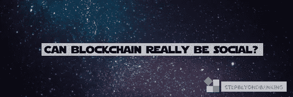

# 区块链真的可以“社交”吗？

> 原文：<https://medium.datadriveninvestor.com/can-blockchain-really-be-social-40b9db93c190?source=collection_archive---------35----------------------->

当谈到区块链技术及其在各行各业的应用时，许多人首先会想到“区块链到底是什么？”，会好奇一会儿，然后宣称“都是电脑的东西，我不懂”；这时候思想就结束了。

其他人会默认地在脑海中联想到区块链意味着“加密货币”，而“加密货币意味着洗钱”，因此意味着它是不好的、邪恶的、非法的；这个想法也就结束了。

对于其他人来说，这可能只是引发了对这一新技术进步能力的一些好奇，远远超出了它在加密货币采矿中的应用(是的——它*确实*也与加密技术有关)，并试图发现区块链还可以用于其他地方，甚至给社会带来积极影响。

这就是我的“好奇心”所在。

尽管区块链因为能够用比特币、以太坊或任何其他加密货币的加密货币代币奖励热心的矿工而成为新闻，但区块链底层技术的能力远不止采矿。事实上，区块链正在革新几乎每一个行业，甚至可以产生积极的社会影响。

"是的，但是*是什么*呢？"，你可能还在想。

简而言之，区块链是一个通过分布式账本技术运行的数据库，其中数据根据网络中预先商定的一致算法记录在计算机上。

这是一种数据库形式，数据以固定结构存储在链中，称为“块”，因此得名“区块链”。

这是一个去中心化的解决方案，意味着除了用户自己之外，不需要第三方来验证交易。一旦交易被编码并添加到区块链上，它将被永久保存，可以一直追溯到其源头，并且不能被修改或删除。

这使得区块链格外准确和安全。*

除了在金融服务行业的应用，创新者还在寻找利用这种新的数字分类账记录任何对人类有价值的东西的方法。为了实现“更智能”和更高效的治理，区块链可以用来记录、保存和存储一切，从*出生和死亡证明*，到*结婚证*、*地契和所有权*、*知识产权*、*病史*、公民身份和投票权。

对于更值得信赖的业务体验，区块链可用于加快保险索赔、制定雇佣合同和记录管理决策权。

为了提高供应商对消费者的可靠性，并回答诸如“*我的食物真正来自哪里*”之类的问题，区块链可用于追踪食物的来源，甚至追踪您的珍贵钻石从我的钻石到零售的过程。为了建立一个更加透明的慈善和捐赠生态系统，区块链可以帮助追踪与具体结果挂钩的慈善捐赠；任何可以被编码的东西。

你能想象这样一种情况吗，医生完全公开患者的病史，使他们能够(a)避免对患者进行不必要的检查，这些检查通常是耗时、昂贵和“在黑暗中搜索”的,( b)在患者来之前准确了解患者在生活中面临的药物/程序/健康问题，以便更准确地诊断和给出医疗建议。

或者，你正在购买的房产的产权并没有藏在某个土地注册处的后台，而你又确切地知道该房产的所有权轨迹？

如果你对你的知识产权的权利被(最后！)被正确地识别，并且你因为属于你的东西被正确地奖励，因为它被用于万维网或者音乐和娱乐产业？

它甚至可以更进一步——走向一个自我主权身份系统的世界，一个授权社区管理而非集中所有权的星际治理的世界——就像 [**CULTU。RE**](https://cultu.re/) 旨在实现。

我有机会现场聆听了 Toni Lane 的演讲，他谈到了区块链技术在重新激励个人“ [*形成相互依赖的市场，使自主的、自我组织的、自愿的网络*](http://www.tonilane.com/resume) *能够为了人类的利益而增选和完善传统基础设施*。 **Cultu.re** 将自己定义为*“星际社会的区块链治理和自我主权”*。通过文化，个人可以整合他们自己的“博爱协议”，在“环球住房网”上登记他们的有形财产，并通过参与不同的社区来创造文化。

正在发现和开发利用区块链的新方法的公司包括 Spotify、De Beers、Accenture 和 Loyyal 等，所有这些公司都在重新开发这项新技术的潜力，以解决关键问题。

**——Spotify 已经收购了 Mediachain Labs 初创公司，他们正在一起使用区块链技术开发 IT 解决方案，将艺术家和其他权利持有人与 Spotify 上托管的歌曲联系起来。Spotify 最近面临许可纠纷，并被迫支付 2000 多万美元和解，此后，该公司现在转向区块链科技公司，帮助他们解决归属和权利所有权问题。**

**[**德比尔斯**](https://www.debeersgroup.com/media/company-news/2018/de-beers-group-successfully-tracks-first-diamonds-from-mine-to-r) —世界著名钻石供应商宣布，他们计划使用区块链追踪钻石从矿场到客户购买的全程。该公司希望通过一个名为 Tracr 的平台，为精选的毛坯钻石创建一条从矿场到切割和抛光，再到珠宝商的数字轨迹。**

**[**埃森哲**](https://www.accenture.com/us-en/service-blockchain-insurance) —该公司为其客户开发了区块链解决方案，可以替代处理、支付、代位求偿和评估保险索赔的人工业务流程，从而提高效率和生产力，避免目前使用的繁琐和分散的流程。**

**[**medical chain**](https://medicalchain.com/Medicalchain-Whitepaper-EN.pdf)—medical chain 建立的创新平台是一个去中心化的平台，能够安全、快速、透明地交换和使用医疗数据。它创建以用户为中心的电子健康记录，并维护该用户数据的单一真实版本。该公司还在开发另外两个应用程序，与该平台一起工作——*远程医疗*应用程序，该应用程序将允许用户远程咨询真正的医生(即通过使用他们的手机),只需向医生支付少量费用；以及*健康数据市场*，通过该市场，用户将能够与第三方就其健康数据的替代用途或应用(即允许其数据用于医学研究)协商商业条款。**

**总的来说，对于一些人来说，区块链正在彻底改变我们迄今所知的几乎每一个行业，这可能确实令人望而生畏。这项技术的潜力是巨大的，它取决于创新者将这项技术很好地利用起来，并创造出独特的解决方案。**

**事实上，区块链可以对社会产生巨大的影响，它可以用来解决困扰国家和政府多年的问题。如果我们真的想得到这些解决方案，那就另当别论了，但不能忽视的是，区块链正在破坏我们从今天到明天的前进道路。**

****(如果你想阅读更多关于区块链的内容，请查看我为 DLA Piper Global Financial Markets Insight 合著的文章"* [*【区块链能不负众望吗？"*](https://www.dlapiper.com/en/portugal/insights/publications/2016/07/global-financial-markets-insight-issue-10/can-blockchain-live-up-to-the-hype/) *)* 。**