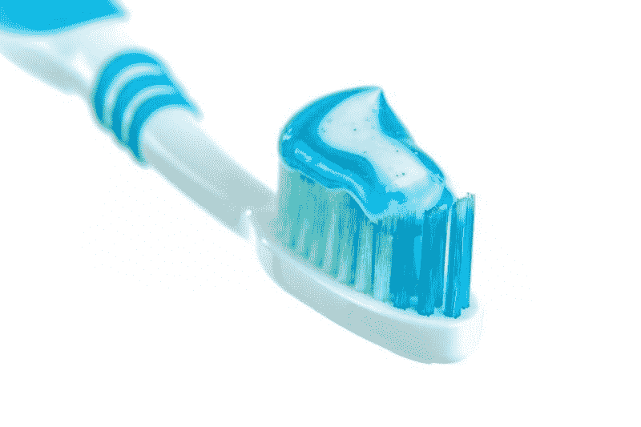
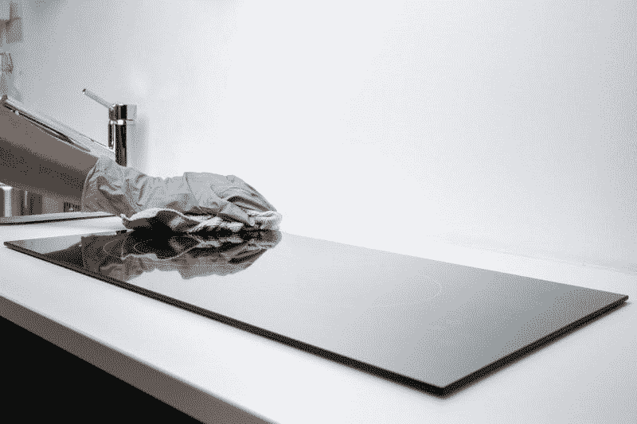
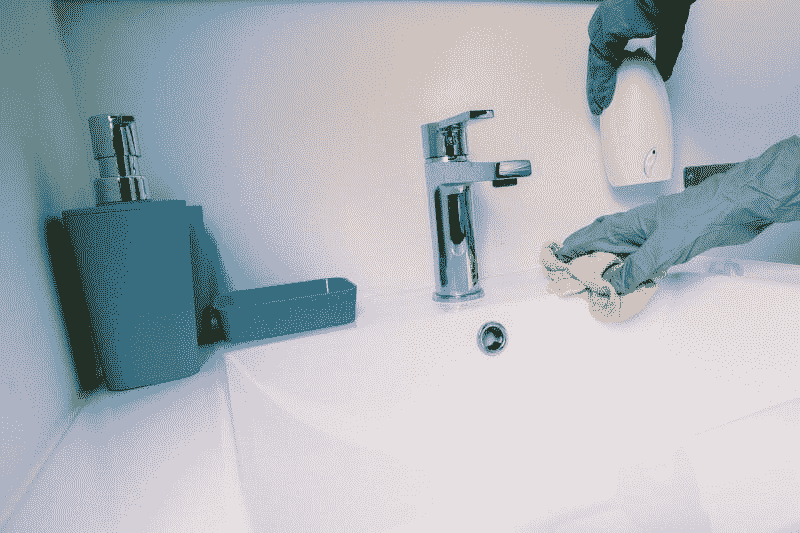
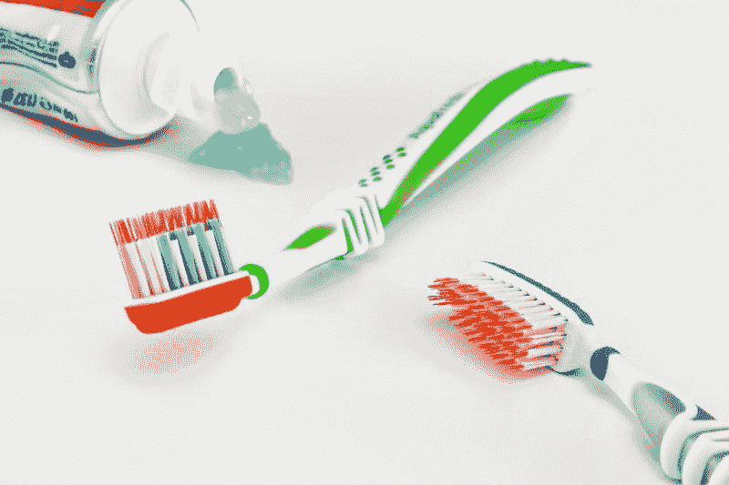

# 高露洁棕榄能生存吗？—市场疯人院

> 原文：<https://medium.datadriveninvestor.com/can-colgate-palmolive-survive-market-mad-house-fe69a360a473?source=collection_archive---------4----------------------->

我问高露洁棕榄能否生存，因为消费品行业是一个越来越艰难的粗糙行业。例如，Coresight [预测](https://marketmadhouse.com/how-to-invest-for-the-retail-apocalypse/)2019 年美国将有超过 12，000 家实体店关门。

这场零售业的末日可能会沉重打击**高露洁棕榄(纽约证券交易所代码:CL)** ，因为它不成比例地影响了传统的折扣店。例如，**美元树(纳斯达克股票代码:DLTR** )可能会完全关闭 190 家家庭美元店。

 [## 算法交易的机器学习|数据驱动的投资者

### 当你的一个朋友在脸书上传你的新海滩照，平台建议给你的脸加上标签，这是…

www.datadriveninvestor.com](https://www.datadriveninvestor.com/2019/01/30/machine-learning-for-stock-market-investing/) 

高露洁棕榄公司的产品，如超亮牙膏和速棒除臭剂，充斥着家庭美元的货架。然而，美元树的所有者将把 200 个家庭美元商店变成美元树的位置；并关闭另外 190 家家庭美元店，一篇*商业内幕*文章[声称](https://www.businessinsider.com/dollar-tree-closes-hundreds-of-family-dollar-stores-2019-3)。

# 零售业末日会杀死高露洁棕榄吗？

商业内幕*推测，美元树正在扼杀家庭美元，因为它拖累了公司的业务。*

Family Dollar 是一家传统的百货商店，向中产阶级和工人阶级客户出售各种各样的基本消费品。此外，Family Dollar 主要服务于农村和小城镇的客户。

美元树是一个更加专业化和城市化的连锁店，以 1 美元的价格出售所有商品。有趣的是，Dollar Tree 的销售额在 2018 年增长了 3.2%，而 Family Dollar 的销售额增长了 1.4%。

# 亚马逊是如何杀死高露洁棕榄的

Family Dollar 销售低迷的一个显而易见的原因是亚马逊，它现在是美国农村最受欢迎的零售商。值得注意的是，每当我去农村邮局，我都会看到很多人拿起亚马逊盒子。

在亚马逊上进行大部分购物的人没有动力去 Family Dollar。此外，亚马逊现在销售 Family Dollar 专营的许多基本消费品，包括牙膏和化妆品。

对 Family Dollar 和高露洁棕榄的一个主要威胁是亚马逊 Prime，它为消费者提供每月 12 美元的免费送货服务。Statista [估计](https://www.statista.com/statistics/546894/number-of-amazon-prime-paying-members/)2019 年 3 月，美国亚马逊 Prime 用户从 2018 年 6 月的 9500 万增加到 1.03 亿。

此外，Statista 估计 Prime 会员平均每年在亚马逊上花费 1400 美元。由于亚马逊 Prime，美国人更习惯于网上购物。此外，**沃尔玛(纽约证券交易所股票代码:WMT)** ，提供免费送货，价格通常比亚马逊更优惠。

# 高露洁棕榄赚钱了吗？

高露洁棕榄是美国零售业的一个很好的晴雨表，因为它拥有许多历史悠久的消费品牌。高露洁的标志性产品包括棕榄洗碗皂、速棒、墨菲油皂、阿贾克斯、超亮牙膏和高露洁牙膏。

然而，截至 2019 年 3 月 31 日的季度，高露洁棕榄的收入增长率下降了 2.95%。值得注意的是，这是连续第三个季度收入增速下滑。详细来说，高露洁的收入增长在 2018 年的最后三个月收缩了 2.08%，在截至 2019 年 9 月 30 日的季度收缩了 3.25%。

# 高露洁棕榄的收入正在缩水

重要的是，高露洁棕榄的收入在 2018 年 3 月至 2019 年 3 月期间下降。具体来说，2018 年 3 月 31 日的收入为 40.02 亿美元，一年后为 38.44 亿美元。

高露洁棕榄仍在盈利，因为截至 2019 年 3 月 31 日，该公司报告季度营业收入为 8.79 亿美元，季度毛利为 22.87 亿美元，季度净收入为 5.6 亿美元。

公司赚钱少了，因为一年时间营业收入从 9.83 亿美元下滑，净收入从 6.34 亿美元下滑，毛利从 24.08 亿美元下滑。因此，零售天启正在伤害高露洁棕榄的业务，而且越来越严重。

因此，高露洁产生的现金很少。例如，该公司报告截至 2019 年 3 月 31 日的季度运营现金流为 6.05 亿美元，自由现金流为 5.34 亿美元。这些数字与去年同期的 6.16 亿美元运营现金流和 4.98 亿美元自由现金流相似。

高露洁棕榄积累现金的能力很小。截至 2019 年 3 月 31 日，它拥有 8.43 亿美元的现金和等价物，低于一年前的 8.51 亿美元。

# 高露洁棕榄会幸存吗？

这些有限的资源使高露洁棕榄的生存受到质疑。该公司目前几乎没有现金，需要开发新的分销渠道来取代奄奄一息的零售商。

尤其是亚马逊，几乎没有动力去销售或推广高露洁棕榄的产品。因此，高露洁棕榄将需要一个强大的营销或折扣力度，才能在亚马逊购物者面前推销其产品。

有趣的是，这种推动将需要使用非传统或数字媒体，因为旧媒体正在消亡。美国最大的广播电视网络哥伦比亚广播公司在 2019 年 7 月 18 日截止日期[估计](https://marketmadhouse.com/can-colgate-palmolive-survive-2/estimates)只有 298 万观众。

此外，CBS 整个 2018-2019 电视季的观众人数为 890 万。值得注意的是，我估计 2018-2019 年美国所有五个广播网络的观众总数为 2840 万。

# 亚马逊 Prime 用户群几乎是网络电视观众的四倍

因此，网络电视的收视率是亚马逊 Prime 美国用户群的近四分之一。据我估计，不到十分之一的美国人在看网络电视，但近三分之一的美国人订阅了 Prime。

为了详细说明，Worldometers 估计 2019 年 7 月美国人口为 3.29093 亿，Statista 估计 2019 年 3 月亚马逊订阅量为 1.03 亿。与此同时，美国五大广播网在 2018-2019 赛季吸引了 2840 万观众。

结果，不到十分之一的美国人看到高露洁和棕榄等产品的电视广告。然而，像高露洁棕榄这样的公司将他们的品牌营销模式建立在网络电视上。在这种情况下，高露洁棕榄需要削减电视广告，投资亚马逊广告。

英国的一项新研究表明，随着婴儿潮一代(55 岁至 75 岁之间)的死亡，看电视的人会越来越少。有趣的是，16 至 24 岁的英国人每天只看两分钟的电视新闻，监管机构 Ofcom 估计，*《卫报》* [报道](https://www.theguardian.com/tv-and-radio/2019/jul/24/young-people-uk-abandon-tv-news-almost-entirely-ofcom)。相比之下，65 岁以上的英国人每天看 33 分钟的电视新闻。

我认为这项研究和收视率显示年轻人不看电视。因此，高露洁棕榄需要将广告费花在其他地方。

# 高露洁棕榄的未来是什么？

Amazon Prime 的成功向我们展示了高露洁棕榄的未来。我认为高露洁棕榄唯一的生存之道就是通过亚马逊和它的竞争对手来销售它的品牌。

例如，高露洁可以通过亚马逊 Prime 独家销售其部分品牌。或者只为主要客户生产特殊尺寸、品种或特殊版本的产品。

一个显而易见的营销策略是向高级会员分发高露洁棕榄产品的免费样品。例如，在亚马逊的每一个订单中，都有一个免费的高露洁牙膏或一个速棒。其他营销渠道包括亚马逊必需品和 [Dash](https://www.amazon.com/b/ref=s9_acss_bw_cg_SnakeLM_md1_w?node=17276841011&pf_rd_m=ATVPDKIKX0DER&pf_rd_s=merchandised-search-2&pf_rd_r=HDJ6FNV60WRYV9FYYEAC&pf_rd_t=101&pf_rd_p=8626d1fa-60a1-4a53-83d9-9a6653cf7563&pf_rd_i=17729534011) 。

Dash 提供按钮和应用程序，让客户只需按一下按钮就可以订购产品。许多 [**【宝洁&**](https://marketmadhouse.com/procter-gamble-asks-can-traditional-brands-survive-in-the-21st-century/)**(NYSE:PG)**的产品已经如潮水般出现在 Dash 上。从战略上讲，客户可以通过 Alexa 轻松访问 Dash。在未来，我认为 Dash 按钮可能会出现在视频游戏、Prime Video 甚至 Kindle 上的书籍中。

然而，只有时间才能证明顾客是否会打断堡垒之夜的游戏；还是最新的*男生*集，重新排序 Ajax。然而像高露洁棕榄这样的公司迫切需要新的方法来接触顾客，尤其是年轻人。

# 高露洁棕榄是价值投资吗？

我认为市场先生在 2019 年 7 月 26 日将**高露洁棕榄(纽约证券交易所代码:CL)** 定价过高，达到 72.15 美元，尽管 55 年来股息一直在增长。解释一下，有限的现金和微薄的收入并不能证明这个价格是合理的。

然而，CL 将于 2019 年 8 月 15 日支付可观的 43₵股息。此外，2019 年 5 月 15 日，股息从 42₵增长到 43₵。总体而言，2019 年 7 月 26 日，Dividend.com 给予高露洁棕榄的股息收益率为 2.38%，年化派息为 1.72 美元，派息率为 57%。

归根结底，高露洁棕榄是一只很好的分红股票，我建议投资者远离它。我建议不要持有高露洁棕榄；因为我看不出这家公司如何在急剧变化的零售环境中赚钱，除非它大幅改变其商业模式。

*原载于 2019 年 7 月 26 日*[*https://marketmadhouse.com*](https://marketmadhouse.com/can-colgate-palmolive-survive-2/)*。*