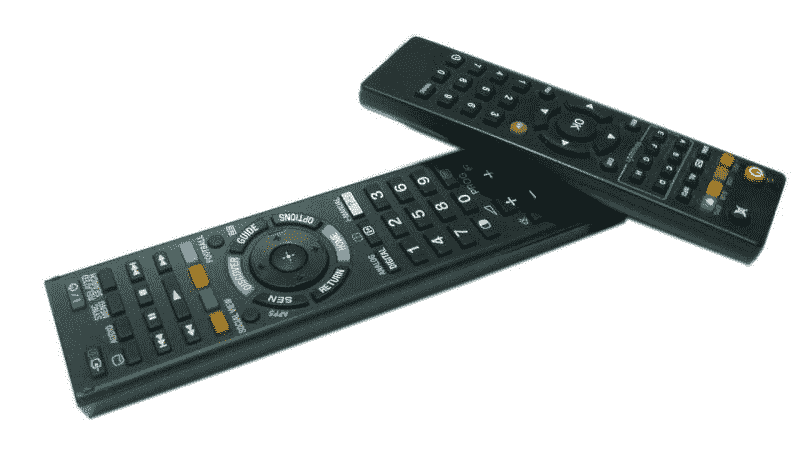
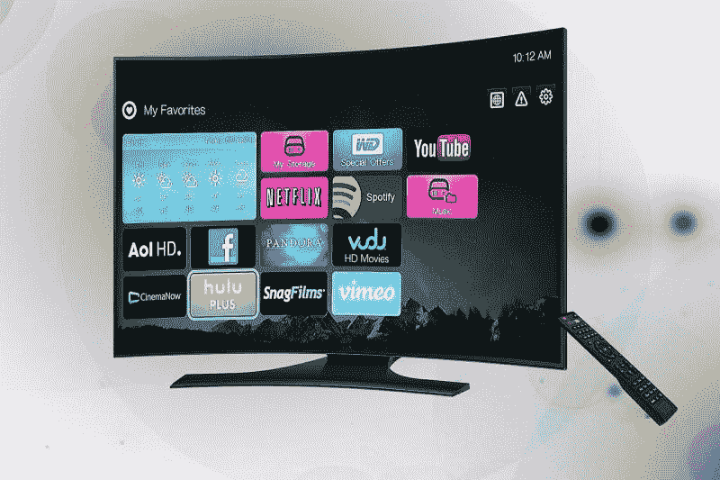

# 康卡斯特能挺过 5G 和割线吗？—市场疯人院

> 原文：<https://medium.datadriveninvestor.com/can-comcast-survive-5g-and-cord-cutting-market-mad-house-96a04e1d658c?source=collection_archive---------12----------------------->

对康卡斯特公司来说，这是黑暗的日子。从 2018 年第二季度到 2019 年第二季度，这家有线电视和互联网巨头失去了 48 万付费电视用户。

具体来说，Statista [估计](https://www.statista.com/statistics/497279/comcast-number-video-subscribers-usa/)康卡斯特在 2018 年第二季度拥有 2164 万视频订户，在 2019 年第二季度末拥有 2212 万视频订户。鉴于这些数字，我估计康卡斯特在过去一年里平均每月失去 4 万名视频用户。澄清一下，我用 2212 万减去 2164 万得出 48 万，用 48 万除以 12 得出 4 万。

 [## 算法交易的机器学习|数据驱动的投资者

### 当你的一个朋友在脸书上传你的新海滩照，平台建议给你的脸加上标签，这是…

www.datadriveninvestor.com](https://www.datadriveninvestor.com/2019/01/30/machine-learning-for-stock-market-investing/) 

令人不安的是，我的估计可能太低了。康卡斯特在 2019 年第一季度失去了 12.1 万名电视客户，*《费城问询者报* [估计](https://www.inquirer.com/business/comcast/comcast-earnings-cord-cutters-netflix-sky-20190425.html)。此外， *Cord Cutters News* [估计](https://www.cordcuttersnews.com/comcast-lost-224000-tv-subscribers-in-2nd-quarter-2019/)康卡斯特在 2019 年第二季度失去了 224，000 名住宅视频订户。

# 有线电视正在消亡——互联网能拯救康卡斯特吗？

因此，如果《断线钳新闻》和《费城问询者报》的数字准确的话，有线电视正在我们眼前消亡。重要的是， **AT & T (NYSE: T)** 在 2019 年第二季度失去了 77.8 万电视订户， *Cord Cutters News* 声称。

奇怪的是，最近康卡斯特有很多好消息。例如， *Cord Cutters News* 声称，康卡斯特在 2019 年第二季度增加了 181，000 名无线客户和 209，000 名互联网客户。另外，*《费城问询者报》*估计康卡斯特在 2019 年第一季度增加了 375，000 名宽带客户。

因此，康卡斯特正处于同时应对急剧增长和市场崩溃的尴尬境地。美国的电视迷比以往任何时候都更沉迷于视频，但他们不再想看有线电视上的节目。

# 有人在看有线电视吗？

有趣的是，数据显示这个问题是“有人还在看有线电视吗”是一个有效的问题。

例如， *AdWeek* [估计](https://www.adweek.com/tvnewser/july-2019-ratings-cnn-sees-noticeable-year-over-year-drop-off-but-remains-a-top-10-cable-network-in-total-day/409984/)一个备受瞩目的有线电视网的收视率；CNN，在 2018 年 7 月至 2019 年 7 月间下跌了 32%。如果 *AdWeek 的*估计是正确的，CNN 一年内失去了近三分之一的观众。另外，康卡斯特的新闻频道；MSNBC 在 2018 年 8 月至 2019 年 8 月期间失去了 20%的黄金时段观众。

很明显，美国最受欢迎的有线电视节目；福克斯*汉尼提【2019 年 7、8 月平均 330 万观众，*截止* [预估](https://deadline.com/2019/08/fox-news-ratings-wins-cable-hannity-rachel-maddow-cnn-msnbc-politics-1202705396/)。因此，顶级有线电视节目的观众只占美国人口的 1%多一点。*

很明显，美国最受欢迎的有线电视节目；福克斯*汉尼提*2019 年七八月平均 330 万观众，*截止* [预估](https://deadline.com/2019/08/fox-news-ratings-wins-cable-hannity-rachel-maddow-cnn-msnbc-politics-1202705396/)。因此，顶级有线电视节目的观众只占美国人口的 1%多一点。

# 有线电视的观众正在逐渐减少

康卡斯特有一个严重的问题，随着看有线电视的美国老年人的死亡，这个问题将在未来几年加剧。

详细来说，营销图表[估计](https://www.marketingcharts.com/television/tv-audiences-and-consumption-106649)2018 年美国传统电视(客厅的电视或屏幕)观众的平均年龄是 56 岁。因此，电视机的主要市场是婴儿潮一代，即 54 岁至 73 岁的美国人。

然而，Inc indar[估计](https://incendar.com/baby_boomer_deathclock.php)每 18.4 秒就有一名婴儿潮一代死亡，每天有 4701 名婴儿潮一代死亡。因此，我估计每年有 171.6 万婴儿潮一代人死亡，每月约有 142，989 名婴儿潮一代人死亡——如果 Incendar 的数据准确的话。

此外，数据显示年轻的美国人不再看有线电视。例如，25 至 54 岁的成年人观看最多的有线电视网福克斯新闻频道频道的人数在 2018 年 7 月/8 月至 2019 年 7 月/8 月期间下降了 11%，*截止日期* [估计](https://deadline.com/2019/08/fox-news-ratings-wins-cable-hannity-rachel-maddow-cnn-msnbc-politics-1202705396/)。

# 5G 如何让康卡斯特的情况变得更糟

令人难以置信的是，康卡斯特的情况可能很快会变得更糟。解释一下，**威瑞森(纽约证券交易所:VZ)** 希望明年在美国一半的城市提供 5G(5gb)无线网络。

威瑞森首席执行官卫翰思告诉美国消费者新闻与商业频道，他的公司计划在 2020 年在超过 34 个城市推出 5G。解释一下，5G 是一种无线服务，可以比现有系统以更高的速度传输更多的数据。

我认为 5G 的扩张威胁到了康卡斯特，因为 5G 连接可以让人们在没有有线互联网连接的情况下下载流媒体视频。因此，数千万美国人可能很快就没有理由每月向康卡斯特支付 50 至 100 美元的互联网服务费用。

# 为什么有线电视正在迅速消亡

此外，5G 的普及将让更多人有理由放弃有线电视。解释一下，一个只看体育比赛的人不再需要订购几百个频道来看他的球队。相反，这个人可以订购一个数字体育服务，只显示他观看的比赛。

例如，一个职业足球迷可以通过 NFL 的[应用程序和网站](https://www.nfl.com/videos)观看所有他想看的比赛。与此同时，一个新闻迷可以放弃有线电视订阅，在 YouTube 和像 [CBSN](https://www.cbsnews.com/news/cbs-to-launch-cbsn-local-streaming-service-to-expand-digital-reach/) 这样的应用上观看她想要的所有新闻，而不用支付有线电视费用。

在这种情况下，像肖恩·哈尼蒂、安德森·库珀和塔克·卡尔森这样的有线电视名人将在几年后寻找新的工作。值得注意的是，YouTube 上最受欢迎的访谈节目之一；Tubefilter [声称，Joe Rogan 体验](https://www.tubefilter.com/2018/09/07/the-joe-rogan-experience-elon-musk/) 吸引了 330 万订户，与福克斯新闻频道的收视率相当。

# 康卡斯特赚钱了吗？

奇怪的是，尽管有线电视即将消亡，康卡斯特公司的收入却在增长。事实上，Stockrow 估计康卡斯特在截至 2019 年 6 月 30 日的季度收入将增长 23.57%。

令人印象深刻的是，Stockrow 报告称，康卡斯特在该季度的收入为 268.58 亿美元，毛利为 153.27 亿美元。此外，康卡斯特的营业收入为 53.56 亿美元，净收入为 31.25 亿美元。

此外，康卡斯特在该季度的运营现金流为 142.71 亿美元，自由现金流为 39.96 亿美元。然而，康卡斯特并没有保留太多现金。例如，2019 年 6 月 30 日，康卡斯特的现金和短期投资只有 39.13 亿美元。

因此，康卡斯特是一家快速增长的公司，通过钱柜运营着大量现金。然而，康卡斯特并不是一家现金充裕的公司。

# 康卡斯特是价值投资吗？

自然很多人会怀疑康卡斯特是不是一个价值投资。例如，2019 年 9 月 10 日，康卡斯特的股价为 46.04 美元。

相比之下，流媒体视频服务**网飞(纳斯达克代码:NFLX)** 的股票在同一天的交易价格为 283.55 美元。具有讽刺意味的是，尽管康卡斯特在 2019 年 7 月 2 日支付了 21₵的季度股息，但网飞没有支付股息。

此外，康卡斯特的股息在 2019 年由 2₵增长。解释一下，康卡斯特在 2018 年 12 月 31 日支付了 19₵股息。因此，康卡斯特股东在 2019 年 9 月 10 日获得的股息收益率为 1.81%，84₵的年化派息率为 33.2%。

# 康卡斯特是好的分红股吗？

归根结底，我认为康卡斯特是一只正在经历显著增长的高股息股票。因此，康卡斯特是一个很好的价值投资，因为它的股票便宜而且赚钱。

然而，**康卡斯特公司(纳斯达克代码:CMCSA)** 面临的风险是巨大的。因此，康卡斯特是不错的价值投资，但那些拥有康卡斯特的人可能需要尽快卖掉它。

*原载于 2019 年 9 月 10 日*[*https://marketmadhouse.com*](https://marketmadhouse.com/can-comcast-survive-5g-and-cord-cutting/)*。*