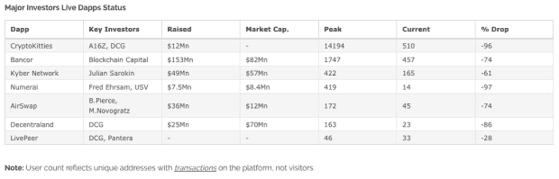
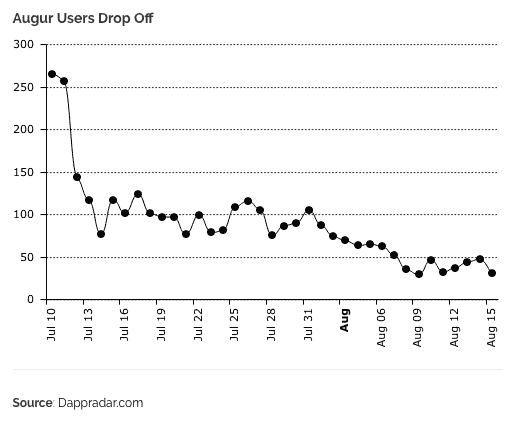

# dApps 能恢复我们的信仰吗？

> 原文：<https://medium.datadriveninvestor.com/can-dapps-restore-our-faith-9648677be024?source=collection_archive---------44----------------------->

又一周过去了，脸书又一次数据崩溃。

这一次，它与网飞、Spotify 等科技巨头分享用户的私人信息数据。几个月前，一次网络攻击暴露了至少 5000 万用户的个人信息。

更糟糕的是，我们随后发现，黑客可能已经访问了受影响用户的所有应用程序，这些应用程序需要他们的脸书登录。

作为消费者，集中式数据库似乎在保护用户数据方面存在重大不足。我们信任的保护我们和我们的数据的守护者一再失败。

而往往，*蔚为壮观*。

无论是收集我们在脸书的用户数据[让剑桥分析公司为特殊的政治目的创建心理特征](https://www.nytimes.com/2018/03/17/us/politics/cambridge-analytica-trump-campaign.html)，还是我们的密码从集中的交易所被盗，集中的模式似乎容易受到日益复杂的黑客操作的攻击。

# dApps 来救援？

越来越多的人猜测他们的分散对等物——dapp——是否会取代他们的位置。他们能送货吗？

我们仍然处于 dApp 开发生命周期的早期阶段，这意味着分散应用程序的固定定义至今仍未确定。但是 dApp 总是会使用由用户对等网络(P2P)运行的智能合约代码——而不是单一的控制实体——将其连接到现有的区块链平台，如以太坊。

值得一提的是，分散式应用在区块链出现之前就已经存在了。例如，用于文件共享的 P2P 网络已经存在了 20 多年，BitTorrent 等应用程序至今都非常成功。

但是在目前区块链的早期时代，像 CryptoKitties 这样的 dApps 已经引起了很多兴趣——也引起了很多争论——关于它们实现大规模收养的潜在范围。使用智能合同，CryptoKitties 允许用户在以太坊区块链上收集这些数字猫，以太坊用于跟踪这些收藏品的所有权。事实上，CryptoKitties 已经被证明是如此受欢迎，以至于在推出后不久，[一只数码猫就以高达 14 万美元的价格被购买。这些小猫可以用加密货币进行收集、购买、出售和交易，用户还可以向其他用户支付“交配费”，让他们的小猫与自己的小猫交配，生产新的小猫。](https://www.nytimes.com/2018/05/18/style/cryptokitty-auction.html)

但事实证明，在 dApp 世界中受欢迎的不仅仅是新奇的游戏。Idex 等分散式交易所可能会终结这个痛苦的交易所黑客时代。像[莫比乌斯·2D](https://m2d.win/?utm_source=DappRadar&utm_content=visit-website)这样的赌博达人可能会改变传统的彩票结构。事实上，dApps 的数量正在强劲增长，共有 1947 个记录在案；以及它们的[类型](https://www.stateofthedapps.com/rankings)，包括分散式文件存储、治理和财务应用。

从一开始，dApps 的核心特征就帮助我们理解了集中式应用程序的局限性。例如，集中式架构包括通过 HTTP 相互通信的前端和后端，并且通常利用 API 来获取用户数据以显示在网站上。后端服务器通常代表应用程序所有者(如脸书)负责保存所有数据。

因此，虽然一方可能存在许多用户，但只有一个实体最终控制后端*。*这意味着集中式应用程序有一个单点故障，因此，对这个点的成功攻击可能导致整个系统失败。它还可能危及我们大量的数据。

但 dApps 的后端代码运行在一个分散的网络上，这样就不需要依赖单一服务器来维护用户数据的完整性。使用智能合同和加密证明，dApps 可以消除单点故障，更有效地保护客户数据。分散的网络也确保了一个不可信的生态系统，一个防止中央权力机构对应用程序的商业目标施加单一控制的生态系统。因此，没有任何实体——即使是应用程序设计者——可以损害你的数据，正如脸书在各种场合所做的那样。

这种对控制的预防也可能延伸到审查等问题。例如，可以开发一个 dApp 版本的 Twitter，让用户可以在 Twitter 上发布不能被审核、审查或删除的消息，即使是应用程序的创建者也不能。一旦发布，这些信息将被永久记录在区块链上，这意味着它们可以被永久保留。

此外，在货币化方面，集中式应用程序通常会通过广告收入产生收入。正如我们在最近的脸书争议中所看到的，我们的用户数据可以用来为我们自己投放高度个性化的广告。

相比之下，dApps 涉及可以在整个区块链中被跟踪的本地令牌。通过具有在未来增值的潜力，该令牌激励用户参与和参与应用，并有机会因更多地使用 dApp 网络而获得令牌奖励。如果没有一个中央权力机构拿走大部分收入，更多的价值可以在 dApp 生态系统的参与者之间分配。

# 那么为什么 DApps 还没有接管世界呢？

尽管 dApps 在架构上有假想的优势，但它们确实面临着某些挑战，尤其是它们的低用户采用率。尽管 dApps 在这些早期阶段经历了大量的投资和用户活动，但对许多应用程序的兴趣已经迅速下降。

研究网站 Diar8 月份发布的一份发人深省的报告显示，ICO 基金筹集的最大七个 dApp 平台的活跃用户平均比历史最高水平减少了 74%。

最令人惊讶的是，8 月份 CryptoKitties 的日游客数量仅为 510 人，比几个月前的峰值下降了 96%。与此同时，分散的 exchange Bancor 失去了高达 74%的活跃用户；而在 7 月份推出的 Augur，[仅在一个月后就有不到 50 名用户](https://diar.co/volume-2-issue-33-34/#3):

虽然令牌化的生态系统可能会鼓励用户采用，但用户和令牌发行者的激励措施必须保持一致，以确保平台的长期持续成功。正如我们最近讨论的那样，这说起来容易做起来难。事实上，今年 dApp 使用量的下降几乎肯定是由于加密价格的下降，这使得设计激励用户持有他们的令牌并在这种时候保持生态系统的积极参与者成为一个独特的挑战。我将在以后的文章中深入讨论这些问题。

如此多的区块链项目所忍受的同样讨厌的可伸缩性问题——或缺乏可伸缩性——也限制了 dApps 的可用性。虽然我们可以对优步、脸书和 Visa 等集中式服务的架构提出批评，但它们仍然可以每分钟处理数十万甚至数十万笔交易。

他们完全使以太坊目前的能力相形见绌。就在 CryptoKitties 于 2017 年 11 月下旬推出一周后，以太坊记录的待处理交易数量增长了 6 倍。新 dApp 的受欢迎程度和巨大的交易量导致平台用户的速度大幅下降，从而揭示了区块链架构在当前形式下的局限性。

区块链领导人没有忽视这一点。以太坊的创始人 Vitalik Buterin 在四月份评论道，“如果你想在一个不可扩展的以太坊上建立一个去中心化的优步和 Lyft，你就完了。句号。”

应该强调的是，仅仅因为基础区块链(如以太坊)可能被认为是分散的，这并不意味着同样适用于 DApp。例如，在 CryptoKitties 中，一只猫的所有权合同由一个钱包拥有——这并不是最分散的解决方案。正如我们思考[加密货币去中心化的程度](http://www.datadriveninvestor.com/2018/06/30/just-how-decentralized-are-cryptocurrencies/)，我们也必须承认 dApps 世界中存在类似的限制。

分散的应用程序能否为集中的数据泄露和 exchange 黑客攻击提供解决方案？

最终，是的。但是在我们到达那里之前还有很长的路要走。在区块链成功实施扩展解决方案之前，我们不太可能很快看到一个分散的脸书。

虽然目前有大约 2000 款 dapp，但值得注意的是，App Store 中有[超过 200 万款 iOS 应用](https://www.theverge.com/2018/4/5/17204074/apple-number-app-store-record-low-2017-developers-ios)。这表明我们处于开发周期的早期。要说服世界转向去中心化的架构，还有很多工作要做。这将是一个稳定的过程，但是正如 dApp 基金的戴维·约翰斯顿[向我们保证的那样](https://github.com/DavidJohnstonCEO/DecentralizedApplications)，“一切可以分散的事情，都将被分散。"

*原载于 2018 年 12 月 20 日*[*www.datadriveninvestor.com*](https://www.datadriveninvestor.com/2018/12/20/can-dapps-restore-our-faith/)*。*