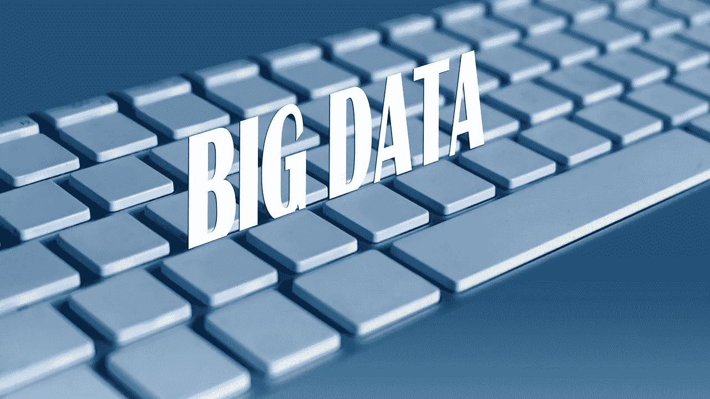
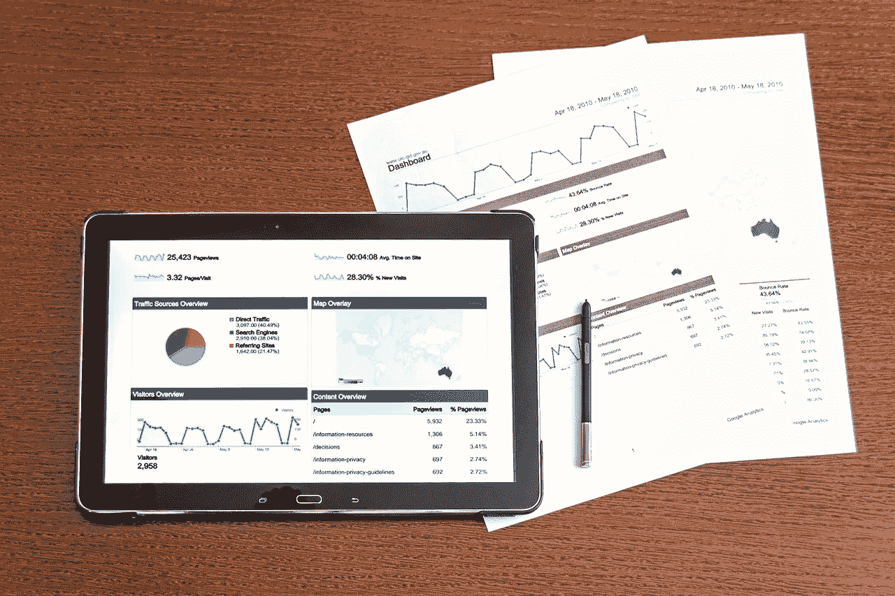

# 数据可以支付基本收入吗？

> 原文：<https://medium.datadriveninvestor.com/can-data-pay-for-basic-income-ab57864029e8?source=collection_archive---------6----------------------->

是时候问一问，由于硅谷产生的巨额利润，数据能支付基本收入吗？

值得注意的是，一些政治家正在讨论“数据红利”其中大数据和大技术赚的一些钱回到普通公民手中。事实上，加州州长加文·纽瑟姆(D-San Francisco)是提议数据红利的人之一。

此外，反叛的民主党总统候选人杨安泽提议为所有美国人提供每月 1000 美元的“T2”自由红利。详细地说，自由红利是一种改进的数据红利。

# **数据红利能支付基本收入吗？**

解释一下，数据红利一词是由大数据税收支付的基本收入的委婉说法。

此外,“股息”这个词听起来比“基本收入”这个词更美国化，更不社会主义化。例如，股息听起来像是人们挣来的，而不是施舍。

此外，人们更有可能支持不会消失在被称为官僚主义的黑洞中的新税。解释一下，大多数公众对税收的愤怒来自于人们看不到任何好处的征税。

普通美国人正确地认识到，他们将再也看不到大部分资金进入联邦国库。值得注意的是，五角大楼将一定比例的联邦税收用于可疑的战争和国防开支。

 [## 另一场精心策划的全球经济危机正在逼近？如果我们的数据经济可以帮助它，就不会了-数据…

### 我们的 DApp 的开发，称为 DECENTR，目前正与我们的 R&D 同步进行，作为我们即将到来的…

www.datadriveninvestor.com](https://www.datadriveninvestor.com/2019/03/06/another-engineered-global-economic-crisis-looming-not-if-our-data-economy-can-help-it/) 

# **什么是数据红利？**

阿拉斯加永久基金体现了数据红利背后的理念。

具体来说，阿拉斯加州收取石油和矿产特许权使用费，并将其存入永久基金。然后每年一次，永久基金向阿拉斯加的每个居民支付现金红利。

类似地，杨、纽森和我本人等基本收入倡导者希望在全国范围内建立类似的安排，让所有美国人分享大数据和大技术的利润。特别是，倡导者认为数据红利可以纠正美国日益增长的收入不平等。

具体来说，数据红利可以将硅谷的现金分配给没有分享美国繁荣的群体。例如，非裔美国人、农村白人、工人阶级白人、千禧一代、教育程度较低的人和工人家庭。

此外，脸书、谷歌和亚马逊等公司的大部分收入来自于从普通人身上收集的数据。然而，大多数人并没有分享到利润。因此有了数据红利这个术语。

数据红利的一个显而易见的好处可能是防止收入不平等带来的社会和政治动荡。值得注意的是，占领抗议、特朗普选举和特朗普就职典礼上的骚乱都被归咎于收入不平等。

# **大数据可以支付基本收入吗？**

本质上，数据红利将“数据是新的石油”或 21 世纪的石油这一理论引向了它的逻辑结论。

详细来说，*《经济学人》的*编辑[在 2017 年 5 月将](https://www.economist.com/leaders/2017/05/06/the-worlds-most-valuable-resource-is-no-longer-oil-but-data)数据标注为“世界上最有价值的资源”。澄清一下，《经济学人》的编辑认为数据是一种有利可图的商品，因为它能产生大量收入。此外，编辑们认为数据驱动 21 世纪的经济，就像石油驱动 20 世纪的经济一样。

重要的是，基于数据的公司现在赚了很多钱。比如谷歌；或 **Alphabet(纳斯达克股票代码:GOOG)** ，2018 年第四季度的毛利为 213.58 亿美元。

加上 **Alphabet(纳斯达克代码:GOOGL)** 报告 2018 年的年度毛利为 772.70 亿美元。此外，Alphabet 的毛利在 2018 年第四季度增长了 18.29%，全年增长了 18.38%， *Macrotrends* [估计](https://www.macrotrends.net/stocks/charts/GOOG/alphabet/gross-profit)。解释一下，Alphabet 通过广告从其搜索引擎中获取数据来赚钱。

与此同时，**脸书(纳斯达克代码:FB)** 报告称，2018 年第四季度毛利润为 141.18 亿美元。此外，Stockrow 估计脸书 2018 年全年的毛利为 464.83 亿美元。比如，Alphabet 脸书公司利用数字广告通过数据赚钱。

此外，公司正在提议将包括无人驾驶汽车和流媒体在内的许多其他数据来源货币化。例如，**福特** [计划](https://marketmadhouse.com/will-ford-motor-f-make-money-from-self-driving-cars/)收集并出售自动驾驶汽车收集的数据。

# **没有大数据无法单独支付基本收入**

因此，大数据赚了很多钱，但远远不足以支付基本收入。具体来说，美国 3.272 亿居民每月 1，000 美元的基本收入每月将花费 32.72 亿美元，每年 3.9264 万亿美元。

因此，正如杨指出的那样，我们将需要许多其他税收来支付所有美国人的基本收入。例如，杨提议征收增值税，增加资本收益税和金融交易税来支付他的自由红利计划。

然而，如果我们将数据税与其他税收结合起来，它可以帮助支付基本收入计划。例如，更高的所得税、增值税或财产税。因此，数据红利并不是一些人认为的无限财富来源。

# **硅谷如何支付基本收入**

有趣的是，硅谷有几种支付基本收入的方式。大科技可以帮助支付基本收入的一些方式包括:

数据税。这将很难收集，因为数据很难量化，也很难货币化。此外，通常很难看出公司如何从数据中赚钱。

数据销售税。当有人为数据付费时，向每个人征收销售税。这样做的好处是简单。缺点是这种税很容易避免。

一个[数字广告税](https://marketmadhouse.com/tax-data-advertising-fund-basic-income/)。每当他们出售数字广告时就征收销售税。

数码产品税。对视频游戏、软件、加密货币、加密资产、保险单、应用程序、歌曲和流媒体视频等数字产品的销售征税。

数字增值税。具体来说，增值税是在产品生命周期的每个阶段征收的销售税。例如，制造商、批发商和零售商各自支付增值税。数字增值税的一个优势是，内容的创造者；像**迪斯尼**，像**网飞(纳斯达克:NFLX)** 这样的转售商支付税款。

# **为什么我们需要对公司现金征税**

对公司现金和收入征税是为基本收入融资的更好方法。重要的是，公司现金和税收将来自底特律、华尔街和硅谷。

征收公司税的一些方法包括:

公司所得税。解释一下，公司的收入经常超过收入。例如，**亚马逊(纳斯达克股票代码:AMZN)** 报告 2018 年第四季度收入为 723.83 亿美元，净收入为 37.86 亿美元。因此，亚马逊仅支付 37.86 亿美元的所得税，尽管它通过其钱柜运营了 733.83 亿美元。收入税允许政府对亚马逊的所有收入征税。

现金及等价物税。实质上是对大型科技公司存在银行的现金征税。例如，**甲骨文(NYSE: ORC)** 在 2019 年 2 月 28 日拥有 400.3 亿美元的现金和短期投资。与此同时，**苹果公司(纳斯达克股票代码:AAPL)** 在同一天拥有 864.27 亿美元的现金和等价物。

现金及等价物税的一大优势是，它还将从金融机构筹集大量资金。例如，**高盛(NYSE: GS)** 在 2018 年 12 月 31 日拥有 1385.47 亿美元的现金。

现金税的另一个好处可能是鼓励公司投资，而不是囤积现金，这可以刺激经济。例如，沃伦巴菲特的**伯克希尔哈撒韦公司(纽约证券交易所代码:BRK。b)**2018 年 12 月 31 日有 1118.7 亿美元。

毛利得税。这样做的好处是，它将从产生高利润的金融和科技公司那里收集资金。例如，**苹果公司(纳斯达克股票代码:AAPL)** 报告称，2018 年第四季度的毛利为 370.31 亿美元。

总之，由公司收入和利润产生的国家红利是一个好主意。这样的股息将会受到普通美国人的欢迎，正如杨安泽在筹资方面的成功所显示的。

# **基本收入和数据红利关乎美国的未来**

然而，政治家、大企业和官僚会反对国家红利。

解释一下，这些团体会担心他们从股息中赚的钱会更少，所以他们会反对。特别是，政客、公司和官僚将更难将税款转入他们的银行账户。

例如，我们可以将基本收入分配到银行账户或数字钱包，而无需社会服务官员的帮助。因此，社会服务官员有强烈的动机反对基本收入——这威胁到他们的工作。

因此，我预测由数据红利或公司红利资助的基本收入是美国的未来。然而，建立这种红利将需要一系列残酷的政治斗争。