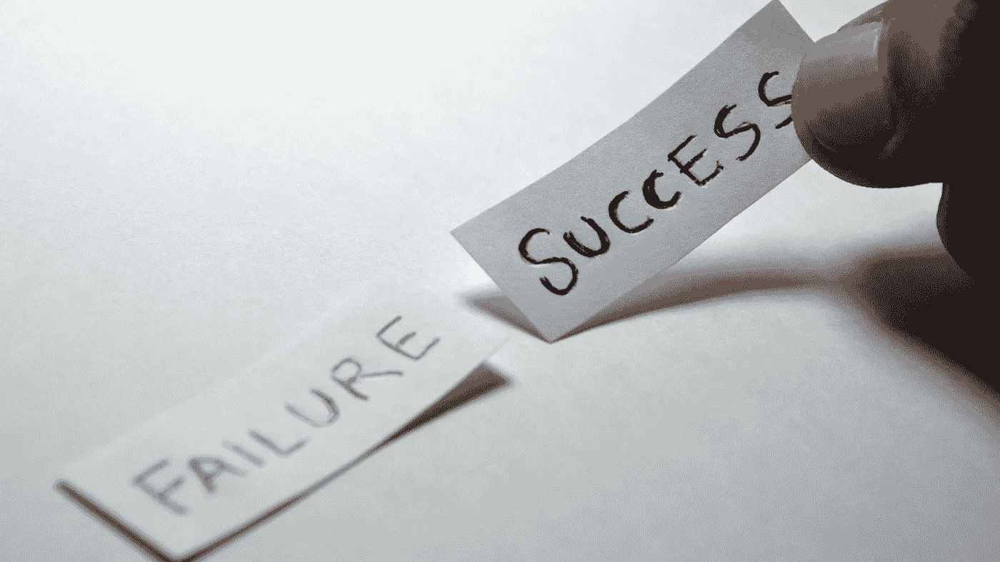

# 失败能导致成功吗？

> 原文：<https://medium.datadriveninvestor.com/can-failure-lead-to-success-b67cde0b8f48?source=collection_archive---------16----------------------->

说到失败，有很多思考过程。

有人说，“早失败，常失败”。

另一个人说，“走最短的成功之路，不要无谓地失败”。

还有一些人，比如领导力专家约翰·C·麦斯威尔说我们应该学会向前失败。他的意思是，既然失败是不可避免的，重要的是你如何处理它。无论我们付出多少努力去避免失败，我们都会失败，所以我们需要与失败建立更好的关系。

本质上，如果我们从失败中吸取教训，并让它照亮前进的道路，失败就不会成为挫折。

# 如何看待失败

看待失败的正确方式是什么？

你是否应该在没人注意的时候早早失败并经常失败，这样你就可以从经验中学习并提高？

你应该尝试绘制一条不包含失败的成功之路吗？

你应该向前失败并与失败建立一种不同的关系吗？

我不认为这是一种错误的思考方式。但是根据我的经验，不失败是不可能成功的。

# 日本之旅

2017 年 11 月，我去日本度假两周。这是一次不可思议的旅行。

我上次去日本是在 14 年前的 2003 年。那段时间我经历了一点失败。

我在日本长大，所以我的日语还算不错。虽然我在阅读、写作和理解他人的话语方面没有任何困难，但我却很难表达和交流自己的想法。我经常会结结巴巴地说不出话来，迷失在自己的头脑中。

作为一个多年来不断完善沟通技巧的人，很难回忆起那段经历。我意识到我不想再犯同样的错误。我想确保我能用日语像用英语一样清晰、雄辩地交流。

于是，2017 年，知道自己要回日本，决定早点开始准备。

# 花时间准备

我的准备过程很简单。我在休息时间花了很多时间看日本电视。这帮助我了解了当地人是如何表达自己和处理问题的。正如我所观察到的，关于如何表达自己的想法开始形成。

我也意识到我可能在 2003 年把事情过于复杂化了。我决定想办法简化我的演讲。

在加拿大完成学业的挑战之一是，我从未体验过在日本工作的感觉。因此，我从未学习过日语中的职称、与具体工作和行业相关的行话以及其他与工作相关的行话。

那么，我做了什么？我事先尽可能多地查找与我的职业相关的词汇。如果我能向某人解释我的工作——相信我，用英语解释已经够难了，更不用说日语了——那么相比之下，对话的所有其他方面都将变得轻而易举。

# 成功源于设计

那么，根据我刚才告诉你的，你认为我上次在日本过得怎么样？

令我高兴的是，我的朋友们惊讶于我仍然能流利地说他们的语言。自然，这不是偶然发生的，而是有意为之。

我的一个新朋友甚至评论说，当他和我说话时，他感觉像是在和一个当地人说话。虽然他从来不知道我还是个孩子，但这仍然是最高的赞美。

公平地说，尽管我外表看起来像加拿大人，但我内心还是很像日本人。

# 失败可以导致成功

我为什么要和你分享这个故事？因为我意识到这说明了失败的重要性。

我意识到——至少对我来说——失败*确实会导致成功。*

如果你和我在一起的时间够长，你可能听过我说类似这样的话，“我在前面尽可能多地犯错误，所以当我需要第二次或第三次做同样的任务时，我会精通*什么不该做*”。

当我反思我的经历时，这被证明是真的。我认为问题是我们中的许多人只是不想犯错误。我们担心。我们关心谁在看着我们，以及当我们跌倒时他们会怎么想。

我遇到过很多情况，我本可以担心人们会怎么想。有一次，我在帮助筹备一个音乐活动，当我搞砸了的时候，一个主持人甚至对我说，“这难道不是你应该做的事情吗？”

绝对应该是这样。但在那一刻，我意识到了一些关于我的过程。我认识到，以各种可能的方式搞砸是我处理失败的方式，为成功铺平了道路。如果我一开始就犯了所有的错误，我就不需要再犯了。我会为下一次执行同样的任务做好准备。

# 结论

不管是好是坏，失败是我们无法避免的。如果你能找到一条不涉及失败的成功之路，那就去做吧！但我觉得那是一厢情愿。我想一路上你会遇到挑战。我认为你会做出*一些*错误的决定。

然而，我确实相信，重要的是你如何对待失败。关键是你如何处理和思考它，这才是最重要的。如果你不愿意失败，那么你可能没有冒足够的风险。你需要抓住更大的机会来享受你渴望的成功。

不要因为你必须失败而失败——失败是为了从经验中学习。失败，这样你就可以改正。

你正在用你所知道的和你现在所拥有的尽你所能。做得更好的唯一方法是意识到你可以做得更好。这包括打破对失败的恐惧。