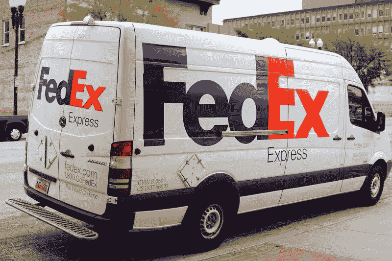
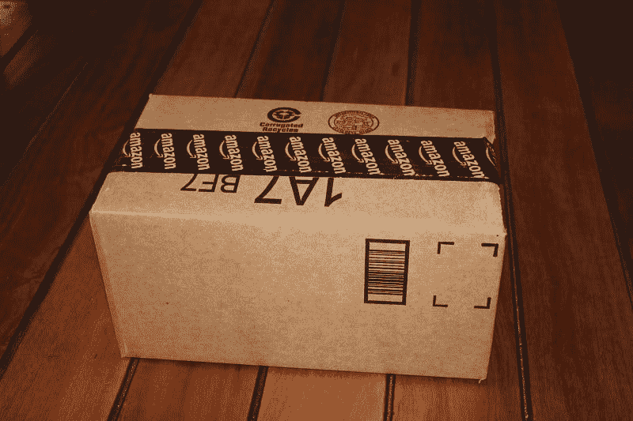

# 没有亚马逊，联邦快递还能生存吗？—市场疯人院

> 原文：<https://medium.datadriveninvestor.com/can-fedex-survive-without-amazon-market-mad-house-6533e65a2b09?source=collection_archive---------8----------------------->

投资者会问，如果没有亚马逊，联邦快递能否生存下去，因为这家航运巨头正在切断与万物商店的联系。特别是，**联邦快递(纽约证券交易所代码:FDX)** 将不会续签为**亚马逊(纳斯达克代码:AMZN)** 提供快递运输服务的协议。

相反，联邦快递将专注于向亚马逊的竞争对手提供服务，如**沃尔玛(纽约证券交易所:WMT)** ，*《纽约时报》* [报道](https://www.nytimes.com/2019/06/07/business/fedex-amazon-express-delivery.html)。《泰晤士报》推测，联邦快递的高管们不再希望与一个日益增长的竞争对手保持密切关系。

 [## 2019 年需要关注的 20 个数字营销趋势和技术——数据驱动的投资者

### Faisal 在加拿大工作，拥有金融/经济和计算机方面的背景。他一直积极从事外汇交易…

www.datadriveninvestor.com](https://www.datadriveninvestor.com/2019/02/04/20-digital-marketing-trends-techniques-to-watch-out-for-in-2019/) 

# 亚马逊是联邦快递最危险的竞争对手

因此，亚马逊正在通过租赁 15 架波音 737-800 货机来扩大其空运服务，*TechCrunch*报道。此外，亚马逊将在 2019 年开设几个新的航空货运设施。此外，亚马逊计划在 2021 年在辛辛那提/北肯塔基国际机场开设其主要的航空枢纽。

杰夫·贝索斯希望这个航空枢纽成为全球亚马逊航空网络的中心。贝佐斯希望航空网络能够加快亚马逊的发货速度，尤其是对 Prime 会员而言。

因此，联邦快递做出了明智的决定，不再帮助一个危险的竞争对手增加资源。然而，联邦快递切断与美国电子商务最大玩家的联系是在冒很大的风险。

# 没有亚马逊，联邦快递还能生存吗？

新的估计显示，联邦快递的行动可能比大多数人意识到的更聪明。Ratuken Intelligence 估计亚马逊在美国电子商务市场的份额正在下降，*互联网零售商* [声称](https://www.digitalcommerce360.com/2019/02/27/amazon-grabs-a-third-of-us-ecommerce-sales-in-2018/)。

与此同时，EMarketer Inc .将其对亚马逊 2019 年美国电子商务销售额份额的估计降低了 9.3%，*彭博* [报道](https://www.bloomberg.com/news/articles/2019-06-13/emarketer-cuts-estimate-of-amazon-s-u-s-online-market-share)。具体来说，Emarketer 此前预测亚马逊在美国电子商务销售额中的比例为 47%。然而，EMarkerters 在 2019 年 6 月 13 日将他们的预测下调至 37.7%。

如果 EMarketer 和 Ratuken 是正确的，联邦快递仍将服务于美国电子商务市场的 66.3%至 62.3%。此外，EMarketer 的数据表明，亚马逊正在失去市场份额。

# 联邦快递赚钱了吗？

财务数据显示了联邦快递切断与亚马逊关系的原因。联邦快递的收入和利润都在下降，利润却在减少。

例如，联邦快递的收入从 2018 年 11 月 30 日的 178.24 亿美元降至 2019 年 2 月 28 日的 171.0 亿美元。与此同时，联邦快递的收入增长率从 2018 年 2 月 28 日的 10.2%降至一年后的 2.93%。

此外，联邦快递的毛利从 2018 年 2 月 28 日的 101.76 亿美元暴跌至 2019 年 2 月 28 日的 44.07 亿美元。加上联邦快递的净收入从 2018 年 2 月的 20.74 亿美元下降到一年后的 7.39 亿美元。然而，联邦快递的营业收入从 2018 年 2 月的 8.58 亿美元增长到 2019 年 2 月的 10.73 亿美元。

这些数字显示，亚马逊不断增长的航运业务可能会削减联邦快递的利润。

# 联邦快递正在产生现金吗？

然而，联邦快递的一些数字正在改善。例如，运营现金流从 2018 年 2 月的-3.36 亿美元增加到一年后的 11.44 亿美元。

此外，自由现金流在一年内从-17.09 亿美元增加到 2100 万美元。然而，融资现金流从 2018 年 2 月的 16.95 亿美元降至 2019 年 2 月的 6950 亿美元。

重要的是，尽管收入和收益下降，联邦快递的现金资产水平仍然相当稳定。例如，联邦快递在 2018 年 2 月 28 日有 27.89 亿美元的现金和短期投资，一年后有 28.72 亿美元。

因此，我的结论是，联邦快递是一个不稳定行业中非常稳定的公司。但这是价值投资还是好的分红股票呢？

# 联邦快递是价值投资吗？

我认为市场先生高估了联邦快递，但它是一只很好的分红股票。值得注意的是，我认为 2019 年 6 月 24 日 FDX 162.095 美元的价格太高了。

然而，联邦快递将于 2019 年 7 月 8 日支付可观的 65₵股息。引人注目的是，联邦快递的股息从 2018 年 4 月 2 日的 50₵增长到 2018 年 7 月 9 日的 65₵。因此，联邦快递今年没有股息增长。

因此，联邦快递九年的股息增长可能要结束了。然而，联邦快递仍然是一只优秀的分红股票。因此，Dividend.com[计算出](https://marketmadhouse.com/can-fedex-survive-without-amazon/dividend.com/dividend-stocks/services/air-delivery-and-freight-services/fdx-fedex/)联邦快递在 2019 年 6 月 24 日交付了 16%的股息率，年化支付额为 2.60 美元，支付率为 15%。

# 联邦快递面临的诸多威胁

然而，我认为联邦快递不是一项价值投资，因为它目前面临的所有竞争。超越 [**UPS**](https://marketmadhouse.com/the-battle-of-the-delivery-giants-ups-vs-fedex/) **(纽约证券交易所代码:UPS)** 联邦快递面临着许多跟随亚马逊脚步发展自己的运输和递送能力的零售商。

沃尔玛；例如，谷歌正在试验[无限杂货递送](https://www.theverge.com/2019/6/16/18680993/walmart-delivery-unlimited-grocery-subscription)、[门房服务](https://www.vox.com/2018/5/18/17368358/walmart-jetblack-code-eight-personal-shopping-concierge-jenny-fleiss)和[自动驾驶送货卡车](https://www.latimes.com/business/la-fi-tn-walmart-self-driving-delivery-vans-20190619-story.html)。与此同时， **Target(纽约证券交易所:TGT)** 拥有送货应用 [Shipt](https://www.shipt.com/target/?&utm_source=google&utm_term=shipt%20target&utm_campaign=post_launch-search-na-conquest-na-national&utm_medium=cpc&mkwid=sXas8CYgn-dc_pcrid_340255420444_pkw_shipt%20target_pmt_e_slid_&pgrid=75278480544&ptaid=kwd-467137934599&gc) ，Instacart 正在加拿大试验[办公用品](https://mobilesyrup.com/2019/04/05/staples-canada-instacart-same-day-office-supplies-delivery/)和[药物运送](https://www.supermarketnews.com/online-retail/instacart-grocery-delivery-kicks-shoppers-drug-mart)。

鉴于这些发展，联邦快递可能无法从亚马逊竞争对手的爆炸式增长中获利。Instacart 尤其是威胁到联邦快递的低成本承包商队伍，他们自己提供车辆。

# 足球妈妈会帮助送货应用摧毁联邦快递吗？

奇怪的是，Instacart、Postmates、 **GrubHub (NYSE: GRUB)** 、Shipt、DoorDash 在联邦快递、UPS、亚马逊的战争中的秘密武器是足球妈妈。国家公共电台(NPR) [报道](https://www.npr.org/2019/05/25/722811953/why-suburban-moms-are-delivering-your-groceries)超过 50%的食品和杂货递送应用程序承包商是四五十岁的郊区女性。

NPR 解释说，送货应用程序以灵活的时间表吸引了妈妈们，这些时间表不需要用他们的车拖着陌生男人到处跑。此外，这些妇女中的许多人不需要福利，因为她们丈夫的健康保险涵盖了她们。

然而，也有一些限制，包括一些妇女可以提供的物品重量。此外，NPR 声称，一些女性拒绝递送商业订单，因为订单大，而且小费少。

因此，联邦快递在今天的递送格局中仍有一席之地。我认为联邦快递可以交付长途和商业订单，而 Instacart 等应用程序可以处理杂货和本地交付订单。例如，给你从当地的 Nordstrom 或 Walmart 订购的衣服或者你母亲的处方送货。

# 联邦快递是一个好的投资吗？

在目前情况下，联邦快递是一只“市场先生”定价过高的好股票，但联邦快递拥有一个不断增长的市场。

Statista [预测](https://www.statista.com/statistics/272391/us-retail-e-commerce-sales-forecast/)美国电子商务销售额将从 2018 年的 5045.82 亿美元增长到 2023 年的 7353.58 亿美元。因此，美国电子商务收入在五年内可能增长 2307.76 亿美元。然而，Ratuken Intelligence 和 Emarketer 的数据显示，亚马逊在美国在线零售中的份额正在萎缩。

**联邦快递(纽约证券交易所:FDX)** 是价值投资者在这种情况下可以观察但不要购买的公司。**联邦快递(纽约证券交易所:FDX)** 是一家现金充裕的公司，股息丰厚，在一个不断增长的市场中赚钱，但市场先生现在对它的定价过高。数据显示，没有亚马逊，联邦快递也能茁壮成长。

*原载于 2019 年 6 月 24 日*[*https://marketmadhouse.com*](https://marketmadhouse.com/can-fedex-survive-without-amazon/)*。*

*免责声明:文章所表达的观点和看法仅属于作者，不一定反映 DDI 的立场。这篇文章无意成为投资建议。*