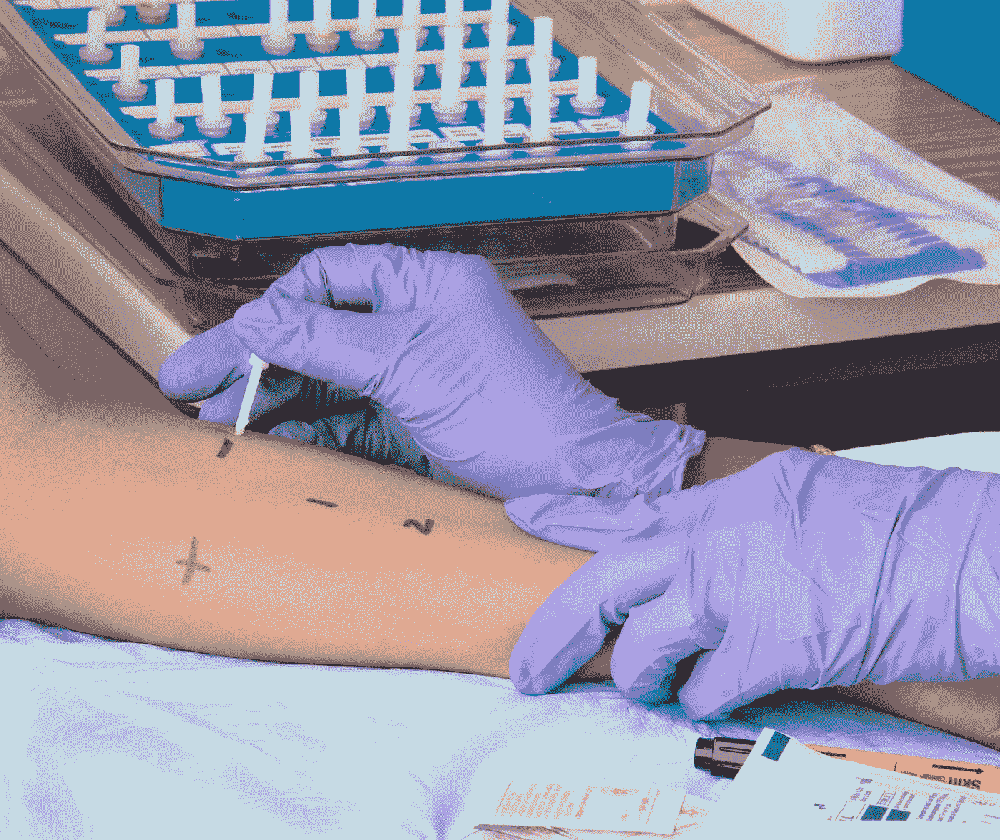

# 健康测试可以消费化吗？

> 原文：<https://medium.datadriveninvestor.com/can-health-testing-be-consumerized-8da3b446e857?source=collection_archive---------11----------------------->

人们口袋和家中的强大设备。

负担越来越重的医疗保健系统。

患者希望控制自己的健康，包括访问他们的数据。

早期检测和持续监测，以降低成本和改善结果。

这些主要力量正在迅速改变健康测试的面貌。事实上，问题不在于健康测试能否消费化，而在于何时消费化。这里有三个主要因素，创业分散健康测试是，并需要继续解决。

1)产品——如何获得采用？

到目前为止，大多数公司，从基因测序的 23AndMe 到微生物组分析的 uBiome，都选择直接面向消费者。当没有报销代码并且上市时间很长时，这通常是有意义的。

但是，在消费者的基础上建立一个健康企业也极具挑战性。自我保险的雇主是数字健康领域的典型黑客，但尽管许多雇主支付的产品涉及心脏、糖尿病、肥胖和一般健康，但不要低估采用的障碍。对员工态度的任何调查都会发现，大多数人勉强同意雇主为这类项目付费，因为他们一直担心自己也会接触到这些数据。

为了达到真正的规模，我们必须接受 FDA 的监管，以及供应商和付款人之间漫长的销售周期。为此，初创公司需要有足够的时间和资金来收集临床证据。好消息是，一旦你克服了障碍，你也很难被取代。

**2)商业模式——如何获得经常性收入？**

原则上，测试很自然地适合于一个循环模型。十年前，AgaMatrix 率先通过 iPhone 进行血液检测，并围绕补充葡萄糖试纸建立了一项业务。Arivale 的产品包括三次教练电话的全面基因分析，更多教练和进一步身体分析的多种选择，以及减肥和心脏健康测试计划——其中大多数是每月订阅。

显而易见的挑战是人类没有逻辑。如果我们的测试显示出良好的结果，我们中的一些人就会忽略做进一步的测试。如果我们的测试显示出不好的结果，我们中的一些人会简单地停止测试，因为我们想忽略这个坏消息。这和很多人一开始就不想测试是一个类似的动机。如果测试仅仅是关于知识，即不会导致行动，那么肯定很少有人会报名参加。

这一切都意味着，如果你根据态度来划分市场，重复的商业模式实际上是很难的。创业者要注意:市场上自上而下的数字具有欺骗性的吸引力，他们将不得不对抗的是高 CAC、低 LTV 和高流失率。

**3)平台——如何超越单一测试？**

tricorder 这个词意味着一种在你手掌上的设备，它可以对你进行全面的测试(在《星际迷航》中甚至是治疗)。尽管最终有了 X 大奖的得主，这仍然是一个难以捉摸的目标。同时测试多种条件无疑是圣杯；我们都想要一个省力、快速、全面的测试。想想 Theranos，如果它真的是合法的，而不是一个骗局。

血液是一个明显的基质，但它确实涉及到针。测量多种状况的侵入性较小的方法是我们的身体自然产生和释放的物质。Healthy.io、Scanaflo、Scanwell 目前都在关注尿液，Toi labs 有一个智能马桶，并且有很多人在利用汗液测量糖尿病。

所有这些面临的挑战是获得足够的样本量。如今，实验室将收集足够的样本进行多次清洁和测试，以最大限度地减少误差。确保微量样品的准确度和精密度仍然是一个技术障碍。

*这篇文章的灵感来自于与* [*阿列克斯·斯维德罗*](https://www.linkedin.com/in/aleks-swerdlow/) *的一次对话。这些都是专注于实践见解的有目的的短文(我称之为 GL；dr —良好的长度；确实读过)。如果它们能让人们对某个话题产生足够的兴趣，从而进行更深入的探索，我会感到非常兴奋。我在三星的创新部门* [*NEXT*](http://samsungnext.com/) *工作，专注于深度科技领域软件和服务的早期风险投资，这里表达的所有观点都是我自己的。*