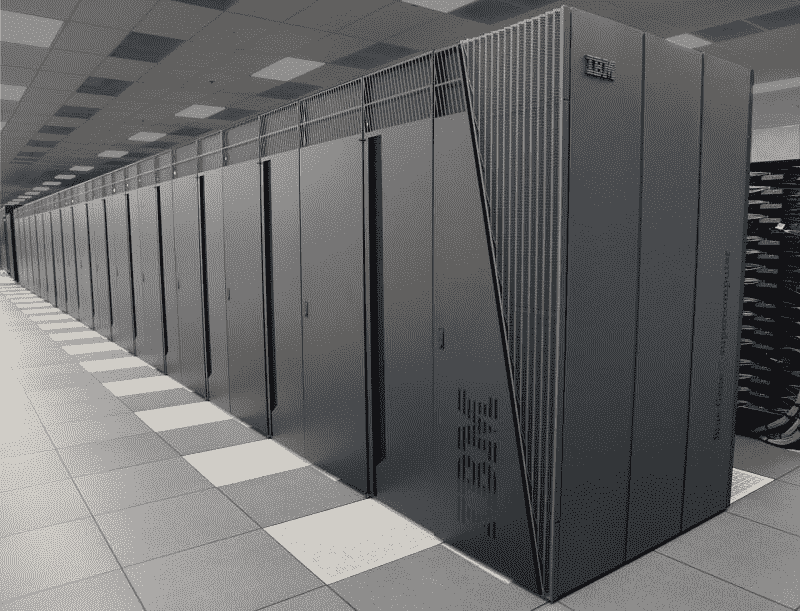
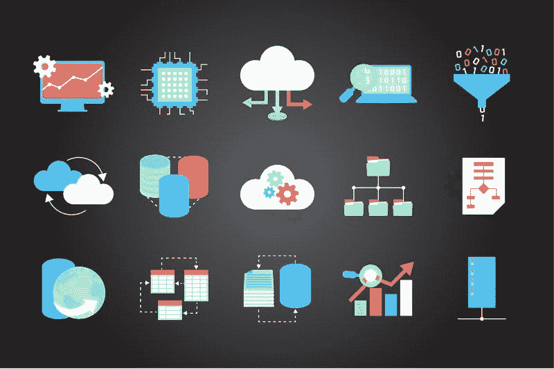
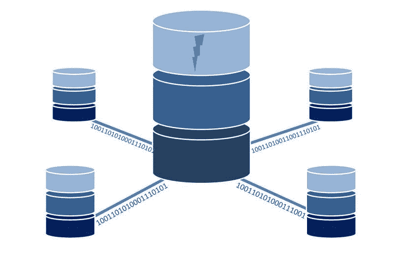
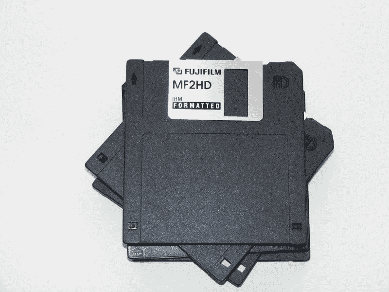

# IBM 能活下来吗？—市场疯人院

> 原文：<https://medium.datadriveninvestor.com/can-ibm-survive-market-mad-house-21dbe197c3bc?source=collection_archive---------5----------------------->

IBM(纽约证券交易所代码:IBM) 是一家应该比其报告赚得更多的公司。

为了解释，IBM 提供了一些令人印象深刻的技术。然而，截至 2019 年 9 月 30 日，该公司报告的季度净收入为 16.72 亿美元，季度营业收入为 19.56 亿美元。然而，IBM 在 2019 年 9 月 30 日报告了 83.36 亿美元的季度利润。

尽管亏损，IBM 仍不断推出惊人的人工技术。例如，IBM 声称其 GRAF(全球高分辨率大气预报系统)可以提前 12 小时预测地球上任何地方的天气。

 [## 值得购买的 4 大人工智能股票及其原因|数据驱动型投资者

### 人工智能(AI)在 2019 年继续进入大众意识。通过应用程序…

www.datadriveninvestor.com](https://www.datadriveninvestor.com/2019/03/06/top-4-artificial-intelligence-stocks-to-buy-and-why/) 

路透社[声称](https://www.reuters.com/article/us-ibm-weather/ibm-to-launch-faster-weather-forecast-system-to-cover-the-globe-idUSKBN1XO1ZG),[IBM GRAF](https://www.ibm.com/weather/industries/cross-industry/graf)可以每小时更新天气预报，并预测三平方公里区域的天气。相比之下，现有的预报系统覆盖 10 到 15 平方公里的区域，每 6 到 12 个小时预报一次天气。

# IBM 能从天气、GPU、超级计算机上赚钱吗？

IBM 可以通过全球大气测绘、销售更好的天气数据和提供更好的预报从 GRAF 中赚钱。此外，IBM 可以与 GRAF 一起建立一个全球范围的天气数据开源市场。

GRAF 运行在 IBM 基于 POWER9 的超级计算机上，该计算机针对图形处理单元(GPU)进行了优化。有趣的是，POWER9 最出名的是它在游戏中的应用。

IBM 可以用 POWER9 赚钱，因为这台超级计算机可以绘制复杂的系统和过程。例如，POWER9 可以绘制市场、能源生产系统、贸易模式、云、选举、广告活动、流媒体视频观众、大型多人在线游戏(MMOGs)、社交媒体网络、交通系统、供应链电子商务生态系统和军事活动。

# IBM 尝试开源 Watson

IBM 试图通过让每个人都可以使用其标志性的沃森人工智能(AI)来适应云和开源经济。

例如，IBM 正在通过其 [Watson Anywhere](https://www.ibm.com/blogs/think/2019/02/enabling-watson-anywhere/) 计划使 Watson 可以通过云访问。Watson Anywhere 允许您将 Watson AI 添加到您的平台中。Watson Anywhere 作为其他平台和 IBM 的 AI 平台之间的接口。

# IBM 正在将人工智能添加到应用中

重要的是，IBM 正在试验人工智能驱动的应用程序，它称之为微服务，硅角度[报道](https://siliconangle.com/2019/10/21/ibm-intros-new-capabilities-watson-ai/)。IBM 的人工智能应用包括沃森助手和一个新的语音助手。

理论上，沃森助手可以充当虚拟客户服务助理或数字生态系统的向导。例如，沃森助手可以教你如何使用交易平台，或者告诉你你需要哪种保险。

与此同时，Watson Discovery 是一个人工智能搜索引擎，它使用自然语言和机器学习与人类对话。理论上，Watson Discovery 可以对大型数据库进行语音搜索，如电子商务平台的库存。

因此，沃森发现可以让没有计算机技能的普通人获得大数据。例如，一位首席执行官可以向 Watson Discovery 索要她公司的一家子公司的详细销售报告。

未来，这位首席执行官可以在乘地铁上班时通过手机使用 Watson Discovery 来分析公司的财务状况。与此同时，你可以使用 Watson Discovery 来管理你的投资组合或管理你的 Spotify 播放列表。

# IBM 能从人工智能驱动的应用程序中赚钱吗？

所以 IBM 在尝试把 Watson 包装成 app。因此，很快每个人都可以通过苹果应用商店、GitHub 或 GooglePlay 使用 Watson。人工智能驱动的应用的利润可能是巨大的。

普华永道[估计，到 2030 年，人工智能可以为全球经济增加 15.7 万亿美元。此外，到 2030 年，人工智能可以将各国的国内生产总值(GDP)提高 27%。](https://www.pwc.com/gx/en/issues/data-and-analytics/publications/artificial-intelligence-study.html)

IBM 可以通过建立人工智能运行的基础设施，从人工智能的爆炸中获利。此外，IBM 可以通过销售沃森品牌下的人工智能应用程序来赚钱。

# IBM 是靠 AI 赚钱的吗？

**IBM(纽约证券交易所代码:IBM)** 正在从人工智能中赚钱。IBM 报告称，截至 2019 年 9 月 30 日，季度运营现金流为 36.19 亿美元，季度自由现金流为 29.37 亿美元。

这些数字高于 2019 年 6 月 30 日的 29.41 亿美元和 25.11 亿美元。因此，IBM 的业务仍然产生大量现金。

此外，IBM 在 2019 年 9 月 30 日拥有 109.58 亿美元的现金和短期投资。引人注目的是，这一数字低于 2019 年 6 月 30 日的 444.08 亿美元现金和短期投资。

# IBM 的业务正在萎缩

因此，IBM 仍然是一家现金充裕的公司，但它是一家受收入缩水困扰的现金充裕的公司。IBM 的季度收入从 2019 年 6 月 30 日的 191.61 亿美元降至 2019 年 9 月 30 日的 180.28 亿美元。

此外，Stockrow [报告称](https://stockrow.com/IBM/financials/income/quarterly) IBM 的收入增长率已经连续四个季度下降。详细来看，IBM 在 2018 年 9 月 30 日营收负增长-2.07%，2019 年 12 月 31 日营收负增长-3.46%，2019 年 3 月 31 日营收负增长-4.67%%，2019 年 6 月 30 日营收负增长-4.21%，2019 年 9 月 30 日营收负增长-3.88%。

因此，随着 IBM 的一些技术能力的提高，其业务正在萎缩。

# IBM 在云中失败了

我认为 IBM 的收入正在萎缩，因为该公司错过了云热潮。

例如，Gartner [估计](https://www.gartner.com/en/newsroom/press-releases/2019-07-29-gartner-says-worldwide-iaas-public-cloud-services-market-grew-31point3-percent-in-2018)IBM 2018 年在全球云市场的份额为 1.8%。相比之下，云领导者**亚马逊(NASDAQ: AMZN)** 网络服务(AWS)2018 年全球云市场份额为 47.8%。

然而，IBM 的全球云市场份额在 2017 年至 2018 年间增长了 24.7%。Gartner 估计，2018 年 IBM 的全球云收入为 5.77 亿美元。相比之下，Gartner 估计亚马逊 2018 年的全球云收入为 154.95 亿美元。

因此，IBM 很难打入云市场。这可能是致命的，因为我认为云是大数据和计算的未来。然而，我认为云上的人工智能可能是一笔大生意。

例如，人们将需要访问和管理他们放在云上的所有数据。沃森发现可以管理这些数据，并让普通人也能访问这些数据。

总体而言，Gartner 估计，基础设施即服务(IaaS)的全球市场在 2018 年增长了 31.3%，从 2017 年的 247 亿美元增长到 324 亿美元。因此，IBM 在云计算领域有很大的发展和赚钱空间。

# IBM 是价值投资吗？

我认为 IBM 是一个价值投资，因为它的 AI 和 IaaS 能力。特别是，我认为 IBM 可以通过销售人工智能应用程序赚很多钱。

此外，我认为 IBM 的红帽子公司可能值很多钱。值得注意的是，新闻稿[透露](https://www.redhat.com/en/about/press-releases/red-hat-reports-fourth-quarter-and-fiscal-year-2019-results)，红帽公司报告 2018 年第四季度收入为 8.79 亿美元。从 2017 年第四季度到 2018 年第四季度，这些收入增长了 14%。

Red Hat 通过提供开源的基于 Linux 的软件和应用程序从云计算中获利。IBM [在 2019 年 7 月以 340 亿美元收购了](https://www.redhat.com/en/about/press-releases/ibm-closes-landmark-acquisition-red-hat-34-billion-defines-open-hybrid-cloud-future) Red Hat。IBM 在 Red Hat 的目标是创建一个混合云，将 IBM 的人工智能和基础设施能力与 Red Hat 的 Linux 专业知识相结合。

然而，Linux 在全球操作系统市场上只是一个小角色。Statcounter [估计【2019 年 10 月，世界上只有 0.81%的设备运行 Linux。然而，NetMarketShare](https://gs.statcounter.com/os-market-share) [估计](https://www.netmarketshare.com/operating-system-market-share.aspx?options=%7B:%7B:%5B%7B:%7B:%5B%5D%7D%7D%5D%7D,:,:,:,:%7B:-1%7D,:,:,:,:,:%7D)在 2019 年 10 月，Linux 在操作系统市场的份额为 1.5%。

鉴于这些数字，我认为市场先生在 2019 年 11 月 21 日对 IBM 的定价过高，为 133.84 美元。IBM 是一家拥有一些伟大技术的好公司，但它的股价太高了。

# IBM 是好的分红股票吗？

反过来说，我认为 **IBM (NYSE: IBM)** 是一只很好的分红股票。例如，IBM 在 2019 年 8 月 8 日支付了 1.62 美元的季度股息。

此外，IBM 的股息在 2019 年由 5₵增长。为了澄清，IBM 于 2019 年 2 月 7 日支付了 1.57 美元的股息，并于 2019 年 5 月 9 日支付了 1.62 美元的股息。

总体而言，IBM 股东在 2019 年 11 月 21 日获得的股息收益率为 4.86%，年化为 6.48 美元，派息率为 50.65%。Dividends 报告称，IBM 的股息已经增长了 19 年。

归根结底，我认为 IBM 是一只安全边际较低的好股息股。安全边际很低，因为 IBM 的收入正在缩水。

相反，我认为 IBM 可以在未来几年赚钱和分红。然而，投资者需要小心 IBM，因为它在一个急剧变化的行业中运营。

*原载于 2019 年 11 月 21 日*[*https://marketmadhouse.com*](https://marketmadhouse.com/can-ibm-survive/)*。*