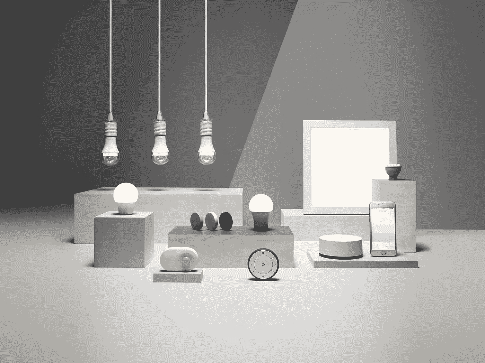
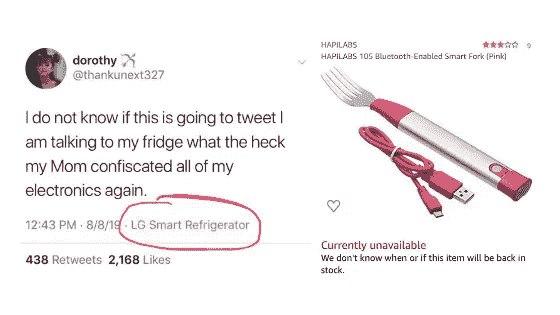
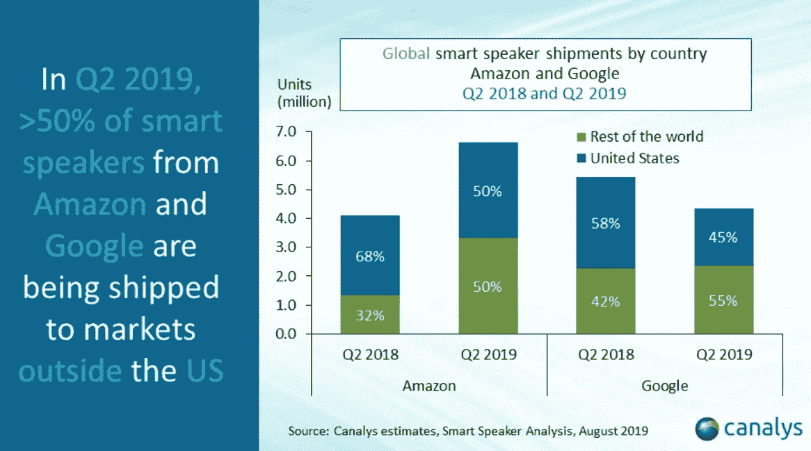
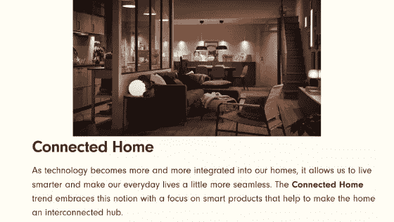
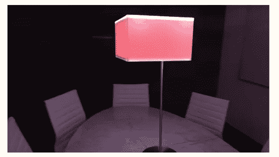
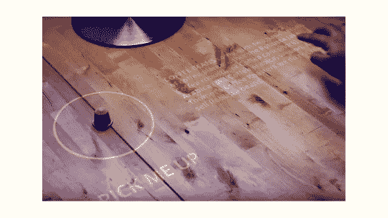
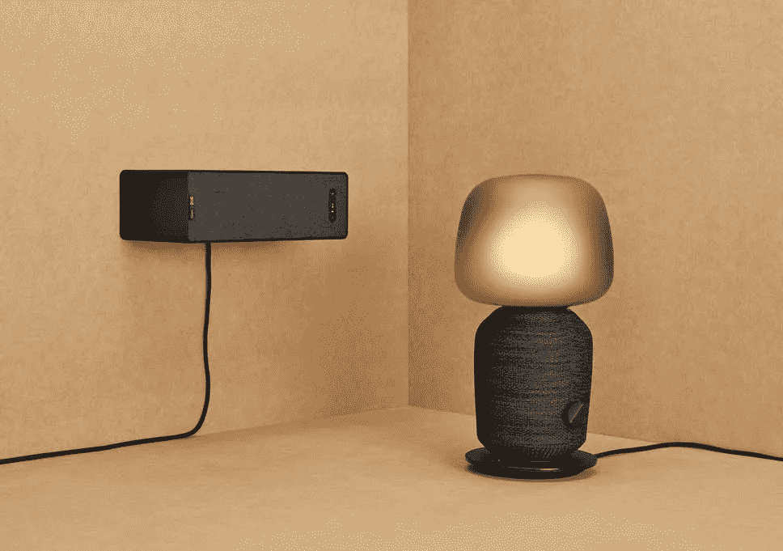
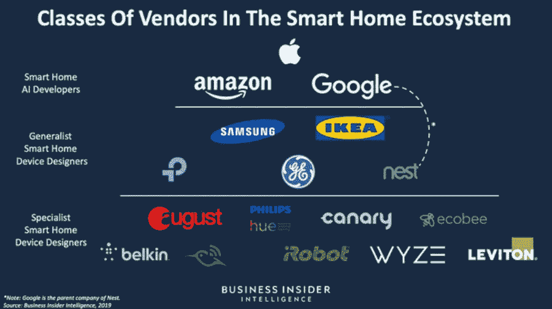
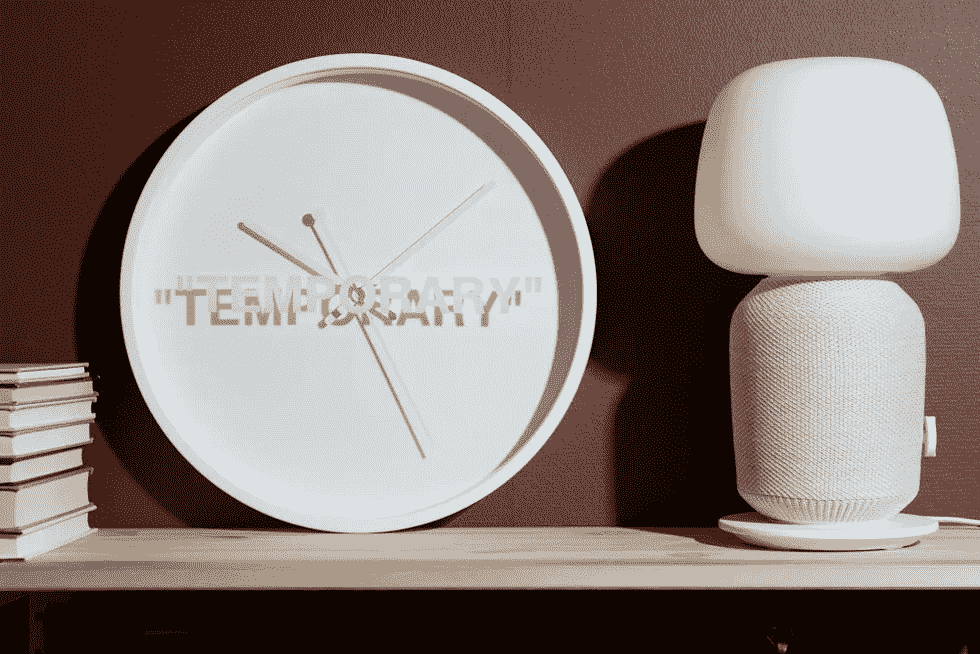

# 宜家能把智能家居推向主流吗？

> 原文：<https://medium.datadriveninvestor.com/can-ikea-deliver-the-smart-home-to-the-mainstream-f31c7bf1d29b?source=collection_archive---------2----------------------->

IKEA’s smart home range.

## 高科技的平板包装家具，来到你附近的仓库。

宜家成立了一个新的业务部门，专注于智能家居，名为 Home Smart。我原以为会有一个可爱的瑞典语名字，比如 Pipstark 或 Tekling，但你不可能拥有一切。

智能家居将与宜家照明和纺织品等其他业务单元并列。事实上，他们将其描述为“自儿童宜家以来，我们正在建立的最大的新业务。”那是在 1997 年。

 [## 2019 年即将改变世界的技术|数据驱动的投资者

### 很难想象一项技术会像去年的区块链一样受到如此多的关注，但是……

www.datadriveninvestor.com](https://www.datadriveninvestor.com/2019/01/17/the-technologies-poised-to-change-the-world-in-2019/) 

瑞典家具现象将希望其低廉的价格、时尚的审美和固有的客户群能够吸引主流追随者。

目前的产品包括智能灯和扬声器，可以通过语音或新的宜家应用程序进行控制。它还可以与亚马逊、谷歌和苹果数字助理配合使用。

宜家的新部门负责创造更具雄心的产品系列，以满足“物联网”的需求。

那么，宜家会是引领智能家居时代的公司吗？

**这个故事将涵盖:**

*   宜家的智能家居计划。
*   新产品的一些想法。(宜家，不客气。)
*   宜家如何创造竞争优势。
*   我们确定要让科技公司进入我们的家庭吗？

# 技术爱好者，集合

**宜家在 2017 年推出了一系列智能灯。当时的许多评论都包含“乏味”和“易碎”等形容词，但平易近人的价格吸引了大量观众。**

**销售额超过目标，宜家希望通过新的专门业务部门占领智能家居市场。声控百叶窗首当其冲，美国上市日期定在 2019 年 10 月，价格为 135 美元。**

迄今为止,“智能家居”的现实还没有达到其崇高的目标。

无缝、联网住所的概念与使用这些新设备的支离破碎和令人沮丧的体验不一致。

“物联网”已经变成了一个笑话，从那个当妈妈拿走她的手机时用智能冰箱发推特的女孩，到当你吃得太快时会振动的智能叉子。

叉子不是只会让你把食物弄得到处都是吗？我想你会用智能吸尘器来清理。

精彩的 [**狗屎互联网**](https://twitter.com/internetofshit) 推特账号整理了这些让我们困惑的怪物。他们的传记提炼了这个时代的情绪:“管它呢，放个芯片进去。”

然而，在每个好笑话的背后，都有一点真理。

据说，仅在美国，智能家居市场今年就价值 360 亿美元(Statista 数字)，到 2024 年，全球智能家居市场可能会增长到 1500 亿美元以上。

人们已经采用了一些智能家居技术；特别是亚马逊和谷歌，已经销售了数百万台人工智能扬声器。

然而，科技公司不建造房屋。有时，他们努力只是为了保持“智能家居”讨价还价的“智能”的一半。

家庭中有一些方便、省时的互联网连接设备使用案例。问题是，没有人以可理解的形式提供这些产品，这些产品回答的问题比它们提出的问题更多。

所以，走进宜家。

**在我们评估宜家在智能家居领域取得成功的潜力之前，有必要评估一下宜家目前的顾客群:**

*   2018 年，全球宜家商场的访问量达到 9.57 亿次。
*   每年印刷 2 亿份宜家《家居指南》。
*   每年有超过 20 亿人次访问 IKEA.com。
*   2018 年，宜家商场的销售额达到 430 亿美元。
*   该公司在 54 个国家拥有 208，000 名员工。

这家瑞典家具巨头当然有能力决定家居用品的趋势。事实上，宜家的 [**刚刚发布了**](https://www.housebeautiful.com/uk/decorate/a28830445/ikea-autumn-winter-trends/) 的秋冬预测趋势，猜猜怎么着？是的，联网住宅位于列表的显著位置。

宜家还拥有完美的迷宫般的环境，让我们相信他们的产品的优点。一个数字助理，可以帮助人们浏览宜家商场，而不必购买大量畅销书。

随着在印度和中国等市场的迅速扩张(在中国，宜家顾客 [**可以睡在床上**](https://www.inkstonenews.com/business/ikeas-china-head-says-you-can-nap-showroom/article/3024396) ，仅供参考)，宜家最有条件利用任何对智能家居设备的兴趣。

首先，宜家需要让顾客相信这些设备为他们的私人空间增加了价值。仅仅为了让我们能让百叶窗关上，就放弃个人数据真的值得吗？

任何胜利都可能是得不偿失的，因为宜家将进入一个复杂而残酷的竞争舞台。

我们来探索一下。

# 家是聪明的地方

**“互联设备购买决策是由解决简单问题驱动的，至少在今天是这样。整个平台和生态系统尚未引起消费者的共鸣。”**

**—麦肯锡**

宜家的承诺简单而诱人:来自城外大型陈列室的有品位的设计，合理的价格。

“智能家居”有一些显著的进入壁垒:虚高的价格、复杂的产品和碎片化的应用生态系统( [**麦肯锡报告**](https://www.mckinsey.com/spContent/connected_homes/index.html) )。

许多品牌努力占据技术公司和家居用品供应商之间的纽带。大多数人一开始是前者，然后笨拙地转向后者。

飞利浦创造了一些优秀的智能灯，但顾客没有理由用飞利浦产品来装饰家里的其他部分。

亚马逊和谷歌创造了有效的智能扬声器和软件开发工具包，但他们不从事设计家具的业务。尽管如此，我还是很想看看谷歌对中世纪扶手椅的看法。

宜家明智地进入智能家居市场，更多是出于信心，而非谨慎。

这些亚马逊回声和谷歌家园并不能取代宜家产品。通常，它们位于它们之上。

像智能灯和应用程序控制的调光开关这样的尝试性尝试让宜家在采取任何重大举措之前先测试一下市场。

新的智能家居业务部负责领导宜家所有其他部门的“数字化转型”。

因此，我们应该期待看到更大胆的宜家很快推出更多雄心勃勃的产品，超越经典电子产品的范畴。

鉴于宜家的优势和现代家居的弱点，这可能意味着电视机会增加装饰效果，而不是有损形象。

几年前，我看到了这款智能灯，我觉得这是宜家可能创造的东西。它看起来并不显眼，但它可以使用增强现实为周围的表面添加“智能”元素。

这就是《认识和解释咖啡》:

形容词“无缝”通常用于智能家居，表示持续连接的技术。

对宜家来说，这个词有一个更微妙的应用，因为它与技术融入生活环境有关。这款智能灯以及数以千计的类似产品创意正符合这一要求。

宜家还可以将其美学天赋应用于臭名昭著的丑陋空调设备，或任何其他功能长期以来胜过形式的家用电器。

目前，合作伙伴关系似乎有可能成为宜家技术战略的支点。

今年早些时候推出的 Sonos/IKEA 扬声器系列(价格非常合理，为 99 美元)让人们得以一窥智能家居的未来。

形式和功能之间的相互作用至关重要。宜家知道如何设计人们想要的家具；Sonos 制造受欢迎的扬声器。

因此，每个人都坚持自己最了解的东西。

目前，宜家在智能家居市场的定位是“设备设计师”，而非技术开发商。但是这种情况会持续多久呢？

# 宜家应用和竞争

新的宜家智能家居应用程序可以与亚马逊、苹果和谷歌数字助理配合使用。

顾客可以选择通过宜家应用程序或亚马逊 Echo 等智能扬声器控制宜家产品。

然而，举例来说，宜家即将推出的一些产品将使其与谷歌旗下的 Nest 展开直接竞争。

像 Nest 的恒温器控制这样的产品是谷歌监控和控制人们日常生活策略的一部分。这个数据对于销售广告来说是非常有价值的。

就他们而言，亚马逊旗下的智能门铃公司 Ring [**一直在与警方**](https://www.theguardian.com/technology/2019/aug/29/ring-amazon-police-partnership-social-media-neighbor) 合作。亚马逊回声录音甚至被 [**用作谋杀案中的证据**](https://techcrunch.com/2018/11/14/amazon-echo-recordings-judge-murder-case/) 。

许多人怀疑亚马逊正在开发一个盈利性的监控网络；最近有消息称，苹果、谷歌、亚马逊、脸书和微软都在分析客户与其产品之间的口头互动，这进一步证实了这些说法。

## 所以，回到宜家。

宜家可能不想从他们的智能百叶窗监视我们，尽管那是一个间谍的好地方。

最有可能的是，他们想卖给我们一些有技术含量的家具，我们可以通过他们的应用程序来控制。这可能意味着情绪照明，温度控制，设置定时器，等等。

事实上，宜家没有计划推出自己的智能助手。一些行业观察人士声称这是不可避免的，尽管这样做的商业理由似乎站不住脚。语音界面是有意义的，但数字助理是一个麻烦，不值得。

在功能软件的推动下，高利润的技术产品似乎是更可靠的盈利途径。宜家已经涉足一些音频内容，比如新版《家居指南》 中的 [**，这标志着人们意识到偏好的变化。这对环境和一切都有好处。**](https://www.retaildetail.eu/en/news/furniture/ikea-releases-audio-book-version-catalogue-spotify)

然而，通过创造可以通过语音激活的家居产品，宜家开启了与亚马逊和谷歌等公司建立数据合作伙伴关系的可能性。

如果人们使用亚马逊 Echo 作为控制宜家产品的中央设备，亚马逊可以直接访问这些数据。

如果他们使用宜家应用程序设置照明水平，这些数据将归宜家所有。像亚马逊(或者谷歌等)这样的公司。)会发现这些数据对于了解他们的客户非常有用。

我们选择定制家居环境的方式揭示了我们当前的状态；我们的感受，我们和谁在一起，我们在做什么。

将这些知识与浏览行为和搜索查询结合起来，你就有了一个非常有效的目标组合。

这听起来可能有些极端和反乌托邦，但考虑到亚马逊 [**已经为 Echo 开发了**](https://www.theatlantic.com/technology/archive/2018/10/alexa-emotion-detection-ai-surveillance/572884/) 软件，该软件可以读取顾客的情绪状态并做出反应改变颜色。

信不信由你，他们也想利用这些数据来优化个人看到的广告。IBM 也在做类似的工作，谷歌也是。我们不应该感到惊讶，我们可能想知道为什么我们首先邀请他们到我们家来。

宜家可能会被证明是智能家居运动可以接受的代言人。随着更多丑闻席卷科技巨头，宜家的地位只会加强。

如果宜家能够像他们希望的那样，创建一个统一的智能家居生态系统，这将推动整个“物联网”行业的发展。

它的意图可能是直截了当的，但它的潜在合作伙伴和/或竞争对手的意图充其量是模糊的。

宜家家居智能越成功，与谷歌、亚马逊、苹果等接触越频繁。

在放弃更多的个人数据之前，客户可能会想为什么这些产品如此便宜——以及最小的便利是否是对他们所放弃的公平补偿。

> “我们的短视是他们的商业计划。”
> 
> —狗屎互联网

# 代码/空格

在他的书名为*的书《新黑暗时代》中，James Bridle 对代码/空间的定义如下:*

> 计算与建筑环境和日常经验的交织达到了一个非常特殊的程度:计算不仅仅是覆盖和增加它们，而是成为它们的一个重要组成部分

当我们在家中加入语音技术时，它们就变成了代码/空间。

直到它发生了，我们才注意到它的发生，但是我们的行为改变了。在这个过程中，我们的思想也是如此。

我们的大脑总是走捷径——即使便利是唯一的好处。

科技公司知道这一点。

亚马逊很乐意在每台售出的 Echo 设备上赔钱，只是为了进入我们的客厅。一旦它们进来了，就很难把它们弄出来——尤其是如果它们控制着你冰箱的温度。

智能家居不仅仅是一个附加了一些小摆设的家。

这是一个由技术和人共同创造的新空间。

我们已经通过一个网络化的镜头来观察世界；我们的思想贯穿于技术之中。

如果我们没有意识到这一点，技术可能会占据主导地位，最终结果是我们依赖技术来执行日常功能。

这一过程已经开始，如果我们在共同创造我们的空间方面发挥积极作用，这一过程仍然可以形成。

像宜家这样的公司应该让顾客了解联网家居的潜在优势和风险。

这是一个比许多人意识到的更大的决定。

> “关于智能家居的故事往往关注负面，这是有充分理由的；还有多少其他家居用品可以被威胁核战争的恶作剧者黑掉？
> 
> —有线

***报名参加 hi，tech。迅*** [***此处***](https://mailchi.mp/16ff381c064c/hi-tech-signup) ***。***