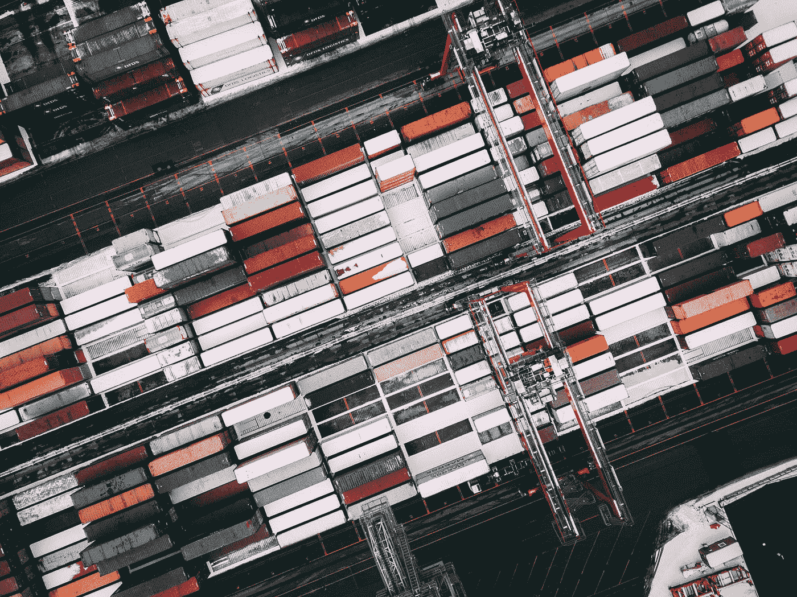

# 这是真的吗？区块链理工应用于 5 个行业的 28 个真实具体的例子！

> 原文：<https://medium.datadriveninvestor.com/can-it-be-actually-real-28-real-concrete-examples-of-blockchain-tech-applied-in-5-industries-72f030c5f367?source=collection_archive---------12----------------------->

我们从未想过这是可能的。但事实如此。

**金融、医药、物流、能源部门、公共管理……**
已经使用区块链技术的*具体实例的最新列表*+5 次更新！

# **金融机构，13 个例子:**

Photo by [Chris Liverani](https://unsplash.com/@chrisliverani?utm_source=medium&utm_medium=referral) on [Unsplash](https://unsplash.com?utm_source=medium&utm_medium=referral)

→投资流程的数字合同*(阿尔法银行、Masterchane、以太坊)。*

→KYC 银行安全兑换-表格 *(AK BARS 银行、Sberbank、Bank Opening、Allianz、Aegon、Munich Re、Swiss Re、Zurich、Liberty Mutual)。*

→客户识别*(secure key；RosEvroBank 和微软 Rus)。*

→公司投票*(broad ridge Financial Solutions、摩根大通、北方信托)。*

→银行间资金转账*(商业银行、卡塔尔、土耳其、阿联酋、埃及、印度的银行)。*

→银行间结算系统*(欧洲结算银行、花旗银行、加拿大丰业银行)。*

→通过区块链的房地产交易 *(ABN Amro，IBM)。*

→通过区块链 *(M.Video 和 Sbertech)根据保理协议控制与家用电器和电子产品供应商的结算。*

→交换文件*(数字生态系统、俄罗斯联邦储蓄银行和俄罗斯联邦储蓄银行)*。

→忠诚度计划管理 *(IBM、加拿大皇家银行、银联)。*

→优化股票交易所对期权的出价(莫斯科股票交易所和 Waves 平台)。

→石油交易 *(Natixis，Hyperledger Fabric，IBM，托克)。*

→上市公司证券交易*(澳大利亚证券交易所，数字资产控股)。*

# **能源部门，4 个例子:**

Photo by [Vidar Nordli-Mathisen](https://unsplash.com/@vidarnm?utm_source=medium&utm_medium=referral) on [Unsplash](https://unsplash.com?utm_source=medium&utm_medium=referral)

→电力买卖*(电网奇点、共识系统)。*

→电力的直接购买和销售 *(Powerpeers，Vattenfall Europe Innovation GmbH)。*

→电动汽车充电平台和清洁能源交易平台 *(RWE)。*

→二氧化碳信用交易*(能源区块链实验室，IBM)。*

**医学，3 例:**

Photo by [Thought Catalog](https://unsplash.com/@thoughtcatalog?utm_source=medium&utm_medium=referral) on [Unsplash](https://unsplash.com?utm_source=medium&utm_medium=referral)

→医疗信息交换 *(IBM)* 。

→病历卡系统 *(MedRec，MIT 媒体实验室)*。

→食谱核算系统*(有记载)*。

**物流，4 个例子:**

Photo by [Erik Odiin](https://unsplash.com/@odiin?utm_source=medium&utm_medium=referral) on [Unsplash](https://unsplash.com?utm_source=medium&utm_medium=referral)

→更新 ERP *(德勤 SAP)。*

→管理产品交付*(亚马逊、沃尔玛)。*

→供应链管理*(必和必拓，IBM)。*

→交付钻石 *(Everledger)。*

**公共管理，4 个例子:**

Photo by [Joakim Honkasalo](https://unsplash.com/@jhonkasalo?utm_source=medium&utm_medium=referral) on [Unsplash](https://unsplash.com?utm_source=medium&utm_medium=referral)

→土地权利登记*(格鲁吉亚国家经济实体登记局)。*

→出售国有资产，拍卖*(电子拍卖 3.0，分布式实验室)。*

→投票和调查 *(NSD、爱沙尼亚的纳斯达克、特拉华州、阿布扎比证券交易所)。*

→翻译州登记处、社会服务、安全机构、医疗保健等。*(IBM 智能迪拜，Bitfury 集团乌克兰)。*

分布式寄存器技术为几乎所有行业增加了价值。

商业对私人区块链更感兴趣，在私人中，分布式网络的主要任务是确认，但不是完全公开。它有一个监管机构，一个封闭的参与者名单和完全的身份证明，有能力存储机密信息。在这个逻辑中，技术的商业应用领域是无限的，这既激励了大公司，也激励了创业公司。

*今年 11 月，在规模最大的瑞士区块链会议上，您将了解更多关于使用区块链技术的公司、它们的案例和成功故事。*

[*http://bit.ly/2nKjCuk*](http://bit.ly/2nKjCuk)