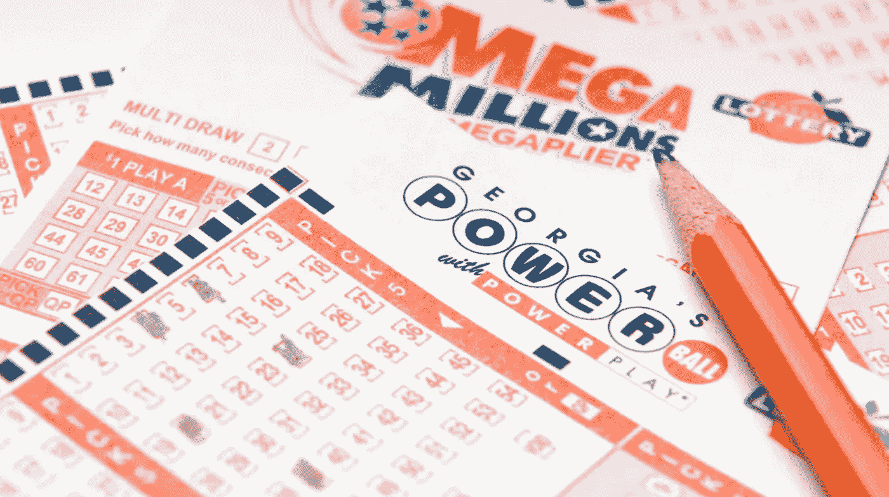
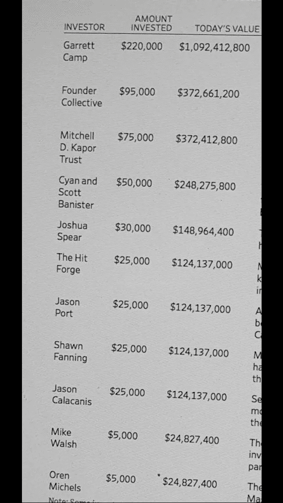

# 彩票能成为投资组合的有益补充吗？

> 原文：<https://medium.datadriveninvestor.com/can-lottery-tickets-be-a-useful-addition-to-an-investment-portfolio-ce046b0217c7?source=collection_archive---------0----------------------->

知识渊博和精明的交易者/投资者正确地认为，投资成功的关键是根据波动性和风险进行积极的预期下注。他们避开碰运气的游戏，支持基于经济、统计和金融模型的决策。

反对彩票和相关的机会游戏如轮盘赌或赌场吃角子老虎机的主要论点是，这些游戏有负面的期望，我们不能用我们的技能、知识或行动来提高我们成功的机会。我同意这些论点，但我想更深入地挖掘它们隐含的假设和局限性，将彩票与天使投资进行比较，并考虑彩票在投资组合中是否有用。



# 1.负面期望

期望是帮助考虑下注的一个非常有效的工具。我将交替使用术语“赌注”和它的委婉语，投资或交易，尽管“赌注”通常意味着消极的预期。最简单的期望概念是，你对赌注的期望是你赢的概率和赢的回报，而不是你输的概率和输的成本。它写在这个非常简洁的等式里。

```
Expected Value = p(win) * E(win) + p(loss) * E(loss)
where:
- p(win) is probability of winning
- E(win) is payoff of winning
- p(loss) is the probability of losing
- E(loss) is the cost of losing
```

在大多数交易模型中，概率[p(赢)和 p(输)]的范围是 1%到 99%，收益[E(赢)和 E(输)]的范围是几美元到几千美元，它们通常既合理又直观。然而，在彩票中，这些值呈现出如此极端的值，以至于概率和收益都不是直观的。

## 彩票的概率

相比之下，彩票的概率违背了任何常识或直觉观念。中百万分之一的几率是 302，575，350 分之一。这大致相当于从整个美国 3.27 亿人口中挑选出一个人。你可以玩好几辈子的彩票，但仍然没有机会中奖。这本身就是一个“不”买彩票的很好的理由，因为这些概率实际上等于“零”

## 彩票收益

数千万到数亿美元的回报同样令人难以置信。对大多数人来说基本上是无限量的钱。由于这种彩票收益是改变生活的事件，它真的可以达到“无限”

## 高收益能有效解释零概率吗？

作为你全部资本的唯一赌注，肯定不行。即使你花了好几辈子的每一分钱去买彩票，你也很有可能以零回报告终，因为概率太低了。

## 在投资组合中呢？也许吧。

这就是我认为，在你的整个投资组合中，资本量非常小的彩票可能是有用的。为了更好地理解这一点，让我们转向天使投资。

# 2.天使投资

以下是优步天使投资者的投资回报。令人难以置信的是，仅仅 5000 美元的投资就能获得 1.25 亿美元。这是 5000 倍的投资回报。像彩票一样，天使投资的回报会达到数千万到数亿美元，甚至数十亿美元。由于这对大多数人来说实际上是无限的，我们可以指定“无限”。



Angel investments and value after $UBER Initial Public Offering

## 天使投资的概率

这些数字看起来不可思议，但必须通过观察选择正确天使投资的概率来减轻这些数字的影响。这些数字看起来怎么样？这是著名天使投资人杰森·卡拉卡尼斯所著《天使:如何投资科技创业公司》一书的节选。

> …你的 200 项投资中的一项将获得 99.9%以上的总回报。让我们考虑一下。如果我做得不错，在我做天使的十年里，我会回顾超过一万家初创公司——亲自会见其中的数千家——以便只下 200 个赌注，其中可能有 197、198 或 199 个对我的总体回报影响很小或没有影响。
> 
> 换句话说，数以千计的会议和数百万计的投资将一无所获，而一个赌注——最长的赌注——将获得我投资的五千倍回报，使我成为分裂威廉·泰尔之箭的人，威廉·泰尔之箭刚刚分裂了落在靶心的箭。
> 
> 那就是天使投资。

这些概率非常低，实际上为零。你可能会经历多次人生，却没有选出一个赢家来解释其他投资

## 天使投资的技能、行动和知识

尽管天使投资的概率非常低，对大多数人来说实际上为零，但它们不太像彩票，因为你有办法增加你的概率。

有见识、有悟性、有人脉的人肯定可以通过以下方式影响这些概率。

1.  **有些人可能对趋势有更深刻的见解
    -** 科学:量子信息科学、基因组学、神经科学等。
    -技术:基因专利、人工智能、GPU 架构等。
    -社会:出生率、人口老龄化、痴呆症增加等。
    -地缘政治:来自稀缺资源、商品、联盟等的冲突。文化:歌曲、艺术、时尚等。
2.  **有些人可能更容易接触到交易流** 许多天使本身就是前企业家，他们投资的早期公司的内部人员，投资公司或对初创公司进行战略投资的后期公司的内部人员，有私人关系，等等。许多交易甚至可能不会在公众面前出现，因为它们甚至会在少数人脉广泛的投资者中被超额认购
3.  有些人有时间和金钱去下更多更大的赌注
    正如我们在上面卡拉卡尼斯的引用中看到的，绝大多数赌注都不会有非常大的回报。卡拉卡尼斯将其量化为从几十年来审查的超过 10，000 家创业公司中挑选出来的 200 个赌注中的 197，198，甚至 199 个。当然，不仅这些数字令人望而生畏，而且对这些初创公司进行尽职调查所需的时间和精力也是巨大的，包括:会见创始人、查看法律和财务状况、与市场和竞争对手进行比较等等。这还需要具备深入挖掘所需的知识、才能、背景和兴趣，以及做出扣动扳机的实际决定的能力，并投入大量资金。

# 3.天使投资与彩票

因此，即使天使投资“有可能”赚到非常多的钱，即使你有上面列出的优势，也不是非常不可能。所以现在让我们考虑一下天使投资和彩票之间的区别

## 投资资本

个人天使投资通常从 2.5 万美元到 10 万美元不等。通过辛迪加，可以下注 1000 美元左右的小额赌注。当然，你也可以选择单独或作为一个财团牵头进行更大规模的投资，接近 100 万英镑。个人彩票的价格从 1 美元到 5 美元不等，如果我们把刮刮乐也算在内，价格可能会涨到 50 美元或 100 美元。这是我认为最大的不同之处。通过彩票中奖花费要少得多。

## 审判

如果你想清楚地做好充分的尽职调查，在天使投资中你有几十到几百次机会。在你的天使投资生涯中，你能接触到的创业公司可能是成千上万个中的几千个。在彩票中，如果我们将一次挥杆定义为一组与一张彩票或一张个人刮刮乐相匹配的数字，你可能会进行数万到数十万次挥杆。

## 进入壁垒

虽然从技术上来说，你不一定要成为“合格”投资者才能投资初创公司，但大多数寻求资金的初创公司只接受合格投资者的投资。这意味着你需要在过去的两年中每年有 20 万美元(个人)或 30 万美元(与配偶共同)的收入，并有同样的预期，或者你需要 100 万美元的净资产，不包括你的主要住所。相比之下，彩票只是要求你年满 18 岁。天使投资的准入门槛要高得多。

## **影响结果的能力**

在上面的副标题:“天使投资的技能、行动和知识”中，我们看到天使投资者可以做一些具体可行的事情来获得优势。相比之下，彩票不需要任何技巧。甚至挑选号码的行为也可以通过告诉销售人员你想要一张“快速挑选票”来自动消除。彩票更容易下注，不需要技巧，这可能是一件好事。

## 彩票优于天使投资吗？

因此，在我看来，彩票的风险回报与天使投资没有太大区别。我的观点是，相对于天使投资，彩票甚至可能是更好的交易工具，因为:

*   彩票需要更少的投资资本
*   彩票允许进行更多的尝试
*   彩票的准入门槛要低得多
*   彩票不需要特殊的技能、天赋、洞察力或关系网

可以取消的其他点

*   你可以在天使投资中提前套现，但你也可能需要投入更多资金来维持你的股权比例
*   彩票对不太完美的匹配有较小的奖励

# 4.杠铃投资策略

到目前为止，分析主要集中在预期和“均值”上，但没有解决涉及方差、偏斜度和峰度的“高阶矩”,这些矩描述了如果我们也考虑大量的小赢款、少量的中赢款和极少量的大赢款，回报的频率会是什么样子。

## 黑天鹅养殖

远处的异常值是什么样的？事实上，YCombinator 的创始人在 2012 年 9 月写了一篇关于这个问题的帖子。

*   [黑天鹅养殖——保罗·格拉厄姆](http://www.paulgraham.com/swan.html)

标题中的黑天鹅一词与概率学家、作家、哲学家、交易者、举重运动员和社交媒体影响者纳西姆·塔勒布(Nassim Taleb)在他的《纽约时报》畅销书“黑天鹅”中密切相关，可以粗略地视为影响非常高、概率很低、无法预测的事件。

这篇文章基本上是说，创业投资是非常困难和违反直觉的，因为好主意一开始看起来像坏主意，所以很难甚至不可能预测。此外，概率和收益的规模是如此极端，以至于它们非常违反直觉，以至于不可能用直觉或数学模型来解释它们。基本上，数百或数千次击球中的一次或两次击球将是获得大满贯的一次，并返回足够的资本来弥补其他击球的损失和成本，这是做生意的成本。

## 太少的风险本身就是隐藏的风险

然而，如果我们的资本没有承担足够的风险，缺乏风险本身就成为一种隐藏的风险，因为资本必须用于增长，因为它受到约 2%的通货膨胀的破坏。

对于一点风险来说，最聪明的策略是基于指数的低成本股票 ETF。此外，如果你将它纳入你的延税退休账户，如 401k 或个人退休账户，你也可以通过让税前资本为你工作来利用税收优惠。唯一的问题是，多样化的广义股票 ETF 的年回报率只有 10%。

你可以投资债券或目标数据基金，但这些基金的回报会更少，费用会更高。在任何情况下，你都不会看到天使投资的 5，000 倍回报或彩票的 100，000，000 倍回报。

此外，所有这些退休计划可能都没有实际意义，因为你不再年轻，生活中也没有保障。退休期间的时间甚至退休本身都没有保障。你可能明天就去世了，甚至还没有享受到退休账户的税收优惠，几十年后甚至还没有接触到基金。

你需要让自己“现在”就变得富有，这样你就可以开始过你想要的生活。“金钱买不到幸福”也许是一句至理名言，但绝对能帮上大忙，缺钱也一定会带来幸福的匮乏。

**杠铃策略**

那么这给我们留下了什么？我的实际观点是，你应该始终保持一个核心安全的投资组合，该投资组合能够增长，并至少保证退休后不会一贫如洗。然而，你也应该注意分配一些小百分比到超高风险，超高回报的投资。这些构成了所谓“杠铃”战略的组成部分。

天使投资的建议从 2%到 10%不等。同样的道理也适用于其他高风险高回报的投资。相对于你的整体投资组合，保持它们的规模较小。

彩票可能以较低的成本和风险完成同样的事情。401k 的平均余额是 100，000 美元，所以让我们考虑一下。不是 2%-10%，也许彩票在下面的顺序可能是正当的，只是为了保持改变生活的黑天鹅的可能性。

*   低两个数量级，每年 0.02%(20 美元)到 0.10%(100 美元)
*   每年降低 0.002%(2 美元)至 0.01%(10 美元)三个数量级

无论如何，这些都是无关紧要的钱，因为 2%的通货膨胀已经侵蚀了资本基础两到三个数量级。