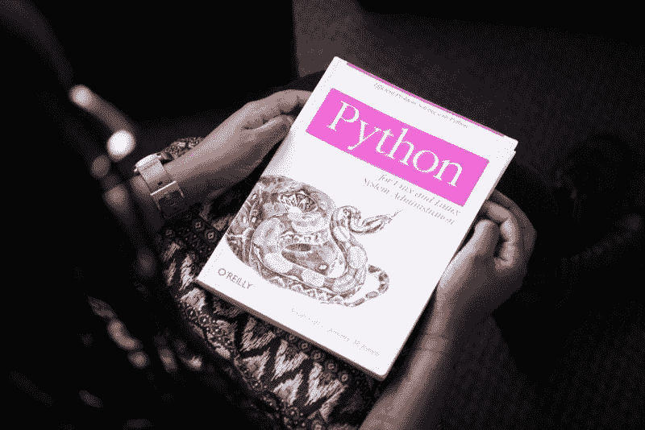
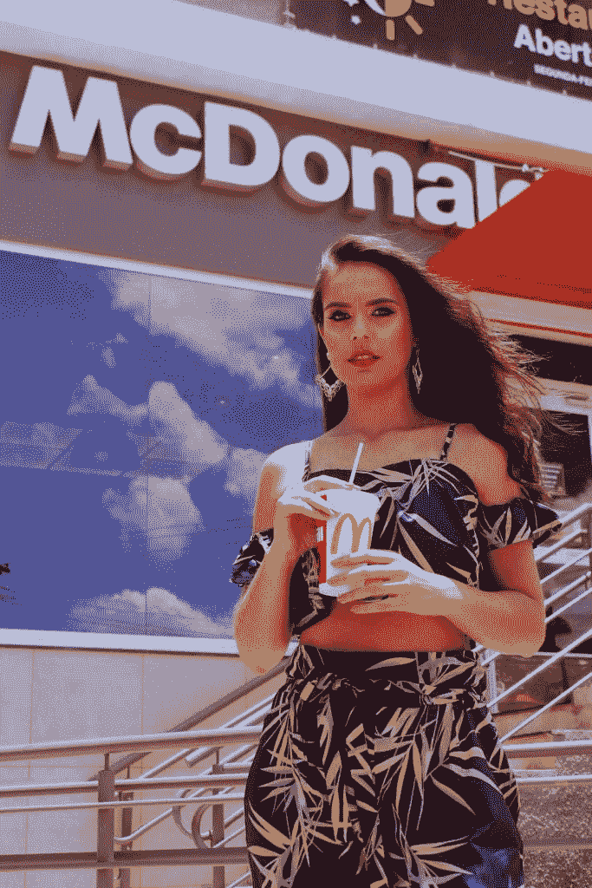
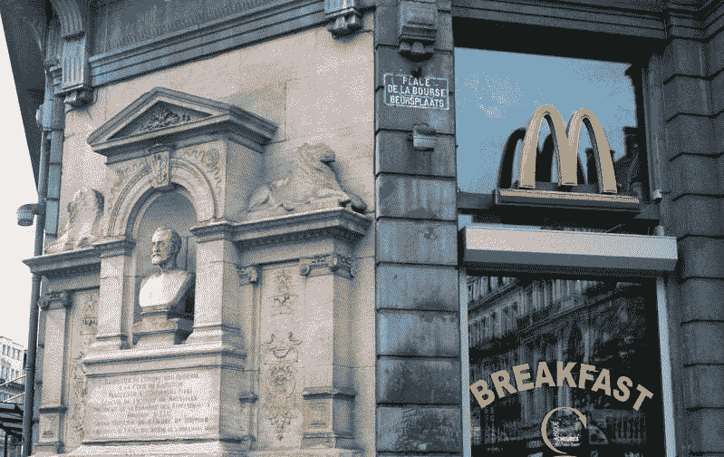
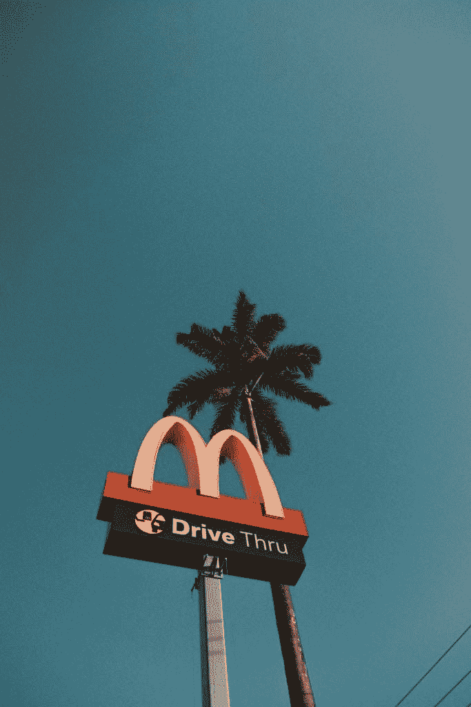

# 机器学习能拯救麦当劳吗？—市场疯人院

> 原文：<https://medium.datadriveninvestor.com/can-machine-learning-save-mcdonalds-market-mad-house-517163a08f6c?source=collection_archive---------5----------------------->

价值投资者在问；“机器学习能让麦当劳免于收入缩水吗？”为了澄清这一点，**麦当劳(NYSE: MCD)** 今年 3 月斥资逾 3 亿美元收购了以色列机器学习公司 Dynamic Yield。

Dynamic Yield 建立了分析客户行为的算法，并为个人客户创造个性化的用户体验，前员工迈克马拉佐在一篇媒体[文章](https://gen.medium.com/the-bs-industrial-complex-of-phony-a-i-44bf1c0c60f8)中透露。理论上，动态收益算法可以检查客户过去的购买情况，并创造个性化的折扣。例如，一种算法可以为购买大量鸡蛋松饼的人在下一份早餐订单中提供一杯免费咖啡。

麦当劳管理层希望动态收益能够帮助其改善客户服务并降低成本。我认为 Dynamic Yield 的算法可以分析一个月的订单，并告诉麦当劳经理要订购多少汉堡和薯条。

 [## 算法交易的机器学习-数据驱动的投资者

### 当你的一个朋友在脸书上传你的新海滩照，平台建议给你的脸加上标签，这是…

www.datadriveninvestor.com](https://www.datadriveninvestor.com/2019/01/30/machine-learning-for-stock-market-investing/) 

# “得来速”如何解释麦当劳的动态收益购买

此外，Dynamic Yield 的算法可以让为个人定制膳食变得更加容易。

动态收益购买的一个奇怪原因是麦当劳对“得来速”的依赖。事实上， *QSR 杂志* [估计](https://www.qsrmagazine.com/reports/2018-qsr-drive-thru-study) 70%的美国快餐购买发生在免下车餐馆。

“得来速”限制客户联系；这使得快餐经营者很难理解顾客或他们的偏好。麦当劳的希望是，通过分析顾客的订单，Dynamic Yield 可以提供更多的顾客信息。

分析订单是艰难的；因为麦当劳号称每天服务 6800 万顾客，*连线* [报道](https://www.wired.com/story/mcdonalds-big-data-dynamic-yield-acquisition/)。然而，Dynamic Yield 在客户数据管理、个性化和目标定位、推荐、测试和优化以及行为信息方面处于领先地位。

# 动态收益如何帮助麦当劳卖出更多汉堡

Dynamic Yield 的平台理论上可以分析顾客的订单，发现一个人通常会在周二下午 1:30 左右购买一个巨无霸。

因此，Dynamic Yield 可以在周二下午 1 点给这个人发送一条短信或一封电子邮件，附带一张免费饮料和一个巨无霸的优惠券。相应地，动态产量构建了一个“[触发引擎](https://www.dynamicyield.com/triggering/)”触发引擎是一个应用程序，可以自动生成和发送电子邮件，并推送通知，据称这些通知将在关键时刻送达客户。

显然，Dynamic Yield 的触发引擎引发了严重的道德和法律问题。例如，麦当劳是否通过操纵顾客来促进不健康饮食和肥胖？我预测，用不了多久，就会有人起诉麦当劳，声称:"触发引擎说服我每天吃四分之一磅肉，导致我心脏病发作."

因此，公共卫生专家和医生应该检查麦当劳最近的收购。动态产量会让鼓励健康饮食变得更加困难。此外，我预测很快会有人呼吁禁止触发引擎和数据个性化。

# 麦当劳绝望了吗？

另一方面，价值投资者会怀疑麦当劳是不是一家绝望的公司。毕竟，除非害怕，否则管理者不会在全新的技术和未经证实的商业策略上花大钱。

不断萎缩的收入增长率表明，麦当劳有很多值得担心的地方。事实上，Stockrow 估计麦当劳的收入增长在过去的九个季度中每一个季度都在萎缩。

例如，在截至 2019 年 3 月 31 日的季度，麦当劳的收入增长下降了 3.357%。值得注意的是，截至 2018 年 6 月 30 日的季度，麦当劳的收入增长萎缩了 11.5%。

值得注意的是，2019 年 3 月 30 日，麦当劳的季度收入多年来首次降至 50 亿美元以下。为了澄清，麦当劳报告 2018 年 12 月 31 日的季度收入为 51.63 亿美元，2019 年 3 月 31 日为 49.56 亿美元。

# 麦当劳赚钱越来越少

此外，麦当劳的毛利从 2018 年 3 月 31 日的 25.3 亿美元降至 2019 年 3 月的 25.36 亿美元。因此，很容易理解为什么麦当劳采取如此绝望的措施——连锁店赚的钱越来越少。

2018 年 3 月，麦当劳报告营业收入 21.43 亿美元，净收入 13.75 亿美元。然而，2019 年 3 月，麦当劳报告营业收入为 209.4 万美元，净收入为 13.28 亿美元。降幅很小，但它确实存在，麦当劳赚的钱更少了。

从好的方面来看，麦当劳正在产生更多的现金。截至 2019 年 3 月 31 日，麦当劳的运营现金流为 20.2 亿美元。相比之下，Golden Arches 去年同期的运营现金流为 16.45 亿美元。

与此同时，麦当劳报告称，2018 年 3 月 31 日的自由现金流为 11.64 亿美元，一年后上升至 15.28 亿美元。此外，麦当劳报告称，2019 年 3 月 31 日的融资现金流异常，为 2.207 亿美元。我的猜测是，融资现金与动态收益率收购有关。

归根结底，麦当劳仍然是一家现金充裕的公司，Mickey D's 在 2019 年 3 月 31 日报告的现金和等价物为 22.89 亿美元。然而，这一数字低于去年同期的 24.68 亿美元。

# 麦当劳怎么了？

麦当劳困境的原因很容易猜测，但很难确定。为了澄清，我把麦当劳收入的下降归咎于核心市场如美国和英国的竞争加剧。

例如，在美国，繁忙的城市十字路口经常有几家相互竞争的快餐店。此外，美国超市如克罗格(纽约证券交易所代码:KR)T1，亚马逊的全食超市，甚至 T2 的沃尔玛(纽约证券交易所代码:WMT T3)都在进入快餐业。例如，[克罗格](https://marketmadhouse.com/kroger-tests-self-driving-vehicle/)现在几乎在每家超市都有熟食店，并且在它的许多商店里增加了烧烤店、咖啡馆，甚至比萨饼店。

除了超市和竞争对手快餐连锁店，像 [**GrubHub**](https://marketmadhouse.com/is-grubhub-a-threat-to-kroger-kr/) **(纽约证券交易所代码:GRUB)** 这样的送餐应用可以直接给饥饿的顾客带来各种各样的食物。因此，一个饥饿的工作狂在吃零食的时候从来不用离开她的办公桌。

# 竞争对手如何慢慢杀死麦当劳

送餐应用对麦当劳是一个巨大的威胁，因为它们消除了去免下车餐馆的需要。更糟糕的是，GrubHub 比免下车餐馆方便得多，因为你不必开车去。

所有的竞争和选择都在对麦当劳造成千刀万剐。解释一下，每一种新的选择只占麦当劳业务的一小部分，但损失会累积起来。一个月或一个季度失去几千个客户听起来并不坏，直到年底你把损失加起来。

最糟糕的是，衡量具体竞争对手的损失对麦当劳来说几乎是不可能的。例如，当 Shake Shack(纽约证券交易所代码:SHAK) 在街对面开业时，麦当劳的特许经营可能会失去 10%的业务，当 GrubHub 开始在该地区送货时，可能会失去 2%。与此同时，当克罗格在一家超市增加一家比萨店时，麦当劳可能会失去 3%或 4%的顾客，这家超市比麦当劳更靠近一个繁忙的办公区。

麦当劳不可能确定确切的损失，因为克罗格、Shake Shack 和 GrubHub 不太可能与竞争对手分享他们的销售数据。将动态产量数据与其他数字进行比较；然而，可以让麦当劳管理层对其亏损及其原因有一个现实的了解。

# 动态收益如何帮助麦当劳生存

动态收益客户数据管理算法可以检查一家麦当劳连锁店两三年的销售情况。通过比较不同日期的销售额，该应用程序可以确定哪些客户不再在麦当劳购买午餐。

因此，麦当劳可以改变菜单来吸引这些顾客。此外，麦当劳可以尝试联系以前的顾客，询问他们为什么不再在那里用餐。理想情况下，麦当劳管理层可以了解顾客离开的原因。

这种数据挖掘是一种未经证实的策略，会带来巨大的风险。顾客可能会将数据挖掘视为对隐私的侵犯，并对麦当劳产生反感。正如我上面提到的，公共健康活动家可能会因为麦当劳试图操纵顾客行为而对其进行处罚。此外，竞争对手可能会嘲笑麦当劳让人工智能来规划菜单。

# 麦当劳是一个好的投资吗？

我认为市场先生在 2019 年 6 月 20 日将麦当劳(纽约证券交易所代码:MCD) 定价过高，为 204.55 美元。然而，麦当劳仍然是一个良好的收入和不错的股息股票。

令人印象深刻的是，麦当劳在 2019 年 6 月 17 日支付了 1.16 美元的季度股息。15₵在 2018 年增加了股息，从 2018 年 9 月 18 日的 1.01 美元增加到 2018 年 12 月 17 日的 1.16 美元。

此外，Divided.com 估计，麦当劳为投资者提供了令人印象深刻的 42 年持续股息增长。此外，投资者在 2019 年 6 月 14 日获得了 2.27%的股息收益率，4.64 美元的年化派息，以及 60.7%的派息率。

因此，尽管面临威胁，麦当劳仍然是一只收益不错的股票。我的建议是现在不要买 MCD，如果拥有麦当劳就持有。我认为在可预见的未来，麦当劳将会是一个稳定的红利来源。

*原载于 2019 年 6 月 20 日*[*【https://marketmadhouse.com*](https://marketmadhouse.com/can-machine-learning-save-mcdonalds/)*。*