# 机器能预测和预防犯罪吗？

> 原文：<https://medium.datadriveninvestor.com/can-machines-predict-and-prevent-crimes-9203f9e1524c?source=collection_archive---------2----------------------->

也许比人类更好！

与流行的好莱坞式的想象相反，机器还没有成为能够比人类更聪明，甚至比得上人类智力的超级人类。但是在一些领域，机器智能可以支持，或者有时智胜人脑有限的神经能力。预测性警务是“机器学习”可以支持人类的一个领域，可以产生积极的社会学影响。

预测性警务指的是收集大量数据并运用算法来推断何时何地最有可能发生犯罪。美国各地的警察部门正在使用一些这样的软件。**如果犯罪数据充分数字化，同样的模式也可以应用于印度城市。**

特别是，LAPD 和亚特兰大警察局使用的**[**pred pol**](http://www.predpol.com)**利用犯罪的地点、时间和类型来创建热点地图，帮助警察决定夜间巡逻路线。另一个 ML 工具，[**HunchLab**](https://www.hunchlab.com)[，](https://www.hunchlab.com/%7D,)由 NYPD &迈阿密警察局使用，专注于社会和行为分析，以生成预测。根据 LAPD 的说法，**在部署机器学习工具**后，报告的入室盗窃案件大幅下降。即使是夏洛克·福尔摩斯也会对这种逻辑印象深刻，被用于这种机器辅助的侦探工作！****

****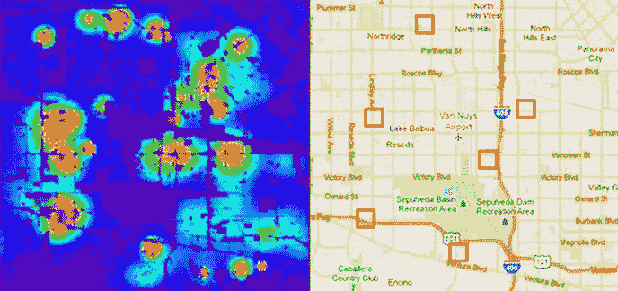****

******Machine Prediction of crime hot spots in a city (Image courtesy: PredPol)******

****让我们快速浏览一下这类软件成功背后的科学。在本案例研究中，让我们考虑美国北卡罗来纳州的犯罪数据库进行分析，并在此基础上建立一个简单的“线性模型”来预测未来的犯罪。随着我们进一步深入，我们会发现这样一个假设，即特征之间的线性关系是否真的存在，如果存在，那种关系的性质是什么。****

******什么是线性模型？******

******线性模型假设因变量和自变量之间呈线性关系。**因变量是我们需要预测的值(这里是犯罪率)。当因变量是实值时，我们使用线性回归模型，当分类时，使用逻辑回归模型。由于犯罪率是一个真实值，我们将使用线性回归来模拟这个问题。****

******线性回归******

****使用线性回归，**我们正在寻找一个线性方程**，y = ax + b，**来捕捉数据中的关系。**给出这样的趋势线，很容易计算出未来 x 值的相应 y 值。****

# ******目录******

******-*** [**应用线性回归:步骤**](https://medium.com/p/9203f9e1524c#5c85)****

******-*** [**关于输入数据**](https://medium.com/p/9203f9e1524c#e0f0)****

******-*** [**步进代码走查**](https://medium.com/p/9203f9e1524c#c99c)****

******— * a)** [**数据加载**](https://medium.com/p/9203f9e1524c#fd2c)****

******— * b)** [**数据分析**](https://medium.com/p/9203f9e1524c#1a50)****

******— * c)** [**探索性数据分析【EDA】**](https://medium.com/p/9203f9e1524c#3bc0)****

******— — 1。** ****————* ***[**目标变量分布**](https://medium.com/p/9203f9e1524c#0e9c) **————* ***[**所有特征分布**](https://medium.com/p/9203f9e1524c#6b5f) **————* ***[**概率/累积分布函数(CDF)**](https://medium.com/p/9203f9e1524c#1b3b)******

******———2。** [**双变量分析**](https://medium.com/p/9203f9e1524c#7c63) **————* ***[**方框图**](https://medium.com/p/9203f9e1524c#c520) **————* ***[**小提琴图**](https://medium.com/p/9203f9e1524c#31c6) **————* ***[**线性回归拟合强相关特征**](https://medium.com/p/9203f9e1524c#6db5) **————————* ***[**特征**](https://medium.com/p/9203f9e1524c#a6a8)****

******—* d)** [**数据清理**](https://medium.com/p/9203f9e1524c#acb6)****

******——* e)**[**模型构建**](https://medium.com/p/9203f9e1524c#2da5) **———1。** [**创建具有最相关特征的模型**](https://medium.com/p/9203f9e1524c#0201) **———2。** [**创建具有前 2 个相关特征的模型**](https://medium.com/p/9203f9e1524c#7790) **———3。** [**具有所有特征的模型**](https://medium.com/p/9203f9e1524c#9461) **———4。** [**从全特征模型中删除特征**](https://medium.com/p/9203f9e1524c#8f34) **— —5。** [**从全特征模型中删除更多特征**](https://medium.com/p/9203f9e1524c#19c7) **— —6。** [**模型评估采用交叉验证&RMSE**](https://medium.com/p/9203f9e1524c#cf5e) **———7。** [**构建最终模型**](https://medium.com/p/9203f9e1524c#d6ee)****

******—* f)** [**培训&模型评价**](https://medium.com/p/9203f9e1524c#580c)****

******—【g】**[**得出结论**](https://medium.com/p/9203f9e1524c#0fc4)****

******-*** [**关闭思路**](https://medium.com/p/9203f9e1524c#3978)****

******-*** [**引用**](https://medium.com/p/9203f9e1524c#f169)****

******应用线性回归:步骤******

****这个博客试图展示线性回归模型如何被用来预测犯罪率。为了更清楚起见，我们将在 Python 代码旁边演示下面的步骤。请注意，现实世界中的软件使用更复杂的模型，输入数据集可能会更大。****

****以下步骤概述了解决该问题的机器学习方法。我们可以在训练后保持模型[3]，它本质上是作为 ML 软件部署的，用于以后的预测。****

*******a)数据加载:*** 从给定的 csv 文件中加载数据****

*******b)数据分析:*** 为 EDA 分析和准备数据****

*******c)探索性数据分析(EDA):*** 可视化分布，绘制属性之间的相关性。进行 EDA 有两种方式:****

*****i)单变量分析:*找出数据集中的单个特征在多大程度上有助于确定目标特征，即犯罪率。****

*****ii)双变量分析:*找出给定属性与犯罪率的关系。****

*******d)数据清洗:*** 对数据进行清洗，基于数据分析和 EDA，通过去除不相关和不完整的信息。这是最重要的一步。****

*******e)模型建立:*** 以 EDA 的发现为基础，开发一个以犯罪率为因变量的合适的线性模型。****

*******f)训练&评估:*** 训练模型，评估预测性能。****

*******g)得出结论:*** 对模型进行评价并提出改进建议。****

******关于输入数据******

*******数据描述*******

****该数据集包含北卡罗来纳州按县汇总的犯罪率数据。****

****数据来源:[https://github . com/AdroitAnandAI/Crime-Analysis-Prediction/blob/master/Crime _ v2 . CSV](https://github.com/AdroitAnandAI/Crime-Analysis-Prediction/blob/master/crime_v2.csv)****

*******数据属性*******

****数据集中的列属性定义如下:****

****[https://github.com/AdroitAnandAI/Crime-Analysis-Prediction](https://github.com/AdroitAnandAI/Crime-Analysis-Prediction)****

****在数据集中，有诸如定罪概率、人均警察、人口密度、区域、少数民族百分比、年轻人口百分比等属性。这可能会影响犯罪率。但是，在构建最终模型之前，让我们评估一下哪些属性在实践中是有用的。****

******一步一步的代码演练******

******a)数据加载******

******样本输出:******

****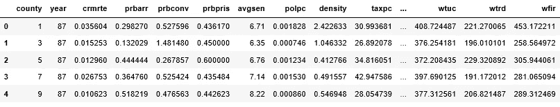****

******b)数据分析******

****真实世界的数据总是远非完美。**我们将发现输入数据中的异常，并通过以下步骤消除它们**。****

*******观察*** *:* 最后一列被**读取为“对象”数据，而不是“浮点”。**发现是由于输入中有一个**特殊符号。csv 文件。******

*******观测*** *:* **概率最大值**特征，prbarr & prbconv，被**发现为> 1 这是数据异常。**我们已经从进一步的分析中删除了这样的行。****

*******观察*** *:* 由于输入中没有缺失值，所以不需要进行数据插补。数据插补是一种用替代品代替缺失值的方法。****

******c)探索性数据分析(EDA):******

1.  ******单因素分析:******

****我们将目标变量的分布与剩余特征进行比较，以确定单个变量的预测能力。****

*******目标变量的分布*******

****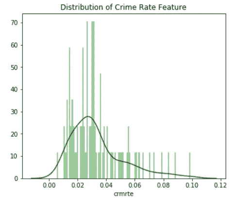****

*******Crime Rate vs Frequency Plot*******

*******分配所有特性*******

****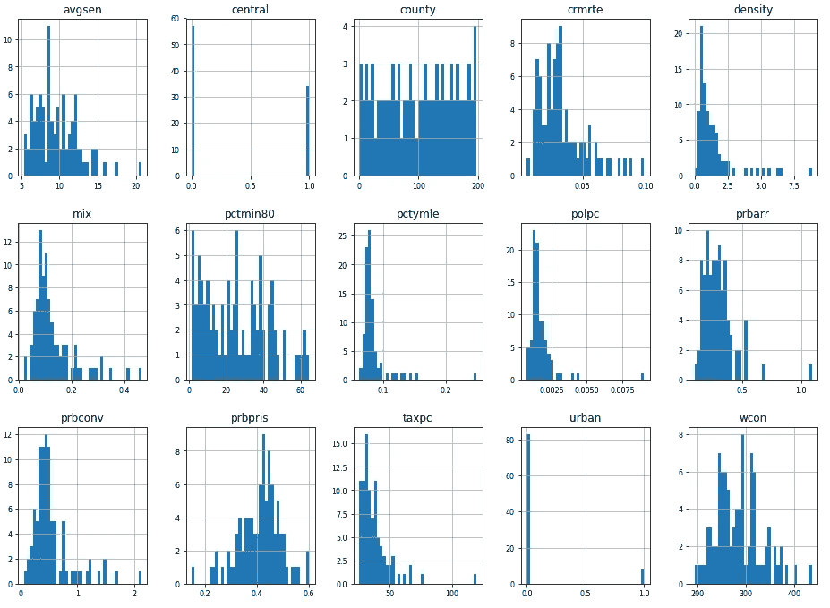********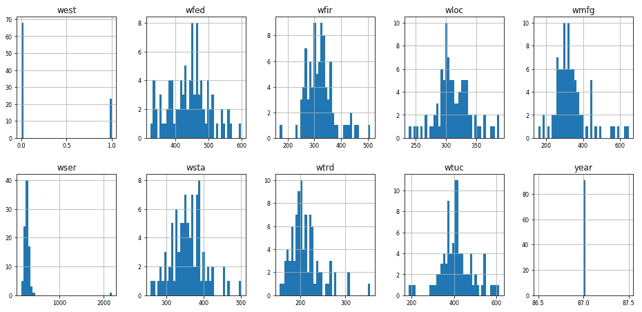****

****观察:特征密度、混合、人均警察、定罪概率和人均税收似乎与犯罪率具有**相似的分布。******

*******【概率/累积分布函数】*******

****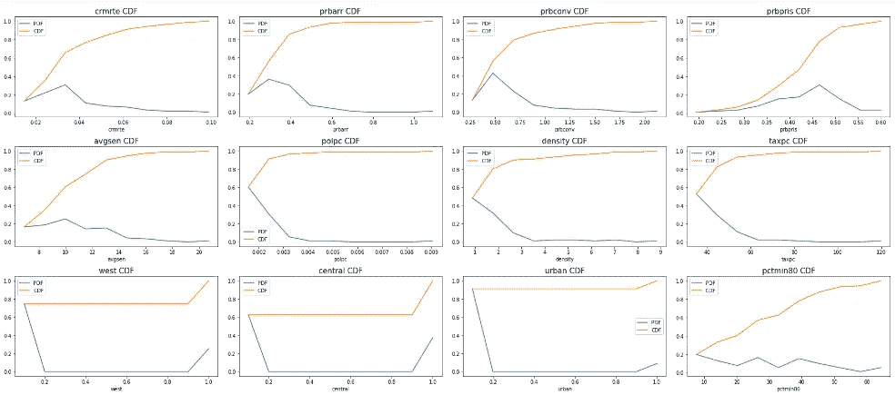********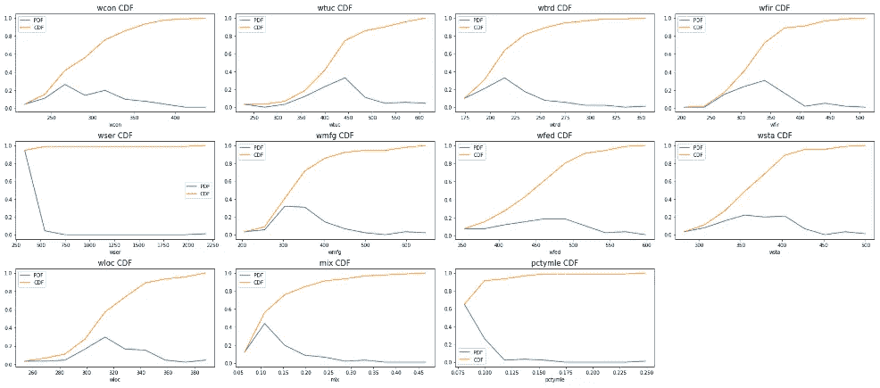****

******观察:******

****a)奇怪的是，超过 95%的服务行业(wser)周工资低于 400 英镑，但最高工资在 2250 英镑左右。因此，**我们将从输入数据中删除“县 185”。******

****b)尽管人均税收最高值为 120 英镑，但超过 50%的值低于 40 英镑。****

****c)尽管警察人均最高值为 0.009，但超过 60%的值低于 0.001。****

****让我们使用双变量分析进一步检查。****

******2。双变量分析:******

****执行双变量可视化以找到数据集中的每个变量与感兴趣的目标变量(即犯罪率)之间的关系。****

****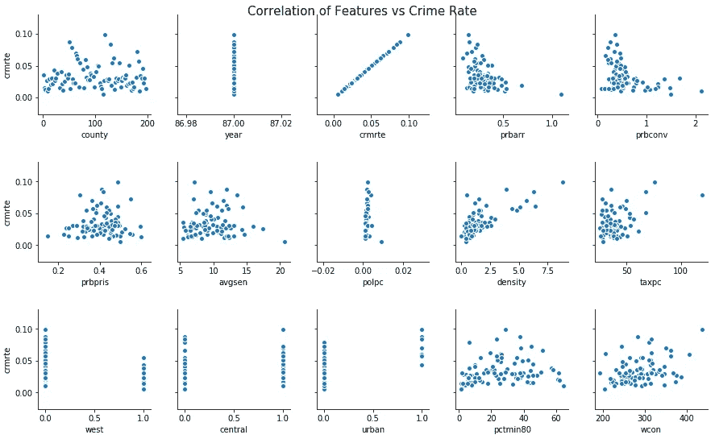********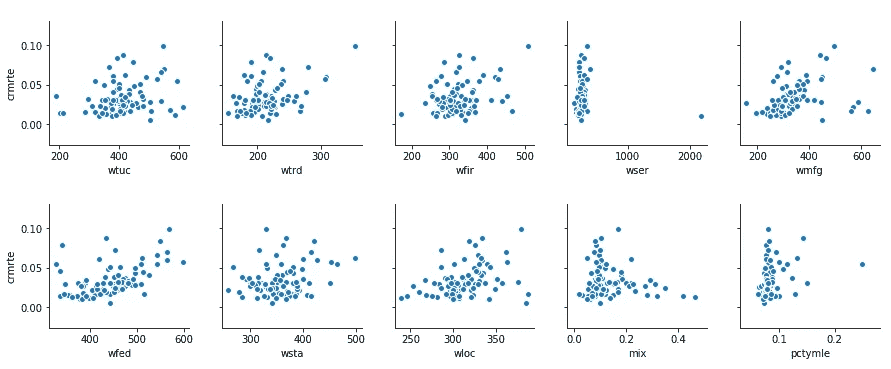****

******观察:******

****a)根据上面的配对图，可以看出**密度特征与犯罪率正相关。******

****b)奇怪的是，**周工资特征和犯罪率被发现略微呈正相关。这个**表示收入分配不均，或者失业率可能很高。********

**类似地，我们可以发现跨位置的特征之间是否有任何相关性:“西部”、“中部”和“城市”。**

****提示:**作为一名数据科学家，**了解所观察问题的实际背景**总是比较好的。在这种情况下，我们应该知道北卡罗来纳州西部以阿巴拉契亚山脉为界，东部以大西洋海岸为界。因此，犯罪类型的**频率&在东西方之间会有很大的不同。****

**为了画出区别，让我们做一个犯罪率的方框图&小提琴图，对照布尔特征“西部”、“中部”和“城市”。**

*****方框图:位置*****

**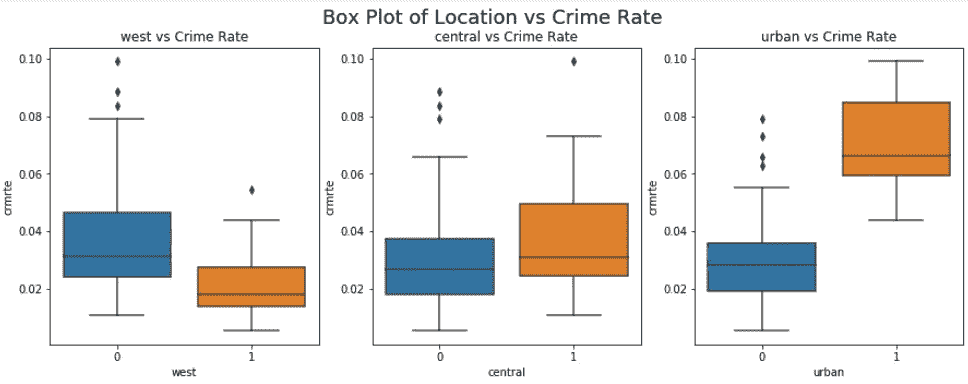**

*****小提琴剧情:地点*****

**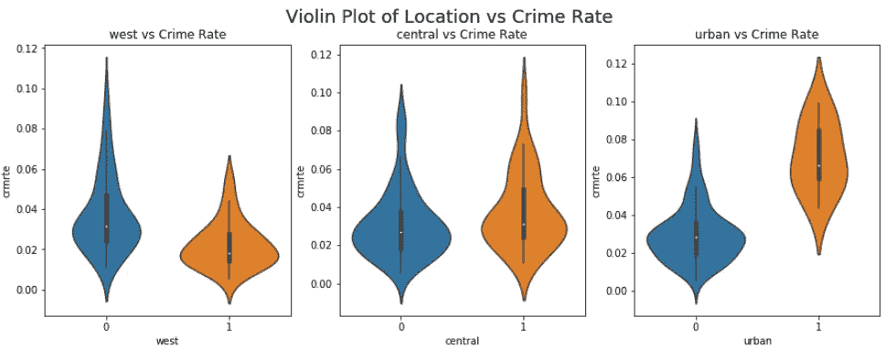**

****观察:****

**a)城市地区的犯罪率非常高。因此，**特征“城市”对于预测是有用的。****

**b)西部的犯罪率较低，中部适中。但是由于有明显的重叠，这样的变化可能对预测帮助不大。**

****强相关特征的线性回归拟合****

**由于有许多特征，我们将只采用最相关的特征来估计线性拟合的良好程度。**

**有 **6 个与犯罪率强相关的值:****

***crmrte 1.000000
密度 0.728963
市区 0.615602
wfed 0.486156
tax PC 0.450980
wtrd 0.410106***

**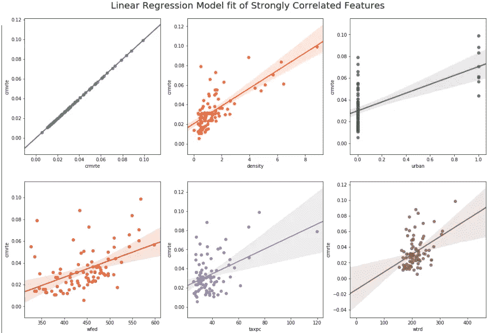**

****特征-特征相关性分析****

**特征间的多重共线性可以通过特征-特征相关性分析来识别。**在线性回归中，输入变量不应是多共线**，即相互依赖。**

**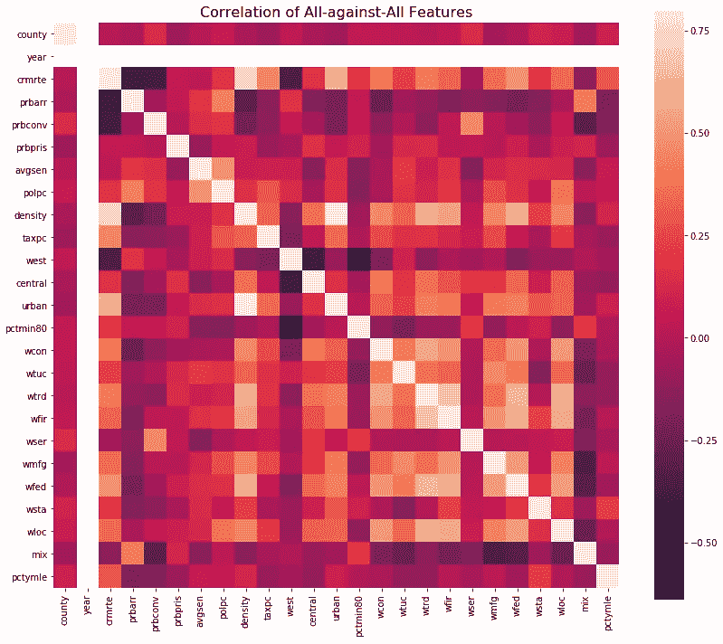**

****缩放的热图****

**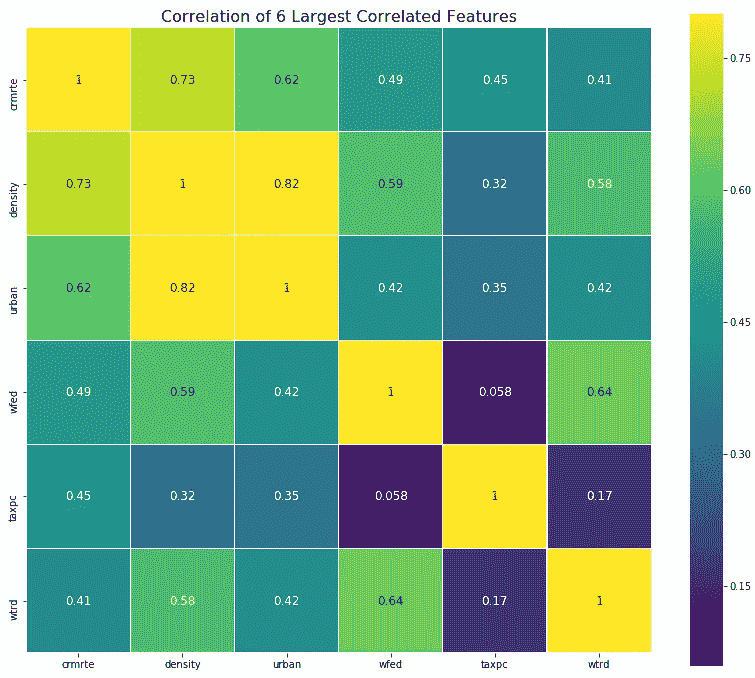**

****观察:****

**a)**密度和城市变量似乎高度相关**，这是显而易见的，因为城市地区人口密集。因此，**密度和城市要素之间很有可能存在多重共线性。我们会用线性回归来梳理这个问题。****

**b)跨领域的“工资特征”正相关。这也是直观的，因为一个领域的工资增加或减少肯定会影响另一个领域。**

****上述来自 EDA 的观察结果被用于帮助建模。****

****d)数据清理****

**在建立模型之前，**根据来自数据分析& EDA 的观察清理数据**是很重要的。**

****e)模型构建****

**让我们通过建立线性回归模型来评估上述观察结果。在线性模型中，**建议在建立模型之前进行标准化**。**

1.  ****创建具有最相关特征的模型****

**基于 EDA，我们知道犯罪率**与密度**最相关**

**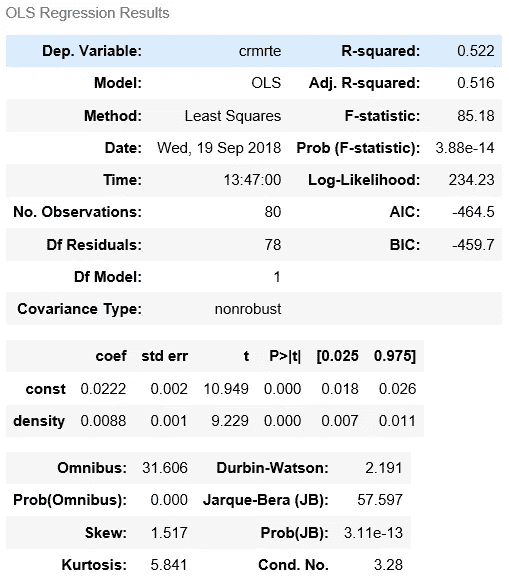**

***中期观察:***

*   **由于密度的 p 值很小，犯罪率与密度密切相关**
*   **r 平方值= 0.525 表示 **52.5%的犯罪率可变性**由密度特征解释。**

**2.**创建具有前 2 个相关特征的模型****

**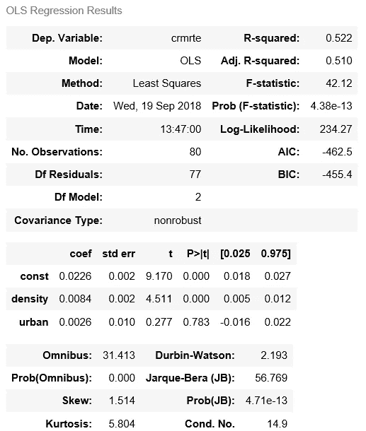**

***临时意见:***

*   **当“城市”与“密度”作为预测变量结合时，r 平方值增加到 0.527。但是，当你添加更多的预测变量时， **R 平方总是上升，不管添加的变量是否有助于预测。****
*   ****调整后的 R 平方**，**对增加更多变量进行处罚。因此，当你加入没有贡献的变量时，它会下降。注意，调整后的 R 平方值**从 0.519 下降到 0.514。**另外， **AIC** 值从-470 增加到-469。*【参见下面的注释】*****
*   **请注意,“密度”特征的 p 值也比早期模型略有增加。因此，这个模型在解释犯罪率时变得不那么可靠了。**

****注意事项**:**

**如果我们加入对预测没有用的变量，就会导致“过度拟合”。然后，预测模型在训练数据中表现更好，但在真实世界数据中表现较差。通过跟踪调整后的 R 平方、p 值、AIC 和 BIC，我们可以仔细地包括或排除建模变量。识别过度拟合的另一个标准方法是检查训练和测试损失曲线的发散。[8]**

****阿凯克信息准则(AIC)** 估计给定模型丢失的相对信息:模型丢失的信息越少，模型的质量越高。因此，AIC 越低越好。 **AIC & BIC(贝叶斯信息标准)**代表模型与另一个相比的质量。**

**3.**具备所有功能的车型****

**当我们分析前 2 个相关特征时，我们将所有特征添加到模型中，并系统地移除特征以找到最佳模型。**

**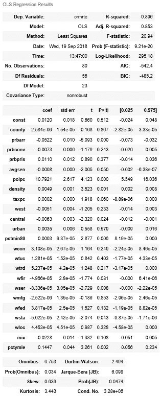**

**4.**从全特征模型中移除特征****

**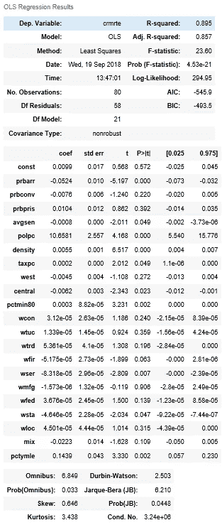**

***中期观察:***

**a) **去除 2 个特征**‘城市’，‘县’，**调整 R 平方提高**从全特征模型中的 0.825 到 0.830。**

**b)在移除两个要素“城市”、“县”后，AIC 值从全要素模型中的-591.3 降至-595.2。**

**因此，我们有一个比全功能模型更好的模型。我们将尝试移除更多功能，并进一步分析模型指标。**

**5.**从全特征模型中移除更多特征:****

**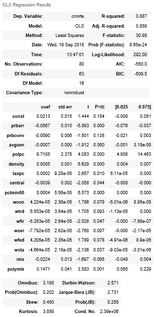**

***中期观察:***

****可调 R 平方&上述型号的 AIC 值优于早期型号**。我们将尝试删除 p > 0.05 的更多特性，并使用 RMSE 进行评估。**

**6.**模型评估采用交叉验证& RMSE****

**我们将测试移除 p > 0.05 的特征时 RMSE 值的变化。**

******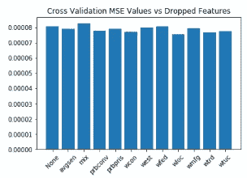**

***中期观察:***

**从条形图中可以看出，当 wtrd & avgsen 特性以及之前移除的特性被移除时， **RMSE 值表现更好。****

**但是当 wtrd 和 avgsen 都被移除时，R 平方和 AIC 数字降级。由于 wtrd 比 avgsen 具有更高的 p 值，**我们将仅从模型中移除 wtrd。****

**7.**建造最终模型****

**我们已经确定了要从数据集中移除的 9 个要素。让我们建立最终模型。**

**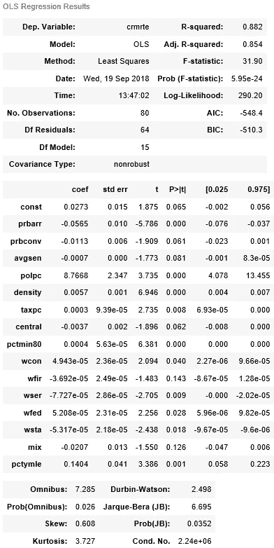**

****f)培训&模型评估****

**我们将输入数据集分为训练和测试。测试数据用于评估模型性能。**

****

***平均绝对误差(MAE) = 0.006986915112800922***

***中值平方误差(MSE) = 9.631084350128324e-05***

***均方根误差(RMSE) = 0.009813808817237233***

***解释方差= 0.8203755208633289***

***中位数绝对误差= 0.004534970460507454***

****g)得出结论****

**a)注意“**实际犯罪率”与“预测犯罪率”的关系图是线性的**。这意味着，犯罪率预测几乎与实际犯罪率相同。因此，线性模型工作正常。**

**b) **特征工程:**将位置特征(西部、中部和城市)组合成分类特征，或使用决策树的真实值的特征宁滨，或像对数一样的**泛函变换**可以增加预测精度。**

**c)为了改进模型，最好通过执行 EDA 来设计特征，以识别误差较大的地方。**例如:**误差图的分布和百分位数。
d)更重要的犯罪预测特征，如**【失业率】**应纳入到输入数据集中。**

**上述案例研究的完整代码可以在这里找到:
[https://github.com/AdroitAnandAI/Crime-Analysis-Prediction](https://github.com/AdroitAnandAI/Crime-Analysis-Prediction)**

****收尾思路****

**在上述案例研究中，我们使用线性回归来预测一个县的犯罪率。同样的想法可以扩展到预测犯罪事件，并生成热图，给定数据集中的位置或 GPS 坐标。这种不同城市的预测犯罪率热图将有助于警察通过优化分配他们有限的资源来预防犯罪。**

**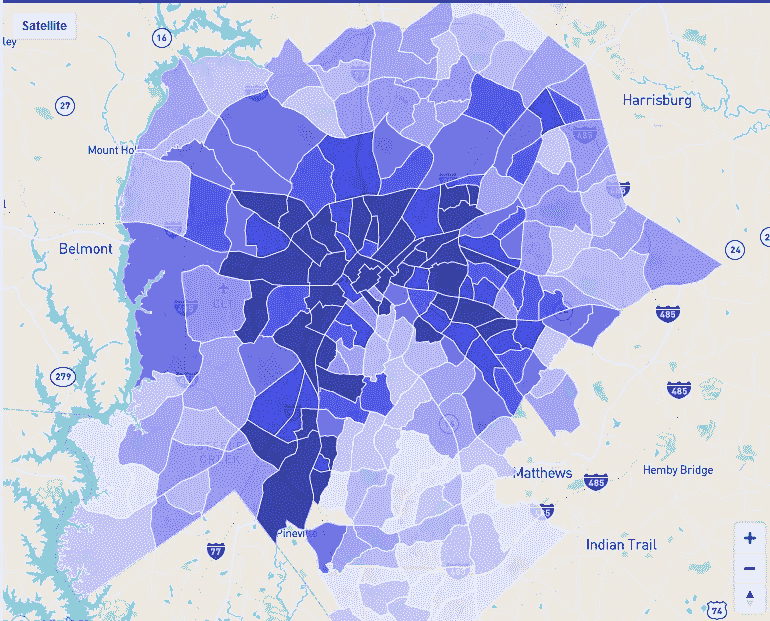**

*****Crime Rate Prediction of Charlotte, North Carolina*****

**犯罪预测不仅利用回归分析，还利用各种机器学习技术，如**随机森林、KNN、XGBoost、支持向量机(SVM)以及多层神经网络。** SVM 和多层神经网络，均优于 logistic 回归方法。[4][5]**

**除了技术方面，数据驱动警务的一个主要警告是等式两边都有人。军官应该不带偏见地将机器的建议转化为行动。**机器本身没有类似人类的偏见，但只有当输入数据是无偏见的**，否则种族貌相等问题就会浮出水面。[2]在等式的另一边，**抓捕无辜者的伦理考量和“谁应对错误逮捕负责？”的责任问题**仍未得到答复。**

**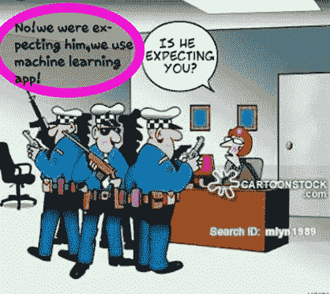**

****参考文献****

1.  **[http://www.bauhinia.org/index.php/english/analyses/314](http://www.bauhinia.org/index.php/english/analyses/314)**
2.  **[https://www . Smithsonian mag . com/innovation/can-computers-predict-crimes-2397470/](https://www.smithsonianmag.com/innovation/can-computers-predict-crimes-2397470/)**
3.  **[https://machinelementmastery . com/save-load-machine-learning-models-python-scikit-learn/](https://machinelearningmastery.com/save-load-machine-learning-models-python-scikit-learn/)**
4.  **[https://www . research gate . net/publication/316446574 _ Prediction _ of _ crime _ occurrence _ from _ multi-modal _ data _ using _ deep _ learning](https://www.researchgate.net/publication/316446574_Prediction_of_crime_occurrence_from_multi-modal_data_using_deep_learning)**
5.  **[https://towards data science . com/the-risks-of-predictive-policing-11928 a9f1d 60](https://towardsdatascience.com/the-perils-of-predictive-policing-11928a9f1d60)**
6.  **[T3【https://www.neighborhoodscout.com/nc/charlotte/crime】T5](https://www.neighborhoodscout.com/nc/charlotte/crime)**
7.  **[https://theness . com/neurology cablog/index . PHP/does-predictive-policing-work/](https://theness.com/neurologicablog/index.php/does-predictive-policing-work/)**
8.  **[https://alliance . seas . upenn . edu/~ cis 520/dynamic/2017/wiki/index . PHP？n =讲座。过度拟合](https://alliance.seas.upenn.edu/~cis520/dynamic/2017/wiki/index.php?n=Lectures.Overfitting)**
9.  **[https://www.appliedaicourse.com/](https://www.appliedaicourse.com/)**

***原载于 2018 年 12 月 14 日*[*medium.com*](https://medium.com/@AnandAI/can-machines-predict-and-prevent-crimes-25a3f6022610)*。***