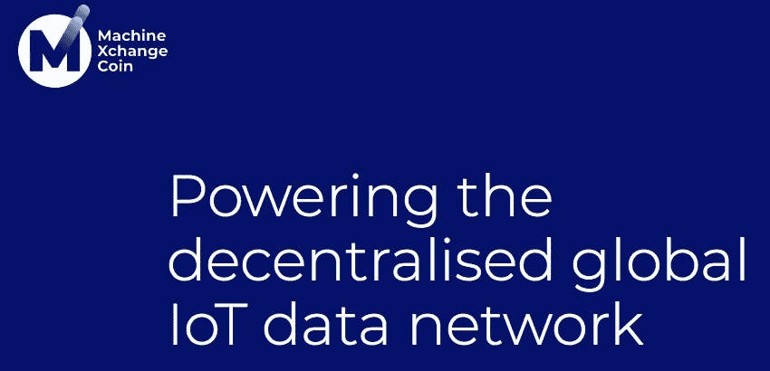
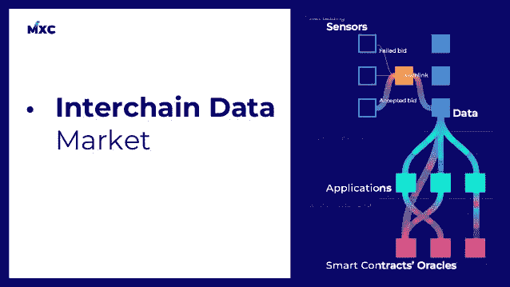

# MXC 能为非政府组织创造额外的收入来源吗？

> 原文：<https://medium.datadriveninvestor.com/can-mxc-create-an-additional-source-of-revenue-for-ngos-392c5254eb23?source=collection_archive---------6----------------------->

**“数据是新油”**。这句话是由克莱夫·亨比创造的，他创立了世界上第一个超市忠诚计划 Clubcard。即使过了十年，这句话仍然适用。

在全球化正处于巅峰的今天，公司甚至个人都需要对客户和环境条件的变化做出快速反应。数据有助于识别增长机会、客户偏好和提高竞争力。

 [## 物联网危险剪断-数据驱动的投资者

### 物联网危险剪断-数据驱动的投资者

物联网危险剪断——数据驱动的 Investorwww.datadriveninvestor.com](https://www.datadriveninvestor.com/2018/09/26/infographic-dangers-of-the-internet-of-things/iot-dangers-snip/) 

现代商业市场是一个数据驱动的环境。数据的作用是让企业领导人能够根据事实、趋势和统计数字做出决策。但是外面有这么多信息，收集和吸收正确的信息是很重要的。除了在基层工作的非政府组织，还有谁能提供可靠的数据？

# 非政府组织

非政府组织在推动农村人口的可持续发展方面发挥着重要作用。非政府组织的活动范围广泛，包括环境、社会、宣传和人权工作。他们在促进基层的社会或政治变革方面发挥着至关重要的作用，这在发展社会、改善社区和促进公民参与方面发挥着至关重要的作用。

大多数非政府组织的资金来自外部来源，如个人捐款和公司捐款。另一个主要来源是政府拨款和合同。有时，即使有这些资金，非政府组织也只能靠自己，不得不在紧张的预算下工作。他们拼命寻找额外的资金来源。这就是像 MXC 这样的区块链创业公司能够拯救他们的地方。

# MXC

MXC 是一家总部位于德国的非营利组织，凭借革命性的 MXProtocol 在物联网生态系统中崭露头角。MXProtocol 旨在解决 LPWAN(低功耗广域网)问题，旨在弥合不同基础设施之间的数据鸿沟。

根据白皮书

> MXProtocol 通过解决 LPWAN 数据冲突问题，为传感器提供智能投标系统以向 MXC 支付网络访问费用，以及建立连接 LPWAN 硬件和免许可区块链的链间数据市场，增强了 LPWAN 技术。

MXC 的另一个特点是链间数据市场。

MXProtocol 也是为了共享数据并从中获利而构建的。根据白皮书，MXC 的目标是建立一个平台，让人们分享他们可以购买的数据，有可能创造额外的收入，并激励人们添加更多的联网设备。这是非政府组织可以受益的一点。

例如，让我们考虑一个在缺水的农村工作的非政府组织。在安装 LPWAN 网关的帮助下，可以评估用水模式。例如，LPWAN 可以安装在水箱中以了解使用情况。LPWAN 可以实时传输这些数据，并可以托管在数据市场中，感兴趣的各方可以购买这些数据，以更准确地评估地面情况，从而减少资源浪费。反过来，非政府组织也因为收集和分享数据而获得经济利益。

非政府组织部署 LPWAN 网关的另一个好处是，他们可以有效地建立一个大规模可扩展的网络，提供大规模的覆盖。因此，他们可以部署更多的传感器，覆盖更多的设备，鼓励其他企业进入该地区以活跃当地经济，并且非政府组织还可以向该地区希望通过 LPWAN 网关传输数据的其他企业收费

当我们听到物联网设备、LPWAN 网关和其他设备时，可能会认为它们成本高昂，而且可能很难安装。但很少有人知道，这些精密的设备只是“即插即用”，非常经济。它的价格从 4 美元起，很容易安装，就像把一个 USB 设备插到你的笔记本电脑上，然后就可以使用了。

我不打算更深入地介绍如何轻松地设置一个 LPWAN 网关。我的一个朋友在他的最新文章中谈到了同样的问题，你可以在这里阅读。

***免责声明:请仅将此信息作为我自己的观点，在任何情况下都不应被视为财务建议。在做任何决定之前，请记住 DYOR。***