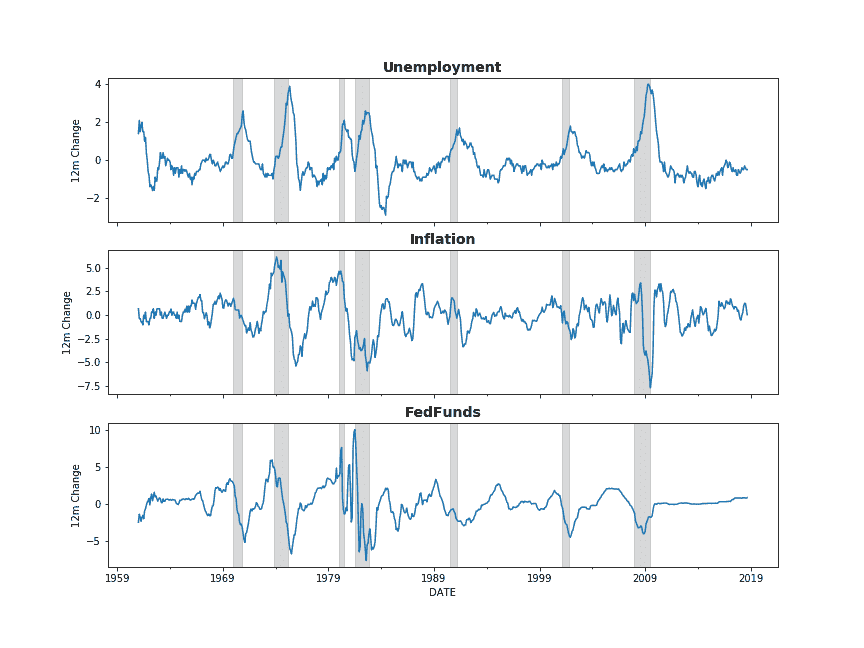
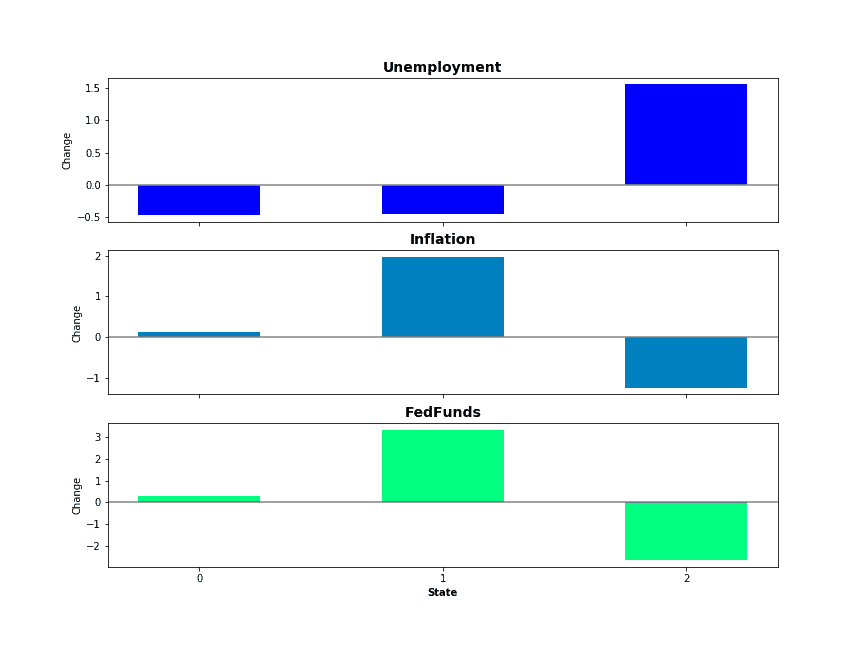
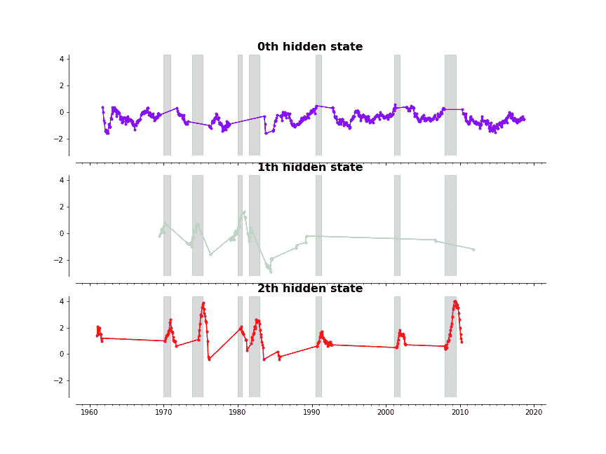
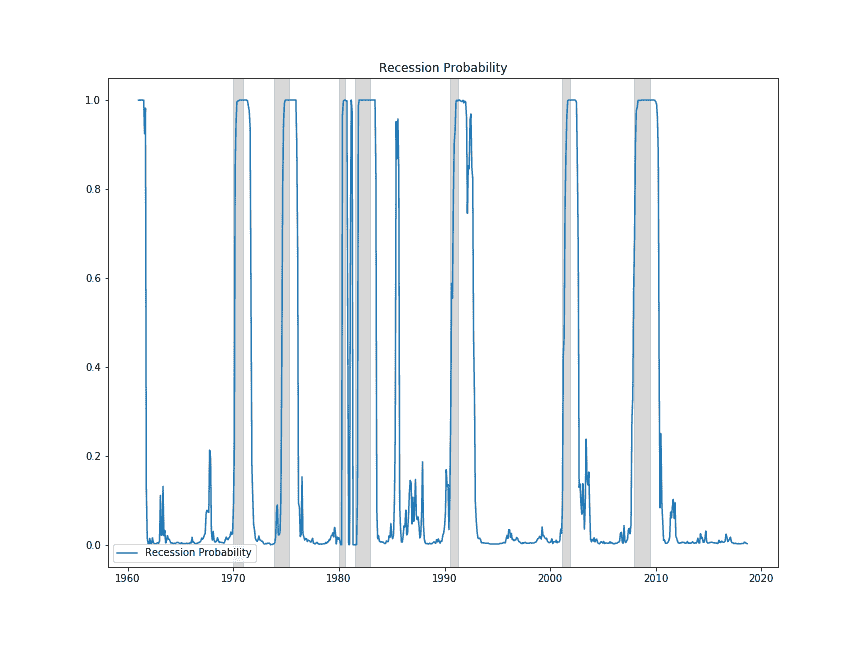
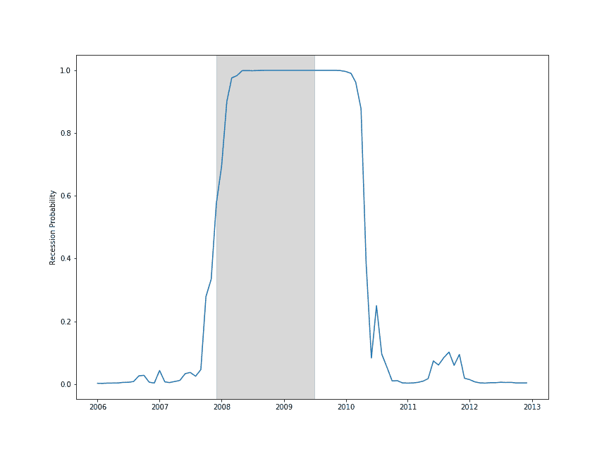

# 我的笔记本电脑能代替 NBER 吗？

> 原文：<https://medium.datadriveninvestor.com/can-my-laptop-replace-the-nber-f74e2fe3f405?source=collection_archive---------23----------------------->

NBER 官方确定了衰退的日期，他们用自己的判断来判断衰退何时开始，但大问题是他们回溯了自己的判断。换句话说，他们告诉你经济已经进入衰退了。这方面的一个很好的例子是大衰退，他们认为大衰退开始于 2007 年 12 月，而在 2008 年 12 月，也就是大衰退开始一年后。

在现代算法和数据的今天，这对我来说似乎是过时的，所以我创建了一个[隐马尔可夫模型](https://en.wikipedia.org/wiki/Hidden_Markov_model)来几乎实时地确定真实的经济状态，只使用三个变量，我认为这比 NBER 更好，当然也更有用。

首先，我们需要得到数据。幸运的是，pandas 使得从圣路易斯美联储获得数据变得非常容易，所以我将失业率、通货膨胀率和联邦基金利率追溯到 20 世纪 60 年代。我将使用每个变量的 12 个月变化，而不是使用非平稳水平，无论如何，这似乎在智力上更有意义。

利用这些数据，机器将能够以接近实时的方式(仅比 CPI 滞后两周左右)确定我们是否处于衰退之中。注意我没有用 GDP 作为变量之一，这有两个原因。首先，GDP 的滞后是巨大的，如果我要指责 NBER 不紧不慢地识别衰退，那么我就不能很好地使用一个有如此滞后的变量。其次，在人口减少的时代，两个季度 GDP 负增长的衰退定义似乎已经过时。极端的例子是日本，仅仅从人口统计数据来看，他们很容易出现两个季度的 GDP 负增长，但却没有陷入任何明显的衰退。总之，事实证明这三个变量就足够了

一旦我们从 FRED 那里得到数据，使用 sklearn 的[高斯混合](https://scikit-learn.org/stable/modules/mixture.html#gmm)来计算我们的状态就很容易了。我将强迫模型的手，告诉它在我们的世界中有三种状态，并让它计算每种状态的分布。完成后，每个状态的方法如下所示

状态 0 是正常状态，失业率温和下降，而通胀和联邦基金利率无所作为。状态 1 是 FOMC 让事情失去控制，失业率下降，但他们不得不提高利率来解决通货膨胀问题。对我来说，状态 2 看起来像是衰退，失业率和通货膨胀率大幅上升，联邦基金利率下降。

这些方法看起来很有希望，在我们的模型中似乎有三种经济状态与现实世界中的状态相对应。然而，如果这些状态是随机分布的，那就没什么意义了，它们应该与实际经济相对应。让我们来看看各州失业率变化的时间序列，阴影部分是 NBER 的衰退

正如你所看到的，每次模型处于第二种状态时(当图表上有点时)，除了在 20 世纪 80 年代后期有一次温和的增长外，周围都有一次衰退。虽然开始日期和结束日期可能略有不同，但该机器能够仅用这三个变量找到每次衰退。

这个模型的一个好处是，我们可以计算每个时间点处于某个状态的概率。因为我们正在讨论取代 NBER 的衰退日期，所以看一下处于状态 2，即衰退状态的概率是有意义的。

除了上世纪 80 年代末的假警报，你可以看到，它在应对衰退方面做得相当不错。事实上，我认为它比 NBER 做得更好，让我们更详细地看看大衰退。

正如你所看到的，它同意 NBER 关于衰退开始的观点，该指标首次超过 0.5 是在 2007 年 12 月(它在几个月前就开始发出警告)。最主要的区别，也是最重要的，是这个信号是在 2008 年 1 月 16 日星期三发出的，而不是 2008 年 12 月，我们在一年前就收到了衰退通知。

看起来我们陷入衰退的时间比 NBER 更长。我个人同意这个模型，经济疲软的时间比 NBER 所说的要长得多。看起来一台机器可以使用有限的数据来确定衰退的日期，可以做得更快，而且(至少对我来说)可以做得更准确。