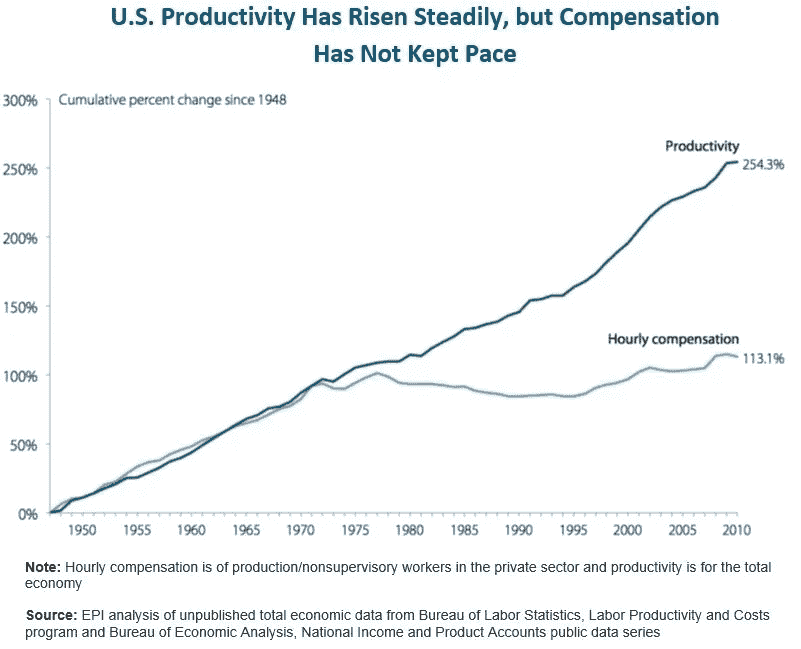
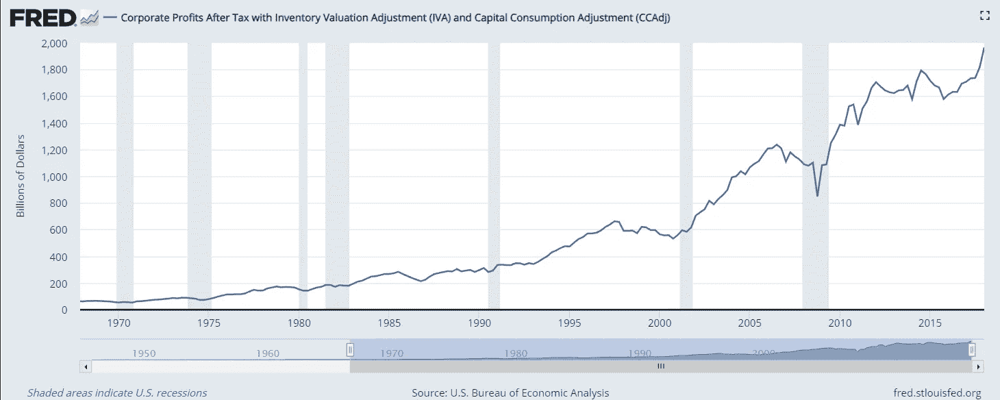
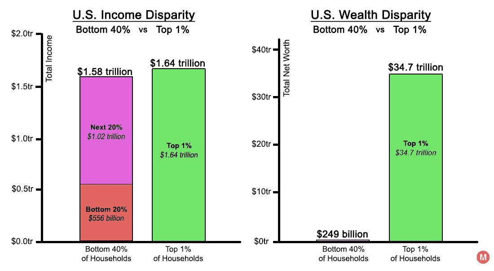
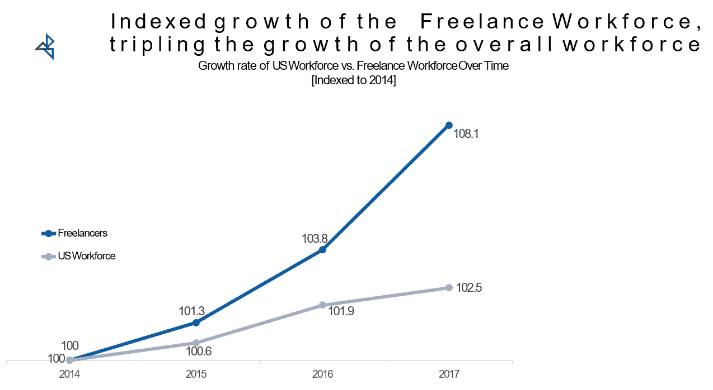
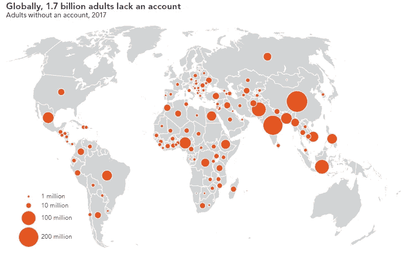
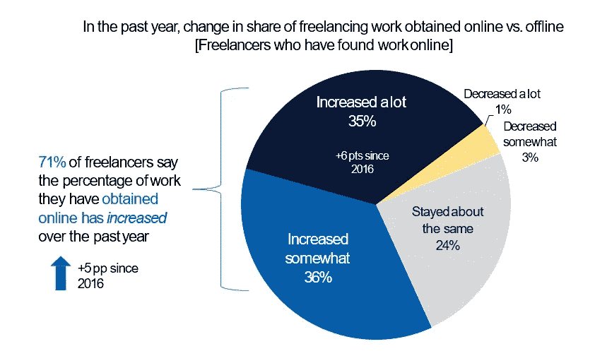
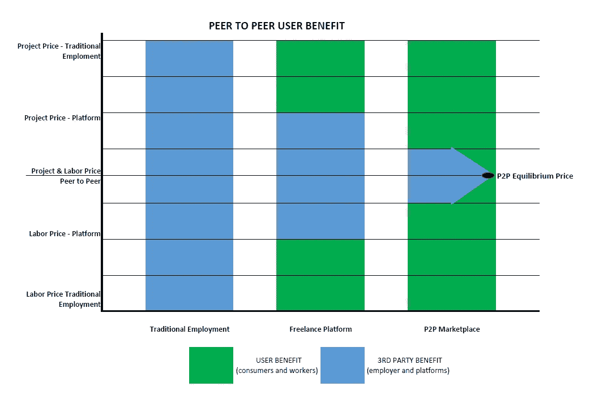

# P2P 网络能阻止贫富差距吗？

> 原文：<https://medium.datadriveninvestor.com/can-p2p-networks-stop-wealth-disparity-9c9f07ff98c7?source=collection_archive---------6----------------------->

谁能记得战后的美国？一个有白色尖桩栅栏、高薪工作和可靠的圣诞奖金的时代。面对现实吧，它不会回来了，也许永远不会。对一些人来说，这是一个真实的记忆，但对年轻一代来说是完全陌生的，他们更有可能接受一份工作，因为有一个很酷的自助餐厅。

Productivity and Employee Compensation, BLS

从二战结束到大约 1970 年，非管理人员的时薪与经济生产率同步增长。这段时间为工人提供了稳定性，他们通常会在一个领域呆上整个职业生涯，并对一家公司忠诚几十年。但是有些事情改变了。让我们快进到 70 年代中期，这标志着公司利润开始增长。利润是个好东西，只是实际工资(经通胀调整的收入)自那以来一直停滞不前。这主要是市场经济的副产品，从那时起直到今天，生产率和企业利润一直在稳步增长，而经济收益却没有惠及劳动力。

US Corporate Profits, Federal Reserve 2017

如今，员工面临以下挑战:

3%储蓄率 78%生活检查检查

工资停滞不前，医疗保健等必需品的成本上升

Wealth and Income Disparity in US, Metrocosm 2016

这些因素都导致了明显的财富和收入差距问题。全球大部分劳动力仍在金融普惠的简单障碍中挣扎。幸运的是，新兴技术提供了一个在关键时期为全球劳动力创造巨大经济价值的机会。

劳动力构成发生了变化，这种变化几年来势头越来越大。自 2014 年以来，自由职业者经济使整体劳动力增长了两倍，仅在我们测量的几个国家，就为美国经济贡献了 1.4 万亿美元，估计为全球经济贡献了 2 万亿美元。

Freelancing in America, 2017

这种现象的增长有不同的原因，对它所影响的每个全球区域都有不同的影响。发达经济体经历了自由职业，这是员工流失、强制规定和企业盈利的市场压力的结果。对于发展中经济体来说，自由职业代表着金融包容性和机遇。世界上仍有高达 35%的人无法进入银行或全球金融体系。对于这些经济体来说，自由职业代表着在全球市场上赚取收入的机会，撒哈拉以南非洲等特定地区已经证明，金融包容性能够创造经济增长。

Global Findex Report 2017, The World’s Unbanked

但是整个现存的自由职业经济被当前的金融系统本身所抑制。乐观地说，我们正进入一个全球化和互联互通的新阶段，这可能会改变这一局面。

随着自动化、机器学习和人工智能的影响，对工作场所解决方案的需求是巨大的。在不确定的“工作未来”中为劳动力确定一条道路的任务是我们最大的挑战之一。然而，这也是几十年来为全球观众创造最大价值的机会。

被称为自由职业者或零工平台的第一代互联网劳动力市场的创新，迄今为止支持了自由职业者经济的增长。消费者和员工使用这些平台联系，以获取和完成从软件开发到内务管理的各种项目。不仅是独立消费者在使用它们，最近调查的财富 500 强公司中有 4/7 已经在使用平台外包劳动力，并计划增加其使用量。

Freelancing in America Report, 2017

这些平台通过重新分配传统上由雇主获得的一部分附加值，为用户(消费者和工人)创造了价值。然而，这仅仅是对点对点或 P2P 网络的皮毛。区块链等新兴技术为开发 P2P 平台提供了机会，这些平台有可能消除对银行或现有平台等第三方中介的需求，以及它们带来的影响和税收。它们在用户之间建立了一个直接的交易渠道，使他们能够保留他们从正在执行的工作中创造的几乎 100%的价值。当然，用户会产生做生意的成本，但官僚主义的成本会大大降低或消除。

Labor and Project Prices of Employment/Work Models and Economic Benefit of Participants. As work models shift to P2P platforms, users(consumer and worker) retain economic benefits from reduced project prices and increased earnings.

当全球劳动力从工作中创造可持续财富的能力越来越落后时，新兴技术有可能改变历史进程。实现加密货币的区块链与限制官僚主义和人为影响的智能合同相结合，创造了一种重新定义工作价值主张的结构。这种结构允许通过多种方式保值。当我们着手 P2P 计划时，我们期望有多少价值？如果你仅仅通过当前行业平台的费用节省来估算价值，平均 2 万亿美元收入的 15%，那就是 3000 亿美元的潜在价值。我们甚至还没有讨论生产率的提高，因为 90%的当前劳动人口对他们的工作或新兴技术的效率和透明度的价值感到不满足。

点对点可能无法阻止全球趋势。但可以肯定的是，潜在的影响在全球范围内是显著的，像 LaborCrypto 这样的公司正在参与其中。

*原载于 2018 年 8 月 15 日*[*【medium.com】*](https://medium.com/@adamcisek/can-p2p-networks-stop-wealth-disparity-4f60cf1bacab)*。*

*原载于 2018 年 8 月 15 日*[*medium.com*](https://medium.com/@adamcisek/can-p2p-networks-stop-wealth-disparity-537588d02df1)*。*