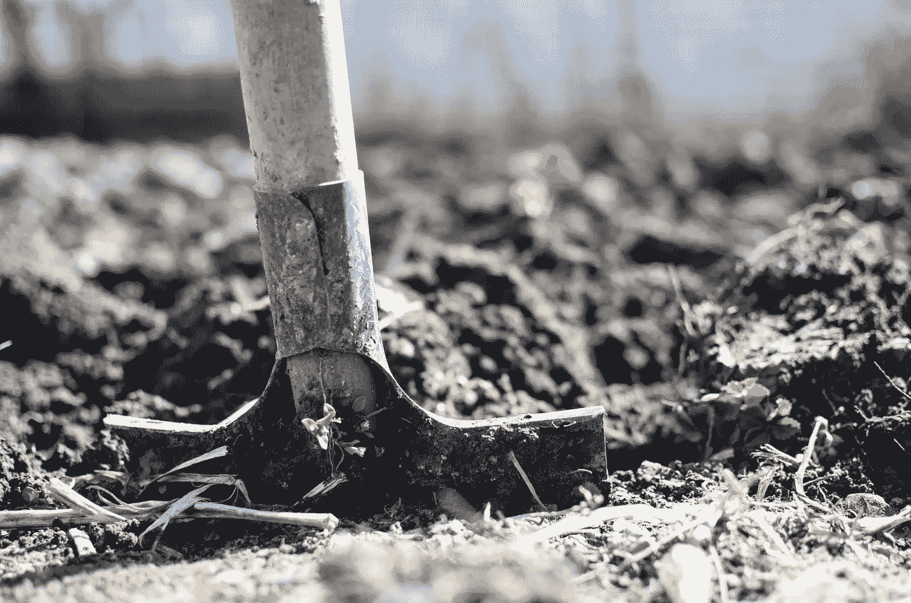

# 再生农业能逆转气候变化吗？

> 原文：<https://medium.datadriveninvestor.com/can-regenerative-agriculture-reverse-climate-change-613655477133?source=collection_archive---------0----------------------->

# 再生农业:一种可持续的农业形式

工业化农业实践对环境有着毁灭性的影响。2016 年，农业和林业占所有温室气体排放的[近 10%](https://www.ers.usda.gov/topics/natural-resources-environment/climate-change/agriculture-and-climate-change/) 。这种产量大部分来自氮基肥料和养分的使用。按照这种速度，气候变化将继续导致[灾难性天气事件](https://bunkerbasics.com/flawed-weather-warnings/)越来越频繁。我们呼吸的空气和吃的食物的质量也会继续下降。幸运的是，正在毒害我们星球的工业可以用再生农业提供解毒剂。

 [## 忘记石油吧，水是未来。-数据驱动型投资者

### 我们不会耗尽燃料的替代品。能源行业曾经是投资者的荣耀，无论…

www.datadriveninvestor.com](https://www.datadriveninvestor.com/2018/11/14/forget-about-oil-water-is-the-future/) 

T4 罗代尔研究所建议再生农业作为不可持续农业实践的替代方案。再生农业不仅仅是一种可持续的耕作方法。它可以通过捕获地球土壤中的碳排放来改善我们的地球。再生农业有可能彻底扭转气候变化，为人们提供健康的有机食品。随着再生农业的广泛采用，生物多样性将会增加，土壤将会变得肥沃。我承认，有些事情听起来好得难以置信。让我们从探索再生农业的四个原则开始。每个原则都充满了滑稽的时髦词汇，所以请原谅我。然后我们将讨论一些个体农业实践。最后，我们将总结再生农业将会遇到的一些障碍，以及我们如何克服它们。

# 再生农业的 4 个原则

# 原则 1:逐步改善整个农业生态系统

农业生态系统是生产食物的生态系统。今天，农业生态系统是靠杀虫剂、化学品和其他毒素维持的。此外，翻耕土壤的做法造成了对肥料的依赖，因为翻耕导致土壤健康退化。通过说服农民放弃这些不健康的做法，农业生态系统可以得到改善。

# 原则#2:创造特定环境的设计，做出表达每个农场本质的整体决策

并非所有的农场都是一样的，所以它们不应该以同样的方式工作。由于目前使用化肥和杀虫剂的做法，农场失去了它们的独特之处。农民应该实施对他们所在地区种植的作物有益的做法。此外，应该考虑如何养活当地人口。饮食、文化习俗和食物的可获得性应该考虑在内，并告知农场种植什么。

# 原则 3:确保并发展所有利益相关者之间的公正互惠关系

参与农业的利益相关者不仅限于农民和消费者。植物、动物、土壤和微生物都必须考虑在内。杀虫剂虽然在短期内保护植物免受害虫侵害，但从长远来看会损害生态系统。需要实施替代实践来确保农民、消费者、植物、动物、土壤和微生物都有互惠关系。这些关系将确保农业生态系统的可持续性。

# 原则 4:不断成长和进化个人、农场和社区，以表达他们的内在潜力

通过努力不断改进耕作方式，社区和组成社区的个人可以得到改善。再生农业涉及社区参与，比工业化农业包含更多的利益攸关方。这种包容性的耕作方式有助于在更大范围内取得更大的进步。

# 5 再生农业实践

# 1.免耕农业

免耕农业是一种不用犁就能种植作物的方法。如上述原则 1 所述，随着时间的推移，耕作会侵蚀土壤。在农业革命期间，耕作显得更有效率，因为它使农民能够将肥料、杂草和作物残体混合到土壤中。然而，耕作使土壤没有任何植物。这使它暴露在风和水的侵蚀下。相比之下，没有翻耕的土壤有更多更多样的生物种群，这提高了它们的肥力。

> 原状土壤类似海绵，由根和土壤生物产生的不同土壤颗粒和通道的复杂结构结合在一起[再生国际](https://regenerationinternational.org/2018/06/24/no-till-farming/)

由于土壤基本不受干扰，二氧化碳释放到大气中的速度与翻耕的土壤不同。事实上，土壤可以减少温室气体。这会将碳留在地下，这对农作物和大气都有好处。最后，通过利用在使用除草剂和杀虫剂之前发展起来的耕作方法，免耕耕作可以有机地进行。

# 2.堆制肥料

堆肥是分解的有机物。堆肥是一种自然的方式，其中有机物质被回收并重新用作土壤改良剂。农民可以购买堆肥或者自己制作堆肥。堆肥的典型成分包括水果和蔬菜的皮和残渣、老植物、草屑和其他有机物质。堆肥可以丰富土壤，使植物生长更健康、更有弹性，并减少食物浪费。

# 3.有机周年种植

有机农业实践放弃使用有毒的除草剂和杀虫剂。每年的有机种植将消除每年 300 万起农药中毒事件。220，000 例中毒导致死亡。此外，每公顷有机农业系统的二氧化碳排放量比传统系统低 [48%到 66%](http://www.fao.org/3/y4137e/y4137e02b.htm)。

# 4.动物整合

有许多[问题](https://www.ucsusa.org/food_and_agriculture/solutions/advance-sustainable-agriculture/integrating-crops-and-livestock.html)源于在笼子里饲养动物，特别是家畜。首先，奶牛粪便不会被用作农场的肥料。相反，它会渗入地下水，最终污染我们的水源。第二，不自由活动的牲畜比在牧场饲养的牲畜需要更多的抗生素。食用用抗生素治疗的奶牛生产的牛肉和牛奶会产生一个抗生素抗性群体。这可能最终导致超级细菌的传播。通过将牲畜与植物重新结合，废物水平将会下降，土壤将会变得有弹性，牛奶和牛肉的质量将会提高。

# 5.生态水产养殖

虽然我们大多数人认为农业仅限于土地，但世界上的许多海鲜也是人工养殖的。事实上，中国大约生产了[世界三分之二的](https://interestingengineering.com/these-massive-floating-fish-farms-in-china-provide-most-of-the-worlds-seafood)海鲜。许多人对鱼有很大的胃口。需求超过了自然供给，这导致了工业化规模的养鱼或水产养殖。虽然水产养殖有很多好处，但大规模的经营导致了水污染和浪费。[生态水产养殖](https://pdfs.semanticscholar.org/9394/2ebef5907bbd9cf8f33ae226c33060442ed1.pdf)就是解决这些问题的方法。生态水产养殖强调海洋生态系统的可持续性。如果管理得当，社会可以获得其所需的海产品数量，而不必应对不负责任的养殖做法的负面影响。

# 如何克服再生农业面临的障碍

# 障碍 1:根深蒂固的系统

阻碍任何变革的最大障碍之一是根深蒂固的体制。这一提议的改变并无不同。受益于现状的个人和公司会努力遏制进步。举个例子，六大农药公司出资反对一项强制营养标签声明食品是否转基因的措施。最终，这项措施失败了。然而，我们可以采取一些对策来促进改变。[杀虫剂之外](https://beyondpesticides.org/programs/lawns-and-landscapes/tools-for-change)包含了大量关于我们如何让社区参与对抗根深蒂固的系统的信息。教育、社区运动和立法将是转向再生农业的关键。

# 障碍 2:养活人口

反对有机农业的最常见的论点是，有机农作物的产量无法养活世界人口。这些说法是在缺乏可靠数据的情况下提出的。诚然，在短期内，收益率会下降。然而，一个长期的转变将导致产量与使用杀虫剂的农场大致相同，如果不是更多的话。如果这种转变伴随着食物浪费的减少，大规模采用再生农业实践就更有可能了。通过转向再生农业，农场将更适合可持续的作物生长，负面环境影响将会下降。

# 障碍 3:成本

不幸的是，再生农业要在成本上具有竞争力还需要时间。上述根深蒂固的体系以规模经济、运转良好的供应链和速度运行。对农民进行再生农业实践的教育将需要一大笔费用。此外，再生农业避免走捷径。转基因和无机肥料促进作物快速生长。随着远离这些捷径，将需要更多的劳动力和可持续创新。为了实现再生农业的好处，短期政府补贴是必要的。越来越多的人意识到当前耕作方式的负面影响，可能会促使政府采取行动。也就是说，我再次认为，社区需要向他们的立法者施加压力，以规范这种转变。随着运动的发展，规模经济将会实现，强大的供应链将会建立，作物生长的速度将会提高。降低再生农业的成本需要长期的承诺。

# 再生农业能逆转气候变化吗？

随着再生农业的广泛采用，碳排放可以被隔离在我们的土壤中。我们生态系统的健康状况将会改善，我们的食物质量将会提高，我们的世界将会减少污染。幸运的是，我们开始看到一些公司宣称再生农业的好处。例如，[厨师创业](https://cooksventure.com/)，正在出售牧场饲养的鸡。这些鸡是以可持续的方式饲养的，对我们更好，也更美味。我希望看到其他公司加入到应对气候变化的战斗中来。

最初发布于 https://bunkerbasics.com/regenerative-agriculture/