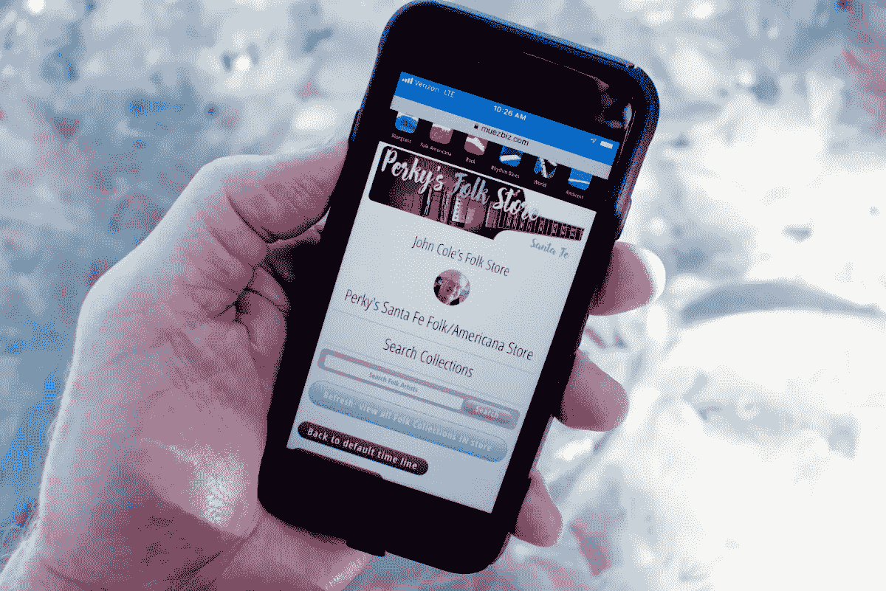

# 地区数字内容代表能赚钱吗？绝对的。

> 原文：<https://medium.datadriveninvestor.com/can-regional-digital-content-reps-make-money-absolutely-5df3460e9b20?source=collection_archive---------20----------------------->

A local rep representing a world of member uploaded digital content.

## 在你的邻居中代表其他人的数字创作。

对数字内容的访问推动了可能性。想象一个任何人都可以通过分享他们喜欢的东西来赚钱的世界。想象一下，有一个全球的代表对上传到网络上的内容感兴趣，他们可以靠这些内容茁壮成长。今天的限制是过去理解的结果:建立一个商店，然后推广它。第一个拥有大量银行账户的人通常会胜出。如果一个商店只是为数百万人提供访问所提供内容的途径，让其他人参与进来，通过分享他们的热情来赚钱，会怎么样？

提供数据(信息和数字产品)的方式已经大大扩展。我们希望如何分享数据，如何从结构上解决问题，远离主流的网络零售模式，需要扩大对能够在他们的区域社区内发挥杠杆作用的人的访问。

# 为什么高效访问很重要？

互联网改变了一切，人们、作者、音乐家和代理人上传内容，希望大规模发行。对于音乐人的来源包括:iTunes、亚马逊、混响国度、音云、乐队营地、潘多拉…等等。

上传我自己的内容，我总是觉得，“好吧，谁去市场约翰科尔…没有人”？苹果会吗？亚马逊？也许潘多拉星球，如果我成功的话。大多数情况下，我不这么认为。我的营销选择是:自举、付费、祈祷。新人去哪了？

所有这些模式都依赖于传统的路径，内容提供商建立一个商店(我们会给你一个免费的网页)，或者上传到看门人；让内容提供商去推销他们的产品。一些在线零售商确实填满了我的电子邮箱。就我个人而言，我宁愿按我的方式比赛，而不是他们的。

我更喜欢一种更平等的营销方式，而不是模糊的承诺，比如，“来我这里吧……我会让你知道的，因为我很大。”我喜欢，“嘿，各位，这是我的东西。你想要一些现金和你的朋友分享吗？

随着数百万人能够创作内容，旧的标准已经不堪重负。起初，搜索参数非常简单。亚马逊从字母 a 开始，随着时间的推移，cleaver 算法发展起来。几乎不完美。肯定更好。

尽管如此，大型搜索引擎几乎无法领先于每个人设备上的海量数据。即使在今天，在亚马逊上搜索滚石，你也会找到从服装到音乐的 70000 个匹配项。在网上搜索，你会得到 211，000，000 次点击。我相信这是 fare 的结论，70，000 点击超出了我们的有机自我，即使许多网站已经介绍了一些方法来完善搜索选择滚石服装，或书籍等。

嗯……那个小家伙怎么了？他们有机会吗？嘿！建立一个网站，希望你认识的人会蜂拥而至。SEO 是什么？

# 将道路带向地球

当我键入这些单词时，我看到了我的手。凝视显示器，点击进入连接的地球仪…从简单到超越。

我一直相信把所有这些算法带到现实中来是很重要的，带到我能看到它、闻到它、听到它、甚至触摸它的地方。也许 AI(人工智能)会取代直接需求。最终，我不这么认为。毕竟，我们就是我们。

这就是为什么我如此强调重新定义搜索参数的重要性，以强调我们在自己社区内的利益。

我们的“老大哥”社交网站确实做得很好，将当地人连接到混乱中，允许链接到第三方网站。然而，他们很大程度上忽略了现实的另一面，一个朋友的本地朋友可以访问代表全球上传的内容。当然，亚马逊不想分享他们从数字内容中获得的利润。

从资本主义的角度来看，为社区带来更多价值的一种方式是，为人们的享受付费。是的。付钱让人享受？

我们的天性是寻找。尽管有些人，比如我，没有太多时间在树林里闲逛。我们喜欢新的发现，包括服装、音乐、艺术…

今天，我们有这么多人愿意上传内容，希望有所发现。我们买下了世界会向我们走来的幻觉。抱歉，不会的，苹果不会花一毛钱投资，除非内容能给他们四倍的回报。

任何人，包括上传数字内容的人，都从朋友和邻居可能听到现场表演或诗歌朗诵的社区开始。这些都是市场营销的基本要素，被神秘分销的大供应商们大大地迷失在大众分销的期望中。

# 如何选择？

这就是利益发挥作用的地方。先从地区说起。然后根据用户的一般兴趣提供预定义的结构，比如音乐杂志。建立一个捕捉两者的社会模型… tada！

移动到成员区域之外的内容可以由用户定义的桥或俱乐部控制，向其他区域城市居民的世界显示激发的兴趣以供选择。

数据更容易管理。数据是围绕兴趣在本地生成的内容，具有全球访问的手段。一个朋友推荐了一首他们在网上纽约俱乐部听过的好歌。

# 《老友记》能代表一首喜欢的歌赚钱吗？

是的。一切都取决于数据是如何建立的，最终结果的目标。

曾几何时，美国几乎每个城镇都有唱片店，然后大的特许经营出现了。时间又变了。现在，任何人都可以在自己的社区中建立自己的唱片商店，并在本地进行交流和分享，还能享受全球覆盖的额外好处。

从基层开始，然后在一个设计互联的世界中有机地延伸。过去没有实体的唱片店正在回归。

*约翰科尔，*[*Muezbiz.com*](http://muezbiz.com/)

通过向邻居代表支付会员出版音乐的份额，努力将音乐出版业从边缘拯救回来。

[Muezbiz](https://www.muezbiz.com) *是一家创业公司。“在音乐对话中结识当地朋友。分享你喜欢的音乐来赚钱。”现在从当地的某个人那里购买按地区过滤的感兴趣的媒体。*

*所有加入的新成员都被转发到圣达菲民间/美国对话社交时间线，以了解网站如何运作。可以通过顶部成员名称下的首选项菜单随时更改默认值。*

我更多的流浪:

[*启用愿景，鼓励可能性*](https://medium.com/datadriveninvestor/enabling-visions-encouraging-possibility-2171356fd2d7)

[*里面的音乐家*](https://medium.com/@john_cole/the-musician-inside-f7d221fdbff0)

[*音乐营销:启用“口碑”*](https://medium.com/@john_cole/music-marketing-enabling-word-of-mouth-7f3451c845da)

音乐家:每卖出一美元赚 90 美分？是啊！

如果全美国的邻居都可以分享音乐内容，那会怎样？

[*小费罐:字面意思小费罐*](https://medium.com/@john_cole/the-tip-jar-literally-the-tip-jar-fc13c8757a89)

[*为了对音乐的热爱:一起成长一个社区*](https://medium.com/@john_cole/for-the-love-of-music-growing-a-community-together-b4773e33bc43)

[*出于对音乐的热爱:为什么做音乐人谋生这么难？*](https://medium.com/@john_cole/for-the-love-of-music-why-is-it-so-hard-to-make-a-living-being-a-musician-4a7af7fcd07)【http://www.track.datadriveninvestor.com/InfoSplit】T42

