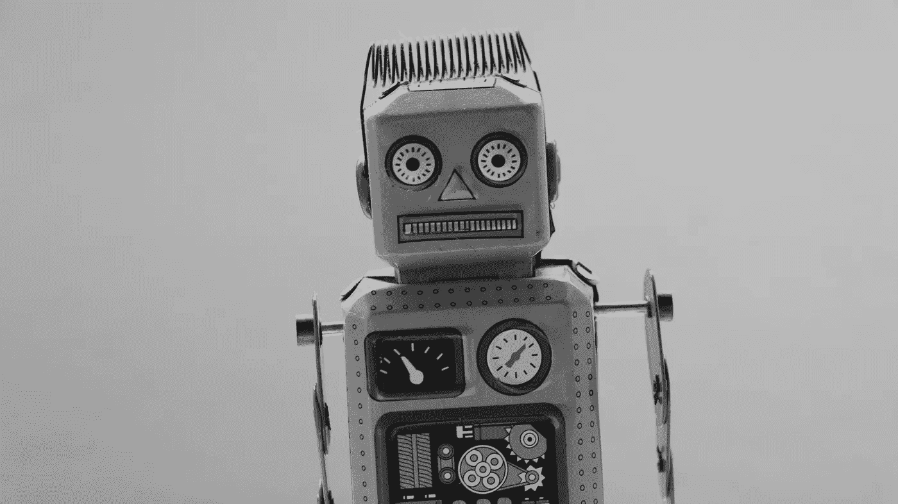
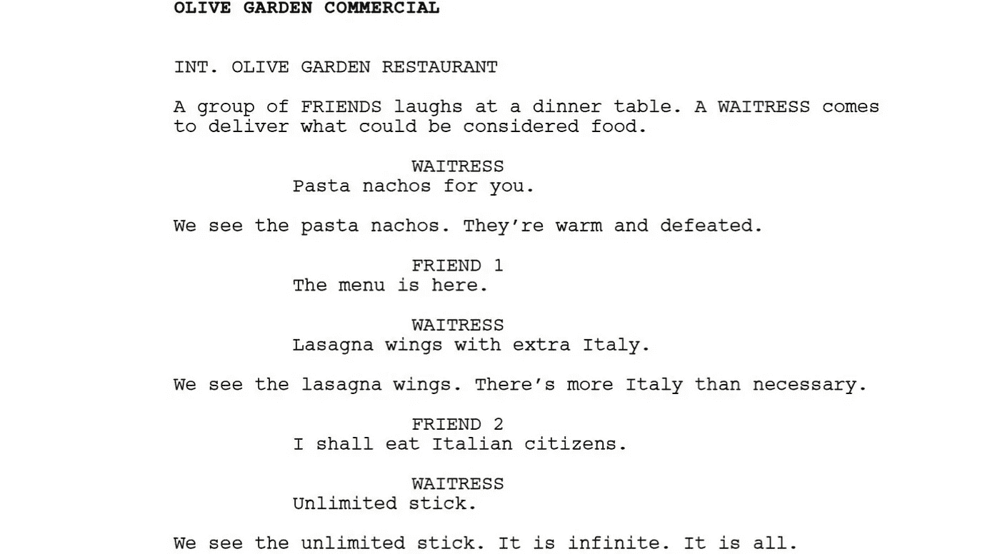
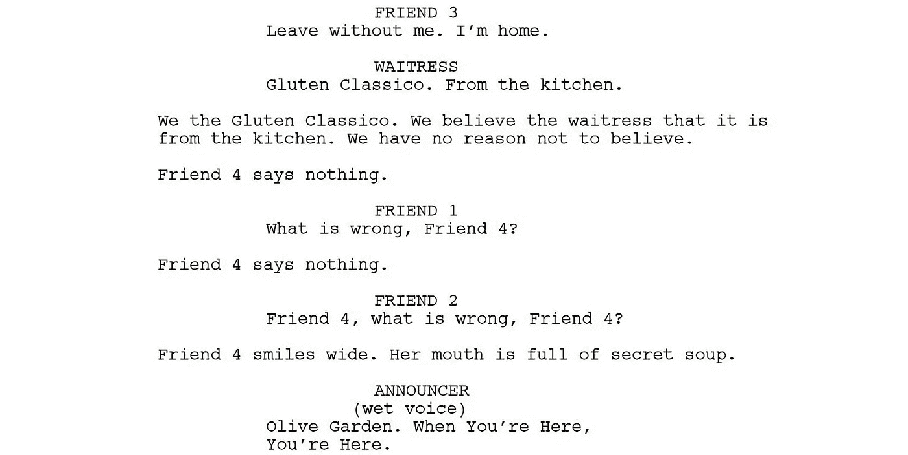

# 机器人能成为下一代广告商吗？

> 原文：<https://medium.datadriveninvestor.com/can-robots-be-the-next-gen-advertisers-96596c2485ad?source=collection_archive---------11----------------------->

我们会选择人工智能而不是人类智能吗？机器人会成为广告职业者的破坏者还是一帮帮手？

> “未来的广告代理发展将基于算法。”—松坂顺

这是否意味着广告商的未来岌岌可危？还是他们必须找到一个巧妙的方法来解决问题，这样他们才能在这个行业生存下去？

在深入研究广告的命运之前，让我们先了解一下松坂是谁，以及为什么他预言算法将主宰广告公司的发展。2015 年，作为麦肯日本办公室的创意策划人，松坂接受了一项挑战，创造了世界上第一个有能力导演电视广告的人工智能创意总监。该团队首先从过去 10 年日本最大的颁奖典礼的解构商业广告中收集了一个数据库，然后通过绘制和标记广告的每个元素来理解是什么使它们成功。糖果英雄蒙德勒兹(Mondelez)同意成为第一个为其 Clorets 薄荷标签试用新的人工智能创意总监的客户。最终，麦肯创作了两个广告；一个是由机器人创造的，另一个是由该机构的人类创意总监仓本美鹤制作的。客户被要求列出他们希望出现在广告中的元素，然后机器人在数据库中寻找想法，在人类实际产生后，最终产生创意。这两个广告随后都进行了全国性的投票，潜在消费者观众可以为他们喜欢的广告点投票，人工智能创意总监以 46%的差距落选。尽管该广告从未在电视上播出，但在 2017 年，当它在英国广告商之声 ISBA 向 200 名广告高管展示时，他们投票支持由机器人执导的广告。显然，会议中的高管不是目标，然而，这个实验证明了人工智能是多么有创造力和有趣。

今年早些时候，美国作家兼喜剧演员基顿·帕蒂(Keaton Patti)强迫一个机器人观看了 1000 多个小时的佛罗里达州休闲家庭餐厅橄榄花园(Olive Garden)的广告，然后让它编写自己的剧本。结果变得既有趣又令人震惊。最后，谁能想到一家家庭餐馆的广告会有如此大的恐怖潜力呢？

Script for Olive Garden’s commercial, written by an AI

几个月后，汉堡王遵循帕蒂的流程，为该品牌的新活动创建人工智能生成的广告位。这家快餐巨头决定通过分析成千上万的快餐商业广告和行业研究的竞争报告，训练一个具有高级模式识别的人工神经网络。广告通过无意义的脚本吸引注意力，目的是提供乐趣，让人们谈论品牌并在社交渠道上分享视频。

从长远来看，使用一种策略来通过人工智能生成的广告点传递笑声对品牌来说会是一种成功吗？我真的很怀疑。最终，就像任何其他趋势一样，它可能会打断这个行业，并围绕这个话题创造一段时间的对话，但不会破坏它。那我们真的需要害怕吗？

> 在 B2B 营销人员中，53%的人认为人工智能将通过提供对以前活动的更详细分析、识别趋势以及提供更多个性化和定制化来提高营销的有效性。EverString 和亨氏营销公司的调查

抛出这个事实，就在几天前，豪华日本汽车制造商雷克萨斯，已经为他们的新雷克萨斯 ES 发起了一场运动；由奥斯卡获奖导演凯文·麦克唐纳拍摄，由 IBM 的沃森人工智能系统开发，证明了人工智能可以成为继承广告中大胆讲故事方法的有力工具。

沃森被用来分析 15 年来赢得戛纳狮子奖创意奖的汽车和豪华品牌广告的镜头、文本和音频，然后确定情商和娱乐奖励点的共同元素。与汉堡王的过程相比，数据库的创建更符合逻辑；有固定的界限，将行业的例子缩小到那些被认为是成功的例子。人工智能机器人沃森(Watson)编写了剧本和大纲，现场导演麦克唐纳(Macdonald)表示，剧本描述得非常详细，然后创意机构 The& Partnership 构建了完整的故事。这一点是感人的情感元素，如日本工程师 Takumi，当他看到汽车离开工厂时哭了，这些细节在汽车广告中乍一看有点荒谬，根据沃森的发现，成功的广告中有内在的情感需求。

雷克萨斯活动让我们对人工智能时代人机将如何合作有了很多见解。所以在这种情况下，我不是很赞同松坂。计算机不会真的取代创意专家，至少在未来几年内不会，但机器学习和人工智能肯定会成为强大的工具，通过非常详细的分析来建立良好、强大和符合逻辑的故事，这将吸引和吸引目标受众，并在社交渠道上创建沉浸式对话。