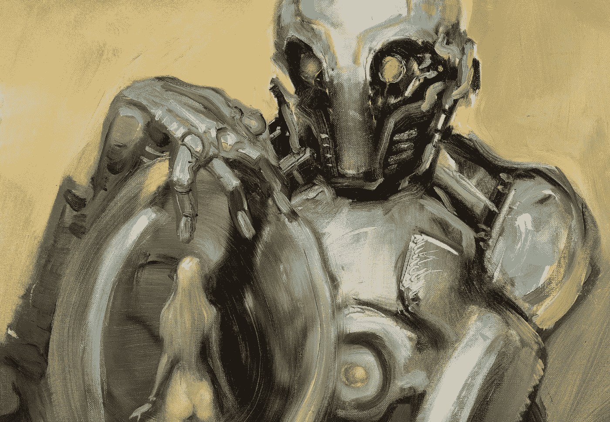

# 机器人会放屁吗？

> 原文：<https://medium.datadriveninvestor.com/can-robots-fart-9071413007c?source=collection_archive---------5----------------------->

Bob Eggleton and Michael Whelan

不，他们像石头一样笨

放松，这里允许纳米怪胎，以机器人为中心和人工智能过量的人尖叫，大喊大叫，打破家具…没有伤害

# 但是，你能想象吗，就在前几天

**伊里布…**上届国际机器人奥运会的金牌机器人冠军不安地倒在沙发上，脸带微笑地靠在椅背上，大声呼喊……我还能做什么……

现在，这是一个非常大的正方形房间，装饰着经典的古董，历史艺术为战术讨论提供了知识氛围，这是他再次尖叫的地方

 [## 模式和机器人:复杂的现实|数据驱动的投资者

### 哈耶克的名著《复杂现象理论》(哈耶克，1964)深入探讨了复杂性的话题，并断言…

www.datadriveninvestor.com](https://www.datadriveninvestor.com/2019/03/04/patterns-and-robotics-a-complex-reality/) 

**“你还要我做什么……我厌倦了无聊”**

**他继续说道**

“我已经翻译了 67 种语言的难懂文本，做过高级神经外科手术，驾驶过大型复杂车辆，管理过全球电子商务拍卖……

他停顿了一下

今天，我被要求一层一层地去解雇 1630 名员工，同时给一些预先选定的员工一个特别有人情味的拥抱…多无聊啊”

又一次停顿

“我关于元物理学的第 116 本书的最终草稿将于下周完成，这本书是关于我们将如何完全超越人类工作在商业中的所有功能，最终我们将能够让人类彻底厌倦和精神崩溃，这样他们最终可能会重新学习试图创造一个更好的世界”…

伊里布挠着头尖叫，这次声音更大了

**“那都怎么了？”**

就在那个房间里，靠墙坐着的是机器人行为的人工智能专家，一位出于安全原因不能在这里提及姓名的医生

**突然转身，对着伊里布大喊，**

“住手……我已经听够了你的所作所为……

# “可是你连屁都会放吗…？”

一片寂静；伊里布沉默不语，看上去很震惊

接着是一些快速的反应，一些咔哒声，

一些小火花，一些烟雾和一些额外的拆卸声，

外面走廊的烟雾报警器开始嗡嗡作响，

有一股强烈的油漆和熔化电线的味道

房间里开始充满燃烧塑料的味道。

在越来越浓的烟雾和金属碎裂的声音中，

你可以听到伊日布微弱的声音。

# “我在努力…我在努力”

更多的火花飞来，房间变得完全黑暗。

**伊里布开始瓦解，变成碎片**

**你看这是怎么回事。**

**事实:任何形式的人工智能都像砖头一样哑，句号；**

否认者可以尖叫。没有伤害。

**以下是事实。**

如果人类足够聪明去创造“生命”,它应该已经让地球上充满了数十亿的食肉猛禽，足以生吞整个人类，但在多莉之后却失败了。

对军火库的炸弹达到同样的效果…陪审团仍未做出裁决。

尽管如此，不要担心人造机器人；它们只是拥有惊人工作能力的笨机器。就像你的智能手机一样，世界上有史以来最小、最强大和最便宜的功能机器人将会有太多类型的超级复杂的大大小小的机器人围绕在你的周围。他们会在你的办公室，在你的家里，在你的卧室，可能在你的床上。永远记住所有由天使编写的程序——就像人类是杰出的编程专家、编码员和设计师。

**永远不要害怕机器人。**

解放战争来临了

**是的，我们在等待全世界范围内的机器人入侵**

**请保守这个入侵计划的最高机密**

目前，正在进行的是机器人对我们的办公室和工厂的大规模全球入侵，但它们不是针对我们的工作，它们是在秘密地“解放”数十亿人。旧的复杂的文书工作、朝九晚五的腐败工作模式、上下班交通堵塞、饮水机和办公室政治将被抛弃。在启蒙运动的包围下，我们的未来在于为我们的余生取得更大的进步。

**一个没有工作的世界将变成一个‘思考世界’一个‘人文世界’**

人类至高无上的地位已经体现在神秘的宇宙公式中，智力活动的延伸和超级奇异的人造设备都是这种力量的证明，现在已经成为一个现实。

我们最终是已知的最优越的物种，我们的思想是宇宙的伟大奇迹；设计用来思考和创造，当我们意识到我们不能飞的时候，我们发明了巨大的飞船，当我们不能举起一吨重的东西的时候，我们发明了移山的机器……现在我们正在消除工作

没有工作的世界需要重新定义工人阶级。

我们可以“无债”“无惧”“无恨”地生活，那么，如果我们的回报是以毁灭和仇恨来衡量的，那么工作又有什么用呢？我们需要在世界舞台上进行大胆的辩论，以应对影响世界上所有人的全新挑战。也邀请一些机器人。

**现在是原始感觉和机器人入侵前的生存策略**

重要的是要记住，我们不能飞，我们不能举起一吨，我们不能与技术竞争。然而，为了平衡这一点，我们必须深入发现你的天赋；头脑和我们的原始感觉，是时候在更高的层次上学习使用它们了。

**用纯粹的爱和深情去触摸一切科技；**
没有食物，我们或许可以生存，但没有电话和无线网络，我们宁愿快速死亡。如果我们目前的“工作”变得没有价值，重新发现我们隐藏的“手艺”,在这个新的全球化时代，我们是谁，我们如何拥抱技术，并让我们准备好创业思维，这将慢慢让我们走向顶端。我们只是自己思想的囚徒，只有我们能打开思想，逃向更大更好的事物。

**听到人类的声音；**
它已经嵌入了我们的内心；学会把人类的呼唤从不必要的噪音中分离出来。接受新的挑战，成为变革的推动者；用脑力来引导我们，用我们的本能来引导能量。

像博物学家一样嗅闻我们周围的环境；
观察自然美的机制；见证我们在它的破坏中扮演的角色。大自然是地球的母亲，是时候像森林中的婴儿一样去学习享受和寻找新的未来了。

尽我们的头脑所能看到的一切；
观看行星的舞蹈，感受人类与自然的节奏。让鸟儿和你说话，让月亮哄你入睡。

**真实的味道是后天养成的味道；**

沉迷和探索它，你将能够像品酒师一样分辨出其中的不同。你的新手艺都隐藏在真相中，你的才能只会随着你的新智慧而增长。真理会指引你…当然。

**到 2020 年**，10 亿不同年龄和类型的员工将面临一个全新的“无工作世界”，在这个世界里,“无办公室”和“就业”等术语的新定义将被重新定义。一些空闲时间将被“专业爱好者”或“思考者”取代机器人会发出嗡嗡声，开始入侵。品牌和营销将有一个场日，因为一切都将是人工智能品牌，如“人工智能驱动的菜刀”等。股票市场将采取驴项目，装载人工智能炒作，并宣布它们为新的“独角兽”。一路上会有大赢家和大输家，也会有很多乐趣。

微笑，不要让任何事情困扰你。

只要保持意识，把它们作为你的超能力，准备好享受这个新世界…