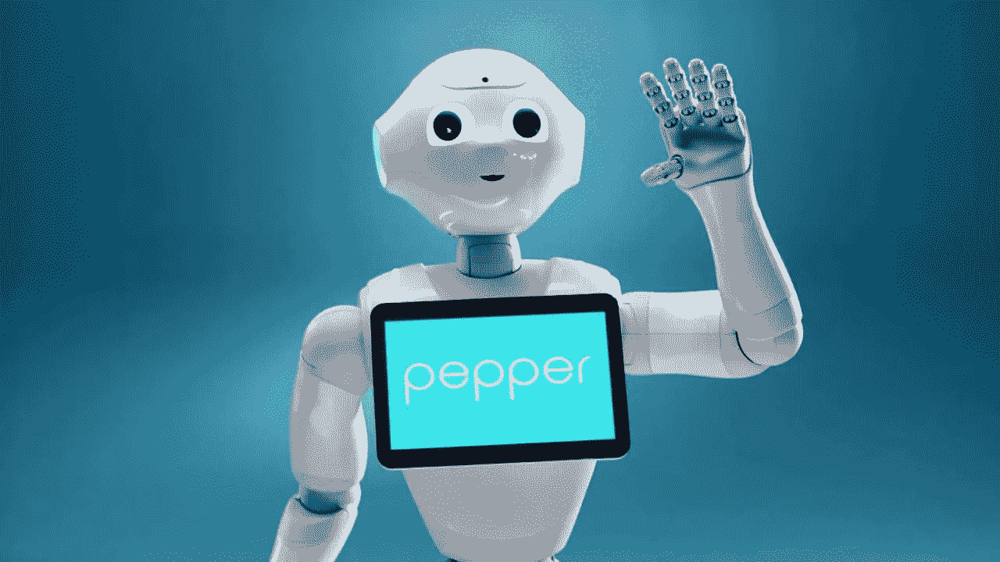

# 机器人能感受情感吗？主演:皮耶朱利奥·劳里亚诺

> 原文：<https://medium.datadriveninvestor.com/can-robots-feel-emotions-featuring-piergiulio-lauriano-5f21df88ba45?source=collection_archive---------10----------------------->

## 如果你在考虑和机器人约会，这是给你的

Credit: [HBO](https://www.hbo.com/)

***机器人能感受情绪吗？***

让这个问题在空气中回荡，然后思考。哦，看，我们已经有答案了。

不，他们感觉不到情绪——至少，**现在是** *。*失望？根据创新者和机器人工程师 Piergiulio Lauriano 的说法，我们还远远没有创造出能够真正模仿人类步态的人形机器人。

如果我们目前甚至不能期望他们像人类一样走路，那么我们怎么能期望他们感觉像人类呢？当然，有些人在他们的约会生活中喜欢无情的人——所以如果那是你，那么对你有好处。但是如果你像大多数人一样，想要某种真正的依恋作为回报，那么在第一次约会之前继续阅读。

## **都是算法而已**

> “我们可以假装你们将要进行一场情感对话，但这仍然只是一种算法。它只是对你面部动作、声音语调的模式识别……归根结底，就是能够对事物进行分类。”—皮埃尔朱利奥·劳里亚诺

我们(人类)是非线性思考的。目前，计算机不擅长非线性思考——它们进行平行思考，用[试探法](https://techterms.com/definition/heuristic)填补空白。阻止计算机进化到非线性思维的一个障碍是需要巨大的能量来促进这一点。

计算机把一切都简化成一种可以通过算法识别的模式。然而，人类不会这样做，因为我们复杂的构成与机器有很大不同。

## ***主动性***

在某些方面，[机器可以主动行动](https://www.google.com/url?sa=t&rct=j&q=&esrc=s&source=web&cd=3&ved=2ahUKEwjViJzXuareAhVDSq0KHSQmCA4QFjACegQIBxAC&url=http%3A%2F%2Fdigital.csic.es%2Fbitstream%2F10261%2F97711%2F1%2FProactive%2520behavior.pdf&usg=AOvVaw29TfRLA7L2YFNVoAEy4wwH)——尽管说到底，这只是另一种算法。看起来[主动](https://www.ijcai.org/Proceedings/16/Papers/477.pdf)是可以通过[利用](https://www.tandfonline.com/doi/abs/10.1080/01691864.2014.916628) [神经网络](http://news.mit.edu/2017/explained-neural-networks-deep-learning-0414)实现的事情。

> “我们来谈谈人脸识别。我训练我的电脑识别男性和女性。我给我的神经网络输入了一组训练集，并告诉网络‘这是雄性，这是雌性。’我在电脑的“大餐”中提供了数千张照片。最终，它开始识别训练集之外的东西。关于学习部分，他们分类得越多，就越好。算法用的时间越长，改进越多。”—皮埃尔·朱利奥·劳里亚诺

最终，随着计算能力的增长和[量子计算](https://www.research.ibm.com/ibm-q/learn/what-is-quantum-computing/)等的进步，机器和人类行为之间的差异将会缩小。

[Credit: Softbank Robotics](https://www.softbankrobotics.com/us/pepper)

## ***实际预测***

Piergiulio 预测，我们还需要 30-50 年才能创造出看起来更像真人的机器人。然而，他确实认为，我们与服务于更多实际用途的智能机器人的互动将会增加——特别是在医院和家庭中。

软银机器人公司设计的像 Pepper 这样的家庭机器人预计会大受欢迎，而人工智能和机器人正在对医疗保健行业产生影响。

机器人可能最终会进化到可以约会(以大多数人的标准来看)，但是…

“情绪要困难得多。机器人能想出自己的钢琴演奏风格吗？也许……但这仍然只是一个过程。

# 你会和机器人约会吗？在这里参加[我们的](http://omnidya.com/)投票[。](https://twitter.com/Omnidya_ai/status/1056705345651765249)