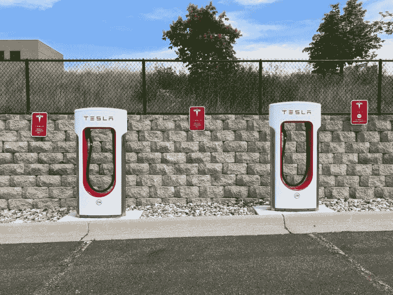
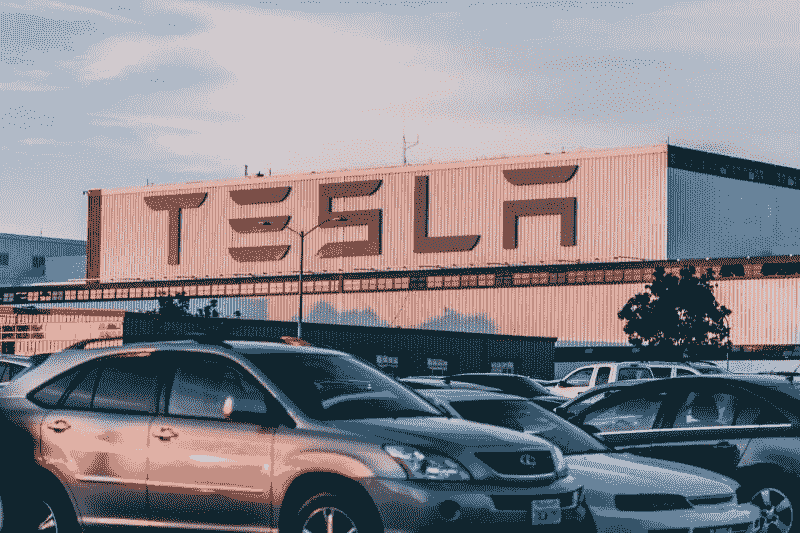
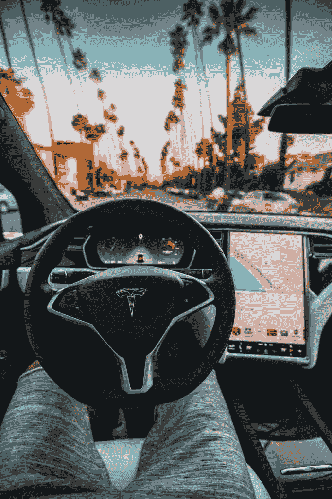
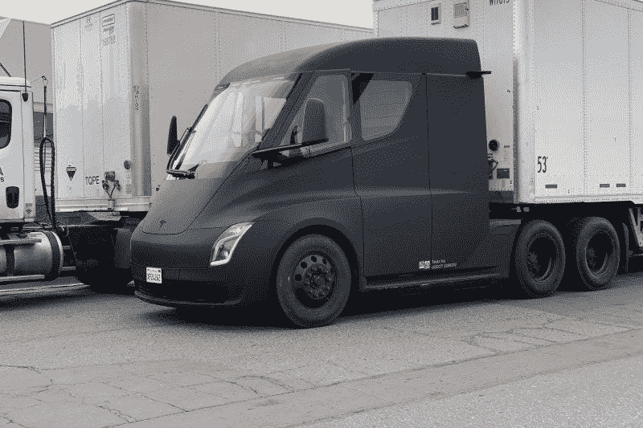
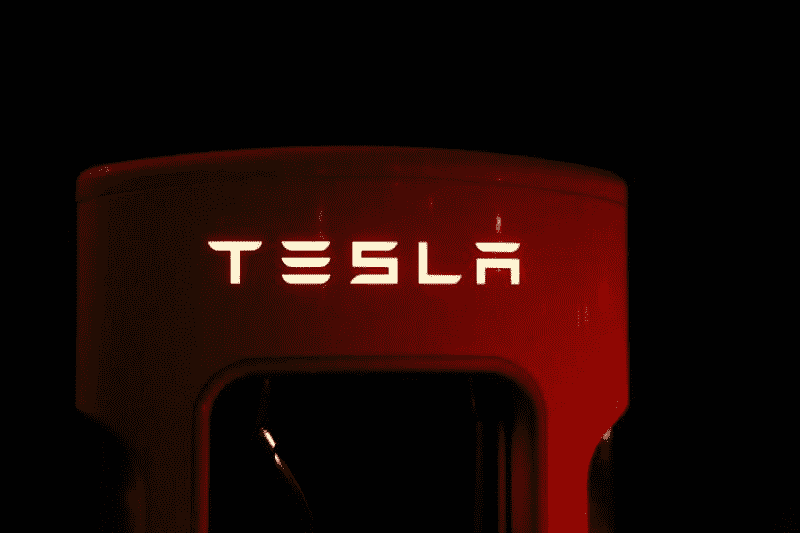
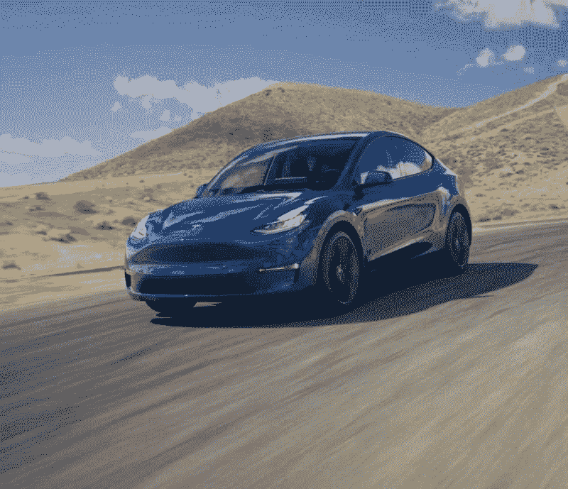
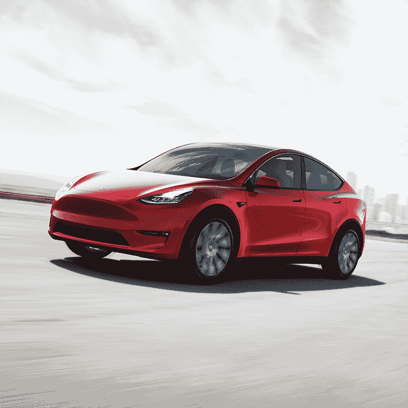

# 自动驾驶汽车能拯救特斯拉吗？—市场疯人院

> 原文：<https://medium.datadriveninvestor.com/can-self-driving-cars-save-tesla-market-mad-house-e37968560633?source=collection_archive---------13----------------------->

奇怪的是，投资者在问自动驾驶汽车能拯救特斯拉汽车公司(纳斯达克股票代码:TSLA)吗？

埃隆·马斯克(Elon Musk)将特斯拉的未来押在了一款他称之为 Autopilot 3.0 的自动驾驶硬件上。特斯拉将 Autopilot 3.0 置于车辆的发动机控制单元(ECU)内。

然而，唐纳德·川普总统(R-New York)的关税威胁到自动驾驶 3.0， *TechCrunch* [声称](https://techcrunch.com/2019/05/03/trumps-tariffs-could-knock-teslas-autopilot-off-course/)。为了解释这一点，广达电脑在上海制造了 Autopilot 3.0 芯片。特斯拉可能很难将硬件运入美国，因为特朗普拒绝免除 auto pilot 3.0 25%的关税。

 [## 在自动驾驶汽车发生事故的情况下，谁应该承担法律责任？数据驱动的投资者

### 我仍然认为自动驾驶汽车是一种奢侈品，而不是必需品…

www.datadriveninvestor.com](https://www.datadriveninvestor.com/2018/11/02/who-is-legally-accountable-in-the-case-of-an-autonomous-vehicle-accident/) 

# 特朗普惩罚特斯拉是因为马斯克甩了他吗？

观察人士会想，特朗普是不是在惩罚特斯拉，因为首席执行官马斯克切断了与总统的关系。

解释一下，马斯克是总统任期早期少数几个与特朗普政府合作的硅谷重量级人物之一。然而，在特朗普退出巴黎气候协议后，马斯克退缩了，并留下了两个顾问委员会。由总统的批评者组织的“埃隆·特朗普(Elon Dump Trump)”活动部分推动了马斯克的行动。

此外，自从放弃总统后，马斯克在采访中攻击了特朗普。自那以后，马斯克一直是美国证券交易委员会(SEC)调查和法院裁决以及关税行动的对象。

因此，马斯克天真的政治行为可能是特斯拉问题的真正根源。如果马斯克理解特朗普的本性并远离他，他可能会为他的公司省去一些麻烦。

# 特斯拉需要自动驾驶汽车吗？

据 TechCrunch [报道](https://techcrunch.com/2019/06/13/why-tesla-and-uber-wont-escape-25-tariffs/)，马斯克打赌他可以通过一种新的芯片来提高销量和盈利能力，这种芯片将赋予特斯拉汽车完全自动驾驶(FSD)的能力。

值得注意的是，特斯拉计划向 FSD 车辆的购车者收取 6000 美元的额外费用。特斯拉需要额外的收入，因为截至 2019 年 3 月 3 日，该公司报告了 521.83 美元的运营亏损和 702.13 美元的净亏损。

此外，FSD 产能可能会增加高利润车队买家对特斯拉汽车的需求。车队买家包括汽车租赁公司、税务公司、优步(NASDAQ: UBER) 等打车服务公司，以及政府车辆调配公司。

如此大的购买量可能会让特斯拉 Model 3 和 Model Y 盈利。例如，一家汽车租赁公司可能想要一辆 FSD 汽车，它可以在送走客户后开回车库。

# 自动驾驶 Semi 能拯救特斯拉吗？

此外，FSD 产能可以增加[特斯拉 Semi](https://www.tesla.com/semi) 的销量，并推动潜在房车的销售。马斯克将特斯拉 Semi 作为公路重型卡车进行营销。全节能驾驶能力可以扩大 Semi 的行驶范围，使其对像**沃尔玛(纽约证券交易所:WMT)** 这样的客户更具吸引力。

此外，FSD Semi 可以帮助特斯拉在所谓的长途卡车司机短缺中获利。NPR [报道](https://www.npr.org/2019/02/11/691673201/facing-a-critical-shortage-of-drivers-the-trucking-industry-is-changing)，美国卡车运输协会(ATA)估计公司需要 6 万到 10 万名额外的长途卡车司机来维持大型钻机的运转。具有 FSD 能力的半拖车可以通过减少对卡车司机的需求来解决这个问题。

例如，一辆 FSD semi 可以在夜间行驶数百英里，而卡车司机则睡在卡车里。这可能会使钻机的范围扩大一倍。此外，semi 可以在城市之间的州际公路上自动驾驶。司机可以在旅程的最后一段接管半拖车，而不是全程。

马斯克需要更大的能力来吸引精明的卡车运输行业高管们将想知道特斯拉 semi 如何让他们赚更多的钱。完全自主是向卡车运输行业出售特斯拉的明显能力。

# 自动驾驶卡车是政治问题吗？

然而，自动驾驶卡车已经引发了政治争议，尽管它们只是理论上的。

反叛的总统候选人杨安泽[预测](https://www.gobytrucknews.com/could-driverless-trucks-cause-mass-riots/123)无人驾驶卡车将导致骚乱和民间动乱。在他的书《普通人的战争》中，杨警告说，如果消防处抢了卡车司机的饭碗，他们将会暴动和抗议。

因此，特朗普可以通过自动驾驶关税行动狡猾地吸引卡车司机和杨的支持者。然而，特朗普可以通过鼓励特斯拉在美国制造 [FSD 芯片](https://www.theverge.com/2019/4/22/18511594/tesla-new-self-driving-chip-is-here-and-this-is-your-best-look-yet)来推迟不可避免的事情。

因此，特朗普可以在短期内保护一些美国就业岗位，但从长期来看，会威胁到数万个卡车运输岗位。另一方面，杨预测，消防处不会开始消灭卡车司机的工作，直到 2025 年或 2026 年。值得注意的是，特朗普的第二个任期可能会在 2025 年结束；因此，当危机爆发时，唐纳德将回到特朗普大厦写他的回忆录。

# 特斯拉是宇宙中最被高估的股票吗？

有一点没有改变，我仍然认为**特斯拉汽车公司(纳斯达克股票代码:TSLA)** 是宇宙中最被高估的股票。

为了解释这一点，特斯拉股票在 2019 年 7 月 9 日的交易价格为 230.06 美元。与此同时，**福特(NYSE: F)** 的股票；该公司计划在 2021 年推出自己的 FSD 汽车，股价为 10.14 美元。详细来说， *TechCrunch* [推测](https://techcrunch.com/2019/03/13/ford-is-expanding-its-self-driving-vehicle-program-to-austin/)福特可能在 2021 年在德克萨斯州奥斯汀推出使用完全自动驾驶汽车的送货和税收服务。

在这种情况下，人们为特斯拉支付 230.06 美元是愚蠢的，因为福特更便宜，更赚钱。例如，福特在 2019 年 3 月 31 日的营业收入为 40.45 亿美元，净收入为 11.46 亿美元。

而且，福特当天报告的营业现金流为 35.44 亿美元，融资现金流为 18.73 亿美元，自由现金流为 19.11 亿美元。然而，特斯拉报告的运营“现金流”为-6.3961 亿美元，融资现金流为-6.5302 亿美元，自由现金流为-9.448 亿美元。

# 特斯拉在烧钱，而福特在赚钱

因此，特斯拉在烧钱，而福特在赚钱。事实上，福特在 3 月底的收入为 403.42 亿美元，毛利润为 40.45 亿美元。截至 2019 年 3 月 31 日，特斯拉报告收入为 45.4116 亿美元，毛利为 5.6574 亿美元。

此外，福特有钱完善自动驾驶汽车，而特斯拉可能没有。事实上，福特在 2019 年 3 月 31 日拥有 208.48 亿美元的现金和等价物以及 168.82 亿美元的短期投资。与此同时，特斯拉在同一天拥有 23.2912 亿美元的现金和等价物。

因此，福特有 377.3 亿美元的现金投资于 FSD 能力。另外，如果特斯拉没钱倒闭，福特有钱从马斯克手里买特斯拉或 Autopilot 3.0。因此，我认为福特而不是特斯拉是最有可能主宰自动驾驶汽车的美国公司。

# 福特是自动驾驶汽车的更好投资

福特也是自动驾驶汽车的更好投资，因为它更便宜，赚钱，并支付股息。

福特于 2019 年 6 月 2 日支付了 15₵季度股息。然而，福特的股息增长有限，去年没有增加派息。然而，Dividend.com[估计](https://www.dividend.com/dividend-stocks/consumer-goods/auto-manufacturers-major/f-ford-motor-company/)在 2019 年 7 月 9 日，福特股东仍然获得了 5.93%的股息收益率(60₵年化支付)和 43.5%的支付率。

如果你想要一部关于自动驾驶汽车的娱乐剧来看特斯拉，埃隆·马斯克和唐纳德·j·特朗普将提供它。如果你想进行价值投资，从 FSD 汽车中赚钱，那就买福特吧。我认为福特是对自动驾驶汽车的价值投资。

归根结底，我不认为关税和芯片戏剧将推迟采用 FSD。不管我们愿不愿意，自动驾驶汽车即将到来。是时候接受这一现实并进行相应的投资了。

*原载于 2019 年 7 月 9 日*[*【https://marketmadhouse.com】*](https://marketmadhouse.com/can-self-driving-cars-save-tesla/)*。*