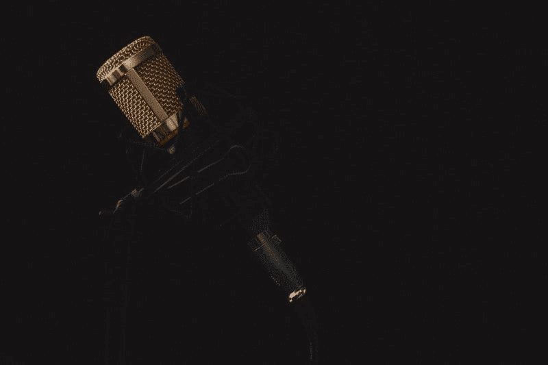
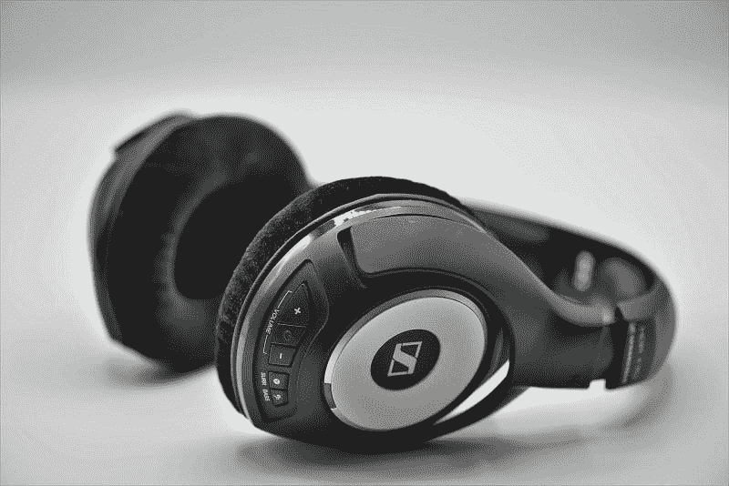

# 天狼星 XM 能活下来吗？—市场疯人院

> 原文：<https://medium.datadriveninvestor.com/can-sirius-xm-survive-market-mad-house-c2d8642cc5b2?source=collection_archive---------8----------------------->

我问天狼星 XM 能活下来吗，因为卫星无线电服务是一个小公司，有一个巨大的竞争对手: **Alphabet(纳斯达克代码:GOOG)** 。

解释一下， **Alphabet (NASDAQ: GOOGL)** 正在向第三方应用开放其用于车辆的 [Android Automotive](https://marketmadhouse.com/alphabet-wants-to-turn-your-car-into-an-android-device/) 操作系统。具体来说，娱乐类 apps 包括 **Sirius XM (NASDAQ: SIRI)** 和 **Spotify (NYSE: SPOT)** ，都可以通过 Android Automotive 的 Google Play 获得。

 [## 2019 年移动应用开发之路——数据驱动投资者

### 任何在移动应用程序开发行业工作的人，无论他们是专注于在伦敦开发 iOS 应用程序还是…

www.datadriveninvestor.com](https://www.datadriveninvestor.com/2019/01/15/the-path-of-mobile-app-development-in-2019/) 

Android Automotive 对 Sirius 构成了威胁，因为它给了无限多的竞争对手获得车辆的机会。澄清一下，Sirius 的商业模式是通过卫星广播向司机提供独家音频内容来源。然而，Android Automotive 可以通过应用程序提供无限量的免费低价音频。

此外，到 2022 年，Android Automotive 将成为所有菲亚特-克莱斯勒(NYSE: FCAU )汽车的标准功能，*底特律自由新闻* [报道](https://www.freep.com/story/money/cars/chrysler/2019/04/30/fiat-chrysler-google-samsung/3621796002/)。因此，所有的吉普、道奇、克莱斯勒和菲亚特都将采用 Google Play。

# 天狼星 XM 能和 Alphabet、Spotify 抗衡吗？

因此，天狼星 XM；据市场观察 [报道，](https://www.marketwatch.com/story/sirius-xm-unveils-new-streaming-only-subscription-starting-at-1-a-month-then-rising-to-8-a-month-2019-04-22)旗下拥有潘多拉的苹果公司提供每月 8 美元的流媒体订阅服务。此外，Sirius 将对前三个月的服务收取 1 美元。

因此，Sirius 试图在自己的游戏中与 Spotify 竞争。然而，这将是困难的，因为 Spotify 提供了 4000 万首音乐的访问权限，商务应用[估计](http://www.businessofapps.com/data/spotify-statistics/)。事实上，Spotify 的“今日热门歌曲”是世界上最受欢迎的 DJ，拥有近 2000 万听众。

另外，Spotify 正在通过收购 Gimlet 和 Anchor 等公司来扩大其在播客领域的影响力， *TechCrunch* [报道](https://techcrunch.com/2019/02/06/why-spotify-is-betting-big-on-podcasting/)。这威胁到天狼星，因为独家音频内容；和霍华德·斯特恩一样，是天狼星最吸引人的地方之一。

# 为什么拉什·林堡会去 Spotify 或者天狼星？

显然，Spotify 可以消灭 Sirius 的一个方法是提供流行电台谈话者的播客，如拉什·林堡、格伦·贝克、肖恩·哈尼蒂和戴夫·拉姆齐。然而，这些超级明星与 iHeartRadio 等电台运营商有独家交易。

因此，单向 Spotify 或 Sirius 或者**苹果(纳斯达克股票代码:AAPL)** ，可以主宰美国的音频是花大价钱，吸引拉什或肖恩的播客。最终，林堡、拉姆齐和其他人将不得不走向数字化才能生存，因为无线电台的听众会逐渐死亡。

此外，成千上万的其他竞争对手，如 Spotify，将通过 Alphabet Automotive 获得 Sirius 的客户。因此，天狼星将很难生存。

# 天狼星 Vs. Spotify

Sirius XM 报告 2019 年 3 月 31 日的收入为 17.44 亿美元，毛利为 8.88 亿美元。此外，Sirius 当天的营业收入为 4.34 亿美元，净收入为 1.02 亿美元。

相比之下，Spotify 报告 2018 年收入为 60.44 亿美元，毛利为 15.55 亿美元。与此同时，Sirius 2018 年的年收入为 57.71 亿美元，年毛利为 34.62 亿美元。

此外，Sirius 2018 年的年营业收入为 17.26 亿美元，年净收入为 13.75 亿美元。然而，Spotify 年的运营亏损为-4943 万美元，净亏损为-89.66 美元。

有趣的是，天狼星产生了大量的现金；2018 年运营现金 18.8 亿美元，自由现金流 15.25 亿美元。相反，Spotify 报告的 2018 年年度自由现金流为 1.0575 亿美元，运营现金流为 3.9540 亿美元。

此外，Spotify 在 2019 年 12 月 31 日拥有 6.5377 亿美元的现金和短期投资。此外，天狼星在 2019 年 3 月 31 日报告没有任何形式的现金和等价物，低于 2019 年 12 月 31 日的 5400 万美元。

因此，Sirius XM 从更少的用户身上赚到了更多的钱。值得注意的是，斯塔西亚[估计](https://www.statista.com/statistics/252812/number-of-sirius-xms-subscribers/)，天狼星在 2018 年底只有 3404 万用户。相反，Business of Apps 估计 Spotify 每月有 217 名用户。

# 天狼星能一直赚钱吗？

Spotify 缺乏收入给 Sirius 带来了巨大的问题，因为 Sirius 正在转向全数字商业模式。另一方面，Spotify 已经在实践这种商业模式，没有产生任何收入。

事实上，Spotify 有 9600 万付费用户，他们向€支付 4.89 英镑(5.47 美元)的订阅费，音乐:)Ally [估计](https://musically.com/2019/02/06/spotify-financials-revenues-premium-subs/)。在这种情况下，当 Spotify 免费提供音频并降低订阅费用时，Sirius 将很难卖出订阅。

与此同时，大量免费和低成本的音频将通过 Android Automotive 提供。此外，新车一出厂就能听到这种声音。

# 谷歌如何摧毁天狼星

因此，Alphabet 正在采用 Sirius 的商业模式，在新车上安装其应用程序。这对 Sirius 来说很危险，因为 Alphabet 不需要来自音频的订阅收入。

相反，谷歌可以免费提供它想要的所有音频，以吸引新客户和销售广告。值得注意的是，Alphabet [在 2019 年 5 月 5 日报告了](https://marketmadhouse.com/googles-revenues-are-declining-should-investors-worry/)363.39 亿美元的季度收入。

此外，Alphabet 正在进军汽车领域，包括与 Lyft 结盟，以及积极扩张其 Waymo 自动驾驶汽车平台。事实上，我认为 Alphabet 将使用 Android Automotive 来收集关于它可以出售的司机的数据。此外，Alphabet 将利用免费音频等亏损领先者让人们使用 Android Automotive。

归根结底，Sirius 将很难在 Alphabet 作为直接和间接竞争对手的情况下继续赚钱。因此，投资者需要远离天狼星。

# 投资者需要远离 Sirius 和 Spotify

事实上，尽管股价很低(2019 年 5 月 14 日为 5.63 美元)，投资者需要远离 **Sirius XM Holdings(纳斯达克代码:SIRI)** 。投资者必须避免 **Spotify (NYSE: SPOT)** ，因为财务数据中没有任何东西证明 2019 年 5 月 14 日 133.58 美元的股价是合理的。

Sirius 将于 2019 年 5 月 31 日支付的 1.21₵股息也不能证明低价是合理的。毫不奇怪，Spotify 目前不支付股息。

根据 Sirius 和 Spotify 的判断，流媒体音频目前并不赚钱。因此，选股人需要避免流式音频。

*原载于 2019 年 5 月 14 日*[*https://marketmadhouse.com*](https://marketmadhouse.com/can-sirius-xm-survive/)*。*