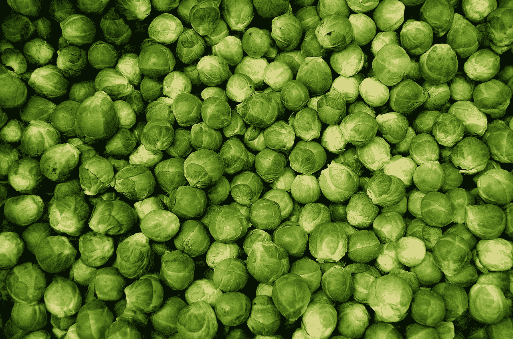
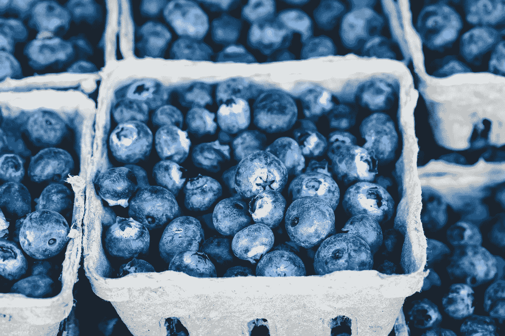

# 豆芽能在食品杂货店的战争中生存下来吗？

> 原文：<https://medium.datadriveninvestor.com/can-sprouts-survive-the-grocery-wars-c8694bbf93d3?source=collection_archive---------3----------------------->

我问豆芽能否存活，因为折扣杂货商正在竞争日益激烈的食品市场大举扩张。

比如，**芽菜农贸市场(纳斯达克:SFM)；**联合首席执行官 Bradley S. Lukow 告诉分析师，公司计划的大多数新店都在新市场，*食品商业新闻* [报道](https://www.foodbusinessnews.net/articles/13793-sprouts-ramping-up-expansion-in-new-markets)。事实上，豆芽现在在美国 19 个州开展业务。

例如，芽正在扩大到它的第一个东北州；宾夕法尼亚州。此外，豆芽很快就可以通过进入新泽西州进入竞争激烈的纽约市食品杂货店市场。

 [## 算法交易的机器学习-数据驱动的投资者

### 当你的一个朋友在脸书上传你的新海滩照，平台建议给你的脸加上标签，这是…

www.datadriveninvestor.com](https://www.datadriveninvestor.com/2019/01/30/machine-learning-for-stock-market-investing/) 

具体来说，芽菜；该公司目前经营着 300 多家门店，计划明年开设 28 家门店。此外,*食品商业新闻*报道，豆芽将通过开设八家新概念商店来增加风险。

# **豆芽面临的威胁越来越大**

豆芽的生存受到质疑，因为它在充满危险竞争对手的残酷食品市场中不断扩张。

豆芽正面挑战的几个竞争对手包括:

美国最大的独立杂货商。Sprouts 在大西洋南部和中部与 Kroger 的 Harris Teeter 品牌直接竞争。特别是，克罗格的简单真理天然有机品牌在 2017 年实现了 20 亿美元的销售额，*进步杂货商* [报道](https://progressivegrocer.com/krogers-simple-truth-brand-hits-2b-sales)。此外，Kroger 正在增加其能力，对由[**Ocado Group PLC**](https://www.datadriveninvestor.com/2019/05/03/ocado-leads-the-robotization-of-retail/)**(伦敦证券交易所:OCDO)** 设计的数字和机器人履行中心进行大量投资。

ldi 或 Aldi Sud。这家快速发展的德国折扣杂货商通过注重质量和以极低的价格销售威胁到了豆芽。阿尔迪；该公司目前在 35 个州经营着 1800 多家商店，并计划再开 400 家。特别是，阿尔迪公司计划通过销售无农药食品来实现完全有机化，*教育、激励、改变*宣称。

L idl。路透社[报道](https://www.reuters.com/article/us-lidl-results/lidl-to-keep-investing-after-sales-rose-in-2018-idUSKCN1SJ1LW)，德国[施瓦茨集团](https://careers.lidl.co.uk/en/our-history-1819.htm)的这一连锁部分在 2018 年欧洲业务和€销售额达到 1043 亿欧元(1174 亿美元)，增长了 8.8%。Lidl 正利用部分资金扩大其美国业务。例如，Lidl 计划明年在东海岸开 25 家新店，巴尔的摩太阳报报道。许多这样的商店将会在豆芽正在扩张的地区。此外，Lidl 正在从较老的竞争力较弱的杂货店购买位置。

T雷德乔的。这家拥有狂热追随者的折扣杂货店是豆芽最直接的竞争对手。像 Aldi 和 Lidl 一样，Joe's 通过提供超过 80%的自有品牌产品来保持低价。此外，Joe's 的目标客户也是中产阶级美食家，但它的知名度更高，运营成本更低。此外，乔氏还有一个秘密武器，那就是一个传奇的葡萄酒、啤酒和烈酒部门。最后，乔氏正在小心翼翼地扩张2019 年春季在东海岸新开四家店。

mazon/Whole Foods。回到 2017 年 6 月，本应是豆芽的重大胜利变成了一场噩梦。解释一下，全食超市的崩溃是因为过度扩张促使其管理层以 134 亿美元的价格将出售给**亚马逊(纳斯达克代码:AMZN)** 。可以预见的是，亚马逊正在降低全食超市的价格，并慢慢与其在线零售平台整合。对豆芽来说，危险的发展包括亚马逊缓慢但稳定的推出当天主要杂货递送。同样有问题的可能是 Amazon Go，这是亚马逊潜在的低成本自动化杂货店和便利店概念。

W **阿尔玛特(纽约证券交易所代码:WMT)** 。美国杂货商在有机和天然食品方面的努力一直不温不火。然而，沃尔玛拥有美国杂货市场 26%的份额，杂色傻瓜*的*亚当·利维[估计](https://www.fool.com/investing/2018/10/11/walmarts-lead-in-groceries-could-get-even-bigger.aspx)。此外，沃尔玛正在大举进军沿海城市和郊区市场；可能是为了抵消其在中心地区的收入下降。此外，沃尔玛正在对食品杂货技术进行大量投资。例如，沃尔玛正在纽约莱维敦的一个社区市场测试使用人工智能来监控库存水平和顾客行为。

# 豆芽能在食品杂货店的战争中生存下来吗？

因此，随着危险的竞争对手部署新武器并进入新市场，本已残酷的杂货店战争正在升温。因此，豆芽的生存受到严重质疑。

**新芽(纳斯达克股票代码:SFM)** 资源与竞争对手相比微不足道。例如，截至 2019 年 3 月 31 日，豆芽的季度收入为 14.31 亿美元，毛利为 4.8435 亿美元。与此同时，Kroger 在同一天的季度收入为 289.1 亿美元，毛利为 61.88 亿美元。

截至 2019 年 3 月 31 日，亚马逊报告季度收入为 597 亿美元，毛利为 257.8 亿美元。最后，沃尔玛占据主导地位，截至 2019 年 1 月 31 日，其季度收入为 1387.93 亿美元，季度毛利为 338.86 亿美元。

最糟糕的是，截至 2019 年 3 月 31 日，Sprouts 只有 1950 万美元的现金和等价物，并且没有短期投资。因此，我认为芽没有资源，可能会崩溃。

# **豆芽赚钱吗？**

我相信豆芽会倒闭，因为它几乎不赚钱。例如，Sprouts 报告 2019 年 3 月 31 日的营业收入为 7956 万美元，净收入为 5639 万美元。

这将使新芽陷入死亡螺旋，因为它可能无法支付 2019 年 3 月 31 日报告的 16.54 亿美元的总债务。令人不安的是，Sprouts 的总债务超过了同一天报告的 14.31 亿美元的季度收入。

# **亚马逊或者克罗格会买豆芽吗？**

这种情况最有可能的结果是豆芽会步全食超市的后尘。说得详细点，豆芽会没钱被卖掉。

豆芽的买家可能包括亚马逊；据报道，该公司正在收购更多的杂货连锁店 Aldi Nord 和 Kroger。特别是，我认为豆芽很适合 Aldi Nord 的折扣店；其中包括乔氏和 Lidl。此外，Aldi Nord 正在扩大其在美国的足迹，在绘图板上有 28 个新的 Lidls。

最后，豆芽将会很便宜，2019 年 5 月 23 日，它的股价为 20.45 美元，市值为 24.15 亿美元。因此，我认为尽管豆芽积极扩张，它仍可能成为收购目标。例如，全食超市在亚马逊出售之前一直在积极扩张。

然而，我建议投资者远离豆芽，因为它没有股息。相反，如果你想要一个便宜的杂货店，买克罗格，因为它更大，更安全。事实上，Kroger 在 2019 年 5 月 23 日的股价为 23.53 美元，但它将在 2019 年 6 月 1 日支付 14₵股息。

归根结底，我认为豆芽将作为大型杂货商的一部分生存下来。然而，我认为在当今残酷的食品市场中，作为一个相互依赖的杂货商，豆芽是不可持续的。

*原载于 2019 年 5 月 23 日 https://marketmadhouse.com*[。](https://marketmadhouse.com/will-sprouts-survive/)**

**免责声明:文章中表达的观点和意见仅属于作者，并不一定反映数据驱动投资者的立场。这篇文章无意成为投资建议。**