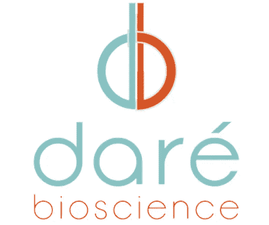
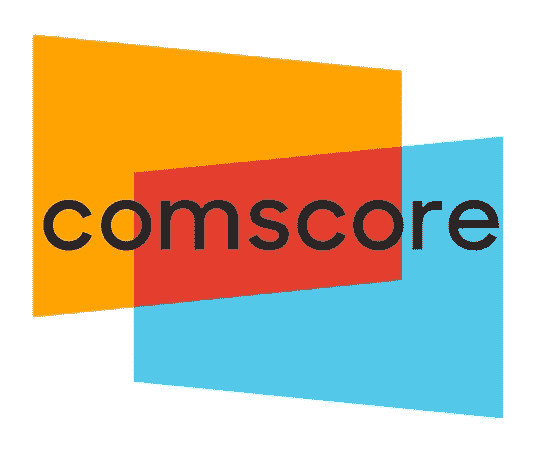
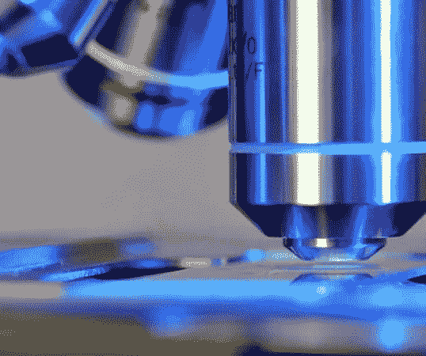
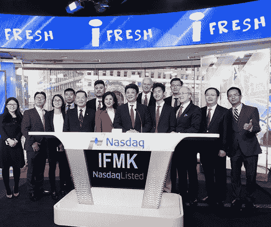

# 这些仙股能在 2019 年 11 月再创新高吗？

> 原文：<https://medium.datadriveninvestor.com/can-these-penny-stocks-make-news-highs-in-november-2019-de40c6204732?source=collection_archive---------13----------------------->

# 这些细价股在本月上涨到新高

人们经常注意到，在构建股票投资组合时，投资者会专注于不同的领域。多年来，事实证明这是一个合理的策略。当谈到投资低价股时，你应该选择有快速增长潜力的行业。

例如，有大量的[生物技术细价股](https://pennystocks.com/category/penny-stock-sectors/biotech-stocks/)，已经显示出这些快速的移动。但是你也需要记住一些基本的东西。根据美国证券交易委员会的说法，T4 的细价股定义是交易价格低于 5 美元的任何股票。我知道，“**细价股**这个说法有点误导。

这基本上是讨论小盘股或廉价股的另一种方式。尽管与蓝筹股相比，这些股票非常便宜，但它们仍然非常有利可图。事实上，细价股有一种独特的能力，可以在极短的时间内带来大量的利润。

 [## 算法交易的机器学习|数据驱动的投资者

### 当你的一个朋友在脸书上传你的新海滩照，平台建议给你的脸加上标签，这是…

www.datadriveninvestor.com](https://www.datadriveninvestor.com/2019/01/30/machine-learning-for-stock-market-investing/) 

# 现在买这些细价股合适吗？

这是由于波动性。那些计划寻找细价股购买的人也应该警惕这种波动性。如果你不按照游戏计划交易，不执行[止损单](https://pennystocks.com/terminology/2019/09/19/penny-stocks-how-to-use-stop-losses/)之类的东西，可能会导致重大损失。

此外，你应该在投资前做大量的研究。研究的第一步是确定值得关注的潜在股票。因此，考虑到这一点，以下是一些在 11 月份创下新高的低价股:

# 戴尔生物科学公司

开球的是 Dare Bioscience Inc. ( [DARE 股票报告](https://pennystocks.com/featured/2019/11/11/penny-stocks-new-highs-november-2019-1-up-104-percent/#m1))。这家生物技术公司着眼于创新女性健康产品。它旨在开发的主要产品是避孕、阴道健康、性健康和生育。

该公司目前有 9 个治疗计划在进行中。细菌性阴道病的主导产品有望很快开始其 3 期试验。在 11 月 11 日的盘前交易时间，这支生物技术细价股飙升了近 29%。这一成果来自 Dare Bioscience 最近发布的一项声明。

**阅读更多**

该公司宣布，它达成了一项收购微芯片生物技术公司的协议。该协议允许该公司获得微芯片的创新药物输送技术，该技术已在骨质疏松症患者的研究中得到验证。

# comScore 公司(SCOR)

下一家公司与我们通常的细价股有些不同。comScore Inc. ( [SCOR 股票报道](https://pennystocks.com/featured/2019/11/11/penny-stocks-new-highs-november-2019-1-up-104-percent/#m1))是一家广告公司，利用诸如测量受众规模和消费者行为等分析来最大化其服务。上周晚些时候，我们简要地[谈到了这只小股票](https://pennystocks.com/featured/2019/11/07/penny-stocks-soaring-this-week-buy-or-sell-november-2019/)。

该公司利用其分析结果，并将其出售给客户，以帮助他们优化广告和媒体计划。这些分析最棒的地方在于，它们衡量了几个不同的平台。

当你看一看 comScore 的月度图表时，你可以看到它一直处于绝对的撕裂状态。在 11 月 11 日的交易时段之前，仙股已经从 2.11 美元一路上涨到 3.30 美元。

这一势头在退伍军人节没有放缓，仙股又上涨了 18%。自第四季度开始以来，SCOR 股票已经上涨了 104%。由于任命了新的首席执行官比尔·利维克(Bill Livek)并公布了有利的收益，本周初势头继续增强。

# Aclaris 治疗公司(ACRS)

这份名单上的第一只[生物技术细价股](https://pennystocks.com/category/penny-stock-sectors/biotech-stocks/)是 Aclaris Therapeutics Inc .([ACRS 股票报告](https://pennystocks.com/featured/2019/11/11/penny-stocks-new-highs-november-2019-1-up-104-percent/#m1))。本月，这仍然是低价股关注的热门领域。该公司于 11 月 7 日发布了第三季度的财务业绩。

事实证明，这是引发该股反弹的一个重要因素。反弹的一个更重要的原因是 Aclaris 提供的一系列更新。

它提供了关于研究和发展活动的最新情况，还透露已经偿还了一笔 3000 万美元的定期贷款。该公司的首席执行官表示，他对 Aclaris 最近取得的进展感到兴奋。这些进展导致该股反弹，上周五该股涨幅高达 15.40%。

# 克洛维斯肿瘤学(CLVS)

在第三季度财务结果公布后，另一只生物技术细价股出现了令人印象深刻的反弹，这是克洛维斯肿瘤公司的股票( [CLVS 股票报告](https://pennystocks.com/featured/2019/11/11/penny-stocks-new-highs-november-2019-1-up-104-percent/#m1))。

其财务业绩中有许多好消息。该公司的产品 Rubraca 实现了高达 65%的同比销售增长。克洛维斯在该季度还创造了 3760 万美元的收入。

除此之外，它还设法承受了分析师对每股亏损的估计。克洛维斯每股亏损 1.89 美元，而非预期的每股 1.92 美元。该股周五飙升 38%，周一继续走高。

现在，我们必须指出一件事。在这个时候，CLVS 的股票不被认为是低价股。这种势头能否持续下去，或者股价能否在 12 月前回落至 5 美元以下？

# iFresh 公司

最后但同样重要的是，iFresh Inc. ( [IFMK 股票报告](https://pennystocks.com/featured/2019/11/11/penny-stocks-new-highs-november-2019-1-up-104-percent/#m1))。这只低价股本季度遭受重创。正如我们所说，密切关注你能找到的关于某些公司的一切。

一份糟糕的报告可能会改变某些低价股的游戏规则。在 iFresh 的案例中，IFMK 的股票在该公司报告了一项投资的糟糕消息后受到了冲击。

具体来说，iFresh 与浙江小太科技有限公司达成了一项交易，iFresh 将收购后者。多亏了杭州警方正在进行的调查，这笔交易被终止了。显然浙江在进行非法集资活动。这里最大的因素不是协议的终止；是股价。

**【阅读更多】** [最新里程碑](https://pennystocks.com/featured/2019/11/04/penny-stocks-to-watch-in-november-after-news/)后 11 月值得关注的 4 只仙股

IFMK 本周从 1.80 美元跌至 0.34 美元的 52 周新低。显然，对于这些较大的交易所来说，不持有 1 美元的最低出价是一个问题。但考虑到所有这些信息，iFresh 股价在触底后反弹至 0.34 美元。

这还能继续吗？我们必须拭目以待，但我们现在知道的是，iFresh 将参加支付宝光棍节销售活动。鉴于今年是该年度活动规模最大的一年，它会有助于提振人气吗？

*原载于 2019 年 11 月 11 日*[*【https://pennystocks.com】*](https://pennystocks.com/featured/2019/11/11/penny-stocks-new-highs-november-2019-1-up-104-percent/)*。*