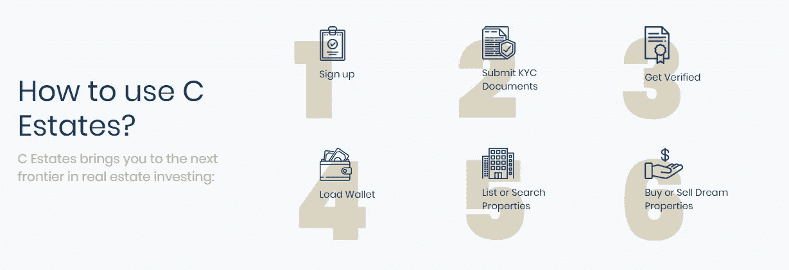

# 标记化能降低房地产行业的进入壁垒吗？c 房地产公司可能会回答这个问题

> 原文：<https://medium.datadriveninvestor.com/can-tokenization-mitigate-entry-barriers-into-the-real-estate-industry-cestates-might-answer-that-63d608bf13b8?source=collection_archive---------5----------------------->

## C Estates tokenization 让每个人都可以轻松地购买、赚取和出售房地产

> 区块链技术对房地产有什么好处？房地产作为一种资产类别，是否展示了为新技术应用提供肥沃土壤的特性？C 房地产公司能采取有意义的措施来实现这一目标吗？本文调查…

传统的房地产行业是一个众所周知的非流动性资产类别，它表现出区块链声称要为其他类型的证券解决的几个特征——新的融资形式，更具流动性的市场，防篡改的所有权历史，简化的支付，以及其他好处。

 [## 2019 年十大区块链课程|数据驱动的投资者

### 渴望在区块链发展吗？你想知道区块链是如何工作的，但不知道在哪里？或者就是太多了…

www.datadriveninvestor.com](https://www.datadriveninvestor.com/2019/03/08/top-10-blockchain-courses/) 

自比特币诞生之初，就有人试图用比特币作为“代币”来代表资产。早期，这是通过利用比特币的元数据字段来为比特币交易赋予意义，并将比特币的所有权识别为其他一些资产的所有权来实现的。然后，比特币区块链可以追踪所代表资产的所有权，并实现所有权的安全和直接转移。从那以后，出现了名副其实的寒武纪大爆发式的协议和区块链，这些协议和是为多种类型的资产的表示和传输而专门构建的。

> 令牌化(令牌的发行)指的是创建智能合约，该智能合约将创建令牌及其功能。

如今，区块链在证券发行和交易中的应用进展顺利，其应用于多种证券的好处也越来越为人所知。我写这篇文章的目的是试图探索令牌化如何影响与真实、有形资产相关的证券。区块链科技如何应对投资这些资产类别带来的独特挑战。

## **为什么商业地产需要安全令牌化？**

令牌化商业房地产(CRE)证券是令牌化证券生态系统的一个子集。CRE 当前的一些特性使得它对标记化特别有吸引力。一般来说，在不透明的数据环境中，单笔 CRE 交易的特点是大量的私人市场投资。

这导致了一个充满缓慢交易和结算流程的投资生态系统，其中包括许多中介机构(代理人、卖方、买方、金融机构、保险公司等)、冗余的验证流程以及在孤立的数据库和注册表中注册的冗余信息。随着向价值链的下游移动，情况变得更加复杂。租赁管理、保险、维护、承租人向出租人付款、出租人向投资者付款以及报告都是繁琐耗时的过程。鉴于 CRE 领域的市场特征(大额前期投资、极低的短期流动性、管理成本等)，散户投资者通常不能直接投资 CRE。然而，一些金融工具旨在通过提供间接投资机会，减少与此类投资者接触 CRE 风险相关的摩擦和成本。

 [## 脸书终于推出天秤座硬币

### 互联网让每个人都能接触到世界上的信息，并使自由交流民主化，但是…

medium.com](https://medium.com/swlh/facebook-finally-unveils-libra-coin-a9d520276bb3) 

**传统商业地产行业内的问题**
***流动性***
在传统和非传统市场中，资产或金融产品的市场流动性由五个关键参数来衡量:(1)紧密度(买卖价差)，(2)深度，(3)弹性，(4)广度，以及(5)即时性。
更广泛的房地产资产类别流动性差是出了名的，这给更广泛的投资群体带来了在投资组合中实现房地产敞口的困难。例如，富达房地产收益基金中房地产债务的典型持有期为 4 至 7 年。私人股本房地产基金锁定期长达 7 年的情况并不少见。

房地产持有量通常缺乏流动性，原因有几个:
● *缺乏公开市场*——大多数房地产交易发生在私人市场，无法获得资产的每日定价和广泛信息。私募市场是基于“按需”定价的，缺乏透明度，也更难进入。
● *交易的难度* —房地产交易需要多方参与，并且需要大量人工生成的文书工作。构建发行、安排融资和收集必要的尽职调查项目的过程通常需要几周或几个月。
● *较大的最低资本要求* —鉴于许多 CRE 交易需要大量的资本汇集，以股权和债务的形式，交易进展较慢。此外，在运营阶段，虽然股权所有者可能很难为他们各自的利益找到买家，但贷款人可能会就财产的财务管理方式订立契约。

***透明度***
房地产透明度是衡量一个城市或国家的房地产信息可及性和可靠性的指标。缺乏透明度导致整个行业关系紧张。银行担心，关于房产的不完整或过时的信息会导致他们高估作为贷款抵押品的房产。不能或不愿对房地产投资组合进行深度尽职调查的谨慎投资者可能会大幅低估或高估资产价值。
开发项目中的股权投资者可能需要成本高昂且耗时的财务控制、报告和审计。这种紧张关系在一定程度上是由于难以及时获得有关房地产资产状态的信息而造成的，在房地产从建设(建筑设计通常难以获得)到销售和租赁(例如，房地产共同基金的投资组合经理可能会发现某个主要租户在违约事件发生后 30-60 天内违约)的整个生命周期中持续存在。

**自 2008 年金融危机以来，美国的抵押贷款服务行业发生了巨大变化。服务提供商在运营、资本和流动性要求方面受到新法规的约束。
抵押贷款服务的典型成本如下:
*●客户服务:报表和账单
●新贷款设立和转让
●清偿/留置权解除
●托管
●投资者报告
●收款
●减轻损失
●破产
●止赎***

## **令牌化对房地产市场的好处。**

*细分* —由于需要大量的前期资金，房地产等资产的准入门槛很高。细分这类资产使其对小投资者的准入民主化
*可定制性* —令牌化使个人房地产资产得以暴露。因此，投资组合可以定制到单个建筑，而不是投资于整个行业。
*流动性* —细分化增加了潜在投资者的数量，可以释放全球投资者基础二级市场也促进了额外的流动性。流动资产需要溢价，可以增加资产价值
*自动化* —智能合同可以自动执行合规、文件验证、交易、托管等步骤。股息和其他现金流可以在到期时以编程方式支付
*成本效率* —通过消除某些中介和提高流程效率，可以降低成本
*结算时间* —代币可以在几分钟或几小时内结算(取决于基础区块链)。这释放了市场中的资金，市场目前解决了
*数据透明性* y —区块链上安全可见的记录保留可以增加底层数据的透明度。特别是对于复杂的衍生产品，将证券与其潜在价值驱动因素
*关联起来的能力结构化产品* —一旦资产被令牌化，就可以实现额外的价值，这使得能够创建额外的分层金融产品，如一篮子资产和衍生产品。由于底层是令牌化的，通过编码的智能契约，创建复杂的产品变得更加简单。

## 商业不动产令牌化的示例:C Estates 实用令牌(XCET)

C Estates 是菲律宾首个房地产智能数字投资平台，提供完整的生态系统解决方案，包括房地产上市、标记化以及房地产投资者、经纪人、买家和卖家的市场。

The platforms simplifies a traditionally complicated process of investing in real estate.

该公司将通过使用 [Nem 区块链](https://nem.io/)发行一个本地实用令牌，用于在 **C Estates 平台**内的交易。与股票和金融工具的数字交易类似，用户可以完全在线买卖经过验证的财产，与传统流程相比，以更低的成本立即完成交易。

> 马卡蒂市的两处住宅共管物业成为菲律宾第一批成功令牌化的 C 地产物业。

通过使用数字分类账，交易及其活动被记录在一起，所有发生的变化都可以通过数字足迹透明地追踪。通过使用公用令牌(XCET)来促进和验证平台中的在线交易， **C Estates** 为用户提供了将房地产支持的令牌作为其价格的一部分或整体进行交易的选项。这是通过区块链技术提供快速，低成本和安全的交易成为可能，这将大大有助于菲律宾房地产行业的流动性。
该项目旨在为其运营筹集约 189 000 枚以太币，目前正处于其在[拉托肯交易所 IEO 启动平台](https://latoken.com/ico/ETH-XCET)上举行的首次交易所发售(IEO)筹资阶段。

C Estates connects property sellers/brokers to millions of international investor.

与不太受欢迎的首次公开募股(ICO)模式相比，IEO 路线对初创公司和投资者来说都更安全，因为 IEO 是由一个加密交易所代表初创公司管理的，该交易所试图用新发行的代币筹集资金。

 [## 十大 IEO 平台/交易所发射台

### IEO 参与者不向智能合约(如管理 ICO 的合约)发送缴款。

medium.com](https://medium.com/the-uridanus/top-10-ieo-platforms-exchange-launchpads-1203ca1ec3ba) 

交易所的使用减轻了初创公司的入职和 KYC 问题，同时让投资者确信项目已经过彻底审查和检查。在 C 地产的案例中，拉托肯给该项目的评分是 3/5，这是公平的。

更多项目信息:[网站](https://main.cestates.io/page/home) || [脸书](https://www.facebook.com/cestates.io/) || [推特](https://twitter.com/cestates_io) || [电报](https://t.me/cestates_io)我的 Bitcointalk 用户名:Dengpei:个人资料[链接](https://bitcointalk.org/index.php?action=profile;u=1418412)

*以上文章是作为进入* C Estates *赏金计划的一个入口，从一个独立的角度写的。上述内容不构成财务建议，在决定是否投资任何金融产品之前，应寻求独立的财务建议。*

*如果你喜欢这篇文章，请推荐&分享到* [*推特*](https://twitter.com/Tendy263) *&* [*脸书*](https://www.facebook.com/tendai.tomu) *。也可以在 Medium 上跟随*[*Tendai Tomu*](https://medium.com/@tendaitomu)*进行更多更新。*