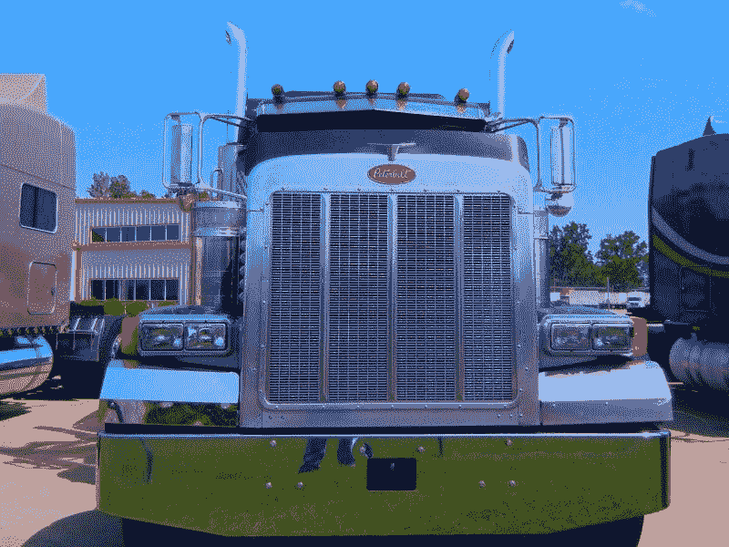
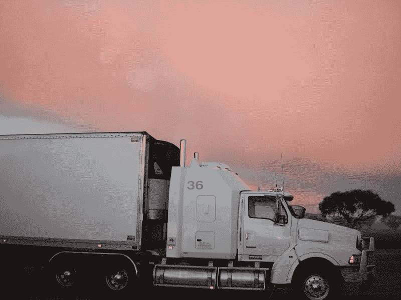
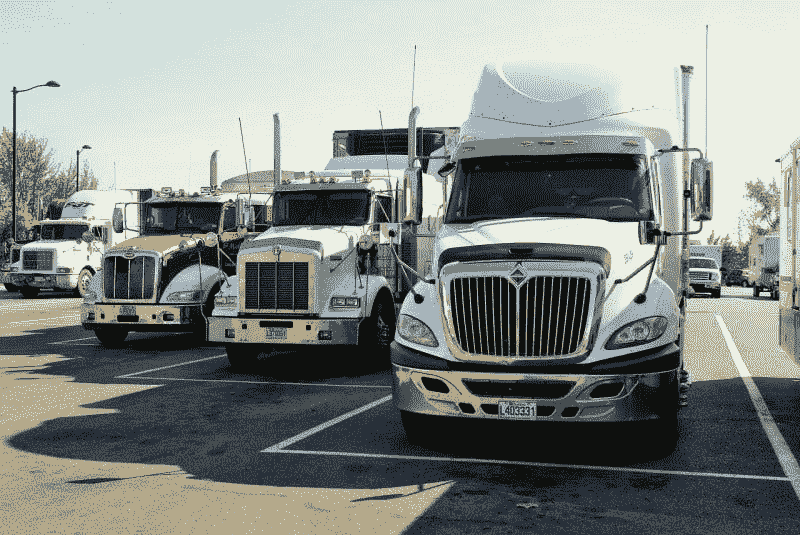
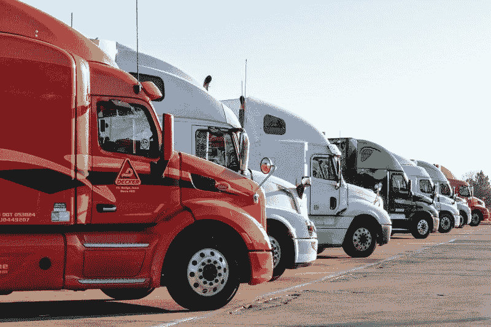
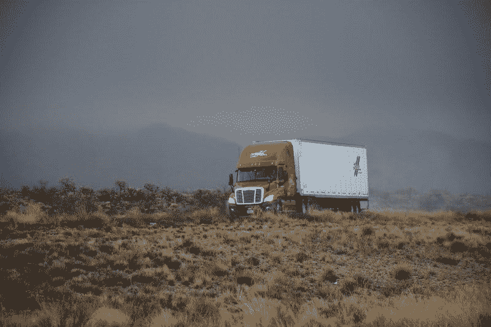

# 卡车运输能在 JB Hunt 生存吗？—市场疯人院

> 原文：<https://medium.datadriveninvestor.com/can-trucking-survive-at-jb-hunt-market-mad-house-7db96999e432?source=collection_archive---------24----------------------->

这些天来，货运受到了很多审查和批评。许多观察家认为，卡车运输业正处于大混乱的边缘。

例如，埃隆·马斯克认为电动半挂车将很快成为行业标准。因此，马斯克的**特斯拉汽车公司(纳斯达克股票代码:TSLA)** 正在制造和销售一辆[电动半自动汽车](https://www.tesla.com/semi)。

 [## 在自动驾驶汽车发生事故的情况下，谁应该承担法律责任？数据驱动的投资者

### 我仍然认为自动驾驶汽车是一种奢侈品，而不是必需品…

www.datadriveninvestor.com](https://www.datadriveninvestor.com/2018/11/02/who-is-legally-accountable-in-the-case-of-an-autonomous-vehicle-accident/) 

与此同时，总统候选人杨安泽(纽约州民主党)[认为](https://evonomics.com/what-will-happen-to-truck-drivers-ask-factory-workers-andrew-yang/)无人驾驶卡车会让成千上万的卡车司机失业。关于 UPS(纽约证券交易所代码:UPS) 等公司进行自动驾驶卡车[测试](https://www.theverge.com/2019/8/15/20805994/ups-self-driving-trucks-autonomous-delivery-tusimple)的新闻报道证实了杨的担忧。

很明显，沃尔沃集团计划在 2020 年推出一个名为沃尔沃自主解决方案的自动驾驶卡车子公司，*有趣的工程* [揭示](https://interestingengineering.com/volvo-to-set-up-new-autonomous-transport-business-starting-2020)。此外，沃尔沃公布了第一辆没有驾驶室的半挂牵引车的照片。

# 卡车运输公司赚钱吗？

鉴于这些发展，我认为卡车运输行业可能很快就会发生超越接待的变化。因此，这是一个很好的时机来问卡车运输公司像 **J.B .亨特运输公司(纳斯达克股票代码:JBHT)**；根据 Careersingear 的调查，美国第二大卡车运输公司赚钱吗？

我认为，只有现金充裕的公司才能在经历范式转变的行业中生存下来。如果卡车运输经历一次范式转变，像 J.B. Hunt 这样的公司将需要大量现金。例如，J.B. Hunt 可能不得不更换其超过 12，000 辆半挂牵引车。

值得注意的是，特斯拉的电动 semi 要价 15 万至 20 万美元。然而，特斯拉网站声称，卡车运输公司可以通过电动化节省超过 20 万美元的燃料成本。

此外，像 Alphabet (NASDAQ: GOOG) 子公司 [Waymo](https://jalopnik.com/meet-waymos-self-driving-semi-truck-1838639674) 这样的公司不会放弃他们的自动驾驶卡车技术。J.B. Hunt 可以通过雇佣更少的司机来省钱。但最终却花了一大笔钱来使用 Waymo 的技术。

我认为 **Alphabet(纳斯达克代码:GOOGL)** 进入卡车是因为其管理层认为他们可以从自主货运中赚很多钱。对 J.B. Hunt 来说，最糟糕的情况是与 Waymo Freight 竞争。因此，未来十年，J.B. Hunt 可能需要在昂贵的新技术上花费数千万美元。

# J.B .亨特赚钱了吗？

这是一个提问的好时机 **J.B. Hunt(纳斯达克代码:JBHT)** 赚钱了吗？目前，J.B .亨特赚了钱，但现金不多。

例如，截至 2019 年 6 月 30 日，J.B. Hunt 报告的季度毛利为 9.5937 亿美元，季度营业收入为 1.9309 亿美元，季度净收入为 1.3363 亿美元。

J.B. Hunt 从 22.61 亿美元的季度收入中赚到了这笔钱。截至 2019 年 6 月 30 日的季度，这些收入以 5.73%的速度增长。因此，J.B. Hunt 可能是一只成长型股票。

J.b .亨特的现金很少。该公司于 2019 年 6 月 30 日的经营现金流为 395.92 百万美元，自由现金流为 92.73 百万美元。值得注意的是，J.B. Hunt 在 2019 年 6 月 30 日报告的现金和短期投资仅为 688 万美元。

在这种情况下，我认为 J.B. Hunt 没有产生足够的现金作为一家独立的公司生存下去。在我看来，J.B .亨特的安全边际可能太低了。

# J.B. Hunt 是收购目标吗？

然而，我认为 J.B. Hunt 可以作为更大企业的一部分蓬勃发展，比如 Alphabet(纳斯达克股票代码:GOOGL)或 Berkshire Hathaway(纽约证券交易所股票代码:BRK)。B) 。为了解释，Alphabet 和 **Berkshire Hathaway(纽约证券交易所代码:BRK。A)** 有大量现金。

值得注意的是，Alphabet 在 2019 年 6 月 30 日拥有 1210.56 亿美元的现金和短期投资。与此同时，伯克希尔·哈撒韦公司在同一天拥有 446.34 亿美元的现金和等价物。

因此，Alphabet 有现金收购像 J.B. Hunt 这样的卡车运输公司，如果管理层愿意，还可以将其并入 Waymo。此外，伯克希尔·哈撒韦公司至少拥有一项物流业务，即向零售店提供商品的麦克莱恩公司。

# 亚马逊如何威胁卡车运输公司

因此，J.B. Hunt 可能成为收购目标。另一个买家是**亚马逊(NASDAQ: AMZN)** ，该公司在 2019 年 6 月 30 日拥有 414.63 亿美元的现金和短期投资。亚马逊正在进行物流业务采购，包括数千辆半挂车和[集装箱](https://www.joc.com/rail-intermodal/intermodal-shipping/amazon-acquires-branded-intermodal-containers_20190909.html)。

此外，*运输话题* [指责](https://www.ttnews.com/articles/amazon-shift-roils-trucking-logistics-firms)亚马逊物流让至少一家货运公司倒闭。那家公司是新英格兰汽车货运公司，于二月份关闭。

因此，J.B. Hunt 可能需要一个财力雄厚的捐助者来生存，并保护自己免受亚马逊的攻击。Alphabet 和沃伦·巴菲特都财大气粗。

# J.B. Hunt 是价值投资吗？

我不认为 **J.B. Hunt(纳斯达克代码:JBHT)** 是一项价值投资，因为缺乏现金。

此外，我认为市场先生在 2019 年 10 月 22 日对 J.B. Hunt 的定价过高，为 117.34 美元。我认为 J.B. Hunt 的风险水平不值得这个价格。

此外，我不认为 j.b. hunt plans 年 11 月 7 日的 26₵股息计划证明 117.34 美元的股价是合理的。值得注意的是，J.B .Hunt 今年的股息没有增长，尽管该公司连续 15 年股息增长，Dividend.com 给予该公司。

J.B. Hunt 投资者在 2019 年 10 月 11 日获得的股息收益率为 0.90%，年化派息为 1.04 美元，派息率为 19.24%。我认为这些数字不足以证明股价的合理性。

归根结底，我认为 J.B .亨特要价过高，风险太大。我建议投资者远离 J.B. Hunt。这家公司在即将经历范式转变的货运业务中几乎没有产生现金。

我相信 J.B .亨特将会经历一段艰难的生存和发展时期。因此，我建议投资者远离 J.B. Hunt。

*原载于 2019 年 10 月 22 日*[*https://marketmadhouse.com*](https://marketmadhouse.com/can-trucking-survive-at-jb-hunt/)*。*