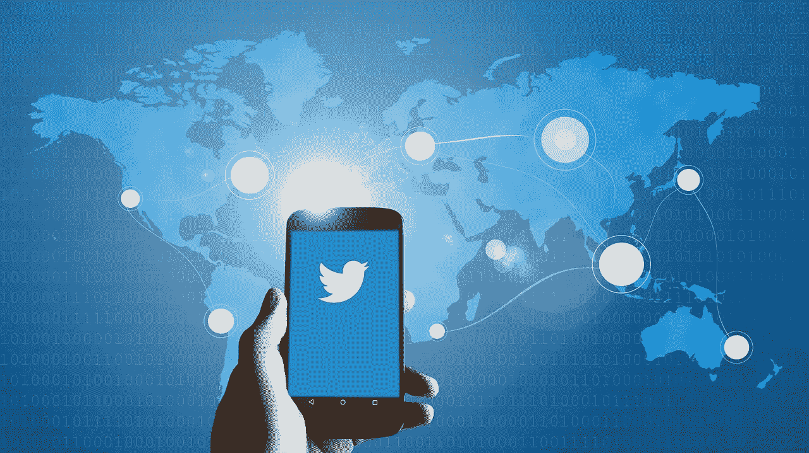
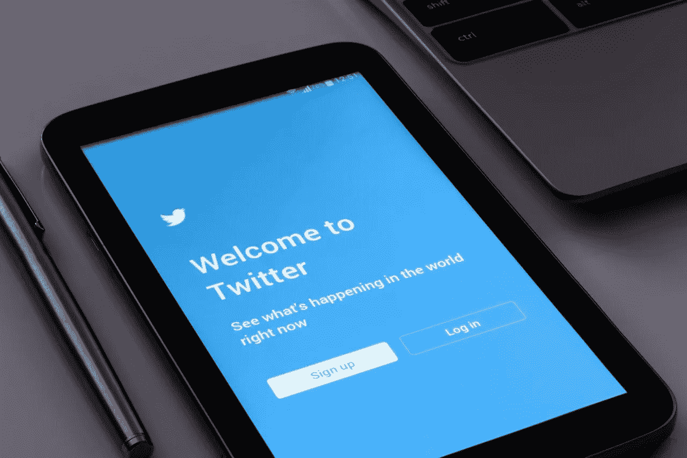
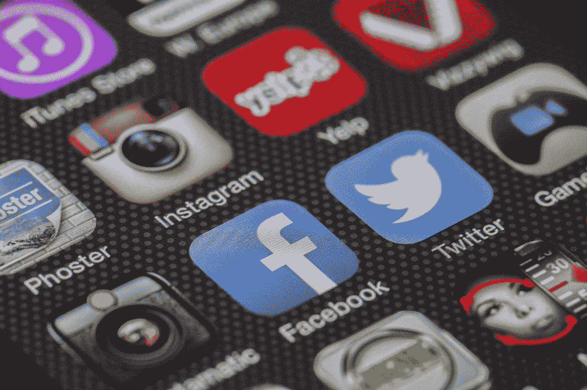
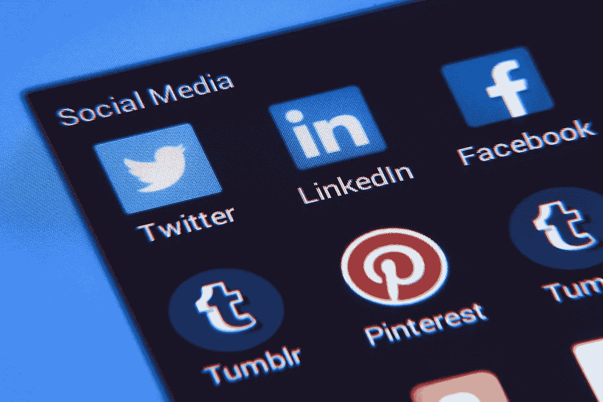

# Twitter 能赚钱吗？

> 原文：<https://medium.datadriveninvestor.com/can-twitter-make-money-d74a81e14cf3?source=collection_archive---------7----------------------->

投资者问 Twitter 能赚钱吗，因为这家社交媒体服务长期亏损。然而，财务数据表明 **Twitter(纽约证券交易所代码:TWTR)** 现在赚了一点钱。

例如，Twitter 报告 2018 年第四季度的毛利为 6.4 亿美元，营收为 9.09 亿美元。此外，Twitter 同期的营业收入为 2.07 亿美元，净收入为 2.55 亿美元。

然而，与**脸书**相比，Twitter 的表现简直是个笑话。相比之下，脸书 2018 年第四季度的毛利为 141.18 亿美元，营收为 169.14 亿美元。此外，脸书报告同一季度的营业收入为 78.2 亿美元，净收入为 68.82 亿美元。

# 【Twitter 如何赚钱？

公平地说，脸书拥有全球最大的四个社交媒体平台。具体来说，这些平台是脸书、WhatsApp、Facebook Messenger 和 Instagram。

与此同时，据 Statista [估计](https://www.statista.com/statistics/272014/global-social-networks-ranked-by-number-of-users/)，Twitter 运营着一个拥有 3 . 26 亿用户的社交媒体解决方案。相反，脸书的平台拥有 60.71 亿用户。详细来看，2019 年 1 月，脸书拥有 22.71 亿用户，WhatsApp 拥有 15 亿用户，Facebook Messenger 拥有 13 亿用户，Instagram 拥有 10 亿用户。

一个显而易见的结论是，你必须像脸书一样大才能在社交媒体上赚钱。很明显，唯一能在规模上与脸书的服务匹敌的社交网络是 **Alphabet 的**，据 Statista 计算，YouTube 在 2019 年 1 月拥有 19 亿用户。

 [## Twitter 算法是如何工作的&更多...-数据驱动型投资者

### 我们去拿护照吧。获取关于技术、金融、工作场所、生产力等方面的每日信息。跟我来…

www.datadriveninvestor.com](https://www.datadriveninvestor.com/2019/03/19/how-does-the-twitter-algorithm-work-more/) 

因此，像 Twitter 这样小而有限的社交网络可能永远不会赚钱。相反，Twitter 的未来可能会成为一个更大组织的一部分。

毫不奇怪，与脸书相比，Twitter 的股票很便宜。具体而言，Twitter 在 2019 年 3 月 29 日的交易价格为每股 32.88 美元，而脸书的交易价格为每股 166.69 美元。

# **Twitter 赚钱了吗？**

然而，Twitter 正在产生现金。值得注意的是，Twitter 报告 2018 年第四季度的运营现金流为 3.32 亿美元，自由现金流为 2.63 亿美元。

这些数字有助于在 2018 年底积累 62.09 亿美元的现金和短期投资。具体来说，Twitter 在 2018 年 12 月 31 日拥有 18.94 亿美元的现金和等价物，以及 43.15 亿美元的短期投资。

令人印象深刻的是，Twitter 的收入、毛利和收入都在增长。例如，毛利从 2018 年 9 月的 5.14 亿美元增长到 2018 年 12 月的 6.4 亿美元。

此外，Twitter 的收入从 2018 年第三季度的 7.58 亿美元增长到 2018 年第四季度的 9.09 亿美元。此外，Stockrow 估计 Twitter 的收入在 2018 年第四季度的增长率为 24.23%。

相反，Twitter 的净收入从 2018 年第三季度的 7.89 亿美元下降到 2018 年第四季度的 2.55 亿美元。相比之下，Twitter 的运营收入从 2018 年第三季度的 9200 万美元增长到 2018 年第四季度的 2.07 亿美元。

# **Twitter 证明社交媒体可以赚钱**

因此，Twitter 证明了较小的社交媒体网络也能赚钱。然而，Twitter 展示了小型社交网络赚钱能力的局限性。

Twitter 的结构限制了该公司的赚钱潜力，因为它主要在北美和英语国家运营。相比之下，脸书的网络遍布全球。

例如，WhatsApp 在印度有 2 亿用户，在巴西有 1.2 亿用户，应用商业[计算](http://www.businessofapps.com/data/whatsapp-statistics/)。另外，WhatsApp 的一个功能，WhatsApp Status 在全球拥有 4.5 亿用户。

有趣的是，WhatsApp 在欧洲很受欢迎，在荷兰的渗透率高达 85%；西班牙的使用率为 83.1%，意大利的使用率为 83%。因此，脸书通过 WhatsApp 拥有了这些国家的社交媒体市场。

然而，WhatsApp 在美国只有 2300 万用户。另一方面，WhatsApp 与 Twitter 不同，它是赔钱的。因此，规模大并不能让社交媒体盈利。

# 【WhatsApp 能赚钱吗？

因此，马克·扎克伯格(Mark Zuckerberg)正试图通过有针对性的广告和付费信息来赚钱。

例如，市场观察[声称](https://www.marketwatch.com/story/facebook-says-whatsapp-will-start-making-money-next-year-2018-08-01)whatsapp 将向优步 0.5₵到 9₵这样的大公司收取向其客户发送信息的费用。此外，广告将出现在 WhatsApp 的状态功能中。

Twitter 投资者需要担心这些努力，因为 WhatsApp 是一个危险的竞争对手。付费短信；特别是，这可能会鼓励企业转而使用 WhatsApp 来发送信息。

# 【Twitter 能和 WhatsApp 竞争吗？

此外，WhatsApp 提供了 Twitter 缺乏的有吸引力的功能。比如 WhatsApp 提供端到端加密，Twitter 没有。这意味着 WhatsApp 会加密整个对话，但 Twitter 不会。

因此，WhatsApp 比 Twitter 提供了更多的安全性和隐私性。然而，像格雷戈里奥·萨农这样的批评家声称 WhatsApp 的安全性存在严重漏洞。

即使存在潜在的安全漏洞，WhatsApp 的加密技术也将使其对商业更具吸引力。此外，WhatsApp 可以提供金融服务和支付功能。

值得注意的是，他们正在测试[WhatsApp Pay](https://marketmadhouse.com/whatsapp-pay-almost-ready-to-roll-out-in-india/)；类似于印度 Venmo 的点对点(P2P)支付解决方案。在这种情况下，WhatsApp 有朝一日可能会执行工资单和应付账款等业务功能。此外，如果 WhatsApp Pay 有效，他们可以使用 WhatsApp 进行银行业务或贷款。

# **谁将收购 Twitter？**

因此，我认为 Twitter 将不得不增加加密和支付才能生存。然而，我认为 Twitter 缺乏资源来添加这样的便利设施。

因此，Twitter 生存的最好机会是被一个更大的组织兼并或收购。最符合逻辑的买家是中国的 [**腾讯控股**](https://en.wikipedia.org/wiki/Tencent) **(SEHK: 700)** 旗下拥有微信和微信支付。

然而，政治分歧可能会阻止腾讯接触 Twitter。值得注意的是，一家与北京关系密切的公司收购特朗普总统最喜爱的玩具将引发一场激烈的争议。

# **PayPal 会收购 Twitter 吗？**

离家更近的是 PayPal 控股公司(纳斯达克股票代码:PYPL) ，它拥有快速增长的 Venmo 和美国最受欢迎的数字钱包。我认为结合 Venmo 和 Twitter 是有意义的。

为了解释，像 Venmo 和 WhatsApp Pay 这样的 P2P 应用程序允许你通过加密消息汇款。我认为如果竞争对手提供加密和 P2P 功能，Twitter 将无法生存。

然而，高度加密的电报；该公司没有 Twitter 的声名狼藉和争议，可能更适合 PayPal。重要的是，Telegram 正在探索通过加密货币增加金融服务的可能性，CCN 声称。

# **为什么 PayPal 不会收购 Twitter**

PayPal 可能会对 Twitter 说不，因为 Twitter 将不得不提供端到端加密来提供支付。解释一下，没人在乎八卦还是新闻；Twitter 的主要产品是安全的，但他们希望他们的钱是安全的。

因此， [PayPal](https://marketmadhouse.com/the-power-of-paypal-pypl-should-a-dividend/) 将需要花费数十亿美元对 Twitter 进行加密，以使其成为可行的支付解决方案。因此，给 [Venmo](https://expandedramblings.com/index.php/venmo-statistics-facts/) 添加消息功能可能是更明智的举措。

因此，Twitter 将不得不提升其加密和安全游戏，以与 WhatsApp 以及 Telegram 或 PayPal 竞争。然而，Twitter 可能缺乏实现这些目标的资源。

因此，我认为 Twitter 永远不会成为社交媒体的主要参与者。因此，**【脸书(纳斯达克股票代码:FB)** ，**腾讯控股(OTCMKTS:TCTZF)**和 **PayPal(纳斯达克股票代码:PYPL)** 对于那些想在社交媒体热潮中获利的人来说是更好的投资。