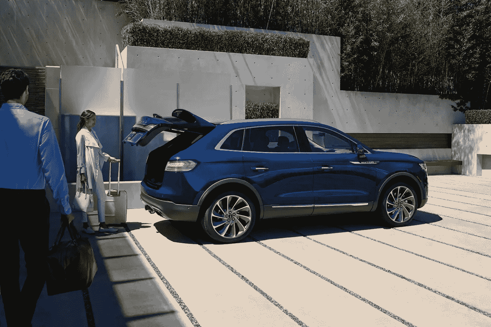
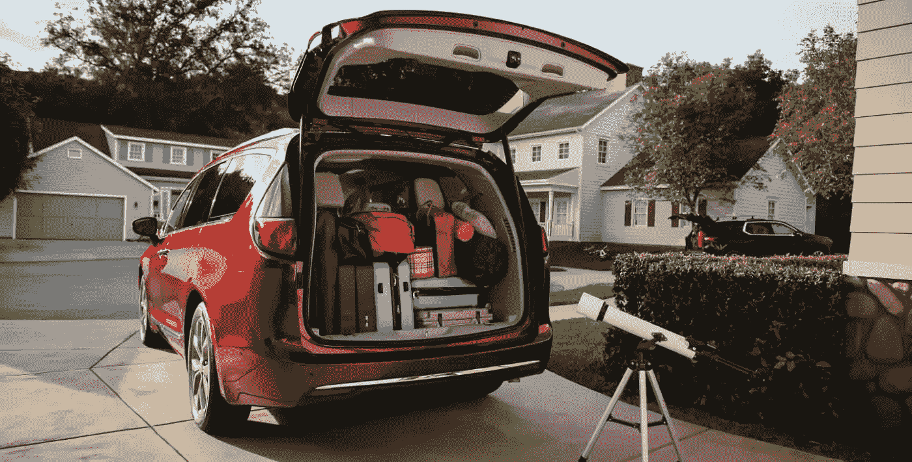
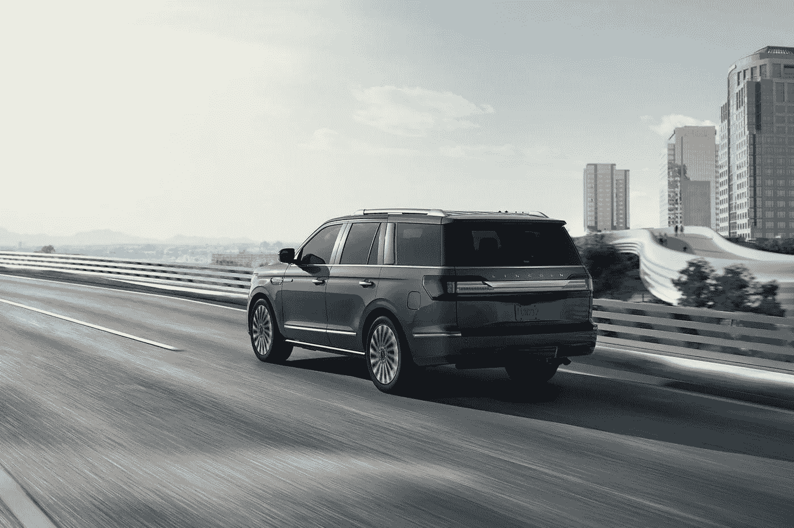
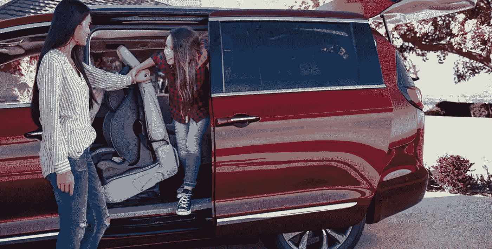
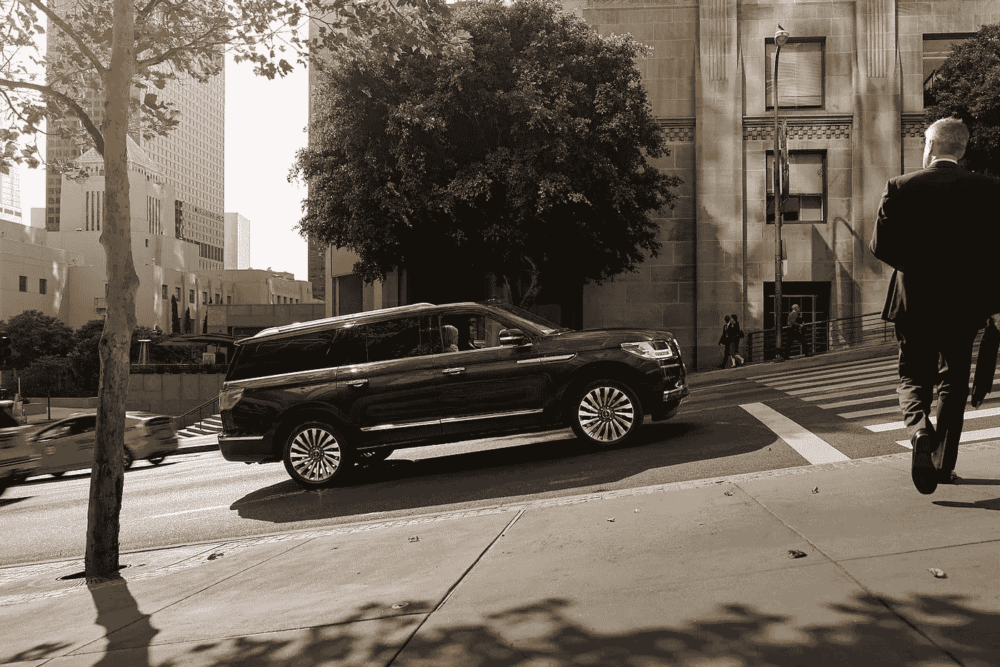

# 优步能赚钱吗？这对经济有好处吗？

> 原文：<https://medium.datadriveninvestor.com/can-uber-make-money-and-is-it-good-for-the-economy-64823d71f3f4?source=collection_archive---------2----------------------->

投资者在问优步能赚钱吗，因为这家乘车股巨头正计划发行股票。此外，批评者还在问，由于缺乏盈利能力，优步对经济有好处吗？

为了解释，优步已经提交了首次公开募股(IPO)的文件，《纽约时报》报道。然而，优步承认 2018 年损失了 18 亿美元。

 [## 在自动驾驶汽车发生事故的情况下，谁应该承担法律责任？-数据驱动型投资者

### 我仍然认为自动驾驶汽车是一种奢侈品，而不是必需品…

www.datadriveninvestor.com](https://www.datadriveninvestor.com/2018/11/02/who-is-legally-accountable-in-the-case-of-an-autonomous-vehicle-accident/) 

投资者对优步感兴趣，因为分析家[估计其价值为 1000 亿美元。此外，优步在 2018 年创造了 113 亿美元的收入。因此，优步可以很快赚钱。另一方面，优步的收入增长正在放缓。](https://www.nytimes.com/2019/04/10/technology/uber-ipo.html?module=inline)

# 优步对经济有好处吗？

优步缺乏盈利能力引发了严重的道德、金融、政治和社会问题。

例如，美国优步司机的平均年收入约为 2 万美元。因此，美国优步司机的平均收入比美国实际个人收入中位数少 11066 美元。

澄清一下，圣路易斯美联储银行估计美国 2016 年的个人收入中值为每年 31066 美元。重要的是，这个数字代表了普通美国人的年收入。

因此，优步司机挣不到足够的钱来维持美国中产阶级的生活方式。因此，批评家指责优步没有给社会带来持久的利益。

# 优步避税吗？

因此，许多优步司机有资格享受美国政府为穷人提供的各种福利。例如，优步的司机有资格享受医疗补助。美国的单一付款人健康保险计划，适用于许多州的穷人。

此外，据《财富》 [报道](http://fortune.com/2019/02/25/uber-u-k-tax-suit-ruling/),律师 Jolyon Maugham 在诉讼中声称优步没有向英国纳税。特别是，批评者指责优步没有支付英国政府养老金所需的国民保险工资税。

因此，批评者声称纳税人正在资助优步的业务。具体来说，优步通过支付承包商司机的工资来避免工资税。在美国和英国，承包商免缴工资税。

然而，优步的竞争对手如出租车公司收取工资税。因此，优步相对于竞争对手拥有不公平的优势。

# 优步教伤害工人吗？

此外，许多批评人士指责优步将运营成本转嫁给司机，损害了工人的利益。

解释一下，大多数优步司机提供自己的车辆、燃料和保险。同时，优步提供了一个连接司机和乘客的平台。作为交换，司机和乘客都要向优步支付连接费。

因此，优步司机的大部分收入都花在了与汽车相关的支出上。例如，加州优步司机彼得·阿什洛克负担不起修理或更换他的汽车，*《纽约时报》* [报道](https://www.nytimes.com/2019/04/12/technology/uber-driver-ipo.html)。

# **优步在推行债务劳役吗？**

相比之下，美国税务出租车公司为司机提供车辆。因此，出租车司机可以比优步司机拿到更多的实得工资。

此外，许多优步司机需要贷款来借车。因此，许多优步司机用他们的大部分收入来支付贷款。毫不奇怪，一些批评家称这种情况为债务劳役。

澄清一下，当一个工人的所有收入都用来偿还债务时，债务劳役就发生了。因此，工人需要借更多的钱来生存，并且永远无法摆脱债务。

此外，批评家指责许多优步司机依靠发薪日贷款来支付费用。解释一下，发薪日贷款是一种短期债务，借款人必须在发薪日偿还。一般来说，发薪日贷款伴随着高利息和严格的还款要求。

# 优步是一个好的投资吗？

在这种情况下，批评家们会给优步贴上糟糕投资的标签。有趣的是，股价表明市场先生同意批评者的观点。

具体来说，市场在 2019 年 4 月 15 日将 **Lyft(纳斯达克代码:LYFT)** 的股票定价为 56.54 美元。优步最大的美国竞争对手 Lyft 的股票于 2019 年 3 月 29 日首次交易。

然而，Lyft 股票在 2019 年 3 月 29 日的交易价格为 72 至 78 美元。因此，Lyft 的股价在两周内下跌了约 20 美元。

和优步一样，Lyft 亏损，并面临向司机支付过低工资的指控。例如，Lyft 在 2018 年损失了 9.11 亿美元，*彭博* [报道](https://www.bloomberg.com/news/articles/2019-04-01/on-demand-startups-are-hemorrhaging-tens-of-billions-a-year)。因此，拼车应用可能对投资者和司机都不利。

# **汽车制造商是比 Lyft 和优步更好的投资**

因此，Lyft 和优步都不是好投资。然而，有一批赚钱的交通股能够从乘车股的增长中获利。

那些公司是汽车制造商，他们赚钱并付给工人高薪。例如，最健康的美国汽车制造商；**福特汽车公司(纽约证券交易所代码:F)** ，报告 2018 年收入 1603.38 亿美元，毛利 146.06 亿美元。

此外，福特报告 2018 年净收入为 36.77 亿美元，营业收入为 22.03 亿美元。令人印象深刻的是，福特在 2018 年 12 月 31 日拥有 339.51 亿美元的现金和短期投资。

# **汽车制造商是价值投资**

与此同时，意大利裔美国人**菲亚特克莱斯勒公司(纽约证券交易所代码:FCAU)** 报告称，2018 年第四季度的毛利为 177.02 亿美元，收入为 1262.18 亿美元。此外，[菲亚特-克莱斯勒](https://marketmadhouse.com/fiat-chrysler-has-more-value-than-you-think/)2018 年第四季度的营业收入为 56.6 亿美元，净收入为 41.47 亿美元。

因此，汽车制造商赚钱，他们支付股息。例如，福特将于 2019 年 6 月 3 日支付 15₵股息。此外，菲亚特-克莱斯勒将于 2019 年 5 月 2 日支付 75₵特别股息。

最后，汽车制造商很便宜，福特在 2019 年 4 月 15 日的交易价格为每股 9.30 美元。与此同时，同一天，菲亚特-克莱斯勒的股价为 16.18 美元。在这种情况下，我认为福特和菲亚特-克莱斯勒价值投资。

# **汽车制造商是一项对社会负责的投资**

此外，汽车制造商是一项对社会负责的投资，因为他们给工人支付高薪。

据估计，例如，福特汽车装配工人的平均基本工资是每小时 18 美元，每年有 7500 美元的额外收入。因此， *Glassdoor* 计算出一名福特员工的年收入为 43，000 美元。此外，俄亥俄州托莱多的菲亚特克莱斯勒生产工人平均年收入为 39，696 美元。

此外，汽车工人不需要购买和维护车辆来完成他或她的工作。因此，汽车工人拿回家更多的钱，并保留更多的钱。因此，汽车制造商对工人更有利。

# **汽车股是乘车股的最佳投资**

有趣的是，像福特和菲亚特-克莱斯勒这样的汽车制造商在不赔钱的情况下从拼车中获利。

解释一下，汽车制造商通过销售和资助司机使用的车辆从打车服务中赚钱。因此，即使优步或 Lyft 倒闭，福特和菲亚特-克莱斯勒也会从拼车业务中赚钱。具体来说，我认为拼车会继续存在，但优步和 Lyft 可能会倒闭。

此外，菲亚特-克莱斯勒和福特都在投资拼车相关技术。特别是，福特和 Autonomic 正在[开发](https://marketmadhouse.com/will-ford-motor-f-make-money-from-self-driving-cars/)交通移动云。

具体来说，交通移动云从自动驾驶汽车中挖掘数据。福特可以利用这些数据开发自己的拼车解决方案或拼车车辆。此外，福特可以向优步和 Lyft 等拼车公司出售数据。

# **自动驾驶汽车是乘车共享的未来**

另外，福特计划向福特自动驾驶汽车有限责任公司投资 30 亿美元；它的自动驾驶汽车项目。这家合资企业将从 rideshare 中赚钱，因为自动驾驶汽车是 rideshare 的未来。

据此，福特自动驾驶汽车公司计划出售一款自动驾驶商用车；大概是福特全顺面包车，2021 年，*汽车新闻* [报道](https://www.autonews.com/article/20180724/MOBILITY/180729868/ford-commits-4-billion-to-autonomous-vehicles-forms-new-subsidiary)。路透社[声称 Alphabet(NASDAQ:GOOG)正在为其 Waymo 自动驾驶汽车合资公司购买超过 62，000 辆菲亚特-克莱斯勒 Pacifica 面包车，因此这种汽车有市场。](https://www.reuters.com/article/us-fiat-chrysler-waymo/waymo-to-get-more-than-60000-cars-from-fiat-chrysler-for-robotaxis-idUSKCN1IW2BC)

因此，菲亚特克莱斯勒已经从 Alphabet 在美国亚利桑那州凤凰城进行的 Waymo One 拼车实验中获利。为了解释这一点， [Waymo One](https://marketmadhouse.com/will-waymo-boost-fiat-chrysler-automobiles-fcau/) 使用自动驾驶货车进行拼车。

因此，打车服务可能是一项不错的投资，但优步和 Lyft 不会。相反，优步或 Lyft 可能会资金告罄而倒闭。因此，像福特这样的汽车制造商将在某个时候收购优步或 Lyft。投资者需要调查汽车制造商，如果他们想赚钱，就远离乘车共享。

这个故事也出现在 [*Empresa Journal*](https://empresa-journal.com/) 上。