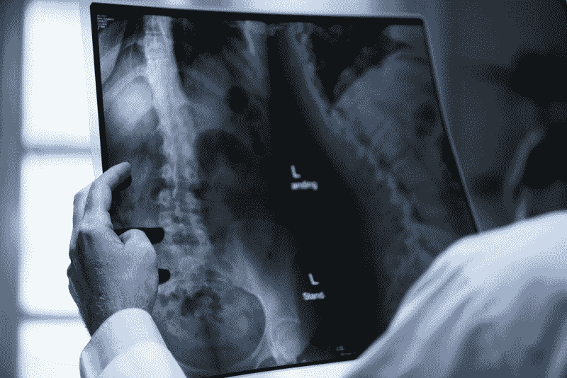
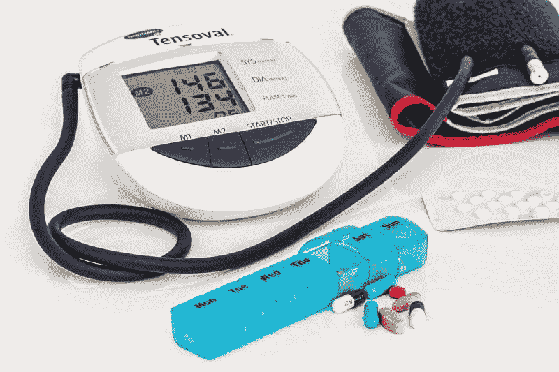

# 联合健康集团和大健康保险能活下来吗？—市场疯人院

> 原文：<https://medium.datadriveninvestor.com/can-unitedhealth-group-and-big-health-insurance-survive-market-mad-house-2865a15342f9?source=collection_archive---------6----------------------->

奇怪的是，许多人在问，由于政治气候的原因，联合健康集团和大型健康保险能幸存下来吗？解释一下，许多政客要求全民医保(单一支付者政府健康保险)，而其他人要求取消私人健康保险。

例如，在 2019 年 5 月接受采访的可能的民主党初选选民中，有 46%支持左翼单一支付者在总统竞选中的支持者。具体来说，四位顶级候选人中有三位是单一支付支持者美国参议员伯尼·桑德斯(佛蒙特州议员)(25%)、卡玛拉·哈里斯(加利福尼亚州议员)(10%)和伊丽莎白·沃伦(马萨诸塞州议员)(10%)。

 [## 大笔资金和尖端技术:人工智能/人工智能投资将如何革新医疗保健…

### 在过去几年人工智能(AI)和机器学习(ML)的显著发展中…

www.datadriveninvestor.com](https://www.datadriveninvestor.com/2018/03/22/big-money-and-cutting-edge-technology-how-investment-in-ai-ml-will-revolutionize-the-healthcare-industry/) 

很能说明问题的是，桑德斯想要摆脱私人保险公司，*《国会山》* [评论道](https://thehill.com/policy/healthcare/436033-sanders-youre-damn-right-health-insurance-companies-should-be-eliminated)。此外,*商业内幕* [指出](https://www.businessinsider.com/kamala-harris-flip-flops-on-private-health-insurance-ban-2019-5)哈里斯希望将私人健康保险限制在研究的补充计划上。因此，哈里斯想取消大多数私人保险。

# 民主党人希望废除私人医疗保险

甚至大保险的朋友；所谓的温和派民主党人，如美国参议员迈克尔·贝内特(D-Colorado)，提出了可能会摧毁其业务的计划。

例如，班尼特提倡他所谓的医疗保险 X。Vox [报道](https://www.vox.com/health-care/2017/10/20/16504800/medicare-x-single-payer) Medicare-X 将允许所有美国人购买公共健康保险。公共选项的购买者将有权获得医疗保险价格和医疗保健提供商。因此，贝内特；一个温和的长期总统候选人，正在提供一个偷偷摸摸的“全民医保”版本。

我认为私人保险公司将无法与 Medicare-X 竞争，因为它将比私人计划更便宜、更容易获得。如果企业可以为员工购买医疗保险 X，像联合健康集团(纽约证券交易所:UNH)这样的公司可能会损失很多钱。

扼杀私人医疗保险现在是民主党的主流立场。民主党已经控制了美国众议院，他们明年可能会赢得总统和参议院。

例如，艾默生民调预测，民主党前五名候选人都可能在 2020 年总统竞选中击败唐纳德·j·特朗普(纽约州共和党)。奇怪的是，特朗普本人过去是一个直言不讳的单一支付者倡导者，并可能再次改变立场以确保连任。因此，在不到两年的时间里，保险公司可能会面临 DC 不利的政治气候。

# 联合健康集团赚了多少钱？

联合健康集团可能很快会面临一场残酷的生存之战，但它目前赚了很多钱。

具体来说，**联合健康集团(纽约证券交易所:UNH)** 报告截至 2019 年 3 月 31 日的季度毛利为 119.88 亿美元，收入为 603.08 亿美元，营业收入为 48.32 亿美元，净收入为 34.67 亿美元。令人印象深刻的是，斯托克罗[估计](https://stockrow.com/UNH/financials/income/quarterly)联合健康集团在 2019 年 3 月 31 日的毛利率为 23.19%。

与此同时，联合健康证明了沃伦·巴菲特关于保险公司是摇钱树的观点是正确的。因此，Stockrow 报告称，截至 2019 年 3 月 31 日，UnitedHealth 的运营现金流为 32.34 亿美元，自由现金流为 26.72 亿美元。

因此，截至 3 月底，联合健康集团拥有 124.07 亿美元的现金和等价物，以及 62.54 亿美元的短期投资。因此，联合健康有 186.61 亿美元的流动资产，巴菲特称之为“浮存”

# 单一支付者如何威胁健康保险公司的生存

在巴菲特的[定义](https://www.npr.org/sections/money/2010/03/warren_buffett_explains_the_ge.html)中，浮存金是保险公司通过收取保费产生的现金。健康保险公司产生大量浮存金；因为大多数美国人必须支付保险费才能获得医疗保健。

此外，雇主会自动从工资中扣除大部分美国人的医疗保险费。因此，像联合健康集团这样的健康保险公司从美国人的工资中获利。

单一支付者威胁到了这种浮动，因为它可以让人们不用支付保险费就能获得健康保险。此外，雇主没有理由在单一支付系统下提供医疗保险。

雇主提供单一付款人医疗保险是没有意义的。解释一下，雇主可以通过消除健康管理成本和潜在的人力关系部门来减少开支。

# 单一支付者如何摧毁联合医疗集团

此外，组织可以为员工提供更高的工资，因为他们不必支付保险费。

最后，单一支付者将使公司更容易雇佣合同工、兼职工人、临时工、自由职业者和零工。具体来说，医疗保险是当今美国全职就业的最大激励因素之一。

在单一支付者制度下，这种激励将会消失，让更多的美国人放弃传统的淘汰工作。雇主有强烈的动机鼓励这一过程，因为零工经济工人、自由职业者、临时工、短期工和兼职人员比传统员工更便宜、更灵活。

所有这些都是对联合健康集团的直接威胁，因为其商业模式是从员工健康保险计划中产生浮存金。如果没有员工健康保险计划，UnitedHealth 就没有业务。

# 联合健康能生存吗？

奇怪的是，联合健康组织正在为单一支付者下的生存打下基础。值得注意的是，UnitedHealth 是私人医疗保险和医疗补助补充计划的主要提供商。

这种补充计划有巨大的市场。亨利·j·凯泽基金会[估计](https://www.kff.org/medicare/issue-brief/a-dozen-facts-about-medicare-advantage/)2018 年有 2040 万美国人拥有医疗保险优势计划；例如，高于 2017 年的 1900 万。

然而，政府在管理此类计划方面往往表现不佳。值得注意的是，国家公共电台(NPR) [声称](https://www.npr.org/sections/health-shots/2019/06/06/730396134/social-security-error-jeopardizes-medicare-coverage-for-250-000-seniors)超过 250，000 人可能因为支付故障而失去医疗保险优势覆盖。

# 社会保障无法支付医疗保险优势

为了解释，社会保障管理局(SSA)自动从许多人的社会保障中扣除医疗保险优势付款。NPR 声称，令人厌恶的是，SSA 几个月都没有支付这些款项，危及了覆盖面。

这种拙劣的做法解释了为什么美国人讨厌私人保险，而想要公共选择。媒体对这些失败和巨额医疗保险账单的报道滋生了一种敌对气氛。因此，政客们利用了对大额医疗保险的仇恨，加入了单一支付者的行列。

值得注意的是，巨额医疗保险成了政客和官僚失败的替罪羊。例如，SSA 显然没有支付私人保险公司。然而，他们将承担责任，并可能最终为山姆大叔的错误买单。

注意，NPR 没有说明 SSA 的失误是否影响了联合健康公司或其客户。然而，我知道至少有一个医疗保险优势的接受者收到了一份由社会保障在五月份支付的统一健康保险的账单。

# 联合健康集团是价值投资吗？

尽管存在单一支付者的威胁，但我的结论是，UnitedHealth 是一只好股票，但不是价值投资。

2019 年 6 月 12 日,“市场先生”对联合健康的公允定价为 242.78 美元。然而，我认为健康保险的未来太不确定，使 UNH 成为一个价值投资。

另一方面，UnitedHealth 在 2019 年 6 月 12 日提供的股息收益率为 1.78%，年化股息为 4.32 美元，派息率为 34%。令人印象深刻的是，联合健康公司 6 月 25 日 1.08 美元的股息将首次超过 1 美元。

联合健康公司于 2019 年 3 月 19 日支付了 90₵股息。因此，联合健康公司的股息由 18₵.增长这使得联合健康成为目前健康保险市场上一个巨大的红利和收益股。不幸的是，我不认为市场会在美国当前的政治气候下存活下来。

*原载于 2019 年 6 月 12 日*[*【https://marketmadhouse.com】*](https://marketmadhouse.com/can-unitedhealth-group-and-big-health-insurance-survive/)*。*