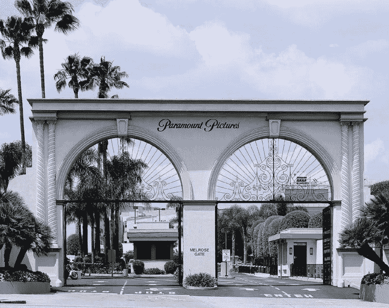
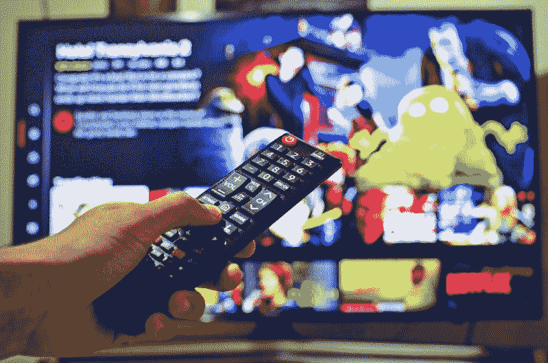

# 维亚康姆能拯救哥伦比亚广播公司吗？—市场疯人院

> 原文：<https://medium.datadriveninvestor.com/can-viacom-save-cbs-from-oblivion-market-mad-house-1de49ce43dfe?source=collection_archive---------15----------------------->

女继承人 Shari Redstone 希望 Viacom 能够拯救 CBS 免于被遗忘。

据《纽约时报》报道，**哥伦比亚广播公司(纽约证券交易所代码:CBS)** 和维亚康姆将再次合并为一家公司。雷石东希望合并能产生协同效应和收入。

 [## 2019 年值得关注的 20 种数字营销趋势和技术|数据驱动的投资者

### Faisal 在加拿大工作，拥有金融/经济和计算机方面的背景。他一直积极从事外汇交易…

www.datadriveninvestor.com](https://www.datadriveninvestor.com/2019/02/04/20-digital-marketing-trends-techniques-to-watch-out-for-in-2019/) 

具体来说， [CBS](https://marketmadhouse.com/is-cbs-cbs-the-future-of-television/) 拥有美国顶级广播网络、出版商西蒙&舒斯特，以及 CBS All Access、CBS Sports HQ、Showtime OTT 和 CBSN 流媒体视频门户网站。与此同时，维亚康姆拥有一家历史悠久的好莱坞电影制片厂；派拉蒙电影公司，以及受欢迎的有线电视频道，包括 MTV、Comedy Central、VH1、TV Land、派拉蒙网络和 Nickelodeon。另外，维亚康姆正在涉足 Noggin 和 Pluto TV 的流媒体视频。

# 为什么 CBS 想要维亚康姆

我猜是红石；媒体大亨、维亚康姆创始人萨姆纳·雷德斯通的女儿，想要创建一个数字娱乐品牌，保护家族财富免受**迪士尼、** **、亚马逊(纳斯达克:AMZN)** 和**网飞(纳斯达克:NFLX)** 的冲击。

值得注意的是，CBS 的收视率远低于网飞或亚马逊。例如，Statista [估计](https://www.statista.com/statistics/250937/quarterly-number-of-netflix-streaming-subscribers-in-the-us/)网飞在 2019 年第二季度拥有 6010 万美国用户。此外，亚马逊 Prime 视频今年可能会吸引 9650 万观众， *AdWeek* 和 *eMarketer* [估计](https://www.adweek.com/tv-video/hulu-and-amazon-prime-video-are-gaining-on-netflix-in-the-streaming-wars/)。

与此同时，迪士尼拥有 Hulu 的股份，今年可能会吸引 7580 万美国观众。此外，迪士尼计划在 2019 年 11 月 12 日推出自己的[迪士尼加](https://preview.disneyplus.com/?cid=DSS-Search-Google-Splash-disney_plus-exact&gclid=CjwKCAjwnrjrBRAMEiwAXsCc4xtOMiWwMKBIcvNSLEyZqp_HUMJbSyYet2PP7kVq_z9bXsPbWlNmoxoCWJsQAvD_BwE)流媒体服务。

相比之下，哥伦比亚广播公司在 2018 年至 2019 年电视季吸引了 890 万观众，截止日期[估计](https://deadline.com/2019/05/tv-ratings-2018-2019-season-totals-viewers-demo-cbs-nbc-1202620062/)。哥伦比亚广播公司的观众人数从 2017-2018 年的 900 万下降到 2016-2017 年的 960 万。此外，2019 年 9 月 2 日，哥伦比亚广播公司的广播网络仅吸引了 335 万观众。

因此，流媒体服务正在赢得争夺美国眼球的战争。此外， *EMarketer* 估计，2019 年将有 1.825 亿美国人或 55%的美国人口观看流媒体视频， *AdWeek* 报道。

# 基础有线电视正在快速消亡

作为回应，CBS 需要用流媒体视频快速取代其广播业务。此外，维亚康姆需要新的节目出口，以取代快速死亡的有线电视网络。

曾经强大的 MTV 是 2019 年 7 月排名第 33 位的美国基本有线电视网，拥有 31.2 万至 42.6 万美国观众， *AdWeek* [估计](https://www.worldometers.info/world-population/us-population/)。值得注意的是，世界计量机构[估计](https://www.worldometers.info/world-population/us-population/)2019 年 8 月美国人口为 3.27096 亿。

与此同时，2019 年 7 月，Nickelodeon 的 Nick at Nite 吸引了 394，000 至 551，000 名美国观众。此外，Nickelodeon 的重要电影《小尼克》(Nick Jr .)同期吸引了 24.1 万至 36.5 万名观众。

因此，我估计维亚康姆有线电视网的平均收视率大约是美国人口的 0.03%。因此，很难再认为 MTV 和 Nickelodeon 是主要的全国性娱乐品牌。

# CBS 如何从流媒体视频中拯救维亚康姆

我认为收视率显示，基础有线电视已死，广播电视正在迅速消亡。因此，夏里·雷石东；就像迪士尼的鲍勃·伊格尔一样，她正急于将公司的内容尽可能多地转移到流媒体视频上。

实现这一目标的最快方法是将维亚康姆和 CBS 合并，然后通过 CBS 互动数字视频频道提供维亚康姆的大部分节目。值得注意的是，Stockrow 认为 CBS 的收入增长令人印象深刻。然而，哥伦比亚广播公司上个季度的收入下降了。

*综艺* [预估](https://variety.com/2019/digital/news/cbs-viacom-merger-streaming-strategy-1203261834/)冥王星卫视；维亚康姆的主流视频门户网站在 2019 年 8 月拥有 1800 万用户。与此同时，面向儿童的流媒体服务 Noggin 拥有 250 万用户。

相比之下，CBS All Access 在 2019 年 5 月拥有超过 800 万订户，*福布斯* [估计](https://marketmadhouse.com/can-viacom-save-cbs-from-oblivion/#3fd372a031ca)。哥伦比亚广播公司称，2019 年第一季度，All Access 的订户数量增长了 71%，这要归功于《T4》的《暮光之城》、《星际迷航:皮卡德》、《T5》和《星际迷航:发现》等系列。

CBS 希望 All Access 能够通过超过 10，000 集的 CBS 节目、*老大哥直播*、大学体育和三月疯狂篮球来对抗迪士尼 Plus。此外，哥伦比亚广播公司计划在 2019 年花费 80 亿美元用于流媒体视频内容。

# CBS 赚钱了吗？

在截至 2019 年 6 月 30 日的季度中，哥伦比亚广播公司实现了 12.47 亿美元的毛利，7.02 亿美元的营业收入和 4.4 亿美元的净收入。

值得注意的是，哥伦比亚广播公司的季度收入为 38.09 亿美元，同比增长 9.9%。然而，这些收入从 2019 年 3 月 31 日的 41.67 亿美元下降。

另一方面，哥伦比亚广播公司报告上一季度自由现金流为负 1.57 亿美元。相比之下，哥伦比亚广播公司报告的经营现金流为 3.14 亿美元，投资现金流为 5.82 亿美元。然而，哥伦比亚广播公司报告同期的融资现金流为-10 亿美元。

另一方面，哥伦比亚广播公司报告上一季度自由现金流为负 1.57 亿美元。相比之下，哥伦比亚广播公司报告的经营现金流为 3.14 亿美元，投资现金流为 5.82 亿美元。然而，哥伦比亚广播公司报告同期的融资现金流为-10 亿美元。

# ViacomCBS 能从流媒体视频中产生 Float 吗？

我的猜测是，雷石东希望将维亚康姆和哥伦比亚广播公司的流媒体视频服务结合起来，从订阅中获得更多现金。

因此，哥伦比亚广播公司-维亚康姆可以产生浮存金，而不是依赖广告收入。解释一下，float 是来自定期支付(如订阅)的稳定现金流。或许，雷石东认为视频订阅将起到浮动的作用。

目前，CBS All Access 对带有有限商业广告的节目每月收费 5.99 美元，无商业广告的服务收费 9.99 美元。相比之下，Pluto TV 是免费的，但 Noggin 每月收费 7.99 美元。

# ViacomCBS 能从流媒体视频中赚多少钱？

因此，我计算出 ViacomCBS 每年可以产生高达 7992 万美元或 9.5904 亿美元的浮存资金——如果所有 800 万 CBS All Access 订户都支付全价的话。

相反，CBS All Access 每月可创收 4792 万美元；或者一年 5.7504 亿美元的浮动资金——如果所有 800 万用户为有限的商业订阅支付 5.99 美元。此外，ViacomCBS 每月可以从 Noggin 订阅中获得 1，997.5 万美元，每年 2.397 亿美元。

合并 CBS 和 Viacom 的另一个明显原因是合并流媒体服务的管理和技术支持系统。理论上，这可以减少提供流媒体视频服务的费用。

然而，流媒体视频的主要原因是通过订阅产生定期现金流或浮动。浮存金可以赚很多钱，值得注意的是，沃伦·巴菲特利用报纸订阅费和保险费等不同来源的浮存金建立了伯克希尔·哈撒韦公司(纽约证券交易所代码:BRK)。B) 。

# 维亚康姆赚钱了吗？

**维亚康姆(纽约证券交易所代码:VIAB)** 在截至 2019 年 6 月 30 日的季度中实现了盈利。具体来说，维亚康姆报告该季度的毛利为 15.85 亿美元，营业收入为 7.57 亿美元，净收入为 5.44 亿美元。

有趣的是，维亚康姆在最后一个季度比哥伦比亚广播公司产生了更多的现金。维亚康姆的运营现金流为 11.03 亿美元，自由现金流为 3.42 亿美元。然而，维亚康姆在 2019 年 6 月 30 日报告了负投资现金流-5.06 亿美元和负融资现金流-142.9 万美元。

此外，维亚康姆在 2019 年 6 月以 7.22 亿美元现金和等价物的形式拥有更多现金。然而，这低于 2018 年 6 月 30 日的 929 美元现金和等价物。

# 雷石东能拿下维亚康姆数码吗？

一种可能的情况是，雷石东计划将维亚康姆从其电影中获得的部分现金投资于扩大 CBS 的数字业务。值得注意的是，哥伦比亚广播公司代理首席执行官乔·伊恩尼罗和数字首席执行官吉姆·兰佐内希望到 2022 年拥有 2500 万浮动制作所有接入用户，*福布斯*撰稿人吉尔·戈德史密斯[报道](https://marketmadhouse.com/can-viacom-save-cbs-from-oblivion/#3fd372a031ca)。

扩大所有接入以容纳这些用户将需要资金。此外，付钱给大明星和主要节目主持人来制作吸引大量订户的内容将会很昂贵。

值得注意的是，维亚康姆仍然可以创造大片娱乐。派拉蒙网络的 21 世纪西部*黄石*第二季大结局吸引了 570 万观众，*截止日期* [估计](https://deadline.com/2019/09/yellowstonerating-highs-season-2-finale-paramount-network-chief-success-end-game-1202709916/)。只有时间才能证明维亚康姆能否在流媒体视频上重复这个公式。

再加上 CBS 可以挖掘维亚康姆的经典电影库；其中包括《星际迷航》系列电影，为电视节目提供创意。

# ViacomCBS 会值多少钱？

维亚康姆哥伦比亚广播公司将在 2019 年底正式达成全股票交易，*最后期限* [推测](https://deadline.com/2019/09/viacom-and-cbs-create-integration-office-announce-overseers-of-merger-process-1202709493/)。奇怪的是，这是 ViacomCBS 的第二次合并，两家公司在 2000 年至 2006 年间合并。

ViacomCBS 的股价可能会达到 68.49 美元。为了澄清，我将哥伦比亚广播公司 2019 年 9 月 5 日的股价 42.89 美元添加到维亚康姆的股价 25.60 美元，以获得该价格。然而,“市场先生”可能对价格有不同的评估，所以这个数字只是猜测。

此外，如果两家公司合并股息，维亚康姆哥伦比亚广播公司可以支付 38₵的季度股息。哥伦比亚广播公司于 2019 年 6 月 7 日支付了 18₵的股息，而维亚康姆于 2019 年 6 月 14 日支付了 20₵的股息。

Shari Redstone 通过她的家族公司 National Amusements Inc. *拥有这两家公司的控股权，洛杉矶时报*估计 National Amusements 控制着维亚康姆和哥伦比亚广播公司 80%的有表决权的股份。有趣的是，据《洛杉矶时报》报道，雷石东将成为维亚康姆哥伦比亚广播公司的主席，也是美国商界最有影响力的女性之一。

如果合并通过 ViacomCBS 可能是一只值得关注的股票，因为它可能是流媒体视频时代的价值投资。特别是，我认为维亚康姆哥伦比亚广播公司可能是价格过高的网飞(纳斯达克股票代码:NFLX)的一个更便宜的选择。

*原载于 2019 年 9 月 5 日*[*https://marketmadhouse.com*](https://marketmadhouse.com/can-viacom-save-cbs-from-oblivion/)*。*